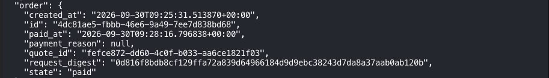

## What does our service do?

Our service combines OpenCTI’s threat intelligence capabilities with Attack Surface Management (ASM) tools. Authenticated users can submit scan requests and review the results.

Paid features extend the basic workflow with additional verification or deeper scans. The application must therefore connect each payment to the correct user, order, and requested operation.

Aperture provides the Lightning payment gate for this workflow. Our application remains responsible for user authentication, scan authorization, and order processing.

By the end of this series, a single scan order ends up in this state: paid, with the time it was paid recorded.



*The order record after an end-to-end testnet run. [Part 3](/posts/from-lightning-payment-to-a-paid-scan-order/) shows every record that changes to get it here.*

## What is Aperture?

Aperture is a reverse proxy that can require Lightning payment credentials before forwarding a request to a backend service.

Think of it as a ticket checkpoint in front of an API. It checks whether the request carries a valid ticket, then allows it through. The backend still performs the actual work.

The core configuration answers four questions:

1. Which requests require payment?
2. How much should access cost?
3. Which Lightning node handles payment requests?
4. Where should authenticated requests be forwarded?

Aperture implements this flow using L402, which combines HTTP 402 responses, macaroon authorization tokens, and Lightning payments. See the [Aperture documentation](https://github.com/lightninglabs/aperture).

## Start with a simple paid API

Suppose we already have a report API:

```text
GET /reports/latest
```

Without Aperture, clients contact it directly:

```text
Client → Report API :8000
```

With Aperture, requests pass through the payment gate:

```text
Client → Aperture :8081 → Report API :8000
              │
              └─ Merchant LND :10009
                 Invoice creation and payment-related operations
```

The client uses its own Lightning wallet to pay. The merchant’s LND node receives the payment.

## Configure the payment gate

The following example assumes Aperture, LND, and the report API run on the same host. It uses HTTP for local development and placeholder paths for credentials and storage.

```yaml
# Address clients use to reach Aperture.
listenaddr: "127.0.0.1:8081"
insecure: true

# Merchant LND connection.
authenticator:
  network: "regtest"
  disable: false
  lndhost: "127.0.0.1:10009"
  tlspath: "/example/lnd/tls.cert"
  macdir: "/example/lnd/data/chain/bitcoin/regtest"

# Persistent storage for authentication-related data.
dbbackend: "sqlite"
sqlite:
  dbfile: "/example/aperture/aperture.db"

# Service protected by L402.
services:
  - name: "report-api"
    hostregexp: '.*'
    pathregexp: '^/reports/.*$'
    address: "127.0.0.1:8000"
    protocol: "http"
    authscheme: "l402"
    price: 100
    timeout: 300
```

The business-related settings are:

| Setting | Meaning |
|---|---|
| `pathregexp` | Match requests whose paths start with `/reports/`. |
| `address` | Forward authenticated requests to this backend. |
| `price: 100` | Charge 100 sats for the service’s L402 credential. |
| `timeout: 300` | Add a 300-second expiration condition to the credential. |
| `authenticator` | Connect Aperture to the merchant’s LND node. |

Here, `timeout` controls credential expiration. It is not the HTTP response timeout. These settings follow Aperture’s [sample configuration](https://github.com/lightninglabs/aperture/blob/master/sample-conf.yaml).

Setting `price: 100` does not automatically mean every HTTP request costs 100 sats. A valid credential may be reusable within its authorization scope. Per-request charging requires an explicit usage policy.

The backend must also be protected against direct access that bypasses Aperture.

## Follow a payment from request to response

### 1. The client requests access

The client initially sends a request without payment credentials:

```http
GET /reports/latest HTTP/1.1
Host: localhost:8081
```

### 2. Aperture returns a payment challenge

Aperture responds with HTTP 402 and supplies a macaroon and a Lightning invoice. A simplified response looks like this:

```http
HTTP/1.1 402 Payment Required
WWW-Authenticate: L402 macaroon="<token>", invoice="<lightning-invoice>"
```

The macaroon carries authorization information. The invoice tells the client what to pay.

### 3. The client pays the invoice

The client pays through its Lightning wallet. Successful payment gives it the payment preimage, a secret associated with that invoice.

### 4. The client retries with payment credentials

The client combines the macaroon and preimage in its authorization header:

```http
GET /reports/latest HTTP/1.1
Host: localhost:8081
Authorization: L402 <macaroon>:<preimage>
```

### 5. Aperture verifies and forwards the request

Once verification succeeds, Aperture forwards the request to the report API and returns the backend’s response to the client.

```text
Validate payment credentials
        ↓
Forward to the report API
        ↓
Backend produces the report
        ↓
Return the response to the client
```

The client must support this challenge, payment, and retry sequence. Simply opening a paid endpoint in a browser does not automatically pay its invoice. See [L402 in Aperture](https://github.com/lightninglabs/aperture).

## How does this map to our OpenCTI service?

Our application uses the same payment-gate concept, but access is associated with a specific scan order.

| Simple report API | Our OpenCTI service |
|---|---|
| Protect `/reports/*`. | Protect `/paid/l402/*`. |
| Use a fixed price. | Look up the price for the requested order. |
| Connect to a merchant LND node. | Connect to `lnd-merchant:10009` on regtest. |
| Forward to the report API. | Forward to a payment receipt verification service. |

The relevant part of our Aperture configuration is:

```yaml
services:
  - name: "opencti-paid-l402"
    hostregexp: ".*"
    pathregexp: '^/paid/l402/.*$'
    address: "payment-aperture-services:8091"
    protocol: "http"
    auth: "on"
    authscheme: "l402"
    timeout: 300

    dynamicprice:
      enabled: true
      grpcaddress: "payment-aperture-services:10010"
      insecure: true
```

This is an excerpt from the repository configuration. It describes our regtest setup, rather than a verified production deployment.

### Order-based pricing

A fixed price is insufficient when different scan options have different costs. We enable `dynamicprice` so Aperture can ask our pricing service for the amount.

```text
Aperture receives a payment-related request
        ↓
Pricing service looks up the corresponding order
        ↓
Pricing service returns the amount in sats
        ↓
Aperture creates the payment challenge
```

The pricing service supplies the amount through gRPC on port `10010`. The application owns the pricing logic; Aperture uses its result.

### Payment verification and order completion

In our configuration, Aperture forwards authorized requests to a receipt verification service on port `8091`.

That service checks the merchant LND’s settlement information and the expected order amount. The application then records the payment result and updates the order.

```text
OpenCTI API
    ↓
Internal payment gateway
    ↓
Aperture: verify L402 credentials
    ↓
Receipt service: verify settlement and order amount
    ↓
OpenCTI: mark the order as paid
```

Payment authorization and scan execution remain separate responsibilities. A valid payment must still correspond to an operation the authenticated user is allowed to request.

## Where does Aperture’s responsibility end?

Aperture handles payment-based access control. Our application handles the meaning of that payment within the scan workflow.

| Aperture | Our application |
|---|---|
| Match protected request paths. | Authenticate users and authorize scan targets. |
| Request invoices and issue authorization tokens. | Create orders and determine prices. |
| Verify L402 credentials. | Associate payment with the correct user and order. |
| Forward authorized requests. | Check settlement, prevent duplicate processing, and update order state. |
| Enforce configured token restrictions. | Schedule and track the permitted scan operation. |

Adding Aperture does not automatically implement “one payment, one scan.” The application must define how payment credentials map to orders and how repeated requests are handled.

For our service, the next step is to trace one scan order through pricing, invoice creation, payment verification, and order completion. That shows how the configuration becomes an actual paid-service workflow.

Next: [Lightning Payments for OpenCTI (2) - From a Scan Order to a Lightning Invoice](/posts/from-a-scan-order-to-a-lightning-invoice/)
