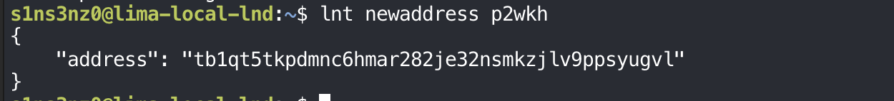
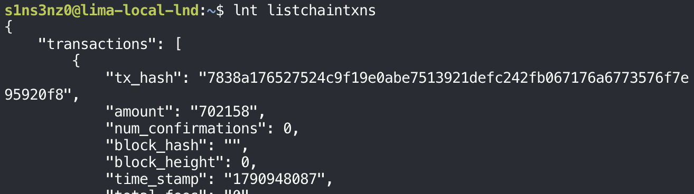
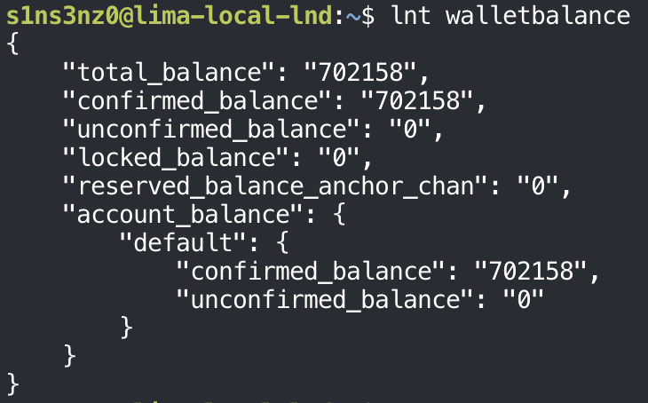

*Part 3 of the series. [Part 2](/posts/always-on-testnet4-lnd-node-monitoring/) moved the monitoring stack to the testnet4 node.*

On regtest, funding a wallet meant mining blocks to my own address. On testnet4 there's no mining on demand: test coins come from a faucet, a public service that gives small amounts to anyone who asks.

## An address to receive on

```bash
lnt newaddress p2wkh
```



The address starts with `tb1q`, where regtest addresses started with `bcrt1q`. `tb` is the prefix for Bitcoin's test networks, testnet4 included, so a test address can't be confused with a mainnet `bc1` one. `p2wkh` asks for a native SegWit address, the same type used on regtest.

## A deposit from a faucet

I used the [coinfaucet.eu testnet4 faucet](https://coinfaucet.eu/en/btc-testnet4/): paste the address, request coins, and the faucet sends a transaction to it.

After that, LND's wallet balance:

```bash
lnt walletbalance
```


| Field | Value | Meaning |
|---|---:|---|
| `unconfirmed_balance` | 702,158 sat | The faucet's payment has reached the node but isn't in a block yet |
| `confirmed_balance` | 0 | Nothing confirmed so far |
| `total_balance` | 702,158 sat | Confirmed and unconfirmed together |

The same picture as the regtest deposit in the earlier series, an unconfirmed balance waiting for a block, but with one difference: on regtest I mined that block. Here the confirmation comes when a testnet4 miner includes the transaction, on the network's schedule, and the node has to be synced far enough to see it.

### The transaction, from the node and from outside

LND lists the faucet's transaction:

```bash
lnt listchaintxns
```



`num_confirmations: 0`, an empty `block_hash`, and `block_height: 0` all say the same thing: the transaction exists but no block includes it yet.

On regtest, the only view of a transaction was my own nodes'. Testnet4 is public, so the same transaction can be checked from outside, on a block explorer such as [mempool.space's testnet4 site](https://mempool.space/testnet4):

![mempool.space testnet4, with a banner saying This is a test network. Coins have no value. Address tb1qt5tkpdmnc6hmar282je32nsmkzjlv9ppsyugvl: confirmed balance 0.00000000 tBTC, pending +0.00702158 tBTC, confirmed UTXOs 0, pending UTXOs +1, type P2WPKH. 1 of 1 transaction: 7838a176527524c9f19e0abe7513921defc242fb067176a6773576f7e95920f8, 6 minutes ago, one input from tb1qjs38q37qclc7aw3cr49djltx98c2phy5cxzet3 of 4.93665888 tBTC, outputs 4.92963587 tBTC to tb1q9m8ljv9jxsn9rsx2swfg76fkq90wanxtsgfwfw and 0.00702158 tBTC to tb1qt5tkpdmnc6hmar282je32nsmkzjlv9ppsyugvl; 1.02 sat/vB, 143 sats; Unconfirmed](../../assets/images/lnd-testnet4/mempool-space-faucet.png)

| | LND | mempool.space |
|---|---|---|
| Transaction ID | `7838a176…20f8` | `7838a176…20f8` |
| Amount to my address | 702,158 sat | 0.00702158 tBTC |
| Status | 0 confirmations | Unconfirmed, pending |
| Address type | `p2wkh` requested | P2WPKH |

The two views agree. The explorer adds what my node doesn't show about a transaction that isn't mine to begin with: the faucet spent one input of 4.93665888 tBTC, sent 0.00702158 to me, and took 4.92963587 back as change. The difference is the fee:

```text
4.93665888 − 4.92963587 − 0.00702158 = 0.00000143 tBTC = 143 sat
```

at 1.02 sat/vB, a near-minimum fee rate. That's typical for a faucet and means the transaction may wait a while for a block when testnet4 is busy.

## The first Lightning peers

While the funds wait for a block, LND has already found company. On regtest, the only peers were the nodes I connected by hand. On testnet4, LND bootstraps on its own: it looks up other nodes and connects to a few to download the network graph.

```bash
lnt listpeers
```

The output is long, mostly each peer's feature list. Condensed:

| Peer (`pub_key`) | Address | `inbound` | `sync_type` | Sent / received (bytes) | Ping |
|---|---|---|---|---:|---:|
| `024c6e1e…3ab6` | `81.17.102.136:9735` | `false` | `ACTIVE_SYNC` | 15,450 / 14,680 | 278 ms |
| `020d84fb…66f7` | `54.252.10.243:9735` | `false` | `ACTIVE_SYNC` | 15,969 / 16,255 | 204 ms |
| `03713bae…9368` | `38.242.151.13:49735` | `false` | `ACTIVE_SYNC` | 18,978 / 23,662 | 278 ms |
| `03b1a1eb…5328` | `34.65.45.157:9737` | `false` | `PASSIVE_SYNC` | 23,429 / 17,187 | 265 ms |
| `03e30eba…a942` | `62.164.218.78:49735` | `false` | `PASSIVE_SYNC` | 2,224 / 23,436 | 864 ms |

| Field | What it shows |
|---|---|
| `inbound: false` on all five | Every connection was opened by my node. That's expected: LND's P2P port is on loopback, so nothing outside the VM could connect in |
| `sync_type` | Three peers are `ACTIVE_SYNC`, the ones LND actively pulls network graph updates from; the other two are `PASSIVE_SYNC`, which only send new updates as they happen. Keeping the active set small spreads the graph download across a few peers without asking every peer for everything |
| `sat_sent`, `sat_recv` | `0` everywhere: these are only peer connections. No channel exists with any of them, so no money has moved |
| `ping_time` | Round-trip times in microseconds, 200 ms to 860 ms: these nodes are elsewhere on the internet, not in the same VM |
| `errors`, `flap_count` | Empty and `0`: no connection problems or reconnects so far |
| `features` | The protocol features each peer supports, such as `anchors-zero-fee-htlc-tx`, `route-blinding`, and on some, `simple-taproot-chans`. They differ by peer, reflecting different implementations and versions; two bits on one peer are reported as `unknown` to LND |

Five peers and zero channels is the state of a node that has joined the network but hasn't committed funds to it yet. The peers are the start of the graph LND needs to find routes; a channel, funded once the faucet's coins confirm, is what will let this node actually send payments.

### Looking up a peer

A public key in `listpeers` says little on its own. `getnodeinfo` looks the node up in the network graph LND has been downloading, which holds what each node announces about itself:

```bash
lnt getnodeinfo \
  --pub_key=020d84fb6ad938545c15633b38db9e3d6dc34205295359611ae817fa0c417066f7
```

Condensed, leaving out the feature list:

```json
{
  "node": {
    "last_update": 1790934283,
    "pub_key": "020d84fb6ad938545c15633b38db9e3d6dc34205295359611ae817fa0c417066f7",
    "alias": "Lightning-Pay-Testnet",
    "addresses": [{ "network": "tcp", "addr": "54.252.10.243:9735" }],
    "color": "#000000"
  },
  "num_channels": 8,
  "total_capacity": "75000000",
  "channels": []
}
```

| Field | Value | Meaning |
|---|---|---|
| `alias` | `Lightning-Pay-Testnet` | The name the node gives itself. Anyone can choose any alias, so it identifies nothing; the public key does |
| `addresses` | `54.252.10.243:9735` | Where it accepts connections, the address `listpeers` showed. My node has no such entry, since it announces no address |
| `last_update` | `1790934283` | When it last announced itself: 2 October 2026, 09:44 UTC, earlier the same day |
| `num_channels` | 8 | Channels it has open on testnet4 |
| `total_capacity` | 75,000,000 sat | Those channels' combined size, 0.75 tBTC |
| `channels` | `[]` | Empty because the channel list is only included when asked for with `--include_channels` |
| `features` | Includes `keysend`, `amp`, `route-blinding` | Payment types and protocol features it supports |

Compared with my node's zero channels and zero capacity, this is an established node: eight channels and 0.75 tBTC of capacity, announcing an address others can reach. That's the kind of peer worth opening a first channel to. A channel to a node that already has channels to others connects mine into the rest of the testnet4 graph, so payments can be routed onward through it.

## The deposit confirms

Some time later, the balance moved:

```bash
lnt walletbalance
```



| Field | Before | Now |
|---|---:|---:|
| `confirmed_balance` | 0 | 702,158 sat |
| `unconfirmed_balance` | 702,158 sat | 0 |
| `total_balance` | 702,158 sat | 702,158 sat |

The full 702,158 sat moved from unconfirmed to confirmed: a testnet4 miner included the faucet's transaction in a block. On regtest, this step was a `generatetoaddress` I ran. Here it took a stranger's block, and it also needed my own node to be far enough along to see it. LND only counts a transaction as confirmed once its backend has the block it's in, so a confirmed balance also says `bitcoind-testnet4` has synced at least that far.

The wallet now holds about 0.007 tBTC that's spendable on chain, enough to open a first channel.

## One channel to pay, two to route

One channel to a well-connected peer like `Lightning-Pay-Testnet` is enough to send payments: LND finds a route through that peer to wherever the money needs to go.

```text
my node → Lightning-Pay-Testnet → another node → recipient
```

Relaying other people's payments, which is what a routing node does, takes more. A payment has to come in on one channel and leave on another, so the node needs at least two channels to different peers:

```text
outside node → peer A → my node → peer B → recipient
```

And the money has to be on the right side of each:

| Channel | Liquidity needed | Why |
|---|---|---|
| Peer A → my node, where the payment comes in | Inbound: funds on peer A's side | Peer A pays my node by moving its own balance across |
| My node → peer B, where it goes out | Outbound: funds on my side | My node pays peer B with its own balance |

This is the same picture as the routing test in [an earlier post](/posts/lnd-testnet-routing-practice/), where the WSL node needed a balance on the far side of the channel the payment came in on. Opening two channels with my own coins doesn't give me that. A channel I fund starts with everything on my side, so both channels would have outbound liquidity and no inbound liquidity, and nothing could arrive.

So the order from here:

1. Open the first channel to an outside node.
2. Send a real payment through it and confirm it works.
3. Open a second channel, and get inbound liquidity on one of them, which means funds on the other party's side.
4. Watch for forwarded payments.

At no step do I pick routes by hand. Opening channels is manual; finding a path for each payment is LND's job.

## The first channel

The first channel goes to `024c6e1e…3ab6`, one of the peers LND had already connected to, with 250,000 sat of the 702,158:

```bash
lnt openchannel \
  --node_key=024c6e1edd12f0792d0c1ddda3abc6e2fde6bf89f2848e00cf8d6a58fabb6c3ab6 \
  --local_amt=250000
lnt pendingchannels
```

![lnt openchannel --node_key=024c6e1edd12f0792d0c1ddda3abc6e2fde6bf89f2848e00cf8d6a58fabb6c3ab6 --local_amt=250000 returns funding_txid e43bffd012071547024911cd6b9e96daf3232fb9de697fe3ef8f5e6deccaa285; lnt pendingchannels shows one pending open channel: remote_node_pub 024c6e1e…3ab6, channel_point e43bffd0…a285:0, capacity 250000, local_balance 246530, remote_balance 0, local and remote chan_reserve_sat 2500, initiator INITIATOR_LOCAL, commitment_type ANCHORS, private false; commit_fee 2810, commit_weight 772, fee_per_kw 2500, funding_expiry_blocks 2016, confirmations_until_active 3, confirmation_height 0](../../assets/images/lnd-testnet4/openchannel-testnet4.png)

Set against the regtest channel from the earlier series:

| Field | Regtest channel | Testnet4 channel | Why |
|---|---:|---:|---|
| `capacity` | 1,000,000 | 250,000 | The amount put in, a third of the faucet coins |
| `local_balance` | 996,530 | 246,530 | Capacity minus the opener's commitment costs |
| `remote_balance` | 0 | 0 | The peer put nothing in |
| `chan_reserve_sat` | 10,000 | 2,500 | 1% of capacity in both cases |
| `commit_fee` | 2,810 | 2,810 | Same commitment fee rate, `fee_per_kw` 2,500 |
| `confirmations_until_active` | 1 | 3 | More confirmations required on testnet4 |
| `--sat_per_vbyte` | 2, set by hand | Not set | LND estimated the funding fee from `bitcoind-testnet4` |

The local balance works out the same way as on regtest: the opener pays the commitment fee and two 330-sat anchor outputs.

```text
250,000 − 2,810 − 2 × 330 = 246,530
```

Two differences come from being on a public network. The channel needs three confirmations instead of one, because on a real chain a single block can still be replaced, and waiting a few blocks makes that much less likely. And without `--sat_per_vbyte`, LND asked its backend for a fee estimate, which on testnet4 reflects actual demand for block space instead of a number I picked.

With `remote_balance: 0`, this channel is all outbound: it can send up to about 246,000 sat but can't receive anything yet. That matches step 1 of the plan above.

### The funding transaction, from outside

As with the faucet's payment, the funding transaction can be looked up on mempool.space:


| Field | Value | Meaning |
|---|---|---|
| Transaction ID | `e43bffd0…a285` | The `funding_txid` from `openchannel` |
| Status | Unconfirmed, ETA ~10 minutes | Waiting in the mempool for the next block |
| Fee | 4,118 sat at 25.1 sat/vB | What LND paid to get the channel on chain |
| Features | SegWit, RBF; Taproot crossed out | A SegWit transaction that signals replace-by-fee, so its fee could be raised later if it got stuck. It doesn't use Taproot |

The fee rate is the interesting number. LND chose 25.1 sat/vB on its own, about 25 times the faucet's 1.02 sat/vB and twelve times the 2 sat/vB I set by hand on regtest. LND's default is to aim for confirmation within a few blocks, and the fee estimate it got from `bitcoind-testnet4` priced that in. The blocks above show why an estimate can run high on testnet4: the mempool's fee spread runs from almost nothing to over 100 sat/vB, since a test network has no real market to settle fees. 4,118 sat for a channel open is cheap in test coins, but on mainnet the same habit of not setting a fee rate could cost real money.

### The same transaction, from my own bitcoind

mempool.space is someone else's view of the network. My own `bitcoind-testnet4` has the transaction in its mempool too, and `getmempoolentry` shows what it knows:

```bash
sudo -u bitcoin-t4 bitcoin-cli \
  -conf=/etc/bitcoin-testnet4/bitcoin.conf \
  -datadir=/var/lib/bitcoind-testnet4 \
  getmempoolentry \
  e43bffd012071547024911cd6b9e96daf3232fb9de697fe3ef8f5e6deccaa285
sudo -u bitcoin-t4 bitcoin-cli \
  -conf=/etc/bitcoin-testnet4/bitcoin.conf \
  -datadir=/var/lib/bitcoind-testnet4 \
  getblockcount
```


| Field | Value | Meaning |
|---|---|---|
| `vsize` | 164 vbytes | The transaction's size for fee purposes |
| `fees.base` | 0.00004118 tBTC | 4,118 sat, the same fee mempool.space showed |
| `height` | 154,816 | The chain height when it entered this mempool |
| `ancestorcount`, `descendantcount` | 1, 1 | Counting only itself: it doesn't depend on another unconfirmed transaction, and nothing spends it yet |
| `bip125-replaceable` | `true` | It signals replace-by-fee, matching the RBF tag on mempool.space |
| `unbroadcast` | `false` | `bitcoind` has passed it on to its peers. `true` would mean it never left this node, and nobody else could mine it |

The fee rate follows from the two numbers my node reports itself: 4,118 sat over 164 vbytes is 25.1 sat/vB, the figure mempool.space showed. `unbroadcast: false` is the line that matters most. It says the transaction reached the network, which is why an outside explorer can see it at all.

`getblockcount` returns 154,816, the same height. At the start of Part 1 the node knew of 154,807 headers and had verified 8,728 blocks; now it's at the current tip, and the initial download is done. The funding transaction is waiting for block 154,817.

### The pending channel on the dashboard

The monitoring from Part 2 sees the channel too. The **Channel Count** panel in the Node State dashboard, with the cursor on 22:54:30:


| Series | At 22:54:30 | Meaning |
|---|---:|---|
| `pending_open` | 1 | The channel opened above, waiting for its confirmations |
| `active`, `inactive` | 0 | No channel is open yet |
| `waiting_close`, `pending_force_close` | 0 | Nothing is closing |

The step from 0 to 1 at about 22:50 is the `openchannel` call. It shows up as `pending_open`, the state `lnt pendingchannels` reported, and not as `active`. When the third confirmation arrives, the same panel should show `pending_open` dropping back to 0 and `active` rising to 1, without anyone running a command. That's the point of having the dashboard: the channel's whole lifecycle gets recorded as it happens.

### A block that didn't take it

Block 154,817 arrived, but the funding transaction wasn't in it:


| Block | Transactions | Fees in block |
|---|---:|---|
| 154,815 | 31 | 0.15 to 362 sat/vB |
| 154,816 | 1 | 0.00 to 0.00 |
| 154,817 | 1 | 0.00 to 0.00 |

A block with one transaction holds only its coinbase, the transaction that pays the miner the block reward. Blocks 154,816 and 154,817 are both like that: their miners left the mempool's transactions out, mine included, even though they were offering fees. That happens on testnet4 in a way it rarely does on mainnet. The minimum-difficulty rule mentioned in Part 1 makes some blocks almost free to mine, and with test coins worth nothing, a miner gives up nothing by skipping the fees. So a 25 sat/vB transaction can sit through empty blocks, and "in about 10 minutes" is an estimate, not a promise.

The funding transaction is still waiting, now with 15 others for the next block.

## Two channels, both open

The first channel's funding transaction did get into a block eventually, and after its three confirmations the channel opened. Along the way I opened a second one, to `03e30eba…a942`, another of the peers LND had found by itself. A short script prints just the fields that matter from `listchannels`:

```bash
lnt listchannels | python3 -c '
import json, sys
for c in json.load(sys.stdin).get("channels", []):
    print("channel:", c["chan_id"])
    print("peer:", c["remote_pubkey"])
    print("active:", c["active"])
    print("local:", c["local_balance"], "sat")
    print("remote:", c["remote_balance"], "sat")
    print()
'
```

![lnt listchannels piped into a python3 -c script printing, for each channel, chan_id, peer, active, local, and remote (labels in Korean): channel 85a2caec6d5e8fefe37f69deb92f23f3da969e6bcd11490247150712d0ff3be4 with peer 024c6e1edd12f0792d0c1ddda3abc6e2fde6bf89f2848e00cf8d6a58fabb6c3ab6, active True, local 246530 sat, remote 0 sat; channel 50a22d2aa4d1f193454eccc45a922284f833a2851554bb48a94e03f8b8c0c88c with peer 03e30eba5bcabfa9be245c71384945e7139a773039fbe2f1d9c3a67189c2bba942, active True, local 248777 sat, remote 0 sat](../../assets/images/lnd-testnet4/two-channels-active.png)

*The script's labels are in Korean in the screenshot: "채널" is "channel", "피어" is "peer".*

| Peer | Active | Local | Remote |
|---|---|---:|---:|
| `024c6e1e…3ab6` | `true` | 246,530 sat | 0 |
| `03e30eba…a942` | `true` | 248,777 sat | 0 |

Both channels are active, so step 1 of the plan is done twice over: the node can send through either peer. In this version of LND, `chan_id` comes out as a hex identifier, as it did in my earlier routing posts; the numeric short channel ID is in the `scid` field.

The two `remote` columns are what the earlier section predicted. Each channel was funded entirely by me, so all the balance sits on my side, about 495,000 sat of outbound liquidity in total and none inbound. The node can pay, but it can't receive a payment yet, and it can't relay one either: there's no channel with funds on the far side for a payment to come in on.

<!-- TODO: first payment; inbound liquidity -->
