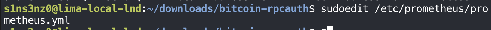
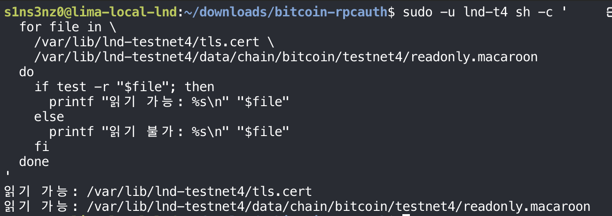
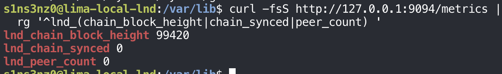
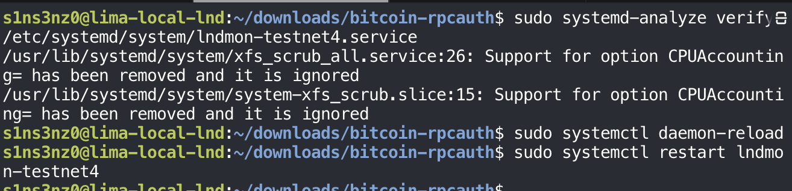
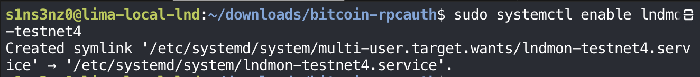
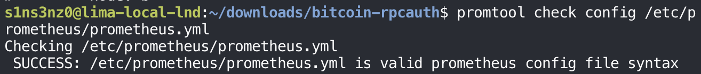
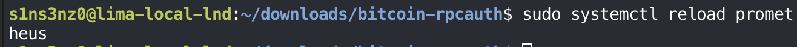
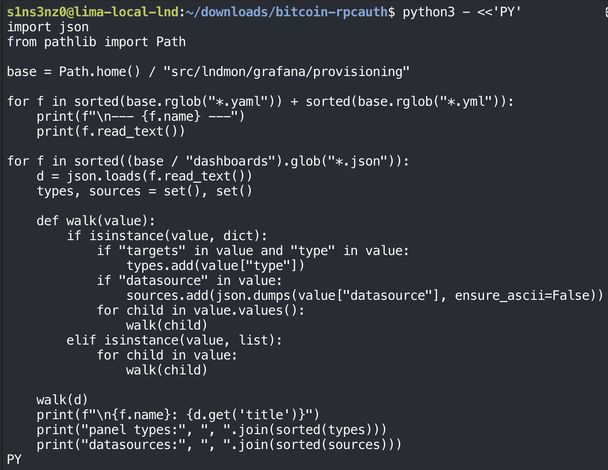
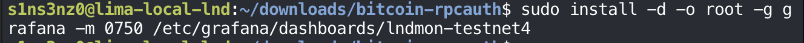
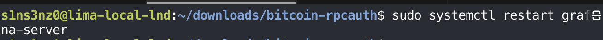

*Part 2 of the series. [Part 1](/posts/always-on-testnet4-lnd-node/) set up a separate `bitcoind` and LND on testnet4, next to the regtest lab.*

The monitoring stack from [Monitoring LND with systemd, Without Containers](/posts/monitoring-lnd-with-systemd-without-containers/) still watches the two regtest nodes. The node that matters now is the testnet4 one, so this part moves the monitoring over to it.

## Retiring the regtest scrape job

### Commenting out the lndmon job

The first change is in Prometheus's configuration, edited with `sudoedit` as before:

```bash
sudoedit /etc/prometheus/prometheus.yml
```



The regtest `lndmon` job is commented out, each line prefixed with `#`, while the `prometheus` and `node` jobs stay:

```yaml
global:
  scrape_interval: 15s
  evaluation_interval: 15s

scrape_configs:
  - job_name: prometheus
    static_configs:
      - targets: ['127.0.0.1:9090']

  - job_name: node
    static_configs:
      - targets: ['127.0.0.1:9100']
# - job_name: lndmon
#   static_configs:
#     - targets: ['127.0.0.1:9092']
#       labels:
#         node: a
#     - targets: ['127.0.0.1:9093']
#       labels:
#         node: b
```


Commenting the job out rather than deleting it keeps the regtest targets one edit away, in case the regtest lab needs watching again. The history Prometheus already stored for `job="lndmon"` stays in its database either way; only new scrapes stop. The host metrics from node exporter and Prometheus's own metrics carry on, since they describe the VM rather than either chain.

<!-- TODO: promtool check, reload, up{job="lndmon"} gone; stop/disable regtest lndmon-a/b? -->

## lndmon for testnet4

### The files it needs

An exporter for the testnet4 node needs the same two files as the regtest ones: LND's TLS certificate and its read-only macaroon. The check is the loop from the monitoring series, run as `lnd-t4`:

```bash
sudo -u lnd-t4 sh -c '
  for file in \
    /var/lib/lnd-testnet4/tls.cert \
    /var/lib/lnd-testnet4/data/chain/bitcoin/testnet4/readonly.macaroon
  do
    if test -r "$file"; then
      printf "readable: %s\n" "$file"
    else
      printf "not readable: %s\n" "$file"
    fi
  done
'
```



*"읽기 가능" in the screenshot means "readable".*

Both files exist and `lnd-t4` can read them. LND created them when it first started, and the macaroon's path shows the network change: `data/chain/bitcoin/testnet4/` where the regtest nodes had `data/chain/bitcoin/regtest/`. LND keeps its macaroons in a directory per network, so the path in lndmon's `--lnd.macaroondir` has to name the network too.

### A first run by hand

The same manual run as for the regtest nodes, with every value pointing at testnet4:

```bash
sudo -u lnd-t4 lndmon \
  --lnd.host=127.0.0.1:10011 \
  --lnd.network=testnet4 \
  --lnd.tlspath=/var/lib/lnd-testnet4/tls.cert \
  --lnd.macaroondir=/var/lib/lnd-testnet4/data/chain/bitcoin/testnet4 \
  --lnd.macaroonname=readonly.macaroon \
  --prometheus.listenaddr=127.0.0.1:9094 \
  --prometheus.logdir=/var/lib/lnd-testnet4/lndmon-log
```


| Option | Regtest node A | Testnet4 |
|---|---|---|
| Run as | `lnd` | `lnd-t4` |
| `--lnd.host` | `127.0.0.1:10009` | `127.0.0.1:10011` |
| `--lnd.network` | `regtest` | `testnet4` |
| `--lnd.tlspath`, `--lnd.macaroondir` | Under `/var/lib/lnd`, `.../regtest` | Under `/var/lib/lnd-testnet4`, `.../testnet4` |
| `--prometheus.listenaddr` | `127.0.0.1:9092` | `127.0.0.1:9094` |
| `--prometheus.logdir` | `/var/lib/lnd/lndmon-log` | `/var/lib/lnd-testnet4/lndmon-log` |

The metrics port is `9094`, the next one after the two regtest exporters on 9092 and 9093. `--lnd.network=testnet4` matters as much as on regtest: lndmon's default is `mainnet`, which would look for the wrong macaroon and talk about the wrong chain. The startup is identical to the regtest exporters', ending in `Prometheus active!`, so lndmon reached testnet4's LND over TLS with the read-only macaroon.

From a second shell, the endpoint on 9094:

```bash
curl -fsS http://127.0.0.1:9094/metrics |
  rg '^lnd_(chain_block_height|chain_synced|peer_count) '
```



| Metric | Value | Meaning |
|---|---:|---|
| `lnd_chain_block_height` | 99,420 | The height LND has followed `bitcoind-testnet4` to. It was 67,062 at the end of Part 1 |
| `lnd_chain_synced` | 0 | LND isn't synced to the chain yet, the `synced_to_chain: false` from `getinfo` |
| `lnd_peer_count` | 0 | No Lightning peers yet |

These look nothing like the regtest baseline of 1, 1, 1. On regtest, the metrics described a finished, healthy setup. Here they describe a node still catching up: a block height that keeps climbing, `chain_synced` waiting to flip to 1, and no peers. That's exactly what makes them useful to chart. The sync itself will show up on the dashboard, and the moment `lnd_chain_synced` turns 1 will be visible as a step.

### The unit

The manual run goes into `lndmon-testnet4.service`, shaped exactly like the regtest `lndmon-a.service`:

![sudo tee /etc/systemd/system/lndmon-testnet4.service >/dev/null <<'EOF' with [Unit] Description=LND testnet4 metrics exporter, Wants=lnd-testnet4.service, After=lnd-testnet4.service, StartLimitIntervalSec=0; [Service] Type=simple, User=lnd-t4, Group=lnd-t4, ExecStart=/usr/local/bin/lndmon with --lnd.host=127.0.0.1:10011, --lnd.network=testnet4, --lnd.tlspath=/var/lib/lnd-testnet4/tls.cert, --lnd.macaroondir=/var/lib/lnd-testnet4/data/chain/bitcoin/testnet4, --lnd.macaroonname=readonly.macaroon, --prometheus.listenaddr=127.0.0.1:9094, --prometheus.logdir=/var/lib/lnd-testnet4/lndmon-log, Restart=on-failure, RestartSec=5, UMask=0077, NoNewPrivileges=true, ProtectHome=true, ProtectSystem=full; [Install] WantedBy=multi-user.target](../../assets/images/lnd-testnet4/lndmon-testnet4-unit.png)

| Directive | `lndmon-a.service` (regtest) | `lndmon-testnet4.service` |
|---|---|---|
| `Description` | `LND A metrics exporter` | `LND testnet4 metrics exporter` |
| `Wants`, `After` | `lnd.service` | `lnd-testnet4.service` |
| `User`, `Group` | `lnd` | `lnd-t4` |
| `ExecStart` options | Regtest node A's host, files, and port 9092 | The testnet4 values from the manual run, port 9094 |

Everything else is the same, including `StartLimitIntervalSec=0`, which matters more here than it did on regtest. If the VM reboots, LND comes back with its wallet locked until someone unlocks it, and lndmon can't get data from a locked node. Without the start limit turned off, systemd would give up on lndmon after a few quick failures. With it off, lndmon keeps retrying every five seconds and starts reporting as soon as the wallet is unlocked.

The dependency chain for the testnet4 stack is now complete: `lndmon-testnet4` wants `lnd-testnet4`, which wants `bitcoind-testnet4`.

### Checking and starting it

```bash
sudo systemd-analyze verify /etc/systemd/system/lndmon-testnet4.service
sudo systemctl daemon-reload
sudo systemctl restart lndmon-testnet4
```



`verify` flags only the two Ubuntu XFS units seen every time before, nothing in the new file. With the manual run stopped so port 9094 is free, `restart` brings the service up. On a unit that isn't running, `restart` simply starts it, so it works the same as `start` here and is a habit that also covers the case where an older instance is still running.

```bash
systemctl status lndmon-testnet4 --no-pager
```


| Line | Meaning |
|---|---|
| `active (running)`, `Main PID: 53232 (lndmon)` | The exporter is up as a service, its own process under systemd |
| `CGroup: … --lnd.host=127.0.0.1:10011 …` | Started with the testnet4 options from the unit |
| Four journal lines ending `L…ve!` | The same four startup lines as the manual run, ending in `Prometheus active!`, cut short because `-l` was left off |
| `Loaded: … disabled` | Running now, but not yet set to start at boot |

```bash
sudo systemctl enable lndmon-testnet4
```



Now the exporter starts at every boot. Because of `Wants=lnd-testnet4.service`, so does testnet4's LND, and through LND's own `Wants=`, `bitcoind-testnet4`, even though `lnd-testnet4` hasn't been enabled directly. LND will still come up with its wallet locked, and lndmon will keep retrying until it's unlocked.

## Scraping the testnet4 exporter

### The new scrape job

Back in `prometheus.yml`, the `lndmon` job returns with a single target, the testnet4 exporter:

```bash
cat /etc/prometheus/prometheus.yml
```


| | Regtest (before) | Testnet4 (now) |
|---|---|---|
| Job | `lndmon` | `lndmon` |
| Targets | `127.0.0.1:9092`, `127.0.0.1:9093` | `127.0.0.1:9094` |
| Labels | `node: a`, `node: b` | `network: testnet4`, `node: t4` |

The job keeps its name, so the Grafana queries built on `{job="lndmon"}` keep working without changes. The new `network` label is what tells the two eras apart. Prometheus still holds the regtest series from before, labeled `job="lndmon"` with `node="a"` or `node="b"` and no `network` at all. The testnet4 series carry `network="testnet4"`, so a query can pick out just the testnet4 node with `{job="lndmon", network="testnet4"}` even when its time range reaches back into the regtest history.

```bash
promtool check config /etc/prometheus/prometheus.yml
```



`promtool` accepts it, so the file is safe to load.

### Reloading Prometheus

```bash
sudo systemctl reload prometheus
```



As in the monitoring series, `reload` sends `SIGHUP` and Prometheus re-reads the file without a restart, so the stored history and the scrapes of the other jobs carry on uninterrupted. From the next scrape, it stops asking 9092 and 9093 and starts asking 9094.

Then a query that uses the new label, asking only about the testnet4 target:

```bash
curl -fsSG http://127.0.0.1:9090/api/v1/query \
  --data-urlencode 'query=up{job="lndmon",network="testnet4"}' |
  python3 -m json.tool
```

![curl -fsSG http://127.0.0.1:9090/api/v1/query --data-urlencode 'query=up{job="lndmon",network="testnet4"}' piped into python3 -m json.tool returns status success, resultType vector, one result: up with instance 127.0.0.1:9094, job lndmon, network testnet4, node t4, value [1790946725.24, "1"]](../../assets/images/lnd-testnet4/up-testnet4.png)

| Label | Value | Where it came from |
|---|---|---|
| `instance` | `127.0.0.1:9094` | The target address, added by Prometheus |
| `job` | `lndmon` | The job name |
| `network` | `testnet4` | The new label from the scrape configuration |
| `node` | `t4` | Likewise |

One result, with `up` at 1: Prometheus is scraping the testnet4 exporter, and the `network="testnet4"` selector finds it. The regtest targets no longer appear because they're no longer scraped; `up` is only recorded for targets in the current configuration.

## Grafana: the dashboards lndmon ships

### What's in the repository

Instead of building every panel by hand as in the monitoring series, this time I'm using the dashboards that come with lndmon. They're in the repository cloned in that series:

```bash
rg --files ~/src/lndmon/grafana |
  rg '\.(json|yaml|yml)$'
```


`rg --files` lists every file under the directory, and the second `rg` keeps the configuration and dashboard files:

| File | What it is (the dashboards going by their names, until they're loaded) |
|---|---|
| `provisioning/datasources/datasource.yaml` | A Grafana data source definition for Prometheus |
| `provisioning/dashboards/dashboard.yml` | A provider definition that tells Grafana where to load dashboard files from |
| `chain.json` | Chain and sync state |
| `channels.json` | Channels and balances |
| `peers.json` | Peer connections |
| `network.json` | The Lightning network graph |
| `routing.json` | Payment forwarding |
| `inbound_fees.json` | Inbound fee policies |
| `perf.json` | Performance |

The layout follows Grafana's provisioning format: rather than clicking through the UI, Grafana reads data sources and dashboards from files at startup. The seven dashboards cover far more than the four panels I built for regtest, which suits a node that's going to stay up on a public network.

### Reading the files before using them

These files were written for lndmon's Docker Compose setup. Before copying anything into Grafana, a short Python script prints the two YAML files and, for each dashboard, its title, the panel types it uses, and every data source it refers to:

```python
import json
from pathlib import Path

base = Path.home() / "src/lndmon/grafana/provisioning"

for f in sorted(base.rglob("*.yaml")) + sorted(base.rglob("*.yml")):
    print(f"\n--- {f.name} ---")
    print(f.read_text())

for f in sorted((base / "dashboards").glob("*.json")):
    d = json.loads(f.read_text())
    types, sources = set(), set()

    def walk(value):
        if isinstance(value, dict):
            if "targets" in value and "type" in value:
                types.add(value["type"])
            if "datasource" in value:
                sources.add(json.dumps(value["datasource"], ensure_ascii=False))
            for child in value.values():
                walk(child)
        elif isinstance(value, list):
            for child in value:
                walk(child)

    walk(d)
    print(f"\n{f.name}: {d.get('title')}")
    print("panel types:", ", ".join(sorted(types)))
    print("datasources:", ", ".join(sorted(sources)))
```



`walk` goes through the whole JSON tree. An object with both `targets` and `type` is a panel, so its `type` is collected; any `datasource` value anywhere is collected too. Only the standard library is used.

![Output: datasource.yaml defines a data source named Prometheus, type prometheus, access proxy, url http://prometheus:9090, editable true; dashboard.yml defines a provider named Prometheus, orgId 1, folder empty, type file, disableDeletion false, editable true, options path /etc/grafana/provisioning/dashboards. Then per dashboard: chain.json Chain State, channels.json Node State, inbound_fees.json Inbound Fees, network.json Network Stats, peers.json Peer State, perf.json Go Runtime + Performance, routing.json Routing; every panel type is graph; data sources are "$datasource" and "-- Grafana --", plus "Prometheus" in channels.json and inbound_fees.json](../../assets/images/lnd-testnet4/inspect-provisioning-output.png)

The dashboards, by their real titles:

| File | Title |
|---|---|
| `chain.json` | Chain State |
| `channels.json` | Node State |
| `inbound_fees.json` | Inbound Fees |
| `network.json` | Network Stats |
| `peers.json` | Peer State |
| `perf.json` | Go Runtime + Performance |
| `routing.json` | Routing |

And five things that don't fit this VM as they are:

| Finding | Why it matters here |
|---|---|
| `url: http://prometheus:9090` in `datasource.yaml` | `prometheus` is the service's name on a Docker Compose network. There's no such host in this VM; Prometheus is at `http://127.0.0.1:9090` |
| Data source named `Prometheus` | The data source I created by hand in the monitoring series is `prometheus`, lowercase. Provisioning this file as is would add a second data source for the same server |
| `"Prometheus"` hard-coded in `channels.json` and `inbound_fees.json` | Most panels use the `$datasource` variable, which can point at any Prometheus data source. These two refer to one by the exact name `Prometheus` and won't find `prometheus` |
| Every panel is type `graph` | Grafana's old graph panel. Recent Grafana versions replace it with the time series panel, so these dashboards depend on Grafana converting them when they load |
| `path: /etc/grafana/provisioning/dashboards` in `dashboard.yml` | Inside the Docker image the JSON files are mounted there. Here they'd have to be copied there, or the path changed |

`-- Grafana --` isn't a problem: it's Grafana's built-in source for annotations, present in every installation.

The fix is mostly a matter of names and addresses: one data source, called `Prometheus`, pointing at `127.0.0.1:9090`, and the dashboard files somewhere Grafana reads them.

### The data source that already exists

Rather than provisioning lndmon's `datasource.yaml`, the plan is to keep the data source created by hand in the monitoring series and point the dashboards at it. That needs its exact identity, which Grafana's API returns:

```bash
curl -fsS -u admin http://127.0.0.1:3000/api/datasources |
  python3 -c '
import json, sys
for source in json.load(sys.stdin):
    if source["type"] == "prometheus":
        print("name:", source["name"])
        print("uid:", source["uid"])
        print("url:", source["url"])
'
```


| Part | Meaning |
|---|---|
| `-u admin` | Log in to the API as Grafana's `admin` user. With no password on the command line, `curl` prompts for it, so it stays out of the shell history and the process list |
| `/api/datasources` | Every data source Grafana has, as JSON |
| The `python3 -c` script | Keep only the Prometheus ones and print three fields |

| Field | Value | Meaning |
|---|---|---|
| `name` | `prometheus` | The display name, the one `channels.json` and `inbound_fees.json` don't match |
| `uid` | `fg00cihfa2v40f` | Grafana's stable identifier for this data source. Dashboards can refer to it by `uid`, which doesn't change if the name does |
| `url` | `http://127.0.0.1:9090` | Already the right address, unlike the `http://prometheus:9090` in lndmon's file |

There's exactly one Prometheus data source, and it already points at the right place. The dashboards are what needs adjusting, not the data source.

### A directory for the dashboards

lndmon's `dashboard.yml` expects the JSON files in `/etc/grafana/provisioning/dashboards`, the directory where provider definitions also live. I gave the dashboards a directory of their own instead:

```bash
sudo install -d -o root -g grafana -m 0750 /etc/grafana/dashboards/lndmon-testnet4
```



The same ownership pattern as every configuration directory in these series: root owns it and can change it, the `grafana` group can read it, and nobody else can. Grafana runs as `grafana`, so it can load the dashboards but not rewrite them on disk. Keeping them in `lndmon-testnet4/` separates them from the provisioning definitions and from any other dashboards added later.

### Copying the dashboards, pointed at the right data source

One Python script copies all seven dashboards into the new directory and fixes their data source references on the way:

```python
import json
import os
import grp
from pathlib import Path

source = Path("/home/s1ns3nz0.guest/src/lndmon/grafana/provisioning/dashboards")
destination = Path("/etc/grafana/dashboards/lndmon-testnet4")
datasource = {"type": "prometheus", "uid": "fg00cihfa2v40f"}
grafana_gid = grp.getgrnam("grafana").gr_gid

def update(value):
    if isinstance(value, dict):
        for key, child in list(value.items()):
            if key == "datasource":
                builtin = (
                    child == "-- Grafana --"
                    or isinstance(child, dict) and child.get("type") == "grafana"
                )
                if not builtin:
                    value[key] = datasource.copy()
            else:
                update(child)
    elif isinstance(value, list):
        for child in value:
            update(child)

for file in sorted(source.glob("*.json")):
    dashboard = json.loads(file.read_text())
    update(dashboard)

    dashboard["id"] = None
    dashboard["uid"] = "lndmon-t4-" + file.stem
    dashboard["title"] += " (testnet4)"
    dashboard.pop("__inputs", None)

    variables = dashboard.get("templating", {}).get("list", [])
    for variable in variables:
        if variable.get("type") == "datasource":
            variable.update({
                "type": "constant",
                "query": datasource["uid"],
                "current": {"text": "prometheus", "value": datasource["uid"]},
                "options": [{"text": "prometheus", "value": datasource["uid"], "selected": True}],
                "hide": 2
            })

    output = destination / file.name
    output.write_text(json.dumps(dashboard, indent=2) + "\n")
    os.chown(output, 0, grafana_gid)
    os.chmod(output, 0o640)
    print(output.name, "→", dashboard["title"])
```

It ran as root (`sudo python3 - <<'PY'`), since the destination belongs to root, and printed one line per dashboard:

```text
chain.json → Chain State (testnet4)
channels.json → Node State (testnet4)
inbound_fees.json → Inbound Fees (testnet4)
network.json → Network Stats (testnet4)
peers.json → Peer State (testnet4)
perf.json → Go Runtime + Performance (testnet4)
routing.json → Routing (testnet4)
```

What it changes in each dashboard, and why:

| Change | Why |
|---|---|
| Every `datasource` becomes `{"type": "prometheus", "uid": "fg00cihfa2v40f"}` | Fixes both the hard-coded `"Prometheus"` in two dashboards and the `$datasource` references: every panel now names the existing data source by its `uid`, which doesn't depend on its name |
| `-- Grafana --` and `type: grafana` are left alone | That's the built-in annotation source, not Prometheus |
| The `$datasource` variable becomes a hidden `constant` | A query that still says `$datasource` resolves to the same `uid`, and with `hide: 2` there's no data source picker on the dashboard to change it by mistake |
| `id: null` | Grafana assigns its own database id when it loads the file |
| `uid: "lndmon-t4-<file>"` | A stable, readable identifier per dashboard, e.g. `lndmon-t4-chain`, unique even if lndmon's dashboards are loaded again for another node |
| Title gets ` (testnet4)` | Says on screen which node a dashboard is about |
| `__inputs` removed | That block is for interactive imports, asking which data source to use; provisioned files don't need it |
| Owner `root:grafana`, mode `0640` | Same as the directory: Grafana reads the files, root alone can change them |

The script recurses through the JSON the same way the inspection script did, so it catches `datasource` keys at any depth: on panels, on individual queries, and on annotations.

### Where the files live

Grafana's dashboard provisioning has two kinds of file, and they go in different places:

```text
/etc/grafana/
├── provisioning/dashboards/
│   └── lndmon-testnet4.yaml   ← the provider: tells Grafana where to look
└── dashboards/lndmon-testnet4/
    ├── chain.json             ← the dashboards themselves
    ├── peers.json
    └── ...
```

| File | Role |
|---|---|
| `provisioning/dashboards/lndmon-testnet4.yaml` | A provider definition. Grafana reads every file in `provisioning/dashboards/` at startup; this one says "load the dashboards in `/etc/grafana/dashboards/lndmon-testnet4`" |
| `dashboards/lndmon-testnet4/*.json` | The seven adjusted dashboards, which the provider points to |

lndmon's own `dashboard.yml` mixed the two, pointing the provider at the same directory provider files live in. Separating them means the provisioning directory holds only small registration files, one per set of dashboards, and each set has its own folder.

### The provider file

```bash
sudo cat /etc/grafana/provisioning/dashboards/lndmon-testnet4.yaml
```


| Setting | lndmon's `dashboard.yml` | Mine | Meaning |
|---|---|---|---|
| `name` | `Prometheus` | `lndmon-testnet4` | The provider's own name, which says what it loads |
| `folder` | `''` (top level) | `LND Testnet4` | The Grafana folder the dashboards appear in |
| `type` | `file` | `file` | Load dashboards from JSON files on disk |
| `disableDeletion` | `false` | `true` | The dashboards can't be deleted from Grafana's UI |
| `editable` / `allowUiUpdates` | `editable: true` | `allowUiUpdates: false` | Changes made in the UI can't be saved over the provisioned version |
| `updateIntervalSeconds` | Not set | `30` | Grafana rechecks the directory every 30 seconds, so edits to the JSON files show up without a restart |
| `options.path` | `/etc/grafana/provisioning/dashboards` | `/etc/grafana/dashboards/lndmon-testnet4` | Where the JSON files are |

lndmon's file leaves its dashboards open to editing in the UI. Mine makes the files on disk the only source of truth: the dashboards can't be deleted or overwritten from the browser, and changing one means changing its JSON, owned by root. For a node that's meant to keep running, that matches how the rest of its configuration is handled, with every setting in a root-owned file rather than in state someone could change by clicking.

### Restarting Grafana

```bash
sudo systemctl restart grafana-server
```



Grafana reads provisioning files at startup, so the new provider takes effect with a restart. Unlike Prometheus's `reload`, this restarts the whole service; Grafana's state lives in its own database, so users, the data source, and existing dashboards come back with it.

### The dashboards in Grafana

After the restart, Grafana's **Dashboards** page shows the provisioned set:


| What's shown | Where it comes from |
|---|---|
| Folder `LND Testnet4` | The provider's `folder: LND Testnet4` |
| Seven dashboards, each ending `(testnet4)` | The seven JSON files, with the titles the copy script set |
| Tag `lightning-network` | lndmon's own dashboard files. `Inbound Fees` has none, so its file simply doesn't set one |

All seven loaded, which means the provider found the directory, Grafana could read every file as the `grafana` user, and none of the JSON was rejected. The folder keeps them apart from the regtest dashboard built by hand in the monitoring series.

### Opening one: the wallet panels

Opening a dashboard shows two things at once: whether the old `graph` panels render, and what data they pick up. Three of its panels:

![Three Grafana panels from 16:45 to 22:35: On-Chain Wallet Balance with a y-axis up to ฿100M and legend conf_sat three times and unconf_sat three times, showing a green conf_sat line at about 100M in blocks from about 17:40 to 18:05, 19:10, 19:25, and 20:00 to 22:10, then a purple line at 0 after 22:15; UTXO Counts with num_conf_utxos at 1 in the same blocks and a purple line at 0 after 22:15; UTXO Sizes with avg, max, and min UTXO size lines around 100M in the same blocks, legend repeating each name three times](../../assets/images/lnd-testnet4/grafana-wallet-utxo-panels.png)

The panels render. The `graph` type that every lndmon dashboard uses was converted to Grafana's current time series panel when the dashboard loaded, so the dashboards work without editing their panel types.

The data needs a closer look, though:

| What the panels show | What it is |
|---|---|
| A wallet balance of about 100M, from about 17:40 to 22:10 | Regtest node A's on-chain wallet: the roughly 1 BTC, 100 million sat, left from the earlier series. It ends at 22:10, when the scrape job switched from the regtest exporters to testnet4 |
| A purple line at 0 from about 22:15 | The testnet4 node's wallet. It's new and hasn't been funded, so 0 is correct |
| Each legend name three times (`conf_sat`, `conf_sat`, `conf_sat`) | One series per node: regtest A, regtest B, and testnet4, with nothing in the legend to tell them apart |
| Gaps before 20:00 | The same setup gaps as in the monitoring series, when nothing was being scraped |

So the dashboards work, but they're showing every node Prometheus has ever recorded under `job="lndmon"`, regtest history included. The copy script pointed them at the right data source; it didn't narrow their queries to the testnet4 node. That's exactly the case the `network` label was added for: adding `network="testnet4"` to the dashboards' queries would leave only the testnet4 series. Until then, the regtest lines will scroll out of view as the time range moves past 22:10.

One display detail is misleading too. The axis reads `฿100M` for what is 100 million sat, about 1 BTC: the panel labels satoshi values with a bitcoin sign. The number is right; the unit symbol isn't.

## Where this part ends

The monitoring stack now follows the testnet4 node:

| Piece | Testnet4 setup |
|---|---|
| lndmon | `lndmon-testnet4.service`, as `lnd-t4`, metrics on `127.0.0.1:9094`, enabled |
| Prometheus | The `lndmon` job scrapes 9094, with `network: testnet4` and `node: t4` labels; the regtest targets are commented out |
| Grafana | lndmon's seven dashboards, adjusted to the existing data source, provisioned read-only into the `LND Testnet4` folder |

What's left is narrowing the dashboards to `network="testnet4"`, and then letting the node finish its initial sync, so the panels show a node that's caught up rather than one that's still replaying 2024.

