*This series builds on two earlier ones: [Running LND with systemd, Without Containers](/posts/running-lnd-with-systemd-without-containers/) set up `bitcoind` and LND on regtest, and [Monitoring LND with systemd, Without Containers](/posts/monitoring-lnd-with-systemd-without-containers/) added lndmon, Prometheus, and Grafana.*

Regtest was a private chain: blocks appeared only when I mined them, and the only other node was my own. Testnet4 is a public test network. Blocks arrive on their own schedule, other people's nodes and channels exist, and the coins still have no value. The goal of this series is a node that stays up there, running continuously, with the monitoring from the last series watching it.

The regtest lab stays where it is. Testnet4 gets its own `bitcoind`, with its own account, directories, and configuration, next to the regtest one rather than replacing it.

## A second bitcoind for testnet4

### Its own service account

The first piece is a service account for the testnet4 `bitcoind`, created the same way as the regtest `bitcoin` user in the earlier series:

```bash
sudo useradd --system --user-group \\
  --home-dir /var/lib/bitcoind-testnet4 \\
  --no-create-home \\
  --shell /usr/sbin/nologin \\
  bitcoin-t4
```

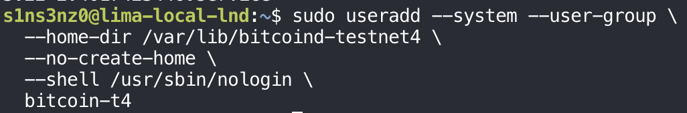

| | Regtest | Testnet4 |
|---|---|---|
| Account | `bitcoin` | `bitcoin-t4` |
| Home and data directory | `/var/lib/bitcoind` | `/var/lib/bitcoind-testnet4` |

The options are the ones explained in the earlier series: a system account with its own group, no login shell, and a home directory created later with exact permissions. A separate account, rather than reusing `bitcoin`, keeps the two chains' data apart at the file-permission level: the regtest `bitcoind` can't read testnet4's files, and the other way around.

### Its data directory

Then the data directory, owned by `bitcoin-t4` and closed to everyone else, the same `0700` the regtest data directory got:

```bash
sudo install -d -o bitcoin-t4 -g bitcoin-t4 -m 0700 \
  /var/lib/bitcoind-testnet4
```

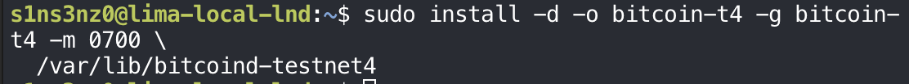

This is where the testnet4 chain will be downloaded and stored. Unlike regtest's few kilobytes of self-mined blocks, it holds a real public chain, so it's also the directory whose size needs watching on a 30 GiB VM disk.

### Choosing ports that don't collide

Two `bitcoind` processes will share one VM, so the testnet4 node needs ports the regtest node isn't using:

| Port | Use | Regtest node uses |
|---|---|---|
| `48332` | Bitcoin Core RPC | `18443` |
| `48333` | Bitcoin P2P | None (`listen=0`) |
| `28334` | ZMQ block notifications | `28332` |
| `28335` | ZMQ transaction notifications | `28333` |

`48332` and `48333` are Bitcoin Core's own defaults for testnet4, so they need no special reasoning. The ZMQ ports have no per-network default; `28334` and `28335` are simply the next two after the regtest node's `28332` and `28333`.

Before using them, a check that nothing already listens on any of the four:

```bash
sudo ss -lntp '( sport = :48332 or sport = :48333 or sport = :28334 or sport = :28335 )'
```

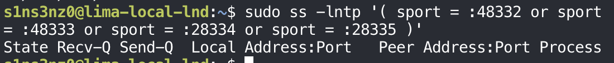

Only the header line comes back: no process is listening on any of the four ports, so the testnet4 node can take them.

### Configuration

A configuration directory owned by root and readable by `bitcoin-t4`, as `/etc/bitcoin` was for regtest, and the configuration file in it:

```bash
sudo install -d -o root -g bitcoin-t4 -m 0750 \
  /etc/bitcoin-testnet4
sudo tee /etc/bitcoin-testnet4/bitcoin.conf >/dev/null <<'EOF'
testnet4=1
server=1
daemon=0
printtoconsole=1
prune=5120
dbcache=512
[testnet4]
rpcbind=127.0.0.1
rpcallowip=127.0.0.1
rpcport=48332
port=48333
zmqpubrawblock=tcp://127.0.0.1:28334
zmqpubrawtx=tcp://127.0.0.1:28335
EOF
```

![sudo install -d -o root -g bitcoin-t4 -m 0750 /etc/bitcoin-testnet4; sudo tee /etc/bitcoin-testnet4/bitcoin.conf >/dev/null <<'EOF' with testnet4=1, server=1, daemon=0, printtoconsole=1, prune=5120, dbcache=512, then a [testnet4] section with rpcbind=127.0.0.1, rpcallowip=127.0.0.1, rpcport=48332, port=48333, zmqpubrawblock=tcp://127.0.0.1:28334, zmqpubrawtx=tcp://127.0.0.1:28335](../../assets/images/lnd-testnet4/bitcoin-conf-testnet4.png)

Compared with the regtest `bitcoin.conf`:

| Setting | Regtest | Testnet4 | Why |
|---|---|---|---|
| Network | `regtest=1` | `testnet4=1` | The public test network instead of a private chain |
| `server`, `daemon`, `printtoconsole` | `1`, `0`, `1` | Same | RPC on, foreground for systemd, logs to the journal |
| `prune` | Not set | `5120` | Keep only about 5,120 MB of recent block files and delete older ones, so the chain fits the 30 GiB disk |
| `dbcache` | Default | `512` | 512 MB of memory for the chain-state cache. More cache makes the initial sync faster; 512 MB is a modest share of the VM's 8 GiB |
| `txindex` | `1` | Not set | A full transaction index needs every block kept, which pruning doesn't allow |
| `listen` | `0` | Not set | See below |
| RPC | `127.0.0.1:18443` | `127.0.0.1:48332` | Loopback only, on testnet4's default port |
| `port` | — | `48333` | The P2P port, testnet4's default |
| ZMQ | `28332`, `28333` | `28334`, `28335` | Loopback only, clear of the regtest node's sockets |

The network-specific settings sit under `[testnet4]`, as they sat under `[regtest]` before.

Two settings change what this node is:

- **`prune=5120`.** A pruned node still downloads and verifies every block, but only keeps the most recent ones on disk. It's still a full validating node; it just can't serve old blocks to others or look them up later. Whether that suits LND, which sometimes needs to fetch older blocks, is something to check once LND connects.
- **No `listen=0`.** The regtest node refused incoming P2P connections. This one leaves `listen` at its default, which is on, and a testnet4 node needs peers to sync at all. Outgoing connections are what syncing depends on; whether to accept incoming ones, and on which interface, is a separate decision for an always-on node, and worth checking with `ss` after it starts.

There's no `rpcauth` line yet. That, and the file's own permissions, come next.

### The file's permissions

`tee` wrote the file, so it got whatever owner and mode a new root-created file gets by default:

```bash
sudo ls -l /etc/bitcoin-testnet4/bitcoin.conf
sudo cat /etc/bitcoin-testnet4/bitcoin.conf
```

![sudo ls -l /etc/bitcoin-testnet4/bitcoin.conf shows -rw-r--r-- 1 root root 215 Oct 2 21:23; sudo cat prints the configuration as written: testnet4=1, server=1, daemon=0, printtoconsole=1, prune=5120, dbcache=512, [testnet4], rpcbind=127.0.0.1, rpcallowip=127.0.0.1, rpcport=48332, port=48333, zmqpubrawblock=tcp://127.0.0.1:28334, zmqpubrawtx=tcp://127.0.0.1:28335](../../assets/images/lnd-testnet4/bitcoin-conf-ls.png)

The content is right, but `root:root` with `0644` isn't what the regtest `bitcoin.conf` ended up with. Two layers are protecting it right now:

| Layer | Owner, mode | Effect |
|---|---|---|
| Directory `/etc/bitcoin-testnet4` | `root:bitcoin-t4`, `0750` | Only root and the `bitcoin-t4` group can enter it at all |
| File `bitcoin.conf` | `root:root`, `0644` | Anyone who can reach the file can read it |

Today the directory does the work: other users can't get into `/etc/bitcoin-testnet4`, so the file's open `r--` for everyone doesn't help them. `bitcoin-t4` can read the file only through that "everyone" bit, not as its group. That's fine while the file holds only ports and paths, but it will soon hold an `rpcauth` line, and the file shouldn't depend on the directory alone. So it gets the same `root:bitcoin-t4` and `0640` as the regtest file, before any credential goes in.

```bash
sudo chown root:bitcoin-t4 /etc/bitcoin-testnet4/bitcoin.conf
sudo chmod 0640 /etc/bitcoin-testnet4/bitcoin.conf
```

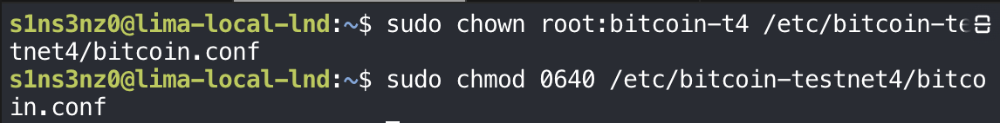

Now root owns the file and can write it, `bitcoin-t4` reads it through its group, and nobody else can read it, even if they could reach the directory. Both commands print nothing on success.

<!-- TODO: ls -l and sudo -u bitcoin-t4 read check -->

## Running it under systemd

### The unit

<!-- TODO: systemctl cat bitcoind-testnet4 screenshot and table of differences from bitcoind.service -->

### Starting it

```bash
sudo systemctl daemon-reload
sudo systemctl start bitcoind-testnet4
sudo journalctl -u bitcoind-testnet4 -n 50 --no-pager
```

![sudo systemctl daemon-reload; sudo systemctl start bitcoind-testnet4; sudo journalctl -u bitcoind-testnet4 -n 50 --no-pager shows bitcoind[51715] lines at 2026-10-02T12:26:01Z: init message: Pruning blockstore…, initload thread start, and UpdateTip: new best=00000000da84f2bafbbc53dee25a72ae507ff4914b867c565be350b0da8bf043 height=0 version=0x00000001 log2_work=32.000022 tx=1 date='2024-05-03T23:11:00Z' progress=0.000000 cache=0.3MiB(0txo)](../../assets/images/lnd-testnet4/start-journal-genesis.png)

| Log line | Meaning |
|---|---|
| `init message: Pruning blockstore…` | Startup with `prune` set: Bitcoin Core checks which old block files it may delete. On an empty data directory there's nothing to remove yet |
| `initload thread start` | The thread that loads saved state, such as the mempool, has started |
| `UpdateTip: new best=00000000da84…f043 height=0` | The chain tip is the testnet4 genesis block, at height 0 |
| `date='2024-05-03T23:11:00Z'` | The genesis block's timestamp. Testnet4 is a young network, started in May 2024 |
| `progress=0.000000` | The estimated share of the chain verified so far: none |
| `cache=0.3MiB(0txo)` | The chain-state cache is nearly empty, with no unspent outputs yet |

This is the same starting point as regtest in the earlier series, the genesis block at height 0, with one difference: regtest stayed there until I mined, and testnet4 has a real chain to download. From here `bitcoind` connects to peers, fetches headers and blocks, and `UpdateTip` lines keep appearing as the height climbs.

### Syncing

A few minutes later, `getblockchaininfo` shows the sync under way. The command runs as `bitcoin-t4` with testnet4's configuration and data directory, so `bitcoin-cli` finds the right RPC port and cookie:

```bash
sudo -u bitcoin-t4 bitcoin-cli \
  -conf=/etc/bitcoin-testnet4/bitcoin.conf \
  -datadir=/var/lib/bitcoind-testnet4 \
  getblockchaininfo
```


| Field | Value | Meaning |
|---|---|---|
| `chain` | `testnet4` | The right network |
| `headers` | 154,807 | Bitcoin Core downloads block headers first. This is how long the testnet4 chain is, as far as the node knows |
| `blocks` | 8,728 | How many of those blocks it has downloaded and fully verified so far |
| `time` | `1715358233` | The timestamp of block 8,728: 10 May 2024, a week after genesis. The node is replaying history in order |
| `verificationprogress` | 0.0009 | Bitcoin Core's estimate of how much of the chain's work it has verified: under 0.1% |
| `initialblockdownload` | `true` | Still in initial block download, and it will be until the tip is recent |
| `difficulty` | 256 | Real proof of work, unlike regtest's 4.66e-10 |
| `size_on_disk` | 71,681,459 | About 72 MB so far |
| `pruned`, `automatic_pruning` | `true`, `true` | Pruning is on and runs by itself |
| `pruneheight` | 0 | Nothing has been deleted yet; the stored blocks are far below the limit |
| `prune_target_size` | 5,368,709,120 | The `prune=5120` setting in bytes: 5,120 × 1,024 × 1,024 |

The gap between `headers` and `blocks` is the work left: about 146,000 blocks to download and verify. `blocks` is already ahead of the `progress=0.000000` in the startup log, and once `size_on_disk` passes about 5 GiB, `pruneheight` will start to rise as old block files are deleted.

### Keeping it running

An always-on node has to come back by itself after the VM restarts, so the unit gets enabled right away:

```bash
sudo systemctl enable bitcoind-testnet4
```

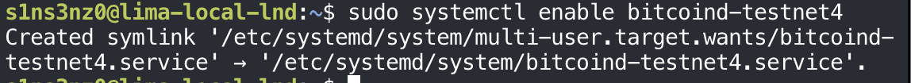

The symlink in `multi-user.target.wants/` points at a unit in `/etc/systemd/system/`, my own file rather than a package's. With it, a reboot in the middle of the initial download isn't a problem: systemd starts `bitcoind-testnet4` at boot, and it carries on from the blocks already in `/var/lib/bitcoind-testnet4`, as the regtest node did after its restart test.

<!-- TODO: peers (getconnectioncount / getpeerinfo), ss for 48333, sync finishing -->

## LND for testnet4

### Its own service account

While `bitcoind-testnet4` downloads the chain, LND's side can be prepared. It gets its own account too, alongside the regtest `lnd` and `lnd-b`:

```bash
sudo useradd --system --user-group \
  --home-dir /var/lib/lnd-testnet4 \
  --no-create-home \
  --shell /usr/sbin/nologin \
  lnd-t4
```

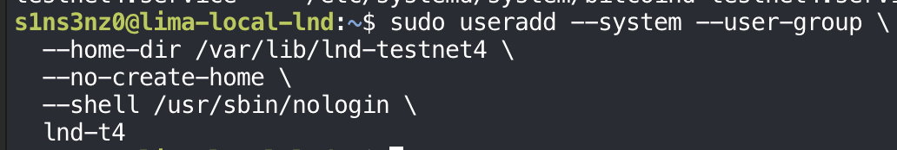

| Account | Runs | Data directory |
|---|---|---|
| `bitcoin` | Regtest `bitcoind` | `/var/lib/bitcoind` |
| `lnd`, `lnd-b` | Regtest LND nodes A and B | `/var/lib/lnd`, `/var/lib/lnd-b` |
| `bitcoin-t4` | Testnet4 `bitcoind` | `/var/lib/bitcoind-testnet4` |
| `lnd-t4` | Testnet4 LND | `/var/lib/lnd-testnet4` |

One account per service, each with its own data directory. Like `lnd` before it, `lnd-t4` isn't in `bitcoin-t4`'s group, so it can't read testnet4 `bitcoind`'s cookie; it will log in to RPC with its own `rpcauth` credentials, the same arrangement as on regtest.

### Its data directory

```bash
sudo install -d -o lnd-t4 -g lnd-t4 -m 0700 \
  /var/lib/lnd-testnet4
```

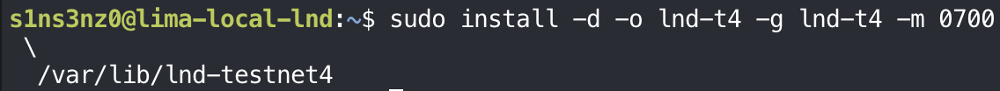

The same `0700`, owner-only directory as `/var/lib/lnd`. This is where LND will keep the testnet4 wallet, the channel database, its TLS certificate, and the macaroons, so nobody but `lnd-t4` gets in.

### Its configuration directory

```bash
sudo install -d -o root -g lnd-t4 -m 0750 /etc/lnd-testnet4
```

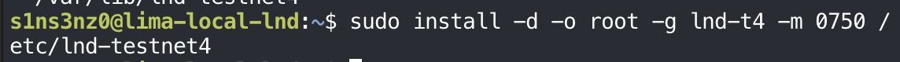

Root owns it and the `lnd-t4` group can read it, the same split as `/etc/lnd`. The `lnd.conf` that goes here will hold the RPC password for testnet4's `bitcoind`, so LND can read its configuration but never rewrite it.

| Directory | Owner:group | Mode | For |
|---|---|---|---|
| `/etc/bitcoin-testnet4` | `root:bitcoin-t4` | `0750` | Testnet4 `bitcoind`'s configuration |
| `/var/lib/bitcoind-testnet4` | `bitcoin-t4:bitcoin-t4` | `0700` | Testnet4 chain data |
| `/etc/lnd-testnet4` | `root:lnd-t4` | `0750` | Testnet4 LND's configuration |
| `/var/lib/lnd-testnet4` | `lnd-t4:lnd-t4` | `0700` | Testnet4 wallet, channels, TLS, macaroons |

The testnet4 stack now mirrors the regtest one directory for directory, under its own names.

### RPC credentials for lnd-t4

Testnet4's LND needs its own login to testnet4's `bitcoind`, made with the same `rpcauth.py` from the earlier series, now for a user named `lnd-t4`:

```bash
python3 ~/downloads/bitcoin-rpcauth/rpcauth.py lnd-t4
```

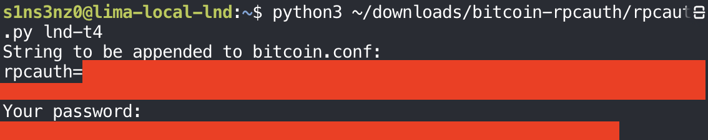

*The generated `rpcauth` value and the password are covered.*

These are new credentials, not the regtest `lnd` ones. Each `bitcoind` gets only the `rpcauth` line for the LND that talks to it, so the regtest password opens nothing on testnet4, and a leak on one side doesn't reach the other. The `rpcauth=` line goes into `/etc/bitcoin-testnet4/bitcoin.conf`; the password goes into testnet4 LND's `lnd.conf`.

The `rpcauth=` line goes in with `sudoedit`, the same way Grafana's configuration was edited in the monitoring series:

```bash
sudoedit /etc/bitcoin-testnet4/bitcoin.conf
```

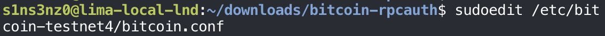

Editing the existing file this way, rather than rewriting it with `tee` as when it was created, keeps the `root:bitcoin-t4` owner and `0640` mode set earlier. `sudoedit` writes the edited copy back into the original file, so its ownership and permissions stay as they are.

```bash
sudo cat /etc/bitcoin-testnet4/bitcoin.conf
```

![sudo cat /etc/bitcoin-testnet4/bitcoin.conf: testnet4=1, server=1, daemon=0, printtoconsole=1, prune=5120, dbcache=512, then rpcauth= followed by a covered value, then [testnet4]](../../assets/images/lnd-testnet4/bitcoin-conf-with-rpcauth.png)

*The salt and HMAC are covered.*

The `rpcauth` line sits with the general settings, above `[testnet4]`, where the regtest file had its own. As covered in the earlier series, `rpcauth` isn't one of the network-specific options that must go inside a section.

`bitcoind` reads `rpcauth` only at startup, so the node restarts to pick it up:

```bash
sudo systemctl restart bitcoind-testnet4
sudo systemctl status bitcoind-testnet4
```


It's back up nine seconds later. The restart interrupts the initial download only briefly: on startup `bitcoind` picks up from the blocks it already verified, and the shutdown before it had time to flush its databases, as the regtest restart test showed. The right edge of the status output is cut off because this `status` ran without `--no-pager -l`.

### Logging in as lnd-t4

The login test follows the regtest one: read the password without echoing it, then hand it to `bitcoin-cli` on standard input.

```bash
read -r -s -p 'testnet4 Core RPC password: ' T4_RPC_PASSWORD
```

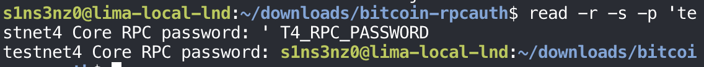

Nothing appears where the password was typed, which is `-s` doing its job. The next shell prompt lands on the same line as the question because `read -s` also suppresses the newline from pressing Enter, a cosmetic quirk rather than an error. As on regtest, `T4_RPC_PASSWORD` is a plain shell variable, not exported, so it stays in this shell.

Then the login itself, as `lnd-t4`, with no configuration file and no access to the cookie:

```bash
printf '%s\n' "$T4_RPC_PASSWORD" |
  sudo -u lnd-t4 bitcoin-cli \
    -conf=/dev/null \
    -datadir=/var/lib/lnd-testnet4 \
    -testnet4 \
    -rpcconnect=127.0.0.1 \
    -rpcport=48332 \
    -rpcuser=lnd-t4 \
    -stdinrpcpass \
    getblockchaininfo
```


| Option | Compared with the regtest test |
|---|---|
| `sudo -u lnd-t4` | The testnet4 LND account instead of `lnd` |
| `-datadir=/var/lib/lnd-testnet4` | Testnet4 LND's directory, which has no `.cookie` in it |
| `-testnet4`, `-rpcport=48332` | The testnet4 network and its RPC port, instead of `-regtest` and `18443` |
| `-rpcuser=lnd-t4` | The new `rpcauth` user |

`-conf=/dev/null` and a data directory without a cookie leave `rpcauth` as the only way this login could work, the same reasoning as on regtest. It worked: the answer is testnet4's chain, from the account LND will run as.

The same output doubles as a sync check, a few minutes after the first one:

| Field | Earlier | Now |
|---|---:|---:|
| `blocks` | 8,728 | 55,869 |
| `headers` | 154,807 | 154,807 |
| `time` of the newest verified block | 10 May 2024 | 29 November 2024 |
| `verificationprogress` | 0.0009 | 0.017 |
| `size_on_disk` | 72 MB | 1.55 GB |
| `pruneheight` | 0 | 0 |

The node has worked through about a third of the chain by block count, and the restart for `rpcauth` didn't set it back. `verificationprogress` is still low because Bitcoin Core weighs progress by transactions, not blocks, and later blocks carry more of them. At 1.55 GB, the data is still under the 5 GiB prune target, so nothing has been deleted yet.

`difficulty` dropped from 256 to 1 between the two checks. That's a property of the blocks being verified, not of the node: testnet4 keeps a rule that lets a block be mined at the minimum difficulty when none has been found for 20 minutes, so difficulty-1 blocks appear throughout its history.

<!-- TODO: unset T4_RPC_PASSWORD -->

### lnd.conf

Testnet4 LND's configuration, in `/etc/lnd-testnet4/lnd.conf`:

```bash
sudo cat /etc/lnd-testnet4/lnd.conf
```

![sudo cat /etc/lnd-testnet4/lnd.conf: [Application Options] alias=local-lnd-testnet4, listen=127.0.0.1:9737, rpclisten=127.0.0.1:10011, restlisten=127.0.0.1:8082; [Bitcoin] bitcoin.testnet4=1, bitcoin.node=bitcoind; [Bitcoind] bitcoind.rpchost=127.0.0.1:48332, bitcoind.rpcuser= and bitcoind.rpcpass= with covered values, bitcoind.zmqpubrawblock=tcp://127.0.0.1:28334, bitcoind.zmqpubrawtx=tcp://127.0.0.1:28335](../../assets/images/lnd-testnet4/lnd-conf-testnet4.png)

*The RPC user and password are covered.*

Set beside the regtest node A's `lnd.conf`:

| Setting | Regtest node A | Testnet4 |
|---|---|---|
| `alias` | `local-lnd` | `local-lnd-testnet4` |
| `listen` (Lightning P2P) | `127.0.0.1:9735` | `127.0.0.1:9737` |
| `rpclisten` (gRPC) | `127.0.0.1:10009` | `127.0.0.1:10011` |
| `restlisten` (REST) | `127.0.0.1:8080` | `127.0.0.1:8082` |
| Network | `bitcoin.active=1`, `bitcoin.regtest=1` | `bitcoin.testnet4=1` |
| `bitcoind.rpchost` | `127.0.0.1:18443` | `127.0.0.1:48332` |
| `bitcoind.rpcuser`, `rpcpass` | The regtest `lnd` login | The new `lnd-t4` login |
| ZMQ | `28332`, `28333` | `28334`, `28335` |

Each port is one past what the regtest nodes use (node B took 9736 and 10010), so three LND nodes can run in the same VM without colliding. `bitcoin.active` is gone: LND's log flagged it as deprecated on regtest, and `bitcoin.testnet4=1` is enough on its own. The `[Bitcoind]` section points at testnet4's `bitcoind` and nothing else: its RPC port, the `rpcauth` login just tested, and the two ZMQ sockets from its `bitcoin.conf`.

Two things are deliberately unchanged for now. Every listener is on loopback, including Lightning P2P on 9737, so this node can open connections to testnet4 peers but can't accept them from outside the VM. And `bitcoind` is pruned, so LND will be running against a backend that doesn't keep old blocks. Both are fine for a first start and worth revisiting once it runs.

This file holds the RPC password in plain text, so it gets the same ownership as the regtest `lnd.conf`:

```bash
sudo chown root:lnd-t4 /etc/lnd-testnet4/lnd.conf
```

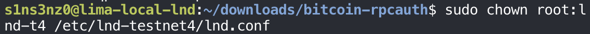

Root owns it, and the `lnd-t4` group, which only testnet4's LND belongs to, is the group that may read it.

```bash
sudo chmod 0640 /etc/lnd-testnet4/lnd.conf
```

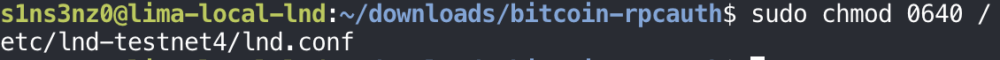

`0640`: root reads and writes, the `lnd-t4` group reads, and everyone else gets nothing, so the password is no longer readable by "others" even if they reached the directory. Owner and mode now match the regtest `lnd.conf`.

<!-- TODO: ls -l confirm, ports-free check -->

### LND's unit

```bash
sudo tee /etc/systemd/system/lnd-testnet4.service >/dev/null <<'EOF'
[Unit]
Description=LND testnet4 node
Wants=bitcoind-testnet4.service
After=bitcoind-testnet4.service

[Service]
Type=simple
User=lnd-t4
Group=lnd-t4
ExecStart=/usr/local/bin/lnd --configfile=/etc/lnd-testnet4/lnd.conf --lnddir=/var/lib/lnd-testnet4
Restart=on-failure
RestartSec=5
TimeoutStopSec=300
UMask=0077
NoNewPrivileges=true
ProtectHome=true
ProtectSystem=full

[Install]
WantedBy=multi-user.target
EOF
```

![sudo tee /etc/systemd/system/lnd-testnet4.service >/dev/null <<'EOF' with [Unit] Description=LND testnet4 node, Wants=bitcoind-testnet4.service, After=bitcoind-testnet4.service; [Service] Type=simple, User=lnd-t4, Group=lnd-t4, ExecStart=/usr/local/bin/lnd --configfile=/etc/lnd-testnet4/lnd.conf --lnddir=/var/lib/lnd-testnet4, Restart=on-failure, RestartSec=5, TimeoutStopSec=300, UMask=0077, NoNewPrivileges=true, ProtectHome=true, ProtectSystem=full; [Install] WantedBy=multi-user.target](../../assets/images/lnd-testnet4/lnd-testnet4-unit.png)

It's the regtest `lnd.service` with every name swapped for its testnet4 counterpart:

| Directive | `lnd.service` (regtest) | `lnd-testnet4.service` |
|---|---|---|
| `Description` | `LND regtest node` | `LND testnet4 node` |
| `Wants`, `After` | `bitcoind.service` | `bitcoind-testnet4.service` |
| `User`, `Group` | `lnd` | `lnd-t4` |
| `--configfile` | `/etc/lnd/lnd.conf` | `/etc/lnd-testnet4/lnd.conf` |
| `--lnddir` | `/var/lib/lnd` | `/var/lib/lnd-testnet4` |

The restart policy, the five-minute stop window, and the hardening lines are identical, and mean what they did in the earlier series. The dependency is the part that matters most here: `lnd-testnet4` pulls in `bitcoind-testnet4`, never the regtest `bitcoind`, so the two stacks start and stop independently.

As before, `After=` orders the processes and nothing more. `bitcoind-testnet4` is still in its initial download, and LND will start against a backend that isn't caught up yet. How LND behaves in that state is something its log will show.

### Starting it

<!-- TODO: verify, daemon-reload, start commands -->

Once started, testnet4's LND stops at the same place the regtest one did on its first run:

![The journal for lnd-testnet4 shows lnd[52531] at 2026-10-02 21:44:46: [INF] LTND: Waiting for wallet encryption password. Use lncli create to create a wallet, lncli unlock to unlock an existing wallet, or lncli changepassword to change the password of an existing wallet and unlock it.](../../assets/images/lnd-testnet4/lnd-t4-waiting-wallet.png)

`Waiting for wallet encryption password` means LND has opened its databases under `/var/lib/lnd-testnet4` and is now waiting for a wallet. It's a fresh data directory, so there is none to unlock: the next step is `lncli create`. Until a wallet exists and is unlocked, LND doesn't start its chain backend, so it hasn't contacted `bitcoind-testnet4` yet, and the half-finished sync hasn't come into play.

### A shortcut and the wallet

First a shortcut for testnet4's `lncli`, built like `lnc` for regtest, then the wallet:

```bash
lnt() {
  sudo -u lnd-t4 lncli \
    --lnddir=/var/lib/lnd-testnet4 \
    --network=testnet4 \
    --rpcserver=127.0.0.1:10011 \
    "$@"
}
lnt create
```


*The cipher seed is covered.*

| Shortcut | Account | `--lnddir` | `--network` | `--rpcserver` |
|---|---|---|---|---|
| `lnc` | `lnd` | `/var/lib/lnd` | `regtest` | `127.0.0.1:10009` |
| `lnb` | `lnd-b` | `/var/lib/lnd-b` | `regtest` | `127.0.0.1:10010` |
| `lnt` | `lnd-t4` | `/var/lib/lnd-testnet4` | `testnet4` | `127.0.0.1:10011` |

Three LND nodes in one VM make a shortcut per node more than a convenience: each one bundles the account, directory, network, and port that belong together, so a command can't be sent to the wrong node by a mistyped flag.

The `create` dialog is the one from the regtest series: a wallet password, `n` for a new seed, no seed passphrase, then 24 words. This wallet is new and separate. Its seed restores only the testnet4 node, and the regtest wallets' seeds have nothing to do with it. These are still worthless test coins, but this node is meant to stay up, so its seed is written down and stored away from the VM the same way a mainnet seed would be.

### LND meets a backend that's still syncing

With the wallet unlocked, LND starts its chain backend and connects to `bitcoind-testnet4`. `getinfo` shows what it sees:

```bash
lnt getinfo
```


| Field | Value | Meaning |
|---|---|---|
| `identity_pubkey` | `03eca642…ab055` | The testnet4 node's own key, from the new wallet. Different from both regtest nodes |
| `alias` | `local-lnd-testnet4` | From `lnd.conf` |
| `chains` | `bitcoin`, `testnet4` | The right network. `testnet: true` marks it as a test network |
| `block_height` | 67,062 | Where `bitcoind-testnet4` is in its download right now |
| `best_header_timestamp` | `1737977977` | That block's time: 27 January 2025, well behind the present |
| `synced_to_chain` | `false` | LND knows the backend isn't caught up |
| `num_peers`, channels | `0` | No Lightning peers or channels yet |
| `uris` | `[]` | Nothing advertised, since P2P is on loopback |

The height says the RPC login and the ZMQ feeds work: LND can only know block 67,062 by asking testnet4's `bitcoind`, and it moved past the 55,869 of the earlier check. It also shows how LND handles a backend in the middle of its initial download. It doesn't fail or restart; it reports the height `bitcoind` has reached and marks itself not synced. `synced_to_chain` will turn `true` once `bitcoind-testnet4` reaches the tip, about 87,000 blocks further on.

<!-- TODO: enable lnd-testnet4; later: sync complete, synced_to_chain true; lndmon/Prometheus for testnet4 -->

## Where this part ends

The testnet4 stack runs next to the regtest one, sharing nothing but the binaries and the VM:

| | Testnet4 `bitcoind` | Testnet4 LND |
|---|---|---|
| Account | `bitcoin-t4` | `lnd-t4` |
| Unit | `bitcoind-testnet4.service`, enabled | `lnd-testnet4.service` |
| Configuration | `/etc/bitcoin-testnet4/bitcoin.conf` | `/etc/lnd-testnet4/lnd.conf` |
| Data | `/var/lib/bitcoind-testnet4`, pruned to about 5 GiB | `/var/lib/lnd-testnet4`, with a new wallet |
| Listens on | RPC `127.0.0.1:48332`, ZMQ `28334`/`28335`, P2P `48333` | gRPC `127.0.0.1:10011`, REST `8082`, P2P `9737` |

`bitcoind-testnet4` is still working through its initial download, and LND is connected to it, following along and waiting to be in sync. The next part picks up once the chain is caught up: enabling LND for boot, confirming `synced_to_chain`, and bringing the testnet4 node into lndmon, Prometheus, and Grafana.

Next: [Moving the monitoring to testnet4](/posts/always-on-testnet4-lnd-node-monitoring/).
