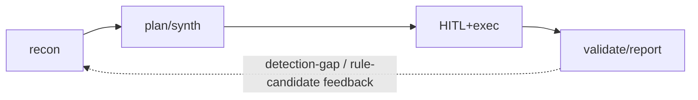

I recently participated in a hackathon focused on designing and building Red Team AI agents to target military UAVs. Given the abundance of red-teaming AI agents already publicly available online, my team recognized the need to differentiate our solution from those built by other teams, as well as from publicly available tools. Also the event was hosted by a defense company, we chose to incorporate U.S military strategies, doctrines, and manuals into our agent's design. I'll eleberate on how F3EAD methodology, as outlined in FM 3-60, is implemented in our solution 

## Table of contents

## What Is F3EAD
F3EAD(Find, Fix, Finsih, Exploit, Analyze, Desseminate) is a six-stage targeting methodology that fuses operations and intelligence into a single continuous loop, rather than treating "hit the target" as the end of the process. Where conventional targeting stops once a target is neutralized

## What Is D3A and Why F3EAD Instead of D3A
Army doctrine splits targeting methodology by use case. D3A(Decide-Detect-Deliver-Assess) is the primary deliberate targeting methodology for planned, conventioinal targets. F3EAD is built for dynamic targeting-time sensitive, fluid high-value individuals and netoworks. FM 3-60 itself keeps D3A as its main methodology and treats F3EAD as an appendix

## The Six Stages
F3EAD splits into two havled with distinct characters.

Exploitation serves four goals: force protection, enabling follow-on targeting, tracing the origin and distribution chain of captured material, and supporting prosecution

|Category|Stage|Description|
|--------|-----|-----------|
|Operations|Find|Target nomination. Can be deliberate or opprtunity-based|
|          |Fix|Intelligence collection assets pin down the target's location in space and time; positive identification(PID)|
|          |Finish|Rapdid execution using an established drill - not necessarily lethal; can include non-kinetic political or social effects|
|Intelligence|Exploit|Interrogating and analyzing captured personnel, equipment, and documents to convert them into intelligence|
|          |Analyze|Processing exploited information with structured analytic techniques into actionable intelligence|
|          |Disseminate|Distributing the resulting product to relevant consumers - which becomes the input for the next find|

## Why F3EAD, not D3A
### The nature of the target demanded F3EAD over D3A. 
- A UAV in flight is a dynamic target whose state keeps changing and whose next move depends on reconnaissance results-a better fit for D3FEAD's adaptive cycle than for D3A's pre-approved, fixed target lists.

### The operations/intelligence split maps directly onto state-machine diagram.
- F3EAD's division between its operational front half and intelligence-focused back half corresponds directly to the standard state-machine design principle of seperating "action nodes" from "nodes that convert results into information."

### The training objective itself required a closed loop.
The value of red team training isn't in a single successful attack-it's in both sides improving through repeated engagement. F3EAD was designed from the outset so that the outcome of hunting one target becomes the intelligence for hunting the next, which is structurally isomorphic to the goal of closed loop red/blue training.

## Structure of Red Team Cycle

## References
- [The Targeting Process(FM 3-60)](https://www.globalsecurity.org/military/library/policy/army/fm/3-60/fm3-60.pdf)
