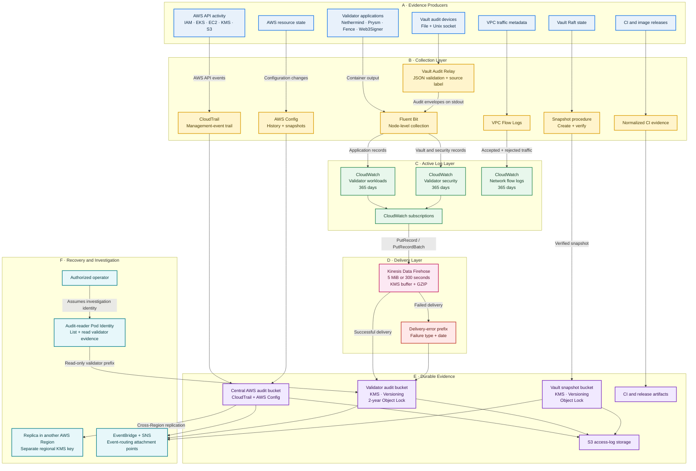

# Audit and Logging Architecture for Hoodi Node Validator

## 1. Why Audit and Logging Matter

**Purpose:** Preserve trustworthy evidence for security analysis, operational troubleshooting, incident response, and recovery.

A validator incident may involve Prysm, Signing Fence, Web3Signer, Vault, PostgreSQL, Kubernetes, IAM, storage, and network controls.

The platform therefore collects evidence from several layers:

- AWS API activity
- AWS resource configuration
- Kubernetes workloads
- Vault requests
- Validator lifecycle events
- Network connections
- Audit-storage access
- CI and image releases

**Applied here:** CloudWatch provides recent searchable logs. S3 provides long-term evidence. CloudTrail and AWS Config record AWS activity and configuration history.

The design supports:

- **Accountability:** identify the acting principal.
- **Traceability:** connect related events.
- **Integrity:** protect evidence from modification.
- **Availability:** retain recoverable records.
- **Confidentiality:** encrypt and restrict logs.

These controls are declared by the project. Their live status should be verified after deployment in the target AWS account and Kubernetes cluster.

## 2. Project Audit and Logging Architecture

**Purpose:** Show where evidence originates, how it moves, where it is stored, and who can access it.

The architecture contains three principal audit paths.

**AWS path:** CloudTrail and AWS Config deliver account evidence to the central audit bucket. The bucket replicates its evidence to another AWS Region.

**Validator path:** Fluent Bit sends Kubernetes logs to CloudWatch. Subscription filters and Firehose move those records into the validator audit archive.

**Vault path:** Vault writes to file and socket audit devices. The Vault Audit Relay sends validated envelopes into the existing Kubernetes logging path.

## 3. AWS API Auditing with CloudTrail

**Purpose:** Record who performed an AWS action, which API was called, when it occurred, and whether it succeeded.

**Applied here:** The project declares a multi-Region CloudTrail and includes global service events.

The trail covers management activity involving services such as:

- IAM and STS
- EKS
- EC2 and VPC
- KMS
- S3
- AWS Config
- CloudWatch
- Firehose
- ECR

A CloudTrail record can identify:

- Event time
- AWS Region
- API operation
- Acting principal
- Assumed-role session
- Source address
- User agent
- Request parameters
- Response or error
- Event identifier

**Project example:** If a role changes the validator audit bucket policy, CloudTrail can identify the role session, API operation, time, and request context.

The trail delivers records to the central AWS audit bucket. This keeps control-plane evidence separate from validator application logs.

CloudTrail log-file validation is enabled. Signed digest files allow an investigator to check whether delivered CloudTrail files were altered or removed.

[CloudTrail log-file validation](https://docs.aws.amazon.com/awscloudtrail/latest/userguide/cloudtrail-log-file-validation-intro.html) explains this process.

## 4. AWS Configuration History with AWS Config

**Purpose:** Preserve the configuration and relationships of AWS resources over time.

**Applied here:** AWS Config records supported resource types and includes global resource types where applicable.

Its delivery channel sends configuration history and periodic snapshots to the central audit storage.

A configuration item describes:

- Resource identifier
- Resource type
- Configuration state
- Resource relationships
- Tags
- Capture time
- Configuration status
- AWS account and Region

CloudTrail and AWS Config answer different questions.

| Investigation question | Evidence source |
|---|---|
| Who made the request? | CloudTrail |
| Which API was called? | CloudTrail |
| What did the resource become? | AWS Config |
| What was its previous state? | AWS Config |
| Which resources were related? | AWS Config |
| What existed at a point in time? | Config snapshot |

**Project example:** CloudTrail identifies who changed a security group. AWS Config shows the rules before and after that change.

Daily snapshots provide a broader view of the environment and its related resources at a particular time.

[AWS Config concepts](https://docs.aws.amazon.com/config/latest/developerguide/how-does-config-work.html) explain configuration history and snapshots.

## 5. Kubernetes Log Collection with Fluent Bit

**Purpose:** Collect Kubernetes logs centrally and attach workload context to every record.

**Applied here:** Fluent Bit runs as a DaemonSet. Kubernetes places a collector on each applicable worker node.

The collector processes output from:

- Nethermind
- Prysm Beacon
- Prysm Validator
- Signing Fence
- Web3Signer
- Vault
- Vault Audit Relay
- Supporting workloads

Fluent Bit enriches records with Kubernetes metadata, including namespace, pod, container, labels, and node context.

Applications only need to write normal container output. They do not need direct access to CloudWatch or the S3 audit archive.

The collector uses EKS Pod Identity for AWS authorization. Static AWS access keys are not stored in the pod configuration.

**Project example:** A Web3Signer error can be linked to its pod and compared with events from Signing Fence and Prysm Validator.

[AWS EKS log collection with Fluent Bit](https://docs.aws.amazon.com/AmazonCloudWatch/latest/monitoring/Container-Insights-EKS-logs.html) describes this collection model.

## 6. Workload and Security Log Separation

**Purpose:** Separate routine application behavior from security-sensitive activity.

**Applied here:** The project declares two encrypted CloudWatch Logs groups.

| Log group | Intended content |
|---|---|
| Validator workloads | Application operation, readiness, synchronization and failures |
| Validator security | Vault, signing controls, audit relay and lifecycle evidence |

Both groups retain records for 365 days and use the validator audit KMS key.

Typical workload events include:

- Client synchronization
- Validator duties
- Readiness changes
- Container restarts
- Runtime warnings
- Application failures

Typical security events include:

- Vault audit envelopes
- Signing-fence decisions
- Audit-relay activity
- Security-control state
- Validator lifecycle evidence
- Access-related failures

**Project example:** A missed duty may first appear in the workload group. A related signing-control denial may appear in the security group.

## 7. CloudWatch Logs Protection

**Purpose:** Keep recent logs encrypted, searchable, and available for active investigation.

**Applied here:** The project uses customer-managed KMS keys for its validator, security, and network log groups.

The validator workload and security groups retain records for 365 days. The principal VPC Flow Log groups also retain one year of evidence.

CloudWatch supports:

- Recent searches
- Timestamp correlation
- Pod and namespace filtering
- Deployment troubleshooting
- Network analysis
- Operational dashboards
- Archive subscriptions

KMS policies authorize the CloudWatch Logs service under scoped conditions. These conditions associate key use with the intended account and log-group context.

**Project example:** Operators can search for a release SHA or correlation ID across validator and security streams before restoring older S3 evidence.

[CloudWatch Logs KMS encryption](https://docs.aws.amazon.com/AmazonCloudWatch/latest/logs/encrypt-log-data-kms.html) explains this protection.

## 8. Vault Audit Collection

**Purpose:** Preserve Vault request evidence while retaining Vault’s audit-device redaction and HMAC behavior.

**Applied here:** Vault writes audit events to two devices:

- A durable file device
- A local Unix socket device

Both use a dedicated audit directory shared with the Vault Audit Relay sidecar.

The relay:

1. Listens on the Unix socket.
2. Follows new records appended to the audit file.
3. Accepts newline-delimited JSON.
4. Rejects malformed or oversized records.
5. Labels the file or socket source.
6. Wraps each record in an envelope.
7. Writes the envelope to standard output.
8. Lets Fluent Bit collect the output.

The envelope contains a schema version, audit-source label, and the original Vault audit JSON.

A single writer prevents records from concurrent socket connections from being interleaved.

Vault audit devices remain responsible for HMAC protection of sensitive fields. The relay preserves the record supplied by Vault.

**Project example:** Investigators can distinguish file-device evidence from socket-device evidence while retaining the original Vault audit event.

## 9. Validator Evidence Envelope

**Purpose:** Standardize lifecycle evidence and connect related activity without storing validator secrets.

**Applied here:** Stored validator lifecycle records follow a common evidence schema and contain a correlation identifier.

Permitted public identifiers include:

- Validator public key
- Validator-set identifier
- Deposit-data hash
- Deposit transaction hash
- Vault request identifier
- Kubernetes UID
- Release SHA
- Explorer URL
- UTC timestamp
- Response hash

The evidence contract prohibits:

- Mnemonics
- Keystore material
- Passwords
- Tokens
- Vault recovery material
- Kubeconfig content
- Cloud credentials
- Unredacted Vault values

A correlation ID is generated once for a lifecycle change. It is propagated through supported Vault headers, Kubernetes annotations, observer records, and archive metadata.

All timestamps use UTC so that AWS, Kubernetes, Vault, blockchain, and CI records can be compared consistently.

**Project example:** A deposit, activation observation, Vault request, deployment, and release can be connected without recording the validator private key.

## 10. CloudWatch Subscription Controls

**Purpose:** Move records to Firehose without granting CloudWatch direct control over the archive.

**Applied here:** Both validator CloudWatch groups have subscription filters targeting the validator Firehose stream.

The CloudWatch subscription role is limited to:

- `firehose:PutRecord`
- `firehose:PutRecordBatch`

Those permissions apply only to the project’s validator Firehose stream.

The role does not require:

- S3 read or delete access
- Audit-reader access
- Bucket administration
- KMS administration
- Kubernetes access

**Project example:** The subscription role can send a log batch to Firehose but cannot browse the records after Firehose stores them in S3.

[CloudWatch subscription filters](https://docs.aws.amazon.com/AmazonCloudWatch/latest/logs/SubscriptionFilters.html) describe destination delivery.

## 11. Firehose Delivery Controls

**Purpose:** Buffer, encrypt, compress, and deliver validator evidence through a managed pipeline.

**Applied here:** Firehose receives records from the workload and security groups and writes them into the validator audit bucket.

The delivery configuration includes:

- Extended S3 delivery
- A dedicated Firehose IAM role
- A dedicated buffer KMS key
- The validator archive KMS key
- GZIP compression
- Five-MiB buffering
- A 300-second buffer interval
- Date-organized object paths
- A separate error path

Delivery occurs when the configured size or time threshold is reached.

The buffer key protects data inside Firehose. The archive key protects the resulting S3 objects.

The error path includes the failure type and date. Failed delivery records remain distinguishable from accepted evidence.

**Project example:** A failed validator record enters the error prefix with its Firehose failure category instead of appearing as a successful archive object.

[Firehose encryption](https://docs.aws.amazon.com/firehose/latest/dev/encryption.html) explains buffer and destination encryption.

## 12. Immutable Validator Audit Archive

**Purpose:** Preserve validator lifecycle and security evidence through a protected retention period.

**Applied here:** The validator audit bucket is the canonical archive for non-secret validator lifecycle records.

The bucket applies:

- Public-access blocking
- Bucket-owner-enforced ownership
- S3 versioning
- Customer-managed KMS encryption
- Automatic key rotation
- TLS-only access
- Encrypted-upload enforcement
- Object Lock at creation
- Two-year Governance retention
- Server-access logging
- EventBridge integration
- Storage lifecycle transitions

Object Lock protects individual object versions. An overwrite creates another version instead of silently replacing retained evidence.

Governance retention prevents routine deletion or retention reduction. Any bypass is a privileged IAM operation.

The archive uses a validator-specific prefix. Firehose receives delivery access, while the audit reader receives read-only access.

**Project example:** A lifecycle record remains available as a protected object version even if a later record uses the same logical name.

[Amazon S3 Object Lock](https://docs.aws.amazon.com/AmazonS3/latest/userguide/object-lock.html) explains version retention.

## 13. Archive Lifecycle Management

**Purpose:** Retain evidence while lowering the cost of older storage.

**Applied here:** The validator archive changes storage class as records age.

| Record age | Applied storage |
|---:|---|
| 0–89 days | S3 Standard |
| 90–364 days | S3 Standard-IA |
| 365 days and later | S3 Glacier |
| Retention boundary | Two-year Object Lock |

Storage-class transitions do not remove Object Lock protection.

Incomplete multipart uploads are aborted after the configured period. These are unfinished transfers rather than completed audit records.

**Project example:** Recent signing evidence remains immediately accessible, while evidence from the prior year may require a Glacier retrieval.

[S3 lifecycle management](https://docs.aws.amazon.com/AmazonS3/latest/userguide/object-lifecycle-mgmt.html) explains transitions.

## 14. IAM Controls for Audit and Logging

**Purpose:** Give every component only the permissions required for its role in the audit pipeline.

**Applied here:** Collection, transport, reading, replication, and publishing use separate identities.

| Identity | Trust boundary | Main access |
|---|---|---|
| Validator log collector | EKS Pod Identity | Write to approved CloudWatch groups |
| CloudWatch subscription role | CloudWatch Logs | Put records into one Firehose stream |
| Firehose delivery role | Firehose | Write to the validator archive |
| Validator audit reader | EKS Pod Identity | List and read validator evidence |
| Flow Logs roles | VPC Flow Logs | Write to designated log groups |
| Replication role | S3 replication | Copy approved source versions |
| CI publisher roles | GitHub OIDC | Publish to designated ECR repositories |

The collector and audit reader use separate Kubernetes service accounts and Pod Identity associations.

The audit reader can list the bucket and read the validator prefix. It does not receive archive-writing permissions.

The Firehose role can use its buffer and archive keys for delivery. Its S3 access is scoped to the validator archive.

Flow Logs roles can write only to their designated CloudWatch groups.

The replication role can read source versions and write replicas to a bucket in another AWS Region.

**Project example:** A collector pod does not inherit the reader role needed to download archived validator evidence.

[AWS IAM best practices](https://docs.aws.amazon.com/IAM/latest/UserGuide/best-practices.html) explain least privilege.

## 15. S3 Bucket Policy Controls

**Purpose:** Enforce storage requirements independently from caller IAM policies.

**Applied here:** Protected audit storage uses bucket policies alongside identity policies.

The policies enforce controls such as:

- Denial of non-TLS requests
- Denial of unencrypted uploads
- Required KMS encryption
- Service-specific delivery access
- Prefix-scoped writes
- Controlled replication
- Public-access blocking

CloudTrail and AWS Config receive the permissions required for the central audit bucket. Firehose receives separate access to the validator archive.

Bucket-owner-enforced ownership removes reliance on legacy object ACLs for ordinary ownership management.

**Project example:** An upload without the required encryption or HTTPS transport is denied at the archive boundary.

[Amazon S3 bucket-policy examples](https://docs.aws.amazon.com/AmazonS3/latest/userguide/example-bucket-policies.html) describe these controls.

## 16. KMS Controls for Audit Evidence

**Purpose:** Require cryptographic authorization in addition to S3 or CloudWatch access.

**Applied here:** Separate customer-managed KMS keys protect different evidence domains.

These include keys for:

- Central AWS audit records
- Validator audit objects
- Firehose buffers
- Primary VPC Flow Logs
- Foundation Flow Logs
- Vault-recovery Flow Logs
- Vault snapshots
- Cross-Region replicas
- Related access-log stores

Key rotation is enabled. Deletion waiting periods provide time to respond to an unintended deletion request.

Key policies authorize approved AWS services and project roles. Account, source ARN, and encryption-context conditions restrict service use where applicable.

Separating keys limits the effect of one permission boundary. Access to a network-log key does not grant access to Vault snapshots or validator evidence.

**Project example:** Reading a validator object requires permission for both the S3 object and its validator audit KMS key.

## 17. Storage-Access Logging

**Purpose:** Record requests made against protected audit and recovery stores.

**Applied here:** Server-access logging is configured for the central audit, validator audit, and Vault snapshot buckets.

Access records are sent to separate log storage. They are not placed back into the source prefix that generated them.

Access logs can identify:

- Request time
- Requester information
- Bucket and object
- Operation
- HTTP status
- Error code
- Bytes transferred
- Request identifier
- User agent

The project also replicates selected access-log prefixes associated with audit, validator-audit, and Vault-snapshot storage.

**Project example:** An archived validator record can be compared with the S3 access entry generated when that object was requested.

[Amazon S3 server-access logging](https://docs.aws.amazon.com/AmazonS3/latest/userguide/ServerLogs.html) explains these records.

## 18. Cross-Region Audit Recovery

**Purpose:** Maintain central AWS audit evidence in another AWS Region.

**Applied here:** The central audit bucket replicates its objects from the primary AWS Region to a dedicated bucket in a secondary AWS Region.

The recovery path includes:

- Versioned source and destination buckets
- Full central audit-bucket replication
- KMS-encrypted source-object selection
- A separate destination KMS key
- A dedicated replication IAM role
- Private destination access
- Destination lifecycle management
- Destination server-access logging
- EventBridge integration

The replication role can read source versions and replication metadata. It can then create protected replicas in the destination Region.

KMS permissions allow source decryption and destination encryption without granting the role general key administration.

Delete-marker replication is disabled. A delete marker in the primary bucket does not automatically remove the recovery view in the other Region.

The regional copy principally protects CloudTrail and AWS Config evidence held in the central audit bucket.

Selected access-log prefixes also use cross-Region replication.

**Project example:** If the primary audit Region is unavailable, operators can retrieve replicated CloudTrail and AWS Config evidence from the secondary Region.

[Amazon S3 replication](https://docs.aws.amazon.com/AmazonS3/latest/userguide/replication.html) explains cross-Region behavior.

## 19. VPC Flow Logging

**Purpose:** Record metadata for accepted and rejected network traffic.

**Applied here:** Flow logging is declared for:

1. The primary private network
2. The foundation-managed network
3. The isolated Vault-recovery network

The configured traffic type is `ALL`. This includes accepted and rejected traffic.

Each network context uses:

- A dedicated CloudWatch group
- KMS encryption
- A dedicated delivery role
- One-year retention
- Flow Logs service trust
- Destination-scoped permissions

Flow records contain:

- Network interface
- Source and destination address
- Source and destination port
- Protocol
- Packet and byte counts
- Start and end time
- Accept or reject decision

Flow Logs record metadata rather than application payloads.

Foundation flow logging applies when the project manages the foundation VPC. The recovery stack uses its own isolated logging resources.

**Project example:** A rejected connection to a private AWS endpoint can be distinguished from an application-level failure.

[AWS VPC Flow Logs](https://docs.aws.amazon.com/vpc/latest/userguide/flow-logs-basics.html) describes the record format.

## 20. Vault Snapshot Audit Controls

**Purpose:** Protect Vault recovery state and prove that an archived snapshot has the required protections.

**Applied here:** Vault Raft snapshots use a dedicated S3 archive.

The snapshot bucket applies:

- Public-access blocking
- Bucket-owner controls
- Versioning
- KMS encryption
- Object Lock
- Governance retention
- TLS-only access
- Server-access logging
- EventBridge integration

The snapshot workflow verifies:

- Snapshot hash
- S3 object version
- Encryption status
- KMS key
- Retention state
- Object Lock state
- Expected archive location

The local snapshot is removed only after the stored object and its controls have been verified.

**Project example:** A successful upload response is followed by archive validation before the local Raft snapshot is cleared.

## 21. Audit Event Routing

**Purpose:** Make audit-storage events available to monitoring and response automation.

**Applied here:** Protected S3 buckets enable EventBridge integration. CloudTrail delivery is associated with an SNS topic.

These services provide attachment points for:

- New audit objects
- Snapshot arrivals
- Archive delivery events
- Security automation
- Operational notification
- Downstream validation
- Incident-response workflows

EventBridge and SNS route notifications. CloudWatch and S3 remain the evidence stores.

**Project example:** A Vault snapshot arrival can trigger verification while the authoritative snapshot remains protected in S3.

[Amazon S3 EventBridge integration](https://docs.aws.amazon.com/AmazonS3/latest/userguide/EventBridge.html) explains S3 event delivery.

## 22. CI and Release Audit Evidence

**Purpose:** Preserve proof that infrastructure, policy, and container-release checks ran before release.

**Applied here:** Project workflows generate normalized evidence rather than relying only on temporary console output.

Evidence includes:

- OPA policy decisions
- Normalized policy results
- SARIF reports
- Baseline summaries
- Validator control evidence
- Vault runtime verification
- Audit Relay release evidence
- Source-input hashes
- Image digests
- Release SHAs

OPA evidence is retained for 90 days. Vault runtime and Audit Relay release evidence use 30-day artifact retention.

The evidence contract excludes raw secrets, raw runtime telemetry, and unnecessary scanner material from ordinary CI artifacts.

**Project example:** The Audit Relay workflow records its input hash and image digest so a published image can be associated with its build inputs.

## 23. Private Logging-Image Supply Chain

**Purpose:** Control the origin and publication of containers used in audit collection.

**Applied here:** The project defines private ECR publication paths for observability and Vault Audit Relay images.

The repositories use:

- KMS encryption
- Immutable image tags
- Scan-on-push
- Restricted publisher roles
- GitHub OIDC authentication
- Dedicated GitHub environments
- Repository-scoped ECR permissions

GitHub Actions obtains temporary AWS credentials by assuming a publisher role with an OIDC token.

The trust policy restricts the GitHub subject to the intended repository, workflow context, and publication environment.

The publisher can upload image layers and publish an image. It does not receive general infrastructure-administration access.

The Audit Relay container is built as a minimal image and runs under a non-root identity.

These private publication resources can be conditionally enabled through project deployment variables.

**Project example:** Only the approved Audit Relay publication identity can assume its ECR publisher role.

## 24. Operational Investigation Procedure

**Purpose:** Provide a consistent incident-investigation process.

**Applied here:** Operators use this sequence:

1. Define the UTC investigation window.
2. Identify the affected pod, validator, node, and release.
3. Search the workload and security log groups.
4. Correlate Prysm, Signing Fence, Web3Signer, and Vault events.
5. Check VPC Flow Logs for network decisions.
6. Review CloudTrail and AWS Config for AWS changes.
7. Retrieve older validator evidence from S3.
8. Inspect Firehose errors and S3 access logs.
9. Verify CI evidence and image digests.
10. Use the replica in another AWS Region if the primary audit store is unavailable.

The investigation record should preserve relevant correlation IDs, CloudTrail event IDs, object versions, hashes, Config timestamps, and release SHAs.
