# cert-manager and Vault: Roles, Scope, and Collaboration

## 1. Architecture Overview

This project uses **cert-manager** and **HashiCorp Vault** for different layers of security.

- **cert-manager** establishes TLS trust for the Vault service itself.
- **Vault** stores application secrets, authorizes workloads, and manages certificates used by validator signing components.
- **Kubernetes** supplies workload identity, admission control, Secret storage, volume mounting, and network isolation.
- **AWS KMS** allows the Vault cluster to unseal securely after startup.
- **Vault Integrated Storage using Raft** replicates Vault data across three Vault servers.

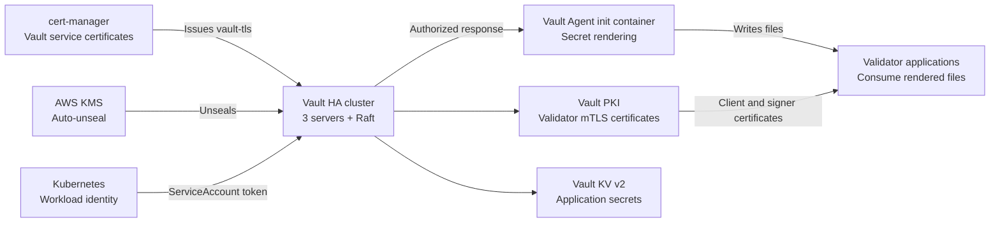

The central distinction is:

> cert-manager secures communication **with Vault**. Vault secures the applications and communication **behind Vault**.

---

## 2. Role and Scope at a Glance

| Component | Primary role | Scope in this project |
|---|---|---|
| cert-manager | Kubernetes certificate lifecycle controller | Vault server API and Raft TLS |
| Vault | Secret management and application PKI | Engine JWT, validator keys, passwords, TLS identities |
| Kubernetes authentication | Proves which workload is calling Vault | ServiceAccount and namespace identity |
| Vault Agent | Retrieves authorized secrets | Prepares files inside selected application Pods |
| AWS KMS | Protects the Vault unseal operation | Vault server startup and recovery |
| Vault Raft | Stores and replicates Vault state | Three-server Vault HA cluster |
| NetworkPolicy | Restricts network reachability | Controls which Pods may connect to Vault |
| Application containers | Consume secrets | Nethermind, Prysm, Web3Signer, database clients |

cert-manager and Vault are complementary. They are not interchangeable certificate systems in this architecture.

---

# Part I: cert-manager

## 3. What cert-manager Does

cert-manager is a Kubernetes controller that watches certificate resources.

An administrator declares:

- the issuer that should sign a certificate;
- the required DNS names;
- the certificate lifetime;
- the renewal window;
- the key algorithm;
- the Kubernetes Secret that should contain the result.

cert-manager then:

1. generates or rotates a private key;
2. requests a certificate from the configured issuer;
3. stores the certificate and key in a Kubernetes Secret;
4. watches the expiration date;
5. renews the certificate before it expires.

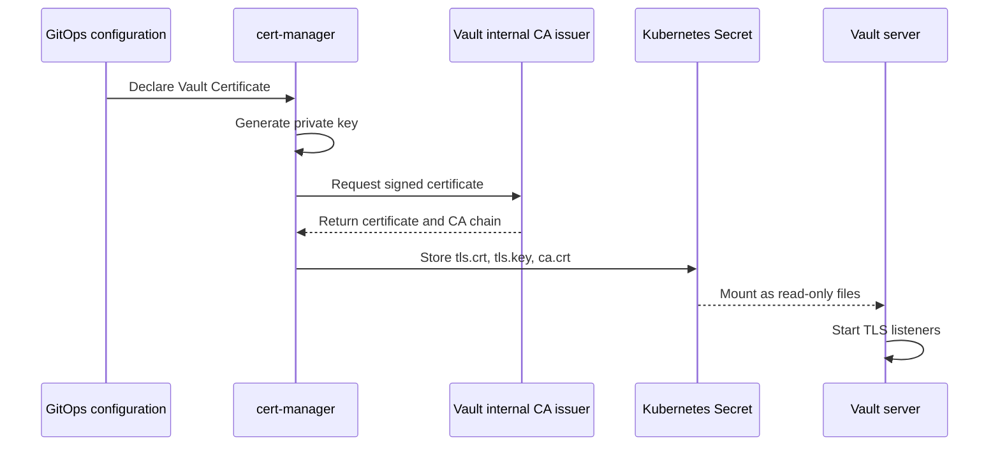

### Example

Suppose the Vault service is accessed through:

```text
vault.vault.svc
```

A client must verify that it is talking to the real Vault service. cert-manager issues a certificate containing this DNS name. Vault presents that certificate during the TLS handshake.

If an attacker presents a certificate for an unrelated service, the hostname verification fails.

---

## 4. cert-manager’s Scope

cert-manager’s trust domain is deliberately narrow:

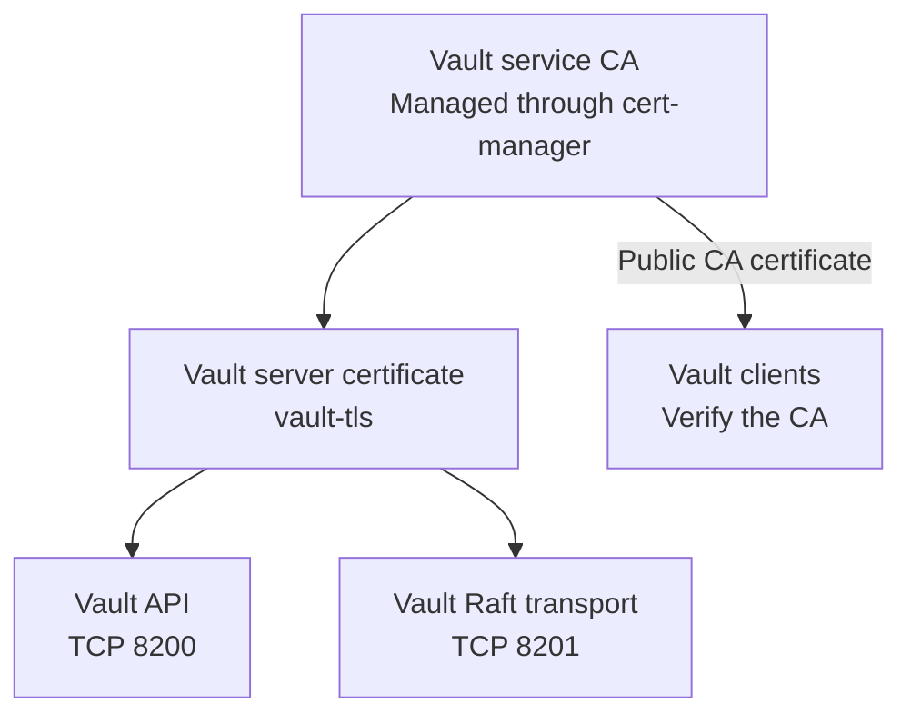

It protects:

- Vault API traffic on port 8200;
- Vault Raft cluster traffic on port 8201;
- DNS identity for the Vault Kubernetes service;
- DNS identities for individual Vault StatefulSet members;
- encryption between clients and Vault;
- encryption and authentication between Vault peers.

It does not directly manage:

- validator signing keys;
- Engine API JWT secrets;
- database passwords;
- Web3Signer keystores;
- application authorization policies;
- Vault authentication roles;
- secret injection;
- GitHub or operator identity;
- validator-to-signer application mTLS.

Those responsibilities belong to Vault or other platform components.

---

## 5. The cert-manager CA Hierarchy

The project uses a small private CA hierarchy for Vault transport.

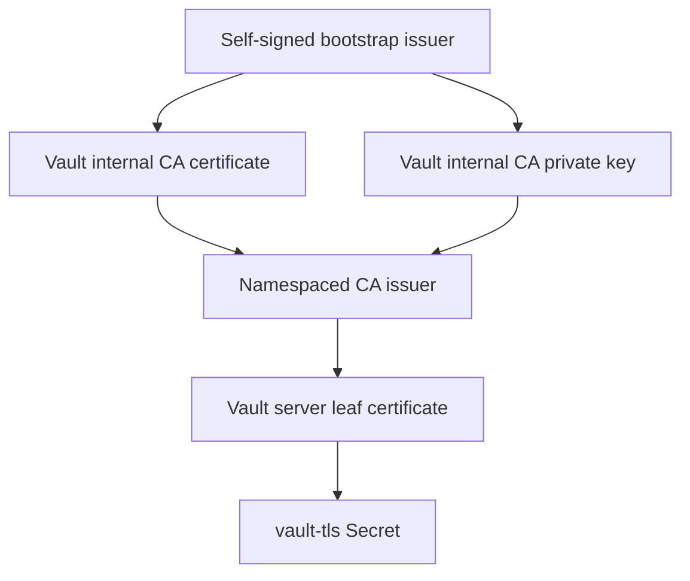

### Step 1: Bootstrap issuer

A self-signed issuer creates the initial CA. This is the root of trust for Vault service TLS.

### Step 2: CA certificate

The resulting CA certificate has permission to sign other certificates. Its private key is sensitive because anyone who obtains it could issue a certificate trusted as a Vault server.

### Step 3: Namespaced CA issuer

A CA issuer uses that certificate and private key to issue the Vault server certificate.

The issuer is namespaced. Its authority is therefore constrained to the Vault namespace instead of becoming a cluster-wide certificate authority.

### Step 4: Vault leaf certificate

The Vault server certificate contains the DNS names used by:

- the Vault Kubernetes service;
- the internal Vault service;
- individual Vault servers;
- the project’s private Vault hostname.

The leaf certificate supports server authentication and, where required, client authentication.

---

## 6. Certificate Material Produced by cert-manager

The resulting `vault-tls` Secret contains three important files:

| File | Meaning | Consumer |
|---|---|---|
| `tls.crt` | Vault server certificate | Vault listener |
| `tls.key` | Vault server private key | Vault listener |
| `ca.crt` | CA trust certificate | Vault and Vault clients |

Vault mounts this Secret as a read-only volume.

The files are then used for two different interfaces:

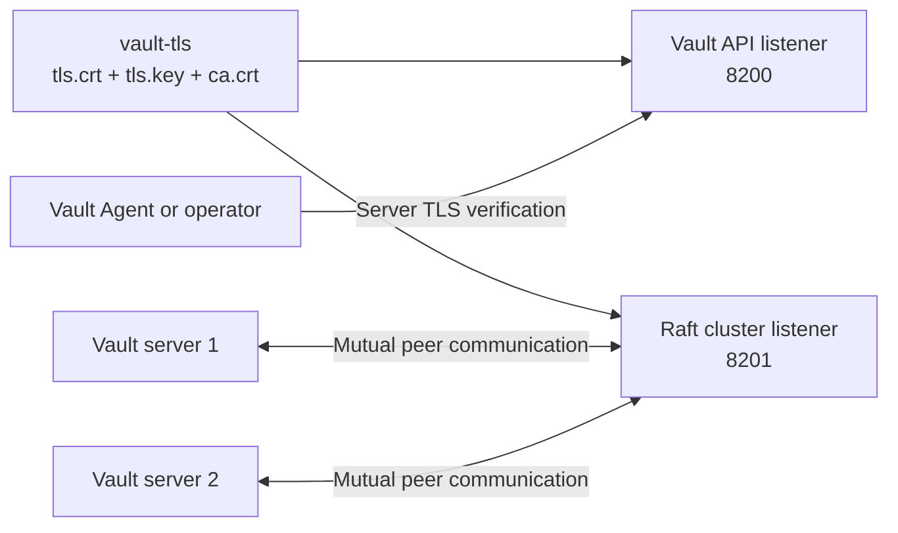

The CA certificate may be distributed more widely because it is public trust material. The private key must remain limited to the Vault servers and cert-manager’s controlled certificate workflow.

---

## 7. Certificate Renewal

cert-manager renews the Vault certificate before expiration and updates the `vault-tls` Secret.

However, replacing a file in a mounted Secret does not automatically prove that Vault has loaded the new certificate.

A complete renewal process therefore has two stages:

1. cert-manager renews the certificate.
2. Vault reloads the certificate or its Pods are restarted safely.

For a three-server Vault cluster, this should be performed as a rolling operation:

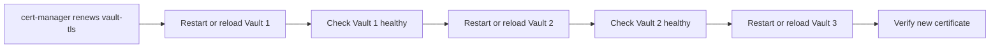

Raft quorum must remain available during this process. Restarting all three servers simultaneously could make Vault unavailable.

---

# Part II: Vault

## 8. What Vault Does

Vault is the project’s central service for sensitive application material.

Its work can be divided into four areas:

1. **Secret storage**  
   Vault stores confidential values in its KV v2 secrets engine.

2. **Workload authentication**  
   Vault verifies Kubernetes ServiceAccount identities.

3. **Authorization**  
   Vault policies determine which workload may read which secret.

4. **Application PKI**  
   Vault issues TLS identities for validator signing communication.

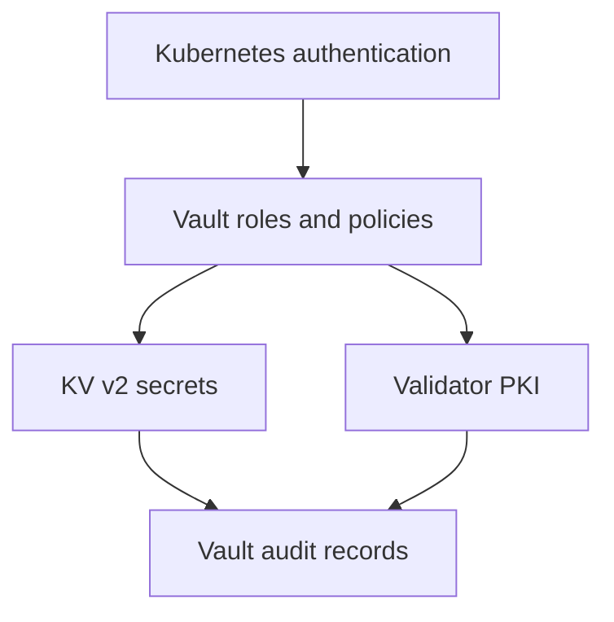

Vault answers three separate questions:

- **Who is calling?**
- **What may that caller access?**
- **What secret or certificate should be returned?**

---

## 9. The Three-Server Vault Architecture

Vault runs as a three-member highly available cluster.

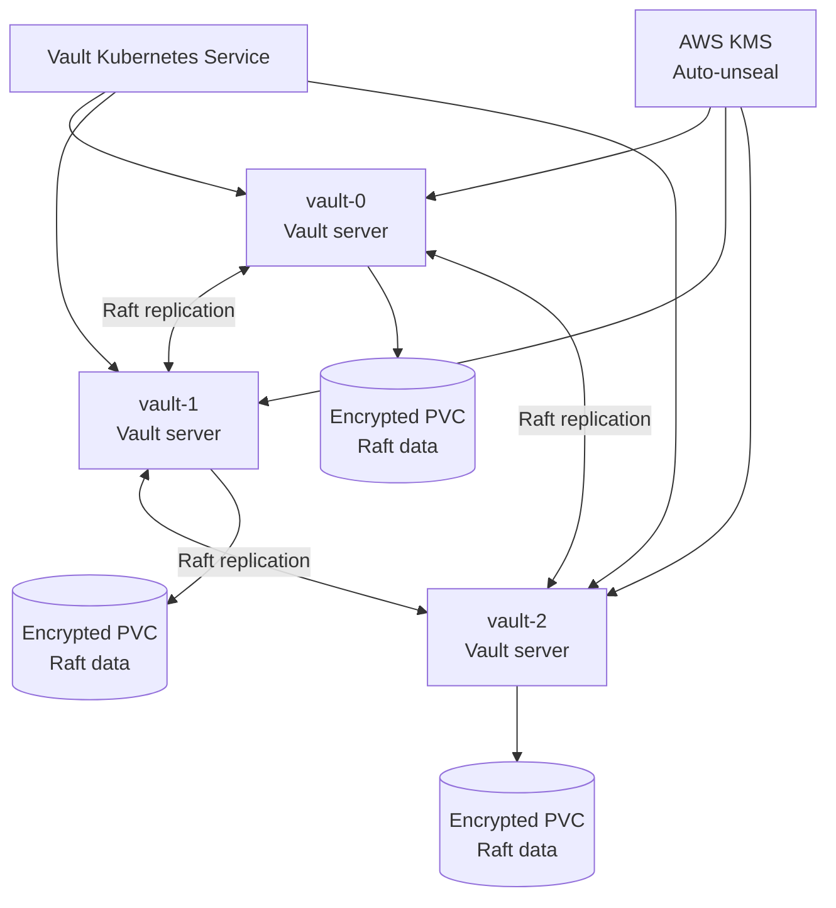

One Vault server acts as the active node. The others remain standby nodes and maintain replicated state.

If the active node becomes unavailable, the remaining nodes can elect a new active server as long as quorum remains.

With three members, quorum requires two available members.

---

## 10. Raft’s Role

Vault Integrated Storage uses the Raft consensus protocol.

Raft stores and replicates:

- encrypted secret records;
- authentication configuration;
- Vault policies;
- Kubernetes roles;
- PKI configuration;
- issued-certificate records;
- leases and token metadata;
- audit-related Vault state.

Each server has its own persistent volume. The data is not merely copied into one shared filesystem. Raft coordinates an ordered state across independent Vault members.

Raft provides availability and consistency, but it is not the same as a backup. Operational recovery still requires controlled Vault snapshots stored outside the cluster.

---

## 11. Seal and Unseal

Vault encrypts its internal data using a hierarchy of encryption keys.

A sealed Vault server can access its stored bytes but cannot decrypt the protected Vault data.

AWS KMS supplies the trusted unseal mechanism:

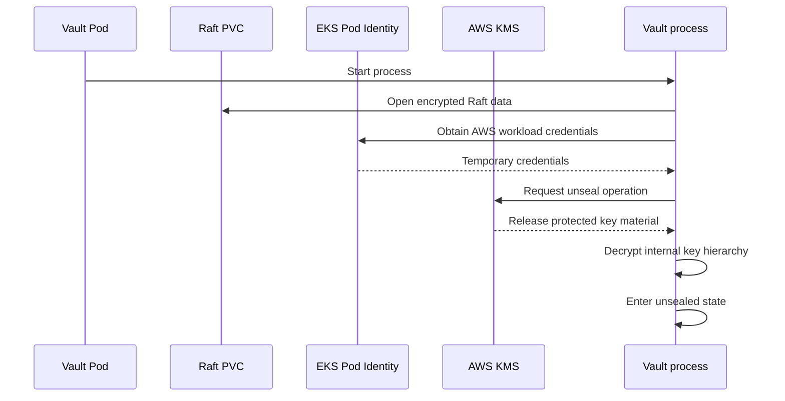

AWS KMS does not store every application secret. Its role is narrower: it protects the key operation that lets Vault unlock its own encrypted storage.

Vault remains responsible for application secret encryption and access decisions.

---

## 12. Secrets Managed by Vault

The project uses Vault KV v2 for application secrets such as:

| Secret | Purpose | Main consumers |
|---|---|---|
| Engine API JWT | Authenticates execution and consensus communication | Nethermind and Prysm Beacon |
| Validator keystore | Holds validator signing key material | Web3Signer |
| Keystore password | Unlocks the validator keystore | Web3Signer |
| Slashing database password | Authenticates database access | Web3Signer |
| Signer TLS bundle | Establishes the signer’s TLS identity | Web3Signer |
| Validator client certificate and key | Establishes the validator client identity | Prysm Validator |

KV v2 supports secret versions and controlled updates. A secret can be replaced without silently overwriting its history.

Versioning helps recovery, but old versions remain sensitive. Vault policy must prevent unauthorized access to both current and historical secret versions.

---

## 13. Kubernetes Workload Authentication

Applications do not share one permanent Vault token.

Each authorized Pod receives a short-lived projected Kubernetes ServiceAccount token. The token identifies:

- the Kubernetes namespace;
- the ServiceAccount;
- the Kubernetes cluster that issued it;
- the intended audience;
- the token expiration time.

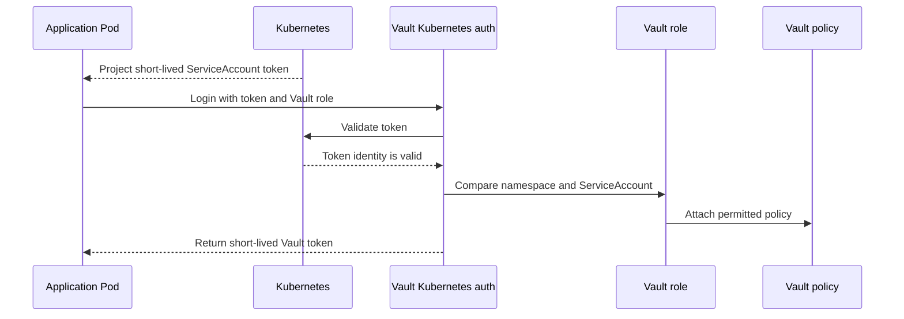

### Example

A Nethermind Pod might authenticate as:

```text
namespace: node-operator
service account: nethermind-execution
```

Vault maps that identity to a role that can read only the Engine API JWT.

A Web3Signer Pod uses a different ServiceAccount and receives broader access to its validator-specific signing material. Nethermind cannot reuse its own identity to retrieve the validator keystore.

---

## 14. Vault Roles and Policies

A Vault role answers:

> Which Kubernetes identity may log in?

A Vault policy answers:

> What may the authenticated identity do?

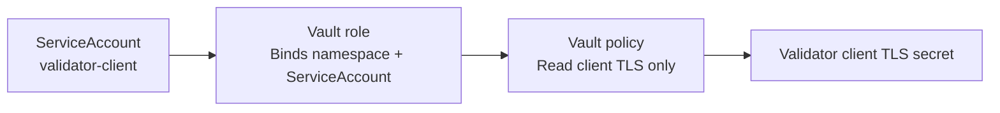

This separation permits precise access control.

For example:

- Nethermind may read the Engine API JWT.
- Prysm Beacon may read the same JWT.
- Prysm Validator may read its client TLS material.
- Web3Signer may read its signing keystore, password, signer TLS bundle, and database credential.
- Unrelated workloads receive no access.

Vault tokens are short-lived and do not automatically inherit the broad default policy.

---

## 15. Vault Agent’s Role

Vault Agent retrieves secrets for application Pods.

In this project’s main workload pattern, Vault Agent runs as a **pre-population init container**. It is not a continuously running sidecar.

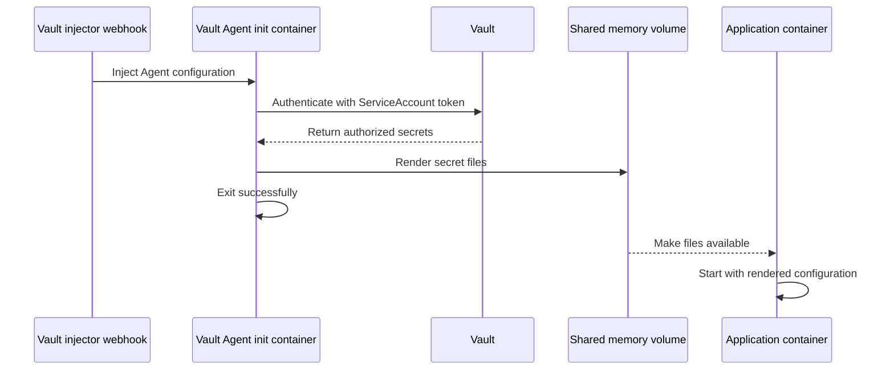

This pattern creates a startup gate:

- if authentication succeeds, the secrets are rendered and the application starts;
- if authentication fails, the init container fails and the application does not start;
- if Vault is unavailable, the secret-dependent application waits instead of starting with missing credentials.

### Operational consequence

Because the Agent exits after rendering, it does not continuously renew or rewrite the files.

When a secret changes in Vault, the application Pod normally requires a controlled restart to retrieve the new value.

---

# Part III: Where cert-manager and Vault Meet

## 16. The Main Correlation Point

The main correlation point is the Vault API connection.

Before Vault Agent can authenticate or retrieve a secret, it must first establish a secure TLS connection to Vault.

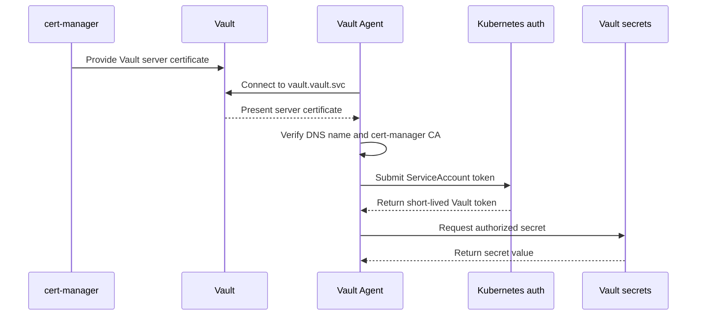

There are two security stages:

1. **cert-manager CA verification** proves that the endpoint is the expected Vault server.
2. **Vault authentication and policy** prove that the client is an authorized workload.

TLS verification alone does not authorize secret access. Likewise, a valid ServiceAccount token should not be sent until the client has verified the Vault server.

---

## 17. CA Trust Distribution

Vault servers receive the private server identity:

```text
tls.crt
tls.key
ca.crt
```

Vault clients receive only the public CA certificate:

```text
ca.crt
```

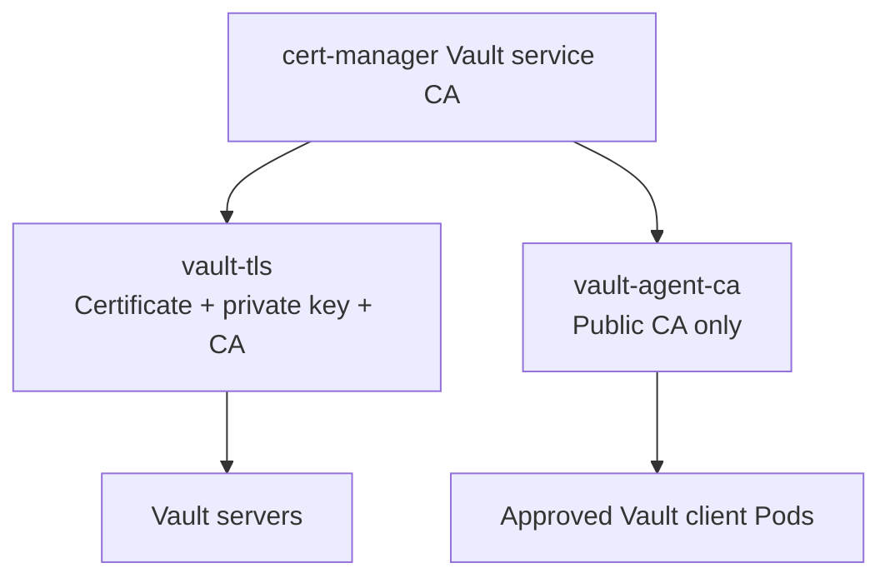

A client uses `ca.crt` to verify Vault. It does not need the Vault server’s private key.

This separation is essential. Distributing the server private key to application namespaces would allow a compromised workload to impersonate Vault.

---

## 18. Two Separate CA Domains

The project contains two internal certificate domains.

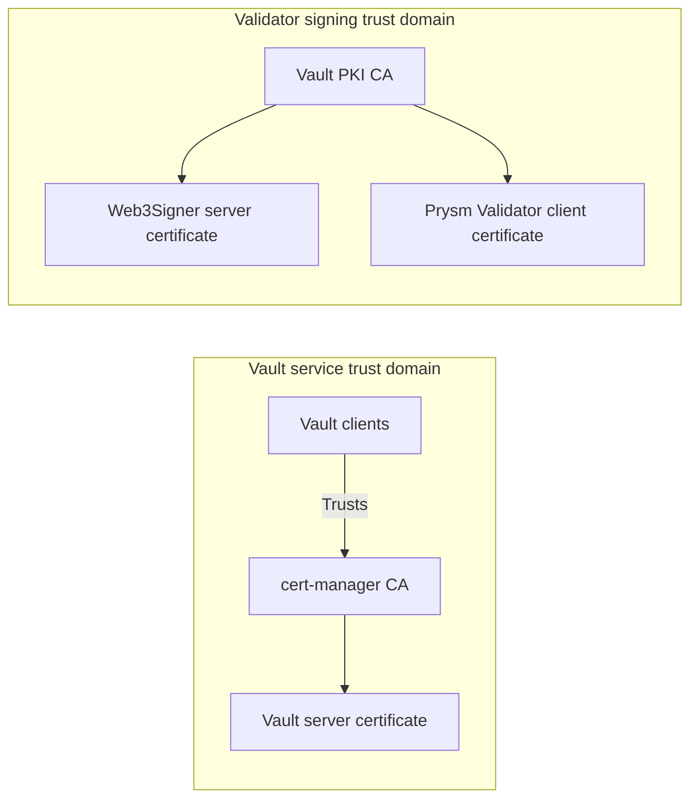

### Domain 1: cert-manager CA

This CA protects access to Vault.

It answers:

> Is this endpoint the expected Vault service?

### Domain 2: Vault PKI CA

This CA protects validator signing traffic.

It answers:

> Is this client an approved validator, and is this server an approved signer?

Keeping these CA domains separate limits the effect of compromise. A certificate issued for validator signing cannot automatically impersonate the Vault service.

---

# Part IV: Vault PKI for Validator Signing

## 19. Vault as an Application CA

After Vault is running and unsealed, its PKI secrets engine acts as a separate internal certificate authority.

The validator PKI is constrained to internal service names associated with the validator operations namespace.

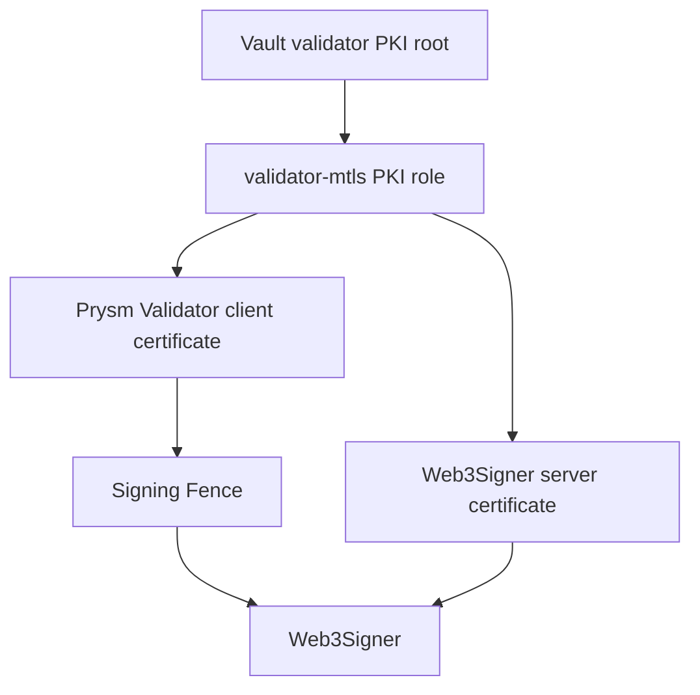

The PKI role restricts certificate issuance by:

- allowed DNS suffix;
- maximum certificate lifetime;
- permitted key usages;
- approved role name;
- Vault policy.

Vault therefore cannot issue arbitrary certificates merely because the PKI engine exists. The caller must have access to the specific issuance role, and the requested names must satisfy that role.

---

## 20. Validator mTLS

Mutual TLS authenticates both ends of the signing connection.

- Web3Signer presents a server certificate.
- Prysm Validator presents a client certificate.
- Each side verifies the certificate chain and expected identity.

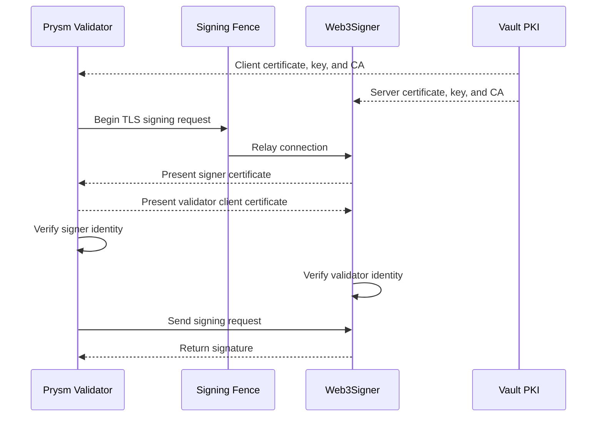

The Signing Fence controls whether traffic may reach Web3Signer, but it does not replace certificate authentication. The layers have different purposes:

- the fence controls active signing access;
- mTLS authenticates the participants;
- Vault controls certificate issuance;
- Web3Signer holds and uses the validator signing key;
- the slashing database prevents conflicting signing history.

---

## 21. Validator Certificate Rotation

Validator TLS rotation must preserve signing safety.

A safe sequence is:

1. stop or scale down the validator client;
2. request a new client certificate from Vault PKI;
3. request or prepare the new Web3Signer server certificate;
4. verify certificate chains, names, and expiration;
5. package the signer identity as required;
6. store the new materials in Vault KV v2;
7. restart Web3Signer so it loads the new server identity;
8. restart the validator so Vault Agent renders the new client identity;
9. verify mTLS;
10. restore validator activity.

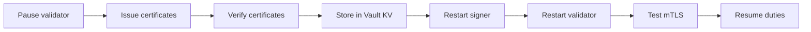

Pausing the client prevents overlapping old and new signing instances during a sensitive identity transition.

---

# Part V: Applied Scope by Workload

## 22. Nethermind and Prysm Beacon

Nethermind and Prysm Beacon share an Engine API JWT.

Vault manages the JWT, and each workload receives access through its own Kubernetes identity and Vault role.

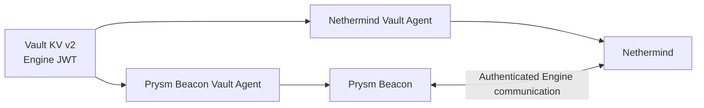

The two workloads consume the same value, but they do not need identical Vault identities or policies.

---

## 23. Prysm Validator

Prysm Validator requests signatures from Web3Signer. It receives:

- its client certificate;
- its client private key;
- the validator PKI CA certificate.

It does not need access to the validator signing keystore. This keeps the high-value signing key inside the signer boundary.

---

## 24. Web3Signer

Web3Signer consumes the most sensitive collection of secrets:

- validator keystore;
- keystore unlock password;
- signer TLS certificate and private key;
- PKI trust certificate;
- slashing database password.

Web3Signer uses these materials locally to:

1. authenticate as the signer;
2. unlock the validator key;
3. check signing history;
4. produce the requested signature.

Vault controls delivery, while Web3Signer performs the actual signing operation.

---

## 25. Slashing Database

Vault supplies the database credential used by Web3Signer. The database records signing history so the signer can detect conflicting proposals or attestations.

Vault protects the database password, but Vault does not implement slashing protection itself.

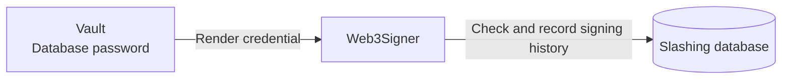

---

# Part VI: Responsibility Boundaries

## 26. What cert-manager Manages

cert-manager manages:

- the Vault service CA;
- the Vault server TLS certificate;
- the Vault server private key;
- certificate DNS names;
- certificate expiration and renewal;
- the Kubernetes Secret containing Vault TLS material.

cert-manager does not decide which application may retrieve a Vault secret.

---

## 27. What Vault Manages

Vault manages:

- Engine API JWT material;
- validator keystores and passwords;
- database credentials;
- Web3Signer TLS material;
- validator client TLS material;
- Kubernetes authentication roles;
- authorization policies;
- short-lived Vault tokens;
- application PKI issuance;
- secret versions;
- secret-access audit events.

Vault does not issue or maintain the Kubernetes ServiceAccount identity itself.

---

## 28. What Kubernetes Manages

Kubernetes manages:

- namespaces;
- ServiceAccounts;
- projected ServiceAccount tokens;
- admission webhooks;
- init-container injection;
- Secret and volume mounting;
- StatefulSets and Deployments;
- NetworkPolicies;
- Pod security controls;
- workload startup and restart.

Kubernetes proves the workload identity to Vault. Vault decides what that identity may access.

---

## 29. What AWS Manages

AWS provides:

- KMS protection for Vault auto-unseal;
- encrypted persistent storage for Raft members;
- EKS Pod Identity for Vault’s AWS permissions;
- private networking;
- infrastructure-level monitoring and audit services.

AWS KMS is part of Vault’s startup trust chain. It is not the main application-secret database.

---

## 30. What These Components Do Not Manage

Neither cert-manager nor Vault directly manages:

- Ethereum validator duties;
- consensus participation;
- execution-layer synchronization;
- slashing-protection logic;
- Kubernetes scheduling;
- GitHub user identity;
- operator authorization through AWS Systems Manager;
- CI/CD approval decisions;
- application correctness.

These systems provide security services to the applications. They do not replace the application control plane.

---

# Part VII: End-to-End Example

## 31. Starting a Prysm Validator Pod

The following example shows how all the components collaborate.

```mermaid
sequenceDiagram
    participant K as Kubernetes
    participant CM as cert-manager CA
    participant A as Vault Agent init
    participant V as Vault
    participant P as Vault policy
    participant F as Shared files
    participant PV as Prysm Validator
    participant WS as Web3Signer

    K->>A: Start injected init container
    A->>CM: Load public Vault CA
    A->>V: Establish server-verified TLS
    A->>V: Authenticate with projected token
    V->>P: Check validator role and policy
    P-->>V: Permit client TLS secret
    V-->>A: Return client certificate and key
    A->>F: Render protected files
    A-->>K: Exit successfully
    K->>PV: Start application container
    PV->>F: Read client TLS material
    PV->>WS: Establish mTLS through signing fence
    WS-->>PV: Return validator signature
```

The sequence provides several independent protections:

1. cert-manager’s CA prevents the Agent from trusting a false Vault endpoint.
2. Kubernetes supplies a short-lived workload identity.
3. Vault validates the namespace and ServiceAccount.
4. Vault policy limits the secret path.
5. Vault Agent writes only the authorized files.
6. the validator starts only after successful retrieval.
7. Vault PKI certificates protect the signing connection.
8. Web3Signer keeps the validator signing key within the signer boundary.

---

# Part VIII: Practical Security Model

## 32. Protection Layers

```mermaid
flowchart TB
    L1["NetworkPolicy<br/>Who can reach Vault?"]
    L2["cert-manager TLS<br/>Is this the real Vault server?"]
    L3["Kubernetes authentication<br/>Which workload is calling?"]
    L4["Vault policy<br/>What may it access?"]
    L5["Vault Agent rendering<br/>How is the secret delivered?"]
    L6["Filesystem permissions<br/>Who can read the file?"]
    L7["Application mTLS<br/>Who may participate in signing?"]
    L8["Signing controls<br/>Is the operation safe?"]

    L1 --> L2 --> L3 --> L4 --> L5 --> L6 --> L7 --> L8
```

No single layer carries the entire security model.

A valid Kubernetes identity does not bypass Vault policy. A valid Vault token does not remove the need for TLS. A valid mTLS certificate does not replace the Signing Fence or slashing protection.

---

## 33. Final Scope Map

| Security question | Responsible component |
|---|---|
| Who issues the Vault server certificate? | cert-manager |
| Who renews the Vault server certificate? | cert-manager |
| Who verifies the Vault server certificate? | Vault clients |
| Who stores application secrets? | Vault KV v2 |
| Who issues validator mTLS certificates? | Vault PKI |
| Who identifies a Kubernetes workload? | Kubernetes |
| Who authorizes the workload’s secret access? | Vault roles and policies |
| Who retrieves secrets into a Pod? | Vault Agent init container |
| Who unseals Vault? | Vault using AWS KMS |
| Who replicates Vault state? | Three Vault servers using Raft |
| Who performs validator signing? | Web3Signer |
| Who gates access to the signer? | Signing Fence |
| Who detects conflicting signing history? | Web3Signer with the slashing database |

The architecture therefore has a clear division of responsibility:

- **cert-manager establishes Vault’s service identity.**
- **Kubernetes establishes the workload identity.**
- **Vault authenticates that identity and controls secrets.**
- **Vault PKI establishes validator and signer identities.**
- **Vault Agent delivers authorized material to the application.**
- **Web3Signer and the signing controls perform and protect validator activity.**
