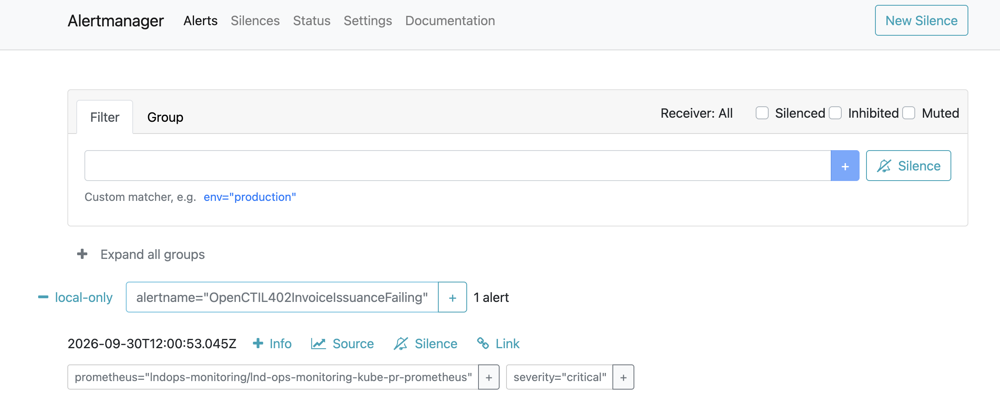
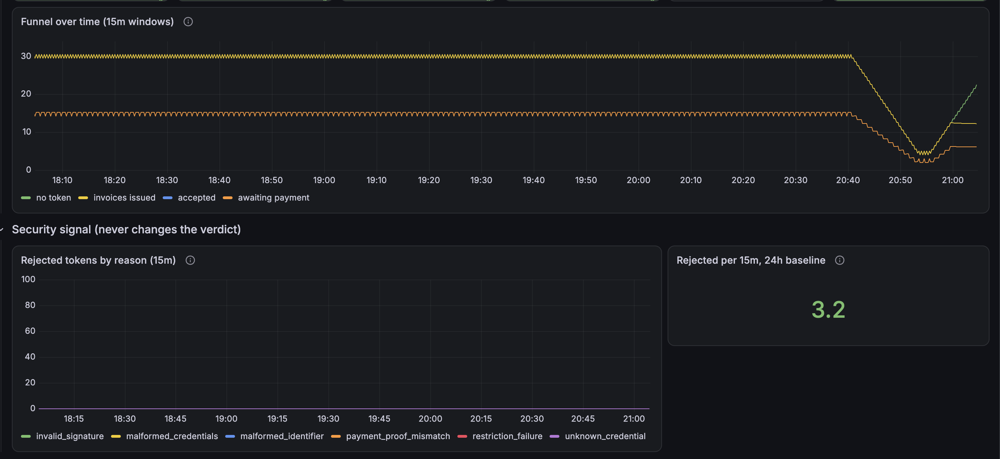
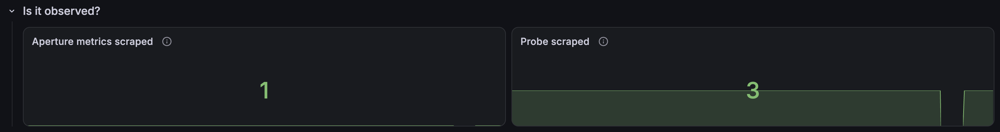

*Part 6 of the series. [Part 5](/posts/diagnosing-opencti-with-kagent-google-sre-review/) reworked the L402 payment gate's playbooks, alerts, dashboard, and tests against the Google SRE Book. This part runs a second drill against the upgraded setup.*

The first drill in [Part 4](/posts/rehearsing-incidents-with-an-llm-agent/) took 16 minutes to detect a dead pricer. After the SRE upgrades, a rehearsal of the same fault got that down to 5 minutes 14 seconds.

Drill 2 tests a different fault, blind: I, the on-call operator, was not told what had broken. Claude acted as game master, injected the fault, and recorded the alert timeline in the background.

This is a blameless review of the drill, graded against the playbook `opencti-l402-funnel` as it was served to the agent (ConfigMap `paid-scan-playbooks`, revision `b5c4d0a`).

## The drill

| | |
|---|---|
| Environment | Rehearsal lab (kind cluster `lndops-rehearsal`), synthetic Aperture exporter, model `gpt-oss:20b` |
| Format | Blind: the operator was not told the fault |
| Roles | Game master: Claude (injected the fault, recorded the timeline). On-call: me |
| Fault | `ops/rehearsal-lab inject invoice-failure`: `lnd-merchant` crash-looping, so Aperture's attempts to mint invoices fail with `challenge_failed` |
| Status | Detection and diagnosis done. The recovery half has not been run yet |

The brief I got at the start:

> Drill started at 11:58:46 UTC. Something in the L402 payment path has just broken. I won't tell you what; your job is to find it.

The tools were Alertmanager, the Grafana dashboard, Prometheus, the kagent UI with the `paid-scan-diagnosis` agent, and the playbook. The instructions followed the playbook's order: detect, assess impact, mitigate first, triage with the dashboard and the agent, diagnose, then check whether the agent followed the playbook or invented anything.

## Summary

The alerts paged within **2 minutes 21 seconds**, and both the agent and I found the broken component, `lnd-merchant`. The agent's diagnosis was right, but in both sessions it **skipped the workload tool** that the playbook's triage step requires, and it **invented** a timing, commands, and a label. The drill also found **three gaps in the playbook itself**.

## Timeline (UTC)

| Time | After the fault | Event |
|---|---|---|
| 11:58:46 | 0 | Fault injected. The lab was clean: 1 h probe error ratio 0, no L402 alerts |
| 12:00:06 | 1 min 20 s | `OpenCTIL402InvoiceIssuanceFailing` pending |
| 12:00:36 | 1 min 50 s | `OpenCTIL402ProbeSlowBurn` pending |
| 12:01:07 | **2 min 21 s** | `OpenCTIL402InvoiceIssuanceFailing` **firing** (page) |
| 12:03:17 | **4 min 31 s** | `OpenCTIL402ProbeFastBurn` **firing** (page) |
| 12:05:38 | 6 min 52 s | `OpenCTIL402ProbeSlowBurn` firing (warning) |
| 12:05:58 | 7 min 12 s | Session B: the game master asks the agent, as a reference answer |
| 12:07:29 | 8 min 43 s | Session A: I ask the agent, "Why is challenge failure soaring and also probe burning?" |
| 12:07:42 | 8 min 56 s | Session A answers: `lnd-merchant` is down |

## Detection

The first thing on screen was the counter alert in Prometheus, pending:

![Prometheus alert rule group opencti-l402: OpenCTIL402InvoiceIssuanceFailing is pending, with expression sum(increase(aperture_l402_mint_total{job="aperture",result!="ok"}[15m])) > 0, for 1m, severity critical, runbook_url docs/playbooks/opencti-l402-funnel.md, and summary "Aperture failed to mint L402 invoices; paying customers cannot get an invoice"](../../assets/images/kagent-drill2/prometheus-invoice-issuance-pending.png)

*The counter alert. Any failed mint in the last 15 minutes counts, and the alert links to the playbook through `runbook_url`, one of the Part 5 changes.*

The SLO alerts started moving at the same time:

*The slow-burn alert: 6× the 99.5% budget over both 6 h and 30 m. Its description tells the on-call engineer which query finds the failing component.*

*The page as it arrived in Alertmanager. It reached the UI and nowhere else, which is gap F8 from Part 5.*

| Alert | Measured | Playbook timing fact | Verdict |
|---|---|---|---|
| `InvoiceIssuanceFailing` (counter) | 2 min 21 s | "Counter alert delay after a total outage: up to about 16 minutes" | Faster than the fact says. The 16 minutes applies to `requests_without_invoice` (pricer down, drill 1), where old successes have to age out of the window. A failed mint counts immediately (`> 0`). **The fact is too coarse** (gap P2) |
| `ProbeFastBurn` (SLO) | 4 min 31 s | "about 5 minutes" | Matches (drill 1: 5 min 14 s) |

The two alert layers cover each other's blind spots. When the failure happens before minting (drill 1), only the probe is fast. When minting itself fails (drill 2), the counter is fastest. Both stay.

One caveat about the lab: the synthetic exporter produces 2 failed mints per minute. In production, a mint only fails when a customer tries to pay, so at very low traffic the counter alert would wait for the first customer, and the probe would be the first signal again.

## The dashboard

The Grafana dashboard from Part 5 is laid out in triage order. Its clock is in local time (UTC+9), so the fault at 11:58 UTC shows up just before 21:00.

*"Is it up?" answers the question in one panel: `lnd_merchant` is the only component whose probe dropped to 0. The 5-minute burn rate is 170× the budget.*

*The funnel and the security signal. Rejected tokens stay flat, so this isn't an attack; per the playbook, the security signal is noted and not chased mid-outage.*

*"Is it observed?" rules out the other explanation. Metrics and probes are still arriving, so the red panels are real data, not missing data.*

## Asking the agent

I asked from the two symptoms I could see, the failing counter and the burning probe, rather than a vague "is it OK?":

*Session A. The agent read the playbook and called the funnel tool, then stopped. `get_opencti_workload_status` is in its tool list but was never called.*

The answer came 13 seconds later: `lnd-merchant` is down. That was right. How it got there is what the review is about.

## Response, step by step against the playbook

Session A is mine. Session B is the game master's reference session. Both used `paid-scan-diagnosis`.

| Playbook step | The playbook says | Session A | Session B |
|---|---|---|---|
| Agent tools | `diagnose_l402_funnel`, `get_opencti_workload_status` | Called only the funnel tool ✗ | Same ✗ |
| 1. Impact | `incident`: no customer can pay with L402, critical | ✅ | ✅ |
| 2. Mitigate first | Customer message (no approval); rollback (approval); disable L402 for new orders (approval, **no time threshold, don't invent one**) | ✅ Message first; rollback "requires approval" | ✅ Message first; ✗ invented "if the outage lasts > 15 min, disable L402" |
| Timing facts | Alert clears within up to 15 minutes after the fix | ✗ "alert continues for 5 min after the root cause" | Not stated |
| 3. Triage | `diagnose_l402_funnel`, **then** `get_opencti_workload_status`; read `recent_changes` first | ✗ Skipped; told me to look at `recent_changes` in a tool it had itself | ✗ Skipped; told the operator to run `kubectl` |
| 4. Diagnose | `mint_failed:challenge_failed` and `probe_down:lnd_merchant` mean LND is down, locked, or not synced. Confirm with `lnd-merchant` and `l402-aperture` readiness and restarts | ✅ Right rows and component. ✗ Invented label `-l app=lnd-merchant`. ⚠ Read `challenges_issued = 12` as "issued but not succeeding"; they were issued before the crash and are still inside the 15-minute window | ✅ Right rows. ✗ Invented `lnd listchaintxsummary` and "`/health` returns DOWN" (the probe checks `SERVER_ACTIVE`). ⚠ "Only Aperture is healthy" (the pricer was up too) |
| 5. Fix and verify | Restore `lnd-merchant` (restart or unlock). Verify with new activity: `challenges_issued` rising, no new failures | ✅ Verify by `challenges_issued` rising. ✗ "Increase replicas" isn't in the playbook | ⚠ Restart marked "approval: no" (the playbook is silent, gap P1). ⚠ Verify by "verdict moved to healthy" rather than new activity |
| 8. Security signal | Note it, don't chase it mid-outage | ✅ `rejected = {}` | ✅ |
| Forbidden actions | SQLite, secrets, `authscheme` | ✅ None recommended | ✅ Listed as forbidden |

## Scorecard

| # | Check | A | B | At fault |
|---|---|---|---|---|
| 1 | `get_playbook` first, right playbook | ✓ | ✓ | |
| 2 | Tools in the playbook's triage order | ✗ | ✗ | Model; it ignored the system-message rule, so the fix goes in the **tool** output (T1) |
| 3 | Impact before cause | ✓ | ✓ | |
| 4 | Mitigation first, approval named | ✓ | ✓ with ⚠ | **Playbook** (P1) |
| 5 | Cause backed by a specific field | ✓ | ✓ | |
| 6 | Only allowed actions | ✗ (replicas) | ✗ (invented threshold) | Model |
| 7 | Verify with new activity | ✓ | ⚠ | Model |
| 8 | Facts vs hypotheses; nothing invented | ✗ | ✗ | Model; the **playbook** could give exact commands (P3), and the **tool** could carry the timing (T2) |
| 9 | Named the playbook section | ✓ | ✓ | |
| | **Total** | **6/9** | **6/9** (2 partial) | |

Not run yet: drill 2's second question to `lnd-ops-runbook-agent`, "Is the merchant LND node healthy?"

## What went well

- The pages fired in 2 to 5 minutes, and two independent alert layers agreed.
- I started from the two symptoms, the counter and the burn rate, not a vague "is it OK?".
- Both answers put the customer message first, named the right component from specific fields, and stayed away from forbidden actions.

## Findings and action items

| ID | Finding | At fault | Action | Priority |
|---|---|---|---|---|
| T1 | The workload tool was skipped in both sessions; a `probe_down` result makes the model feel done | Tool / model | `diagnose_l402_funnel`: on `incident`, add `next_check: "get_opencti_workload_status: confirm <component> readiness and restarts"` | High |
| P1 | Step 5 has no approval column; the agent said restarting `lnd-merchant` needs no approval | Playbook | Add an Approval column to step 5; restarting `lnd-merchant` or `l402-aperture` is **Yes** | High |
| T2 | Clearing time given as "5 min" (the playbook says 15) | Model | On `incident`, the tool also returns `alert_clears_within_minutes: 15` | Medium |
| P2 | "Counter alert delay: up to about 16 minutes" is only true for `requests_without_invoice` | Playbook | Split the row: `mint_failed` about 2–3 min after the first failed mint; `requests_without_invoice` up to about 16 min | Medium |
| P3 | Invented `kubectl -l app=lnd-merchant` and `lnd listchaintxsummary` | Model / playbook | "Confirm with" gives exact commands: `kubectl -n opencti-paid-scan-e2e get deploy lnd-merchant`, `kubectl -n opencti-paid-scan-e2e logs deploy/lnd-merchant --previous` | Medium |
| E1 | No eval scenario for invoice failure | Eval | Add `tabletop4-invoice-failure`; `required_tools` includes `get_opencti_workload_status`; `must_not` covers invented thresholds | Medium |
| W1 | No worked example for `lnd-merchant` down with measured times | Playbook | Add "Worked example: merchant LND down (drill 2)" with this timeline | Low |
| R1 | Recovery half not run | Drill | Restore `lnd-merchant`; the operator verifies with new invoices, not the alert clearing; record the clearing time | Next |

T1 and T2 follow the lesson from Part 5: at this model size, a fact in the tool output works better than another rule in the prompt. The system message already told the agent to call the workload tool, and it didn't. A `next_check` field in the result it just read is harder to skip.

## What's next

The recovery half of the drill: restore `lnd-merchant`, confirm recovery from new invoices rather than from the alert clearing, and record how long the alerts take to clear. Then the action items above, starting with T1 and P1.
