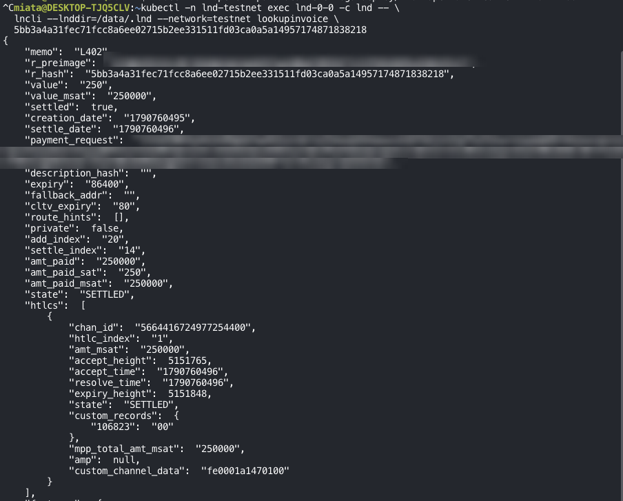
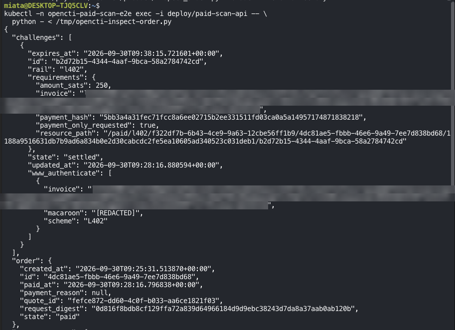
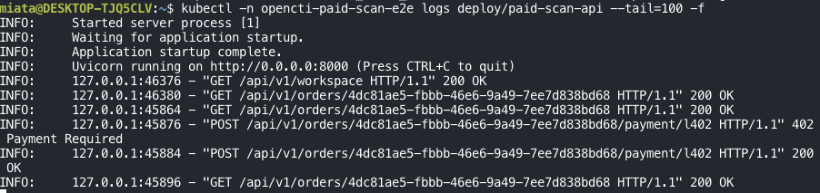

*Part 3 of the series. [Part 1](/posts/adding-lightning-payments-to-opencti-with-aperture/) covered Aperture as a payment gate; [Part 2](/posts/from-a-scan-order-to-a-lightning-invoice/) followed a scan order to its Lightning invoice.*

The customer now has a Lightning invoice and a macaroon. The order is still `awaiting_payment`, and its payment challenge is `issued`.

The next steps connect the Lightning payment to the application’s business state: verifying the proof, confirming settlement, and queuing the scan.

This walkthrough follows the implementation. The examples use placeholders rather than live payment credentials. The two screenshots come from an end-to-end run on testnet, with the preimage and invoice blurred.

## 1. The customer pays the invoice

The customer pays the invoice using a Lightning wallet.

```text
Customer’s Lightning wallet
        ↓
Pays the issued invoice
        ↓
Receives the payment preimage
```

The preimage is a 32-byte secret associated with the payment. Its SHA-256 hash must match the invoice’s payment hash.

```text
SHA256(payment_preimage) == invoice_payment_hash
```

The payment happens through the wallet. Submitting the resulting proof to OpenCTI does not initiate another payment.

Our regtest test client follows this sequence: pay the invoice, obtain the preimage, and check that its hash matches the expected payment hash.

## 2. The customer submits the payment proof

The customer returns to the same payment endpoint, this time with L402 credentials:

```http
POST /api/v1/orders/<order-id>/payment/l402
X-Workspace-Api-Key: <workspace-key>
Authorization: L402 <issued-macaroon>:<preimage-as-hex>
```

The two headers answer different questions:

| Header | Question it answers |
|---|---|
| `X-Workspace-Api-Key` | Which authenticated workspace is making this request? |
| `Authorization: L402 ...` | What payment-based authorization is being presented? |

The public endpoint expects an empty request body. Even an empty JSON object, `{}`, is rejected by this endpoint.

The preimage is encoded as 64 hexadecimal characters. Together with the issued macaroon, it forms the L402 credential.

## 3. OpenCTI checks the order and challenge

Before forwarding the proof, the application loads the order and its saved payment challenge.

It checks the payment method and the applicable authorization, scope, and expiration conditions.

The submitted proof must also match the challenge that the application previously issued.

Conceptually, the adapter checks:

- Does the request refer to the expected tenant and order?
- Does its scan scope match the saved scope?
- Does the challenge match the saved challenge?
- Does `SHA256(preimage)` match the saved payment hash?
- Does the macaroon match the originally issued macaroon?

These checks prevent a valid-looking payment proof from being attached to an unrelated order.

They do not replace Aperture’s own authentication. OpenCTI checks the relationship between the proof and the order; Aperture validates the L402 credential.

## 4. Aperture verifies the credential

The adapter forwards the proof through the internal gateway:

```text
OpenCTI payment adapter
        ↓
Internal payment gateway
        ↓
Aperture
        ↓
Receipt verification service
```

Aperture checks the credential under its configured authentication rules. If authentication succeeds, it forwards the request to the receipt service.

The receipt service also checks the expected internal credentials and payment identity.

This separates two decisions:

```text
Aperture:
    Is this request authorized by a valid L402 credential?

Receipt service:
    Does the corresponding settled payment match this order?
```

## 5. The receipt service checks merchant settlement

The receipt service looks up the invoice on the merchant’s LND node using the payment hash.

The implementation requires:

```text
invoice.state == SETTLED
invoice.amt_paid_sat == saved_order_amount
```

For example, if the order costs 250 sats, the merchant invoice must be settled for exactly 250 sats.



*The merchant invoice for a 250-sat order, looked up on the merchant LND node by its payment hash during a testnet run: `state` is `SETTLED` and `amt_paid_sat` is `250`, the two conditions the receipt service requires. The preimage and invoice are blurred.*

Any routing fee paid by the customer is separate from the amount received against the merchant’s invoice.

The service records an accepted receipt and rejects attempts to reuse that payment against a different resource path or amount.

The adapter then checks the returned receipt against the original request:

| Receipt field | Expected value |
|---|---|
| Resource path | The saved tenant/order/scope/challenge path |
| Payment hash | The hash associated with the issued challenge |
| Amount | The saved order price |
| Settlement state | `SETTLED` |

A successful HTTP response alone is therefore insufficient. The receipt’s contents must match the order.

## 6. OpenCTI records the payment and queues the scan

After verification, OpenCTI must persist the result reliably.

This matters because the Lightning payment and the application database are separate systems. A payment may succeed even if the application restarts before finishing its database updates.

The application first saves a pending receipt outbox record. Think of this as a durable note saying:

> “We have a verified payment receipt that still needs to be applied to the order.”

A separate payment claim prevents the same settlement identity from being assigned to another tenant or order.

The application then performs the related tenant database updates together:

```text
Record the payment event
        ↓
Mark the order as paid
        ↓
Mark the payment challenge as settled
        ↓
Create the queued scan and its first attempt
        ↓
Create a pending scan-dispatch record
        ↓
Mark the receipt processing record as committed
```

The dispatch record is another durable handoff. It tells the execution workflow that scan work is ready to be dispatched.

Here is what those records looked like for the testnet order, read back from the application database after the payment:



*The payment challenge is `settled` and the order is `paid`, both at 09:28:16 UTC. The invoice is blurred and the macaroon is already redacted by the inspection script.*


*The payment event carries the receipt evidence from section 5: `invoice_state` `SETTLED`, `amount_sats` `250`, the same resource path as the challenge, and `settlement_source` `merchant_lnd_lookup_invoice`. The receipt outbox is `committed`, and the amount matches the saved quote.*

The payment endpoint does not run the scanner itself.

## 7. The customer receives the updated order state

On success, the endpoint returns:

```json
{
  "id": "<order-id>",
  "state": "paid"
}
```

`paid` means the payment has been accepted and scan work has been queued. It does not mean the scan has finished.



*The API logs for the same testnet run. The first `POST .../payment/l402` has no proof and gets `402 Payment Required` with the invoice; after the wallet pays, the retry with the macaroon and preimage gets `200 OK`, and the order reads back as `paid`.*

```text
Payment accepted
        ↓
Order paid
        ↓
Scan queued
        ↓
Scan dispatched and executed
        ↓
Results become available
```

Keeping these stages separate makes failures easier to understand. A paid order with a delayed scan is an execution problem, not necessarily a payment problem.

## 8. What happens if the customer retries?

Retries are normal. The customer might lose the HTTP response after the server has already accepted the payment.

The implementation handles several cases:

| Situation | Response or behavior |
|---|---|
| Order is already paid | Return the existing successful order state |
| A verified receipt is saved but processing is incomplete | Recover and finish receipt processing |
| Payment-provider outcome remains uncertain | Return HTTP 202 with `payment_pending` |
| Submitted proof is invalid | Return HTTP 401 |

This avoids treating every retry as a new purchase.

The application uses payment identity claims, deterministic scan identifiers, and conflict checks to support repeat-safe processing. These mechanisms should not be confused with a universal guarantee of exactly-once execution.

## The complete payment flow

```text
Quote created
    ↓
Order awaiting payment
    ↓
Invoice and macaroon issued
    ↓
Customer pays through Lightning
    ↓
Customer submits macaroon and preimage
    ↓
OpenCTI checks the saved order and challenge
    ↓
Aperture verifies L402 authorization
    ↓
Receipt service confirms merchant settlement
    ↓
OpenCTI records payment and queues the scan
    ↓
Order state: paid
```

Aperture provides the payment gate. The application connects that gate to the customer’s order and reliably hands paid work to the scan execution system.
