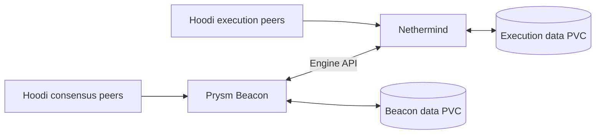
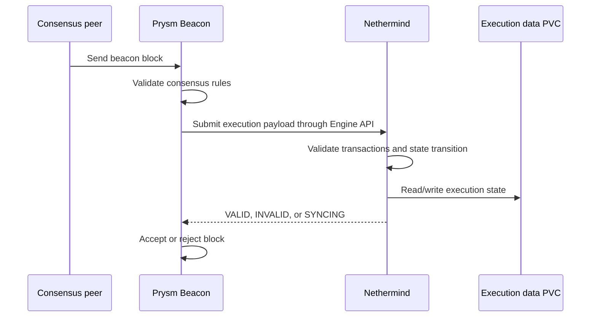
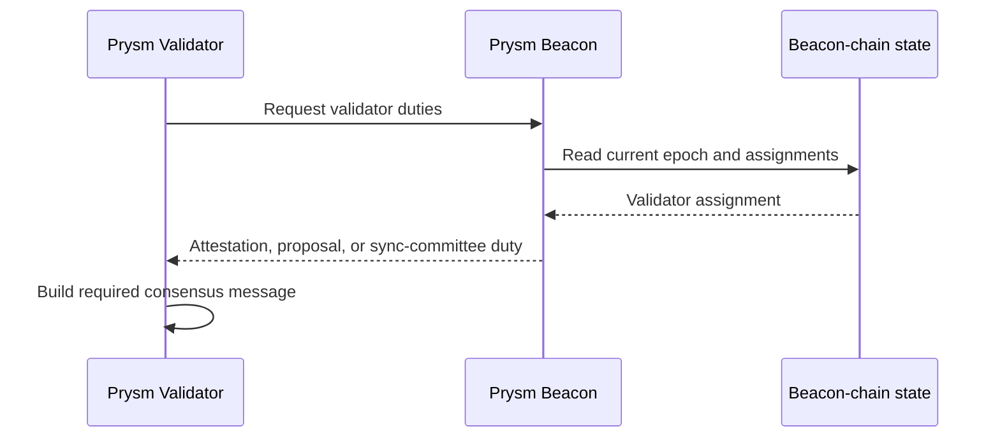
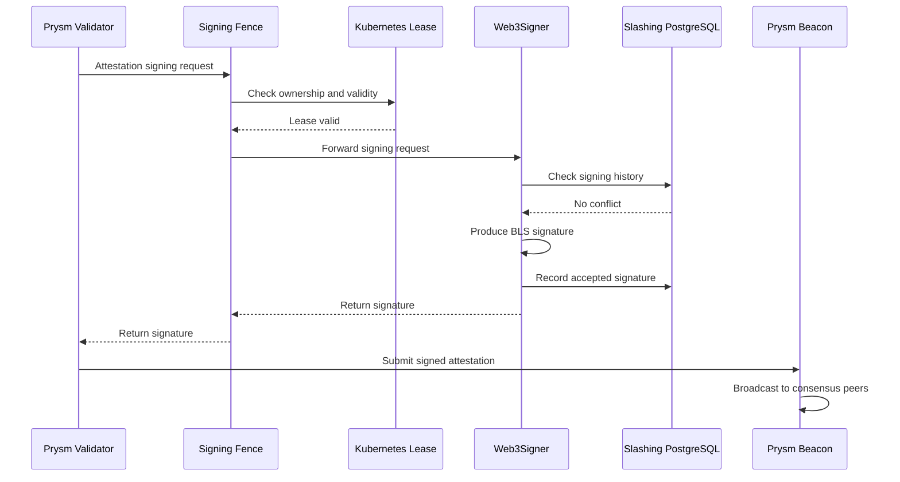
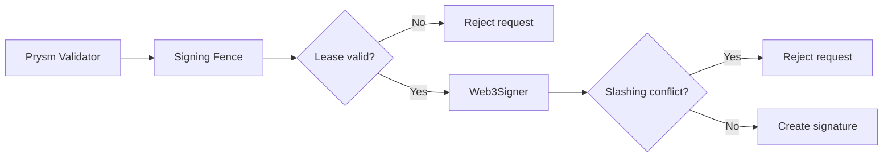
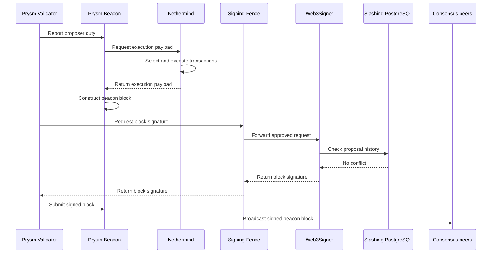
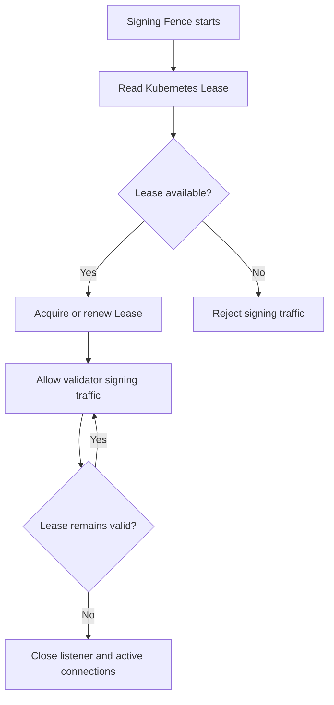
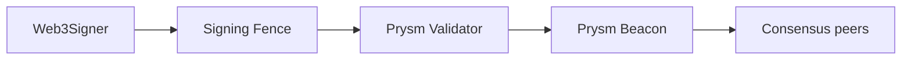

# Hoodi Validator Use Cases and Data Flows

The platform separates validator operations into four Kubernetes namespaces. This article follows the data flows between them, from node synchronization to the safe signing and broadcast of validator duties.

```text
node-operator
    Nethermind
    Prysm Beacon
    Execution and beacon data

validator-operations
    Prysm Validator
    Signing Fence
    Web3Signer
    Slashing PostgreSQL
    Kubernetes Lease

validator-observability
    Fluent Bit

vault
    Vault service
```

## Synchronize the Hoodi Node

Nethermind synchronizes execution-layer data, while Prysm Beacon synchronizes consensus-layer data. Both clients require persistent storage and exchange execution payloads through the Engine API.



1. Nethermind receives execution blocks and transactions from execution peers.
2. Nethermind validates and stores execution state.
3. Prysm Beacon receives beacon blocks and consensus messages.
4. Prysm Beacon validates and stores beacon-chain state.
5. Prysm Beacon sends execution payloads to Nethermind through the Engine API.
6. Nethermind returns the execution-validation result.
7. Both clients continue until they reach the current Hoodi head.

For example, when a beacon block contains an execution payload, Prysm Beacon asks Nethermind whether the payload is valid for the current state. Nethermind can return `VALID`, `INVALID`, or `SYNCING`.

The validator cannot safely operate until Prysm Beacon can provide current chain state.

## Validate a Received Block

Prysm Beacon evaluates consensus rules and delegates execution-payload validation to Nethermind. A block is accepted only when both parts of the validation succeed.



A block can have a valid consensus signature but an invalid execution payload. In that case, consensus validation passes, execution validation fails, and Prysm Beacon rejects the block.

Prysm Beacon owns the consensus decision. Nethermind owns the execution decision.

## Obtain a Validator Duty

Prysm Validator does not independently decide what to attest or propose. It requests its assignments from Prysm Beacon, which reads the current beacon-chain state.



For example, Prysm Beacon can assign validator `98765` an attestation duty for slot `123456`, committee `4`, and target epoch `3851`.

Prysm Validator then obtains the required block root and checkpoint information and prepares the attestation.

## Sign an Attestation

The validator client sends the request data, not the private key. Signing Fence confirms current authority before forwarding the request to Web3Signer, which checks slashing history and produces the BLS signature.



An attestation request identifies the validator, duty, slot, target epoch, and block root. Web3Signer returns the signature to Prysm Validator through Signing Fence.

Prysm Validator submits the signed attestation to Prysm Beacon, which broadcasts it to consensus peers.

## Reject an Unsafe Attestation

The signing flow fails closed. If the Kubernetes Lease is invalid or the slashing database identifies a conflict, Web3Signer does not produce a signature.



If another instance owns the Lease, Signing Fence closes or rejects the connection. Web3Signer receives no request, and the validator misses the duty rather than signing unsafely.

If Web3Signer finds an existing signature for the same duty, it rejects the new request. This is the intended fail-closed behavior.

## Propose a Block

Block proposal combines two separate flows: Nethermind constructs the execution payload, while Web3Signer creates the validator’s block signature.



For a selected validator and proposer slot, Nethermind creates the execution payload and Web3Signer creates the block signature. The Engine API helps construct and validate the payload; it does not sign the validator’s block proposal.

## Enforce One Active Signing Path

The Kubernetes Lease prevents multiple validator paths from reaching the signer simultaneously. It is an active authority control rather than a historical record.



When Validator A owns the Lease through Fence A, its signing traffic is allowed. Validator B, using Fence B, is rejected while that Lease remains held.

The Lease answers, “Who may sign now?” Slashing PostgreSQL answers, “What has already been signed?” Both protections are required.

## Submit a Block After Signing

Web3Signer never broadcasts directly to the network. After it returns a signature, Prysm Validator attaches it to the signed object and submits it to Prysm Beacon.



Prysm Beacon validates the completed object and broadcasts it to consensus peers. This keeps peer-to-peer networking and validator key operations in separate components.
