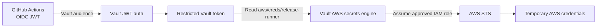
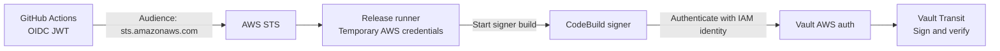

This project uses Vault to authenticate workloads and operators, issue Vault tokens, and control access to secrets and signing operations.

The underlying identities originate in Kubernetes, AWS, or GitHub. Vault decides what those identities may do **inside Vault**.

Repository inspection also revealed an important distinction: a GitHub-to-Vault JWT integration is documented, but the current release workflow obtains its AWS credentials directly from AWS STS.

## 1. Identities and Access Managed by Vault

Vault handles the following authentication and authorization paths. Some are connected to executable workflows; others remain configuration contracts or require live verification.

| Identity | Vault authentication | Access granted | Repository status |
|---|---|---|---|
| Kubernetes application workloads | Kubernetes auth | Workload-specific runtime secrets | Manifests and bootstrap scripts |
| CodeBuild release signer | AWS IAM auth | Transit signing and verification | Used by the signer buildspec |
| Recovery operator | Separate AWS IAM auth mount | Restricted recovery ceremonies | Configuration scripts; live setup unconfirmed |
| GitHub Actions release workflow | JWT auth using GitHub OIDC | Request temporary AWS credentials | Defined contract; not used by the current release workflow |

### 1.1 Kubernetes Workload Identities

Each application authenticates using its Kubernetes ServiceAccount token. Vault maps the verified identity to a role and policies.

For example, the Nethermind role contains:

```json
{
  "bound_service_account_names": [
    "nethermind-execution"
  ],
  "bound_service_account_namespaces": [
    "node-operator"
  ],
  "audience": "vault",
  "token_policies": [
    "hoodi-engine-api"
  ],
  "token_ttl": "5m",
  "token_max_ttl": "10m",
  "token_no_default_policy": true
}
```

The role establishes which Kubernetes identity may authenticate and which Vault policy it receives.

The policy then defines the permitted secret operation:

```hcl
path "node-operator-runtime/data/nodes/hoodi/engine-api-jwt" {
  capabilities = ["read"]
}
```

The project separates workload access by responsibility:

| Workload | Intended Vault access |
|---|---|
| Nethermind | Shared Engine API JWT |
| Prysm Beacon | Shared Engine API JWT |
| Validator client | Its validator set’s client TLS material |
| Remote signer | Its permitted keystore, password, signer TLS, and database credential |
| Slashing database | Its database credential |

For example, a validator client receives access to its client certificate material:

```hcl
path "node-operator-runtime/data/validators/hoodi/REPLACE_WITH_VALIDATOR_SET/runtime/client-tls" {
  capabilities = ["read"]
}
```

It does not receive the remote signer’s keystore policy.

Here, **Vault manages the mapping from a Kubernetes identity to secret-access permissions**. Kubernetes still owns the ServiceAccount itself.

### 1.2 CodeBuild Release-Signer Identity

The CodeBuild signer authenticates to Vault using its AWS IAM identity.

The signer buildspec includes:

```sh
vault_token="$(vault login \
  -method=aws \
  -token-only \
  role="${VAULT_AUTH_ROLE}" \
  region="${AWS_REGION}")"
```

The corresponding Vault role template binds access to the dedicated signer role:

```sh
vault write auth/aws/role/release-signer \
  auth_type=iam \
  bound_iam_principal_arn="arn:aws:iam::<ACCOUNT_ID>:role/node-operator-baseline-release-signer" \
  resolve_aws_unique_ids=false \
  policies=release-signer \
  ttl=5m \
  max_ttl=10m
```

Its Vault policy allows signing and verification:

```hcl
path "transit/sign/node-operator-release" {
  capabilities = ["update"]
}

path "transit/verify/node-operator-release" {
  capabilities = ["update"]
}
```

The shown policy grants no key export, rotation, deletion, or configuration permissions.

This creates a clear responsibility boundary:

- AWS establishes the CodeBuild job’s IAM identity.
- Vault authenticates that identity.
- Vault authorizes the specific signing operations.
- The Transit signing key remains inside Vault.

### 1.3 Recovery-Operator Identity

Recovery operators use a separate AWS authentication mount:

```sh
vault auth enable -path=operator-aws aws
```

The configuration script creates a restricted role:

```sh
vault write auth/operator-aws/role/operator-recovery \
  auth_type=iam \
  bound_iam_principal_arn="$principal" \
  resolve_aws_unique_ids=true \
  token_policies=operator-recovery \
  token_ttl=5m \
  token_max_ttl=10m \
  token_explicit_max_ttl=10m \
  token_no_default_policy=true
```

The policy permits recovery-ceremony operations and self-revocation:

```hcl
path "sys/generate-root/attempt" {
  capabilities = ["read", "update", "delete"]
}

path "sys/generate-root/update" {
  capabilities = ["update"]
}

path "auth/token/revoke-self" {
  capabilities = ["update"]
}
```

Authenticating as this operator does not automatically produce a root token. The required recovery shares must still be supplied.

The repository contains configuration and verification scripts, but its documentation records live setup as pending when that status was written. The inspection did not establish whether the deployed mount has since been configured.

### 1.4 GitHub Actions Identity: Defined Vault Integration

The repository defines a JWT authentication contract that trusts GitHub’s Actions issuer:

```sh
vault auth enable jwt

vault write auth/jwt/config \
  oidc_discovery_url="https://token.actions.githubusercontent.com" \
  bound_issuer="https://token.actions.githubusercontent.com"
```

This is authentication for a workflow using a GitHub-issued JWT. It is separate from interactive browser login for a human administrator. [HashiCorp: JWT/OIDC authentication](https://developer.hashicorp.com/vault/docs/auth/jwt).

The role restricts the accepted identity claims:

```json
{
  "role_type": "jwt",
  "bound_audiences": [
    "https://vault.node-operator.internal"
  ],
  "user_claim": "repository_id",
  "bound_claims_type": "glob",
  "bound_claims": {
    "repository": "s1ns3nz0/node-operator",
    "repository_owner": "s1ns3nz0",
    "ref_type": "tag",
    "ref": "refs/tags/v*",
    "workflow_ref": "s1ns3nz0/node-operator/.github/workflows/release.yml@refs/tags/v*"
  },
  "token_policies": [
    "release-runner-dynamic-aws"
  ],
  "token_ttl": "15m",
  "token_max_ttl": "15m",
  "token_type": "batch",
  "token_num_uses": 1,
  "token_no_default_policy": true
}
```

The intended checks restrict authentication to the expected audience, repository, owner, version-tag context, and release workflow.

`user_claim: repository_id` identifies the subject within the authentication flow. The `bound_claims` determine which claims are accepted.

There is one configuration inconsistency: the role requests both a batch token and a one-use limit. Vault batch tokens do not support use-count limits, so the documented “one-use batch token” behavior cannot be relied upon as written. [HashiCorp: Token types](https://developer.hashicorp.com/vault/docs/concepts/tokens).

### 1.5 Temporary AWS Credentials Through Vault

The intended GitHub role receives this policy:

```hcl
path "aws/creds/release-runner" {
  capabilities = ["read"]
}
```

That operation requests temporary AWS credentials from Vault’s AWS secrets engine.

The engine role template specifies:

```sh
vault write aws/roles/release-runner \
  credential_type=assumed_role \
  role_arns="arn:aws:iam::REPLACE_WITH_ACCOUNT_ID:role/REPLACE_WITH_VAULT_DYNAMIC_AWS_ROLE" \
  policy_document=@deploy/vault/aws/release-runner-assumed-role-policy.json \
  default_sts_ttl=15m \
  max_sts_ttl=15m
```

The documented AWS permissions cover uploading signer input, starting and inspecting the approved CodeBuild signer, and reading its output.

The intended flow is:



In this design, Vault would control access to credential issuance. AWS would still own the IAM role and issue the resulting STS credentials.

**This remains the documented path; it is not the path used by the current release workflow.**

## 2. Identities and Access Managed Outside Vault

Other systems remain responsible for creating identities, issuing their original credentials, and governing access to their own resources.

| Identity or credential | Responsible system | Vault’s relationship |
|---|---|---|
| GitHub users and repository membership | GitHub | Does not administer them |
| GitHub Actions OIDC identity | GitHub | Can verify its JWT through the defined auth contract |
| Current release runner’s AWS session | AWS STS and IAM | Not involved in issuing this session |
| Kubernetes ServiceAccounts and RBAC | Kubernetes | Validates tokens for Vault access |
| AWS IAM users, roles, and trust policies | AWS IAM | Can authenticate selected principals |
| Vault server’s KMS identity | EKS Pod Identity and AWS IAM | Consumes the supplied AWS credentials |
| Vault listener certificate lifecycle | cert-manager and its configured CA | Uses the delivered certificate |
| Human SSO and centralized identity groups | No Vault integration established by the inspected configuration | Not demonstrated in the repository |

### 2.1 GitHub Accounts and Workflow Identity

GitHub manages users, repository membership, and the identity claims attached to workflow executions.

Even when the Vault JWT integration is enabled, GitHub remains the issuer. Vault checks the supplied identity evidence and decides whether to issue a Vault token.

That distinction separates two decisions:

- **GitHub:** which workflow execution does this JWT represent?
- **Vault:** may that execution access the configured Vault role?

Vault does not create GitHub accounts or manage repository membership.

### 2.2 The Current Release Runner’s AWS Identity

The checked-in release workflow requests a GitHub OIDC JWT with this audience:

```text
sts.amazonaws.com
```

It then exchanges that token directly with AWS:

```sh
aws sts assume-role-with-web-identity \
  --role-arn "$AWS_ROLE_ARN" \
  --role-session-name "release-${GITHUB_RUN_ID}" \
  --web-identity-token "$web_token" \
  --duration-seconds 900
```

The implemented flow is:



Vault participates when CodeBuild authenticates for signing. It does not mediate the release runner’s preceding GitHub-to-AWS credential exchange.

This is the principal mismatch found during inspection: **the documented release contract places Vault in the AWS credential-issuance path, while the current workflow calls STS directly.**

### 2.3 Kubernetes ServiceAccounts and RBAC

Kubernetes owns the workload’s ServiceAccount and its Kubernetes API permissions.

A workload can supply a projected token for Vault:

```yaml
serviceAccountToken:
  audience: vault
  expirationSeconds: 600
  path: token
```

Vault uses that token to authenticate the workload, but a Vault policy does not grant permission to list Kubernetes pods or update Deployments.

The permissions remain separate:

```text
Kubernetes Role / RoleBinding
    → Access to Kubernetes API resources

Vault role / ACL policy
    → Access to Vault secrets and operations
```

A workload can have minimal Kubernetes API permissions while still being allowed to read its application secret from Vault.

### 2.4 AWS IAM and Vault’s Own Cloud Identity

AWS manages the IAM principals that Vault trusts or uses.

For auto-unseal, the project associates Vault’s service account with an IAM role:

```hcl
resource "aws_eks_pod_identity_association" "vault" {
  cluster_name    = aws_eks_cluster.private.name
  namespace       = "vault"
  service_account = "vault"
  role_arn        = aws_iam_role.vault.arn
}
```

This identity allows the Vault server to request authorized AWS operations, such as KMS access.

The trust direction differs from CodeBuild’s Vault login:

| Direction | Purpose |
|---|---|
| **Vault → AWS KMS** | Vault uses an AWS identity to access its seal mechanism |
| **CodeBuild → Vault** | CodeBuild presents its AWS identity to obtain Vault permissions |

Both involve AWS identity, but only the second is authentication into Vault.

### 2.5 Certificates Stored in Vault Versus PKI Managed by Vault

Vault may store certificate and private-key material without acting as the certificate authority.

The inspected workload policies permit reading TLS material from KV paths. The Vault listener certificate is supplied through cert-manager and its configured CA.

These responsibilities should not be combined:

| Operation | What it establishes |
|---|---|
| Store a certificate in Vault KV | Protected storage and controlled retrieval |
| Issue a certificate through Vault PKI | Vault participates in certificate issuance |
| Mount a certificate into a pod | Delivery to its consumer |
| Reload a renewed certificate | Application adoption of the replacement identity |

Similarly, storing a database password in Vault does not establish that Vault creates the database account or rotates its password. Those behaviors require an explicit integration.

### 2.6 Human SSO and Central Identity Administration

The inspected configuration did not establish:

- Interactive human OIDC login.
- LDAP or username/password authentication.
- AppRole authentication.
- Explicit provisioning of Vault identity entities and groups.
- Vault acting as an OIDC provider for other applications.

This does not exclude automatically created Vault identity records or manually configured live integrations. It means those capabilities are not demonstrated by the repository.

The project’s established pattern is **external identity verification followed by restricted Vault access**. Kubernetes supplies workload identities, AWS supplies IAM identities, and GitHub supplies workflow identities; Vault applies its own roles and policies where those identities enter Vault.
