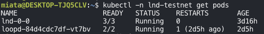
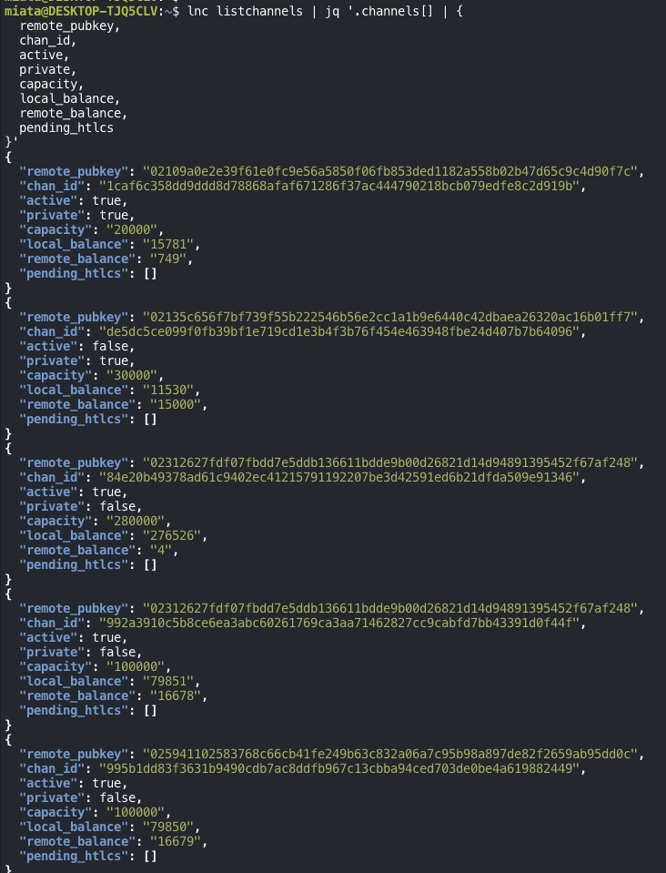
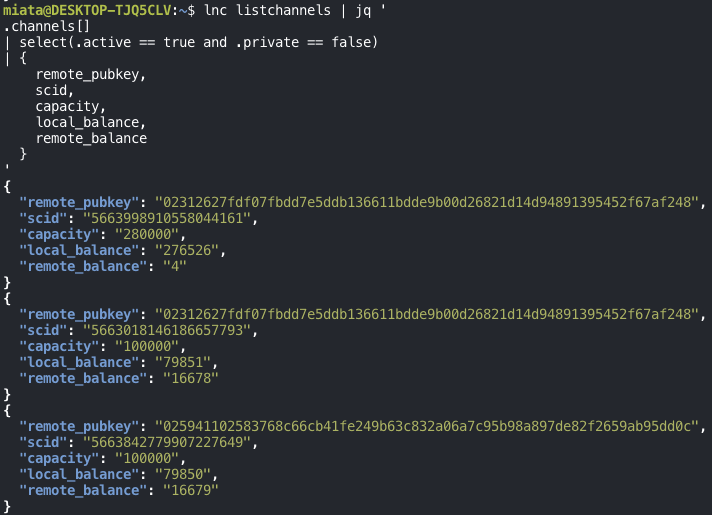
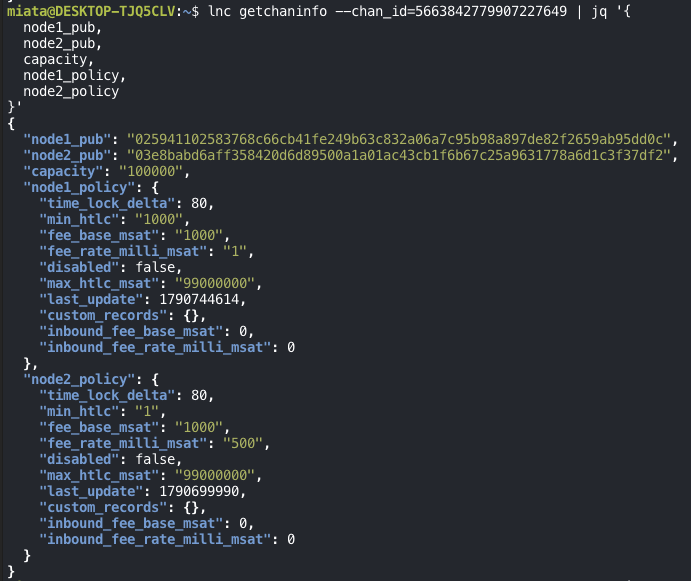
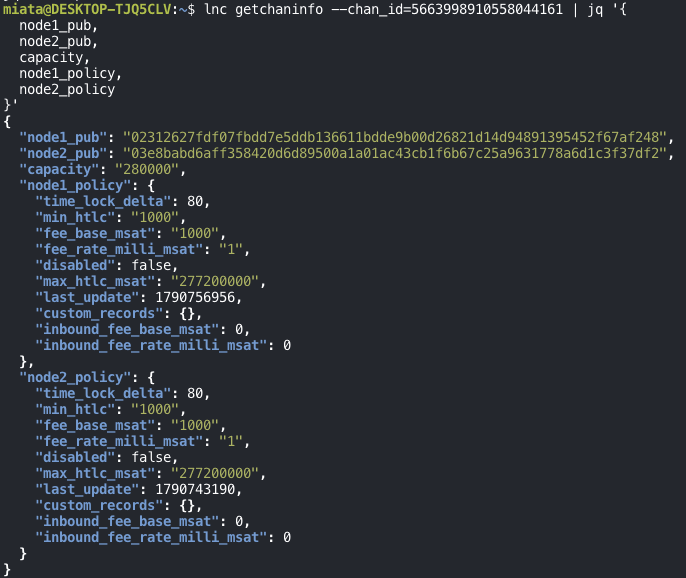
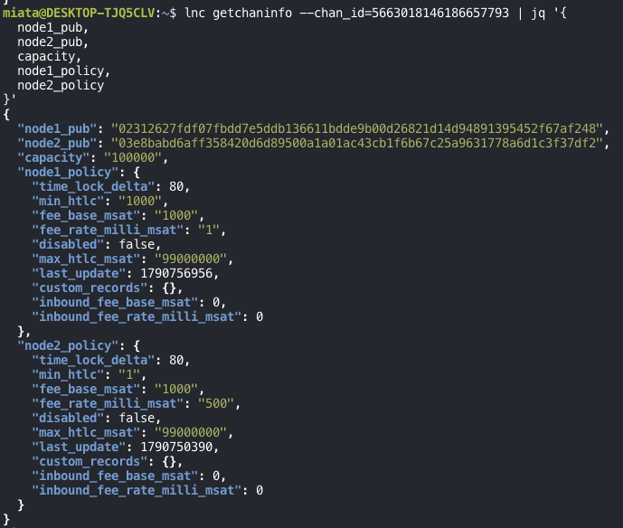

This walkthrough checks whether an LND node running on a Kubernetes cluster in WSL is ready to route payments on testnet. It reads the node's state, its channels' liquidity, and the fee policy on each public channel. Nothing is changed yet.

The node, its testnet wallet, and its channels already exist. Installing Kubernetes, creating the wallet, and opening channels are out of scope.

The check also stops short of two things: sending a payment to see a real forward, and confirming that the node is reachable for P2P connections from outside the network.

The screenshots come from the actual run. Block heights, balances, connection state, and timestamps will differ when you run the same commands.

## 1. Check the LND pod

Point `kubectl` at the kubeconfig used from WSL:

```bash
export KUBECONFIG="${XDG_STATE_HOME:-$HOME/.local/state}/lnd-ops/kubeconfig"
```

List the pods in the testnet namespace:

```bash
kubectl -n lnd-testnet get pods
```



The LND pod `lnd-0-0` is `3/3 Running`, so all three of its containers are ready.

The Loop daemon `loopd` is running too, but this walkthrough doesn't perform any Loop swaps.

A running pod doesn't mean the node is ready to route. The next steps check LND's sync state, channels, fee policies, and liquidity.

## 2. A shortcut for lncli, and the node's state

To avoid typing the `kubectl exec` command and LND paths every time, define an `lnc` shell function:

```bash
lnc() { kubectl --kubeconfig="$KUBECONFIG" -n lnd-testnet exec lnd-0-0 -c lnd -- lncli --lnddir=/data/.lnd --network=testnet "$@"; }
```

It runs `lncli` inside the LND container. `lnc getinfo`, for example, returns this testnet node's info.

The output goes through `jq`, so the function leaves out `-t`. With a TTY attached, control characters can end up in the output and break JSON parsing.

```bash
lnc getinfo | jq '{
  identity_pubkey,
  alias,
  block_height,
  synced_to_chain,
  synced_to_graph,
  num_peers,
  num_active_channels,
  num_pending_channels,
  uris
}'
```


| Field | Value | Meaning |
|---|---|---|
| `identity_pubkey` | `03e8babd6aff…` | Public key of the WSL node under test |
| `alias` | `03e8babd6aff358420d6` | No alias was set, so it defaults to the start of the public key |
| `block_height` | `5151767` | Block height LND reported at the time |
| `synced_to_chain` | `true` | LND reports it has synced to the chain |
| `synced_to_graph` | `true` | LND reports it has synced the channel graph |
| `num_peers` | `3` | Three connected peers |
| `num_active_channels` | `4` | Four active channels |
| `num_pending_channels` | `0` | No channels waiting to open |

`uris` lists the public key and address the node advertises to the network.

An advertised address is not proof of reachability, though. Whether another node can actually connect to it from outside has to be tested separately.

## 3. Channel state and balance in each direction

Next, list the open channels:

```bash
lnc listchannels | jq '.channels[] | {
  remote_pubkey,
  chan_id,
  active,
  private,
  capacity,
  local_balance,
  remote_balance,
  pending_htlcs
}'
```



*The screenshot shows the first 5 of the 7 channels. The table below lists all of them.*

In sats:

| Peer | Active | Public | Capacity | Local balance | Remote balance |
|---|---|---|---:|---:|---:|
| `02109a…` | yes | no | 20,000 | 15,781 | 749 |
| `02135c…` | no | no | 30,000 | 11,530 | 15,000 |
| `023126…` | yes | yes | 280,000 | 276,526 | 4 |
| `023126…` | yes | yes | 100,000 | 79,851 | 16,678 |
| `025941…` | yes | yes | 100,000 | 79,850 | 16,679 |
| `0381e2…` | no | no | 30,000 | 11,560 | 14,970 |
| Mac node `03a9b9…` | no | yes | 23,420 | 8,342 | 11,607 |

Four channels are active, and three of those are public. Two of the public active channels go to the same peer, `023126…`, so the node has public channels to only two distinct peers.

`local_balance` is the WSL node's side of the channel, and `remote_balance` is the peer's side.

To forward a payment, the node needs liquidity on the peer's side of the channel the payment comes in on, and on its own side of the channel the payment goes out on:

```text
Peer A
  │ forwards to WSL using A's side of the A–WSL channel
  ▼
WSL
  │ forwards to B using WSL's side of the WSL–B channel
  ▼
Peer B
```

The 280,000-sat channel has almost everything on the local side and only 4 sats on the remote side. It can send payments out, but it can barely receive any.

Not every sat in the table is spendable right away. Capacity is larger than the two balances combined because some of the channel is set aside, for example for the commitment transaction fee. The amount that can actually be sent also depends on the channel reserve, fees, and HTLC limits.

## 4. SCIDs of the public active channels

The policy lookup in the next step needs each channel's numeric SCID (short channel ID). This time, filter to channels that are both active and public:

```bash
lnc listchannels | jq '
.channels[]
| select(.active == true and .private == false)
| {
    remote_pubkey,
    scid,
    capacity,
    local_balance,
    remote_balance
  }
'
```



In this environment's output, `chan_id` is shown as a hex identifier and the numeric SCID appears in a separate `scid` field. `getchaninfo --chan_id` takes the numeric SCID.

An SCID isn't an arbitrary number. It encodes where the channel's funding transaction sits on chain: split the 64-bit value into block height, transaction index within the block, and output index. All three channels were opened between about 400 and 1,300 blocks before the current height of 5151767.

These are the three channels whose policies get checked:

| SCID | Block × tx × output | Peer | Capacity |
|---|---|---|---:|
| `5663998910558044161` | 5151377 × 3 × 1 | `023126…` | 280,000 sat |
| `5663018146186657793` | 5150485 × 12 × 1 | `023126…` | 100,000 sat |
| `5663842779907227649` | 5151235 × 8 × 1 | `025941…` | 100,000 sat |

## 5. Fee and HTLC policy per channel

Each channel carries two policies, one set by each node for its own direction. The policy your node advertises applies to payments it forwards out through that channel to the peer.

`getchaninfo` labels the two nodes `node1_pub` and `node2_pub`; match your own public key to find your side. `node1` is whichever key sorts first. The WSL node's key starts with `03e8…`, after both peers (`0259…`, `0231…`), so the WSL node is `node2` in all three channels.

The fields that matter here:

| Field | Meaning |
|---|---|
| `fee_base_msat` | Base forwarding fee |
| `fee_rate_milli_msat` | Proportional forwarding fee, read as ppm (parts per million) |
| `min_htlc` | Smallest HTLC accepted, in msat |
| `max_htlc_msat` | Largest single HTLC, in msat |
| `time_lock_delta` | Difference in HTLC expiry height required when forwarding, in blocks |
| `disabled` | Whether this direction is advertised as unusable for routing |

### The 100,000-sat channel with `025941…`

```bash
lnc getchaninfo --chan_id=5663842779907227649 | jq '{
  node1_pub,
  node2_pub,
  capacity,
  node1_policy,
  node2_policy
}'
```



The WSL side (`node2_policy`) charges a base fee of 1,000 msat, which is 1 sat, plus 500 ppm.

If the node forwards 10 sats out through this channel, the fee it charges is:

```text
fee = base fee + amount × proportional rate

1 sat + 10 sat × 500 / 1,000,000
= 1.005 sat
```

The node earns this fee only when it forwards someone else's payment. Payments the WSL node sends itself don't pay its own channel fees.

`time_lock_delta: 80` doesn't mean each payment waits 80 blocks either. It's the gap the node requires between the expiry of the incoming HTLC and the outgoing one when it forwards.

### The 280,000-sat channel with `023126…`

```bash
lnc getchaninfo --chan_id=5663998910558044161 | jq '{
  node1_pub,
  node2_pub,
  capacity,
  node1_policy,
  node2_policy
}'
```



Here the WSL side charges 1 ppm and requires HTLCs of at least 1,000 msat. Both differ from the first channel.

Different policies per channel aren't an error; each channel can have its own fees and limits. The point of this check is to see the differences before applying one target policy to every channel.

### The 100,000-sat channel with `023126…`

```bash
lnc getchaninfo --chan_id=5663018146186657793 | jq '{
  node1_pub,
  node2_pub,
  capacity,
  node1_policy,
  node2_policy
}'
```



The WSL side of all three channels:

| Channel | Base fee | Proportional fee | Min HTLC | CLTV delta |
|---|---:|---:|---:|---:|
| 100,000 sat · `025941…` | 1 sat | 500 ppm | 1 msat | 80 blocks |
| 280,000 sat · `023126…` | 1 sat | 1 ppm | 1,000 msat | 80 blocks |
| 100,000 sat · `023126…` | 1 sat | 500 ppm | 1 msat | 80 blocks |

The two 100,000-sat channels share a policy. Only the 280,000-sat channel differs, in its proportional fee and minimum HTLC. No direction is `disabled`, and the inbound fee fields are 0 everywhere.

## Where the node stands

| Check | Result |
|---|---|
| LND pod | `3/3 Running` |
| Chain and graph sync | Both `true` |
| Active channels | 4, of which 3 are public |
| Distinct public peers | 2 (`023126…`, `025941…`) |
| Policies on public channels | Enabled, but not uniform: 500 ppm on two, 1 ppm on one |
| Liquidity | Mostly on the local side; the 280,000-sat channel has 4 sats remote |

So the node is up, synced, and has enabled public channels, which is the minimum for others to route through it. What limits it is liquidity. Incoming forwards can only arrive over the two 100,000-sat channels, each with about 16,600 sats on the peer's side, and the 280,000-sat channel is effectively outbound-only.

Still unverified: an actual forward through the node, and inbound P2P reachability at the advertised address.

The next step is to route a real test payment through the node.

Next: [Relaying a Test Payment Through a Testnet LND Node](/posts/lnd-testnet-routing-practice/)
