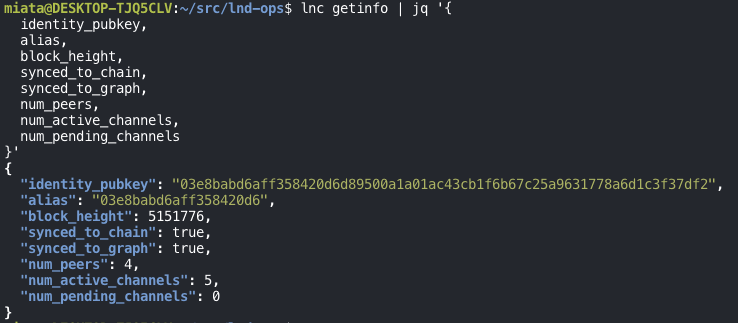
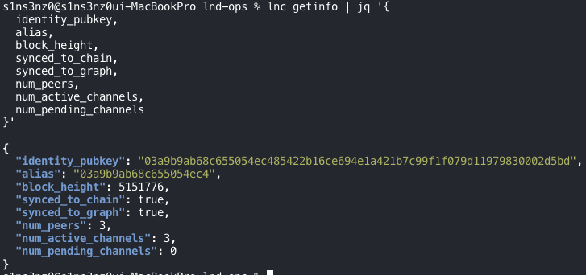
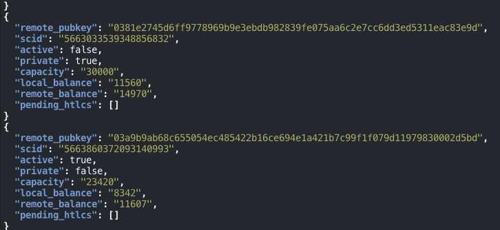
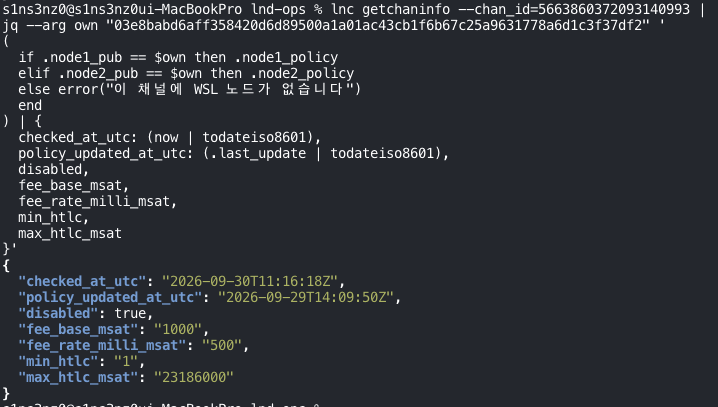
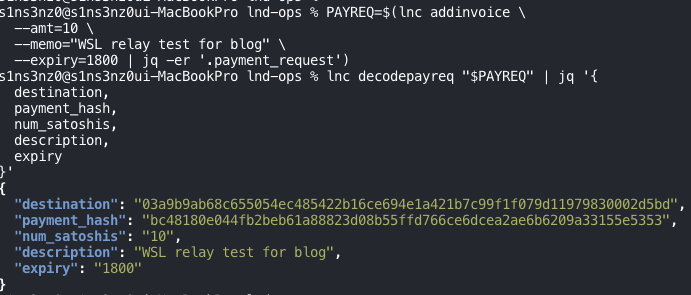
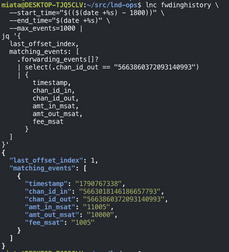

*The [previous post](/posts/lnd-testnet-routing-node-readiness/) only read the WSL node's routing readiness. This one sends a real test payment through it.*

The test uses two LND nodes, one running on a Mac and one on Kubernetes in WSL. First, `getinfo` confirms each node's public key and sync state. Then the channels' active state and liquidity in each direction are checked. Finally, a test payment is sent and matched against the forwarding record.

## 1. Identity and sync of the Mac and WSL nodes

Run the same command on the Mac and in WSL. `lnc` is the `lncli` shortcut function defined in the previous post.

```bash
lnc getinfo | jq '{
  identity_pubkey,
  alias,
  block_height,
  synced_to_chain,
  synced_to_graph,
  num_peers,
  num_active_channels,
  num_pending_channels
}'
```



*WSL node*



*Mac node*

| Field | What it checks | WSL | Mac |
|---|---|---|---|
| `identity_pubkey` | Whether the two are different nodes | `03e8babd6aff…` | `03a9b9ab68c6…` |
| `block_height` | Whether both see the same height | 5151776 | 5151776 |
| `synced_to_chain` | Chain sync | `true` | `true` |
| `synced_to_graph` | Channel graph sync | `true` | `true` |
| `num_peers` | Connected peers | 4 | 3 |
| `num_active_channels` | Active channels | 5 | 3 |
| `num_pending_channels` | Channels waiting to open | 0 | 0 |

A node's public key is what identifies it on the Lightning Network. The keys differ, so the Mac and WSL are separate nodes, and each terminal is talking to the node it's meant to. Both nodes have finished syncing to the chain and the graph at the same block height.

The Mac node's key, `03a9b9…`, is the "Mac node" that showed up as inactive in the previous post's channel list. WSL had 4 active channels then; now it has 5.

The number of active channels alone doesn't tell you whether a payment can be relayed. Which channels are active, and whether there's enough balance in the right direction, is checked per channel next.

## 2. Channels and balance in each direction on both nodes

With both nodes confirmed, list the payment channels. Being connected as peers isn't enough to forward a Lightning payment. You need an active channel for the payment, and liquidity in the direction it flows.

Run the same command on both nodes. Unlike the previous post, this query reads `scid` directly instead of `chan_id`.

```bash
lnc listchannels | jq '.channels[] | {
  remote_pubkey,
  scid,
  active,
  private,
  capacity,
  local_balance,
  remote_balance,
  pending_htlcs
}'
```

| Field | Meaning |
|---|---|
| `remote_pubkey` | Public key of the peer on this channel |
| `scid` | Channel identifier used to pin a route or match forwarding records |
| `active` | Whether the channel is currently active |
| `private` | `false` means a public channel |
| `capacity` | Total channel capacity, in sats |
| `local_balance` | Balance on your side of the channel |
| `remote_balance` | Balance on the peer's side |
| `pending_htlcs` | HTLCs not yet resolved |


*Mac node*



*WSL node, last part of the output*

On the Mac, all three public channels were active. On WSL, four public channels and one private channel were active. A node can open several channels with the same peer, so the number of active channels and the number of peers can differ.

The two nodes' public keys:

```text
WSL: 03e8babd6aff…c3f37df2
Mac: 03a9b9ab68c6…0002d5bd
```

Look for the channel whose peer is WSL in the Mac's output, and the channel whose peer is the Mac in WSL's output: it's the same channel, seen from both sides. Its identifier is `5663860372093140993` and its capacity is 23,420 sats.

| Queried on | Peer | Local balance | Remote balance |
|---|---|---:|---:|
| Mac | WSL | 11,607 sat | 8,342 sat |
| WSL | Mac | 8,342 sat | 11,607 sat |

The Mac's `local_balance` is WSL's `remote_balance`. These aren't two separate balances; it's one channel's balance seen from each node. If a payment had gone through between the two queries, the numbers could differ slightly. Here they matched exactly.

This is the Mac channel that was inactive in the previous post. The balances are the same as then, and it's now `active: true`.

Both outputs had empty `pending_htlcs`: at the time of the query, the channel was active with no HTLCs in flight.

Not all of the displayed balance can be sent. The amount you can actually send is limited by the channel reserve and any HTLCs in flight.

## 3. The test route and WSL's forwarding policy

The test is set up so that WSL records a forward. The Mac pays an invoice it issued to itself, but the payment leaves through an external channel and comes back to the Mac with WSL as the last hop.

```text
Mac ──→ external node A ──→ WSL ──→ Mac
sender                      relay     receiver
```

The actual route may include more external nodes. The final route is confirmed from the payment result.

The balance available in the payment's direction on each leg:

| Leg | Channel | Balance checked |
|---|---|---:|
| Mac → external A | The Mac's 100,000-sat channel | 79,862 sat on the Mac side |
| External A → WSL | WSL's 100,000-sat channel | 16,678 sat on A's side |
| WSL → Mac | The shared 23,420-sat channel | 8,342 sat on the WSL side |

On balances alone, there's plenty of room for a 10-sat test.

After balance comes policy. A relay node charges fees according to the policy of the channel it forwards the payment out on. In this route, WSL's exit is the channel to the Mac, so WSL's policy on that channel tells us whether forwarding is allowed, what it costs, and what the HTLC limits are.

Instead of eyeballing which of `node1` and `node2` is WSL, as in the previous post, pass WSL's public key to `jq` and pick out WSL's policy:

```bash
lnc getchaninfo --chan_id=5663860372093140993 |
jq --arg own "03e8babd6aff358420d6d89500a1a01ac43cb1f6b67c25a9631778a6d1c3f37df2" '
{
  node1_pub,
  node2_pub,
  capacity,
  wsl_to_mac_policy: (
    if .node1_pub == $own then .node1_policy
    elif .node2_pub == $own then .node2_policy
    else error("WSL node is not on this channel")
    end
  )
}'
```


*The error message in the screenshot's `jq` filter is in Korean; it's the same check.*

The Mac's key (`03a9…`) sorts before WSL's (`03e8…`), so WSL is `node2` on this channel.

| Field | Value | Meaning |
|---|---|---|
| `fee_base_msat` | 1,000 msat | Base fee of 1 sat |
| `fee_rate_milli_msat` | 500 | Proportional fee of 500 ppm |
| `min_htlc` | 1 msat | Smallest HTLC |
| `max_htlc_msat` | 23,186,000 msat | Largest single HTLC, about 23,186 sats |
| `time_lock_delta` | 80 | CLTV delta required when forwarding, 80 blocks |
| `disabled` | `true` | WSL → Mac is advertised as unusable for routing |

The fee and amount limits are fine for a 10-sat test. By the previous post's calculation, WSL would charge 1.005 sats to relay it.

The problem is `disabled: true`. `listchannels` showed the channel as `active: true`, but the policy WSL advertised to the network for this direction was still disabled. A node searching for a route can see that and drop the WSL → Mac leg, so the planned route might never be found.

`last_update` was 1790690990, about 21 hours before the query. The policy for this direction hadn't been re-announced since the channel came back.

## 4. Active channel, disabled policy: checking before the invoice

Before creating the invoice, the `disabled: true` had to be sorted out. Looked at separately, the channel state and the routing policy disagreed:

| Check | Result | Meaning |
|---|---|---|
| `active` in `listchannels` | `true` | The Mac↔WSL channel is currently active |
| `disabled` in WSL's policy | `true` | The graph queried shows WSL → Mac as not forwarding |

The policy stored in the graph might simply not have been updated since the Mac reconnected. That alone isn't enough to call it broken. So instead of taking the active channel as proof of readiness, I checked whether the policy would update after the reconnect.

### Querying the policy again

This time the output includes the query time and the policy's update time, both in UTC.

```bash
lnc getchaninfo --chan_id=5663860372093140993 |
jq --arg own "03e8babd6aff358420d6d89500a1a01ac43cb1f6b67c25a9631778a6d1c3f37df2" '
(
  if .node1_pub == $own then .node1_policy
  elif .node2_pub == $own then .node2_policy
  else error("WSL node is not on this channel")
  end
) | {
  checked_at_utc: (now | todateiso8601),
  policy_updated_at_utc: (.last_update | todateiso8601),
  disabled,
  fee_base_msat,
  fee_rate_milli_msat,
  min_htlc,
  max_htlc_msat
}'
```



The WSL → Mac policy was still disabled, and its update time was stuck at the previous day, 2026-09-29 14:09:50 UTC.

This query ran in the Mac terminal, but `--arg own` was given WSL's key, so it shows the WSL → Mac policy as stored in the Mac's graph. It ran at 11:16:18 UTC, before the policy was enabled at 11:19:31 UTC below, so this is the **before** state.

That view matters: the Mac is the sender and finds the route using its own graph. A disabled WSL → Mac direction in the Mac's graph is exactly what could block the test.

### Checking which node you're querying

Next, to check whether WSL still sees the channel as active, I filtered `listchannels` to this one channel by `scid`:

```bash
lnc listchannels | jq '
.channels[]
| select(.scid == "5663860372093140993")
| {
  scid,
  active,
  local_balance,
  remote_balance,
  pending_htlcs
}'
```

```json
{
  "scid": "5663860372093140993",
  "active": true,
  "local_balance": "11607",
  "remote_balance": "8342",
  "pending_htlcs": []
}
```

But the balances were the reverse of what WSL showed earlier. These are the Mac's numbers. The same channel shows local and remote balances swapped depending on which node you ask, so before comparing channel state, confirm the node with `getinfo`'s public key:

```bash
lnc getinfo | jq '{identity_pubkey, alias}'
```

```json
{
  "identity_pubkey": "03a9b9ab68c655054ec485422b16ce694e1a421b7c99f1f079d11979830002d5bd",
  "alias": "03a9b9ab68c655054ec4"
}
```

The key is `03a9b9…`: that was the Mac. Running the same two commands in the WSL terminal:

```json
{
  "identity_pubkey": "03e8babd6aff358420d6d89500a1a01ac43cb1f6b67c25a9631778a6d1c3f37df2",
  "alias": "03e8babd6aff358420d6"
}
{
  "scid": "5663860372093140993",
  "active": true,
  "local_balance": "8342",
  "remote_balance": "11607",
  "pending_htlcs": []
}
```

| Queried on | Active | Local balance | Remote balance |
|---|---|---:|---:|
| Mac | `true` | 11,607 sat | 8,342 sat |
| WSL | `true` | 8,342 sat | 11,607 sat |

Both nodes saw the channel as active, and each node's local balance matched the other's remote balance. Neither had HTLCs in flight.

### WSL's logs

Separately from the connection state, I searched WSL's last 30 minutes of logs for the Mac's key, the channel identifiers, and connection and policy keywords:

```bash
kubectl --kubeconfig="$KUBECONFIG" -n lnd-testnet \
  logs lnd-0-0 -c lnd --since=30m --tail=3000 \
  --request-timeout=10s |
grep -Ei '03a9b9ab|5663860372093140993|a951e157|a088fe45|disabled|enabled|channel.?update|link.*fail|ERR|WRN' |
tail -n 80
```

`a951e157` is the start of the channel's funding transaction ID (its `chan_point`), and `a088fe45` is the start of the 32-byte channel ID that LND prints in its logs. No output would only mean nothing matched in that range, not that everything is fine.

The key lines:

```text
[ERR] CMGR: Can't accept connection: unable to accept connection from 10.42.0.1:23512: chacha20poly1305: message authentication failed
...
[INF] SRVR: Finalizing connection to 03a9b9ab…02d5bd@10.42.0.1:13665, inbound=true
[INF] PEER: Peer(03a9b9ab…02d5bd): Loading ChannelPoint(a951e157…fe88a0:1), isPending=false
[INF] HSWC: Adding live link chan_id=a088fe45…e151a8, short_chan_id=5151251:6:1
[INF] HSWC: ChannelLink(a951e157…fe88a0:1): HTLC manager started, bandwidth=7988005 mSAT
[INF] HSWC: ChannelLink(a951e157…fe88a0:1): received re-establishment message from remote side
[INF] CNCT: ChannelArbitrator(a951e157…fe88a0:1) no close event
```

| Log | Meaning |
|---|---|
| `Finalizing connection to 03a9…` | Connected to the Mac |
| `Adding live link` | The channel link was registered |
| `HTLC manager started, bandwidth=7988005 mSAT` | HTLC handling started, with about 7,988 sats sendable at the time |
| `received re-establishment message` | Received the channel re-establish message from the Mac |
| `no close event` | No channel close event; not an error |

`short_chan_id=5151251:6:1` is SCID `5663860372093140993` split into block, transaction, and output. Same channel.

The `bandwidth` of about 7,988 sats is less than WSL's 8,342-sat balance. As noted in section 2, the reserve and similar constraints mean the whole balance can't be sent.

The earlier `message authentication failed` lines are failed encryption handshakes on incoming connections. They carry no peer key, so they can't be pinned on the Mac, and the Mac's connection was confirmed separately afterwards.

So the WSL logs showed the connection to the Mac, the channel link starting, and the re-establish message, but they weren't enough to say why the policy stayed disabled.

### Explicitly enabling WSL → Mac

Without guessing at the cause, I explicitly enabled WSL's direction on this channel and queried it again. LND's [`updatechanstatus`](https://lightning.engineering/api-docs/api/lnd/router/update-chan-status/index.html) changes the channel status the node advertises to the network. Even after a manual enable, LND can disable it again automatically if the peer disconnects later.

Run on WSL. `--chan_point` is the funding transaction ID and output index.

```bash
lnc updatechanstatus \
  --chan_point=a951e157d887759e2a77502cd2c41ad8f84465fd8c650100b4059fb045fe88a0:1 \
  --action=enable
```

```json
{}
```

`{}` means the command succeeded and has no response fields. Check whether the policy actually changed:

```bash
lnc getchaninfo --chan_id=5663860372093140993 |
jq --arg own "03e8babd6aff358420d6d89500a1a01ac43cb1f6b67c25a9631778a6d1c3f37df2" '
(
  if .node1_pub == $own then .node1_policy
  elif .node2_pub == $own then .node2_policy
  else error("WSL node is not on this channel")
  end
) | {
  disabled,
  policy_updated_at_utc: (.last_update | todateiso8601),
  fee_base_msat,
  fee_rate_milli_msat
}'
```

```json
{
  "disabled": false,
  "policy_updated_at_utc": "2026-09-30T11:19:31Z",
  "fee_base_msat": "1000",
  "fee_rate_milli_msat": "500"
}
```

The WSL → Mac policy is now `disabled: false`, with a fresh update time of 2026-09-30 11:19:31 UTC. The 1-sat base fee and 500 ppm rate are unchanged.

This only confirms that the forwarding policy is enabled. Whether a forward actually succeeds is checked by sending the payment.

## 5. Creating the invoice

With the policy enabled, create a 10-sat invoice in the Mac terminal. No money moves at this step; it only creates a request to receive 10 sats.

```bash
PAYREQ=$(lnc addinvoice \
  --amt=10 \
  --memo="WSL relay test for blog" \
  --expiry=1800 | jq -er '.payment_request')

lnc decodepayreq "$PAYREQ" | jq '{
  destination,
  payment_hash,
  num_satoshis,
  description,
  expiry
}'
```



| Field | Value | Meaning |
|---|---|---|
| `destination` | `03a9b9…` | The receiver is the Mac node |
| `num_satoshis` | 10 | Amount to receive: 10 sats |
| `expiry` | 1800 | Valid for 30 minutes |
| `payment_hash` | `bc48180e…` | Identifier to match against the payment result |

The `-e` in `jq -er` makes `jq` exit with an error if there's no `payment_request`, so an empty `PAYREQ` never reaches the next step.

## 6. A test payment with WSL as the last hop

In the same Mac terminal, pay the invoice just created. The payment leaves through the 100,000-sat channel to an external peer, and the hop right before the receiver is pinned to WSL.

```bash
lnc payinvoice \
  --force \
  --allow_self_payment \
  --max_parts=1 \
  --timeout=30s \
  --fee_limit=10 \
  --outgoing_chan_id=5663440358651985921 \
  --last_hop=03e8babd6aff358420d6d89500a1a01ac43cb1f6b67c25a9631778a6d1c3f37df2 \
  "$PAYREQ"
```

This is a real testnet payment: 10 sats, with a separate routing fee cap of 10 sats.

| Option | Role here |
|---|---|
| `--force` | Skip the confirmation prompt. Needed because `lnc` doesn't pass interactive input |
| `--allow_self_payment` | Let the Mac pay its own invoice |
| `--outgoing_chan_id` | Leave through the Mac → external A 100,000-sat channel |
| `--last_hop` | Pin the hop before the receiver (the Mac) to WSL |
| `--max_parts=1` | Don't split the payment into parts |
| `--timeout=30s` | Time limit for payment attempts |
| `--fee_limit=10` | Fee cap of 10 sats |

If the payment succeeds under these constraints, WSL received it and passed it on to the Mac. LND picks the external part of the route.


*The preimage is blurred.*

| Item | Result |
|---|---|
| Payment status | `SUCCEEDED` |
| Amount received by the Mac | 10 sat |
| Total routing fee | 2.005 sat |
| Outgoing channel | `5663440358651985921` |
| Route | Mac → 1ML.com node ALPHA → WSL → Mac |

The payment `SUCCEEDED`. External node A turned out to be `1ML.com node ALPHA`, and the route went as planned: out from the Mac through the external peer, into WSL, and back to the Mac. It took one attempt.

The 2.005 sats is the fee for the whole route. WSL's share is checked in WSL's own records.

## 7. WSL's forwarding record

In the WSL terminal, pull the last 30 minutes of forwarding history and keep only events that went out on the channel to the Mac:

```bash
lnc fwdinghistory \
  --start_time="$(($(date +%s) - 1800))" \
  --end_time="$(date +%s)" \
  --max_events=1000 |
jq '{
  last_offset_index,
  matching_events: [
    .forwarding_events[]?
    | select(.chan_id_out == "5663860372093140993")
    | {
        timestamp,
        chan_id_in,
        chan_id_out,
        amt_in_msat,
        amt_out_msat,
        fee_msat
      }
  ]
}'
```

If the result is empty, wait a moment for the record to land and query again.



| Field | Value | Meaning |
|---|---|---|
| `timestamp` | 1790767338 | 2026-09-30 11:22:18 UTC |
| `chan_id_in` | `5663018146186657793` | Came in on the 100,000-sat channel with 1ML.com node ALPHA (`023126…`) |
| `chan_id_out` | `5663860372093140993` | Went out on the 23,420-sat channel to the Mac |
| `amt_in_msat` | 11,005 msat | Amount WSL received |
| `amt_out_msat` | 10,000 msat | Amount WSL passed to the Mac: 10 sats |
| `fee_msat` | 1,005 msat | WSL's routing fee |

The incoming channel `5663018146186657793` is the 100,000-sat channel with `023126…` whose policy was checked in the [previous post](/posts/lnd-testnet-routing-node-readiness/). So 1ML.com node ALPHA's key is `023126…`.

The 1,005 msat WSL earned is exactly the figure calculated in section 3:

```text
1 sat + 10 sat × 500 / 1,000,000 = 1.005 sat = 1,005 msat
```

Take WSL's 1.005 sats out of the 2.005-sat total, and the remaining 1 sat went to ALPHA:

```text
Mac sends        12,005 msat
  │ ALPHA fee     1,000 msat
  ▼
WSL receives     11,005 msat
  │ WSL fee       1,005 msat
  ▼
Mac receives     10,000 msat
```

`last_offset_index` is the position of the last returned event, used to page through the history. It's 1 here, so this test payment appears to be the first forward recorded on WSL.

## Summary

| Step | What was confirmed |
|---|---|
| 1. Identity and sync | The Mac and WSL are different nodes, both synced at the same height |
| 2. Channels and balances | The shared channel shows the same SCID on both sides, with balances mirrored |
| 3. Route and policy | Enough balance on every leg, but the WSL → Mac policy was `disabled: true` |
| 4. Enabling the policy | The channel was active on both sides; `updatechanstatus` enabled WSL → Mac |
| 5. Invoice | The Mac created a 10-sat invoice |
| 6. Test payment | `SUCCEEDED` over Mac → ALPHA → WSL → Mac, with 2.005 sats in total fees |
| 7. Forwarding record | WSL received 11,005 msat, passed on 10,000 msat, and kept 1,005 msat as its fee |

A channel being `active` and being ready to forward in a given direction turned out to be two different things. Checking the connection state, the advertised policy, the payment result, and the relay node's own record in turn is what showed that WSL actually relayed the payment.
