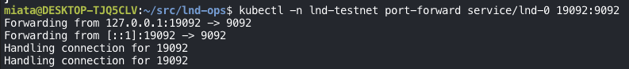
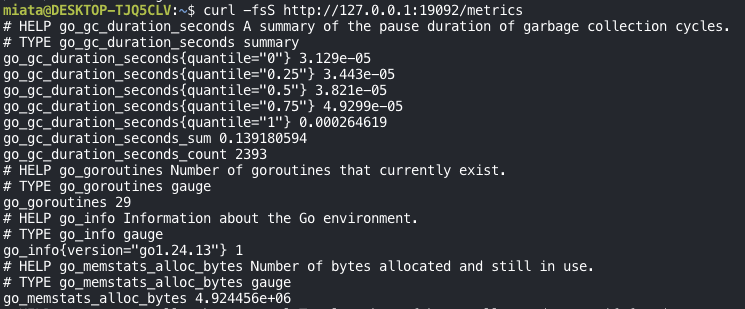

For an [incident-response drill](/posts/rehearsing-incidents-with-an-llm-agent/), the first thing I needed was metrics. An alert can only fire on numbers someone is already collecting, and an agent can only investigate evidence that exists.

The metrics collector I used is **Prometheus**, a graduated CNCF project that a large share of cloud-native services rely on for monitoring.

## How Prometheus collects metrics

Prometheus pulls. On a fixed interval it sends an HTTP request to an endpoint that the service exposes on purpose, usually `/metrics`, and stores every value it reads as a time series. This is called **scraping**.

If a system has no such endpoint, you run an **exporter** next to it: a small program that asks the system for its state through whatever interface it does have (an API, a CLI, a log) and republishes the answers in the Prometheus format. Prometheus then scrapes the exporter instead of the system itself.

## LND and lndmon

For LND, Lightning Labs already provides that exporter: **lndmon**.

lndmon connects to LND over its RPC interface, reads things like chain sync state, peers, channels, and balances, and exposes them as Prometheus metrics. So lndmon and Prometheus are not alternatives to each other:

```text
LND ── RPC ──► lndmon ── /metrics ──► Prometheus ──► alerts, dashboards
```

lndmon produces the metrics; Prometheus collects and stores them.

In my setup, lndmon runs as a sidecar in the LND pod and listens on port `9092`. The `lnd-0` Service exposes that port inside the cluster.

## Checking the endpoint by hand

Before wiring Prometheus to it, I wanted to see the raw data myself. Port-forwarding the Service makes the endpoint reachable from my machine:

```bash
kubectl -n lnd-testnet port-forward service/lnd-0 19092:9092
```



*Local port 19092 now points at lndmon's port 9092. Each "Handling connection" line is one request going through.*

Then, from another terminal, I requested the endpoint the same way Prometheus will:

```bash
curl -fsS http://127.0.0.1:19092/metrics
```



*The first lines are the Go runtime's own metrics for the lndmon process. The Lightning-specific metrics, prefixed `lnd_`, come further down the same page.*

## Reading the format

Every metric is written the same way: a `HELP` line, a `TYPE` line, and one or more samples.

```text
# HELP app_requests_total Total number of requests received.
# TYPE app_requests_total counter
app_requests_total 3
```

- **HELP** is literally help: a one-line description of what the metric measures.
- **TYPE** is the kind of metric. Here it is a `counter`.
- The sample line is the metric name and its current value. `app_requests_total 3` means the service has received 3 requests so far.

The types decide how you are allowed to read the numbers, and the output above already shows three of them:

| Type | What it means | Example from the output |
|---|---|---|
| `counter` | Only goes up (resets to zero on restart). Read it as a rate or an increase over time, not as a raw value. | `app_requests_total` |
| `gauge` | A current value that can go up or down. | `go_goroutines 29`: 29 goroutines exist right now |
| `summary` | A distribution: quantiles plus a running `_sum` and `_count`. | `go_gc_duration_seconds{quantile="0.5"}`: the median garbage-collection pause |

Labels in curly braces, like `{quantile="0.5"}` or `{version="go1.24.13"}`, split one metric into several series. Prometheus stores each label combination separately.

That distinction matters later. In the drill, the alert that caught a dead pricer was built on counters, `increase(...[15m])` over a 15-minute window. Because a counter only makes sense as a change over time, the window length turned into detection lag. That story is in [Rehearsing Incidents with an LLM Agent](/posts/rehearsing-incidents-with-an-llm-agent/).

## Next

Now that the endpoint serves real data, the next step is telling Prometheus to scrape it on a schedule and keep the history, so the numbers can drive dashboards and alerts. Where those alerts come from, and how I manage them, is the subject of [Prometheus Alert Rules: Helm Values or PrometheusRule Files?](/posts/prometheus-alert-rules-helm-values-vs-prometheusrule/)
