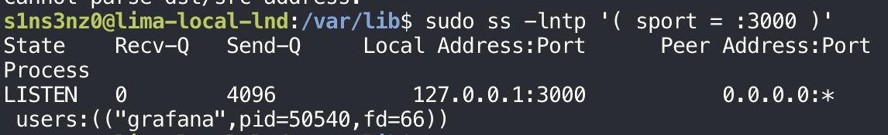
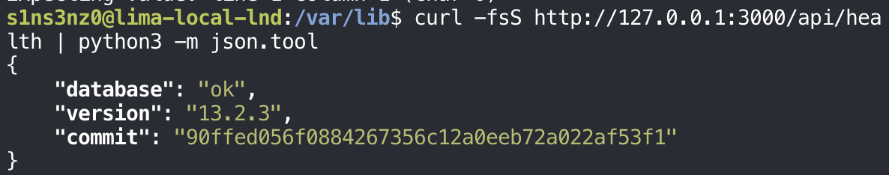
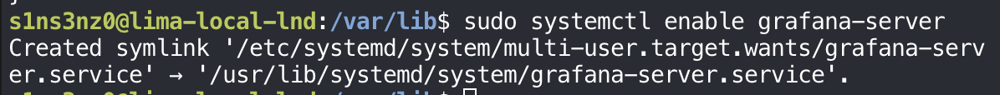
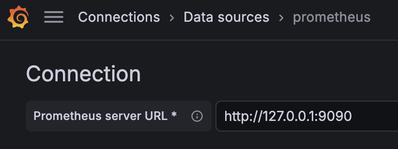

*Part 3 of the series. [Part 2](/posts/monitoring-lnd-with-systemd-without-containers-prometheus/) set Prometheus collecting from both lndmon exporters, node exporter, and itself.*

## Installing Grafana

<!-- TODO: screenshot of the Grafana install (package source and version) -->

### Binding Grafana to loopback

Grafana's settings live in `/etc/grafana/grafana.ini`. The first thing to check is the same question as for Prometheus: which address its web server listens on.

```bash
sudo rg -n '^\[server\]|^;?http_addr\s*=|^;?http_port\s*=' /etc/grafana/grafana.ini
sudoedit /etc/grafana/grafana.ini
```

![sudo rg -n with the pattern ^\[server\]|^;?http_addr\s*=|^;?http_port\s*= on /etc/grafana/grafana.ini prints 40:[server], 48:;http_addr =, 51:;http_port = 3000; then sudoedit /etc/grafana/grafana.ini](../../assets/images/lnd-monitoring/grafana-ini-default.png)

| Part | Meaning |
|---|---|
| `rg -n` | Print matching lines with their line numbers, so the edit lands in the right place |
| `^\[server\]` | The `[server]` section header. The brackets are escaped, since they mean something in a regex |
| `^;?http_addr\s*=`, `^;?http_port\s*=` | The two settings, whether active or commented out. In an `.ini` file, a leading `;` comments a line out |

Both settings are commented out (`;http_addr =` on line 48, `;http_port = 3000` on line 51), so Grafana uses its defaults. For `http_addr`, the default is empty, and the file's own comment spells out what that means: "empty will bind to all interfaces." Port 3000 on every interface, the same problem Prometheus had with `0.0.0.0:9090`.

`sudoedit` is the safer way to edit a root-owned file. It copies the file to a temporary location, opens the copy in my editor running as me, not as root, and writes it back with root's permissions only when I save. A plain `sudo vim` would run the whole editor, plugins included, as root.

After the edit, the `[server]` section reads:

![The [server] section of grafana.ini after editing: ;protocol = http and ;min_tls_version = "" still commented out, then http_addr = 127.0.0.1 under the comment "The ip address to bind to, empty will bind to all interfaces", and http_port = 3000 under "The http port to use"](../../assets/images/lnd-monitoring/grafana-ini-edited.png)

| Setting | Before | After |
|---|---|---|
| `http_addr` | `;http_addr =` (commented, empty: all interfaces) | `http_addr = 127.0.0.1` |
| `http_port` | `;http_port = 3000` (commented, default) | `http_port = 3000` |

Removing the `;` makes both lines active. The port stays at its default, 3000; writing it out just makes the setting visible in the file instead of implied. `protocol` stays `http`: with Grafana reachable only from inside the VM, there's no network path to protect with TLS yet.

After restarting Grafana so it reads the new address, `ss` confirms it:

```bash
sudo ss -lntp '( sport = :3000 )'
```



Grafana listens on `127.0.0.1:3000` only, as the `grafana` user. With that, every listener in the monitoring stack is on loopback:

| Service | Address |
|---|---|
| lndmon for node A | `127.0.0.1:9092` |
| lndmon for node B | `127.0.0.1:9093` |
| Prometheus | `127.0.0.1:9090` |
| Grafana | `127.0.0.1:3000` |

### Checking Grafana is healthy

Listening isn't the same as working. Grafana has a health endpoint that needs no login:

```bash
curl -fsS http://127.0.0.1:3000/api/health | python3 -m json.tool
```



| Field | Value | Meaning |
|---|---|---|
| `database` | `ok` | Grafana can reach its own database, where it keeps users, data sources, and dashboards |
| `version` | `13.2.3` | The installed Grafana release |
| `commit` | `90ffed0…af53f1` | The source commit that release was built from |

`database: ok` is the part that matters: Grafana is up and can read and write its state. The endpoint is the same kind of check `getblockchaininfo` and `lncli getinfo` were for the nodes, a question the service answers about itself, which makes it a natural target for monitoring Grafana later.

Then `enable`, so Grafana comes back after a reboot like everything else:

```bash
sudo systemctl enable grafana-server
```



The link points into `/usr/lib/systemd/system/`, not `/etc/systemd/system/` as for my own units: like Prometheus, Grafana's unit came with its package.

<!-- TODO: grafana restart screenshot; reaching Grafana from the Mac; first login and admin password -->

## Connecting Grafana to Prometheus

### The data source

Grafana reads data through data sources. Under **Connections → Data sources**, I added one of type Prometheus and gave it the address Prometheus listens on:



The URL is `http://127.0.0.1:9090`, plain HTTP. My first attempt used `https://`, which can't work: Prometheus here serves HTTP only, since Part 2 set its listen address and nothing else, and a TLS handshake against a plain-HTTP port fails before any query is sent. Grafana and Prometheus run in the same VM and talk over loopback, so this traffic never crosses a network that TLS would need to protect.

**Save & test** saves the data source and runs a test query against it:


`Successfully queried the Prometheus API` means Grafana reached Prometheus and got an answer back, the same kind of answer `curl` got from `/api/v1/query` in Part 2. The **Remove default** button shows this is Grafana's default data source, so new panels will use it without choosing.

The chain from the diagram in Part 1 is now complete: LND → lndmon → Prometheus → Grafana.

## The first query

### Channel balance over time

Before building a dashboard, Grafana's **Explore** view is a quick way to try a query and see it as a graph. The first one is the channel balance on each node:

```promql
lnd_channels_open_balance_sat{job="lndmon"}
```


| Part | Meaning |
|---|---|
| `lnd_channels_open_balance_sat` | The node's balance across its open channels, the same metric `curl` read from each lndmon in Part 1 |
| `{job="lndmon"}` | Only series from the lndmon job, which covers both nodes |
| Legend `node="a"`, `node="b"` | One line per node, split by the label added in Part 2's scrape configuration |

Each node's line is its side of the one channel between them. Node A's sits just under 1 million on the axis, at 986,530 sat. Node B's looks like it's on zero, but it's 10,000 sat, which is too small to lift off an axis scaled for a million.

This is channel balance, not wallet balance: the funds committed to Lightning channels, not the node's on-chain coins. Node A's on-chain wallet still holds most of the 1 BTC from the previous series, and that doesn't appear here.

The lines begin at about 20:02, when I restarted Prometheus; the graph has data only from that point. Both lines are flat because nothing moved. No payment crossed the channel while Prometheus was recording, so every 15-second sample repeated the baseline from the end of the previous series. That's the healthy picture the failure exercises will be compared against: when a payment goes through, the two lines should step in opposite directions by the same amount.

## Building the dashboard

### Active channels

The dashboard starts with a panel for each of the four signals from Part 1. The first is active channels per node:

```promql
lnd_channels_active_total{job="lndmon"}
```


| Setting | Value | Meaning |
|---|---|---|
| Query | `lnd_channels_active_total{job="lndmon"}` | Active channels, one series per node |
| Legend | `lnd{{node}}` | `{{node}}` is replaced by each series' `node` label, so the lines are named `lnda` and `lndb` |
| Format | Time series | Draw values over time |
| Type | Range | Query every point in the time range, not just the latest value |

Three things in this graph are easy to misread:

- **Only one color shows.** Both nodes have exactly one active channel, the same channel seen from each end, so both lines sit at 1 and B's yellow line is drawn on top of A's green one.
- **The gaps aren't the channel going down.** A gap means no samples: Prometheus had nothing to record, because it was restarted or lndmon wasn't running during the setup in Parts 1 and 2. A channel that actually went inactive would show as a line dropping to 0, not as a missing line. That difference, between a value of 0 and no value at all, is one of the things the failure exercises will make visible.
- **The range is wider than the data.** The panel covers the last several hours, and the scrape history only starts during this afternoon's setup.

### Scrape status

The second panel answers a question the others depend on: is Prometheus getting data from each lndmon at all?

```promql
up{job="lndmon"}
```


| Setting | Value | Meaning |
|---|---|---|
| Title | `LND metrics scrape status` | Names what the panel shows, instead of `New panel` |
| Query | `up{job="lndmon"}` | `1` for each lndmon target Prometheus scraped successfully, `0` for each one it couldn't |
| Legend | `LND {{node}}` | Lines named `LND a` and `LND b`; the space makes them easier to read than `lnda` |
| Interval | `30s` | Grafana's step between points for this time range. Wider ranges get coarser steps |

The shape matches the active-channels panel exactly, gaps included, and that tells me something about the gaps. Prometheus writes an `up` sample for every scrape it attempts, and records `0` when the target doesn't answer. So a gap in `up` means Prometheus wasn't scraping at all, because it wasn't running or didn't yet have the lndmon targets in its configuration. The gaps are on the Prometheus side of the setup, not in the nodes.

This is also the panel to read first during an incident. If `up` is 0 for a node, the other panels have no fresh data for it, and what they show is old.

### Three panels side by side

With a third panel for connected peers, the dashboard has three panels, each with one query over the lndmon job:

| Panel | Query | Legend |
|---|---|---|
| Connected Peers | `lnd_peer_count{job="lndmon"}` | `lnd {{node}}` |
| LND metrics scrape status | `up{job="lndmon"}` | `LND {{node}}` |
| LND Active Channel | `lnd_channels_active_total{job="lndmon"}`, the first panel, now titled | `LND {{node}}` |


All three panels show the same picture: a value of 1 for both nodes whenever there's data, and the same gaps. Side by side, they read as one statement about the lab. Each node has one peer, the other node; each has one active channel, the one between them; and Prometheus was scraping both exporters whenever there's a line at all. The matching gaps confirm what the scrape-status panel showed: they're periods with no scraping, not moments when a peer or a channel dropped.

That agreement is the baseline. When node B is stopped later, these three panels should stop agreeing, and the order in which they change will say what failed first.

<!-- TODO: legend consistency (lnd a vs LND a); channel balance and chain sync panels; save dashboard -->

## Where this part ends

The monitoring chain runs end to end: two LND nodes, one lndmon each, Prometheus scraping both, and Grafana drawing what Prometheus stored, all bound to loopback inside the VM. The dashboard so far shows the healthy baseline: one peer and one active channel per node, scraping working, and the channel balance split 986,530 to 10,000.

This series stops here, on regtest. The next step is testnet, where the chain has other nodes and blocks arrive on their own, and that gets a series of its own: a node that stays up and runs continuously, with this monitoring stack carried over and the dashboard finished there.

