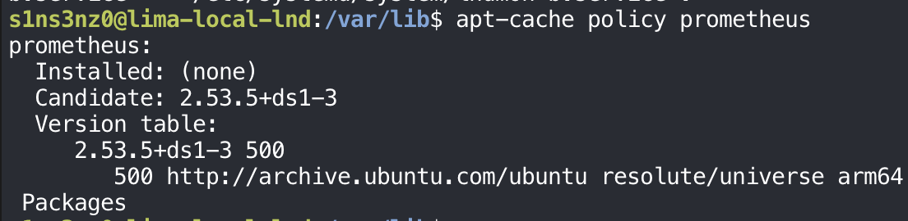
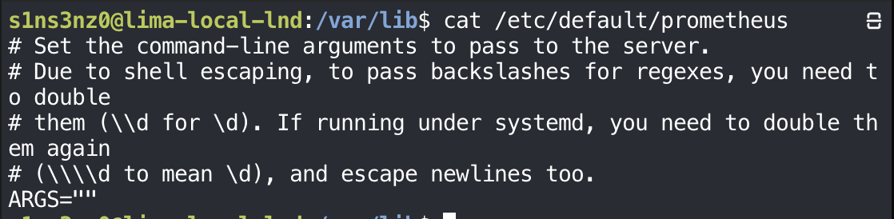
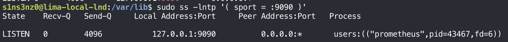
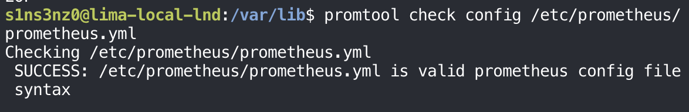
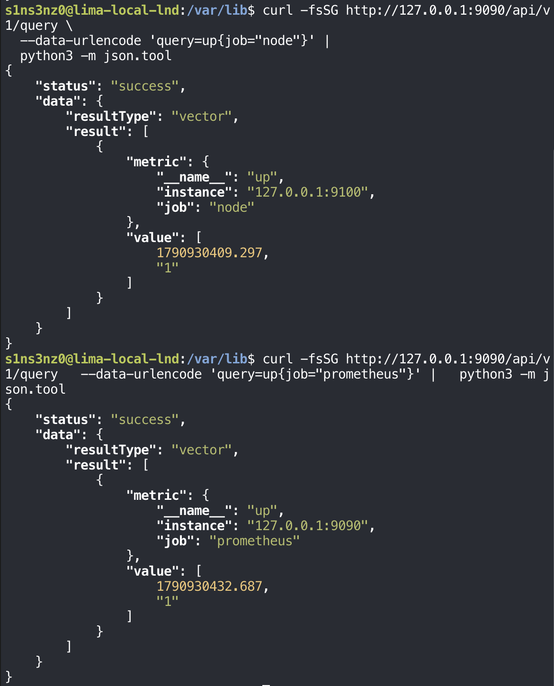

*Part 2 of the series. [Part 1](/posts/monitoring-lnd-with-systemd-without-containers/) built lndmon and left one exporter per node running under systemd: node A on `127.0.0.1:9092`, node B on `127.0.0.1:9093`.*

## Installing Prometheus

### Checking what apt offers

Unlike Bitcoin Core, LND, and lndmon, Prometheus is packaged in Ubuntu. Before installing, `apt-cache policy` shows which version the package would bring:

```bash
apt-cache policy prometheus
```



| Line | Meaning |
|---|---|
| `Installed: (none)` | Not installed yet |
| `Candidate: 2.53.5+ds1-3` | The version `apt install` would pick: Prometheus 2.53.5, repackaged for Debian and Ubuntu (`+ds1`), package revision 3 |
| `500 http://archive.ubuntu.com/ubuntu resolute/universe arm64` | Where it comes from: Ubuntu 26.04's (`resolute`) `universe` component, built for `arm64`. `500` is the default priority |

Two things follow from that. First, a package from Ubuntu's archive arrives already verified: apt checks the archive's signature on every download, which replaces the checksum and signature steps the previous series did by hand for Bitcoin Core and LND. Second, `universe` is the community-maintained part of Ubuntu, and the packaged version is from the Prometheus 2.53 line, not the newest upstream release. For a lab that needs Prometheus to scrape two endpoints and answer queries, that's enough, and it keeps updates in `apt`'s hands.

### The unit the package ships

<!-- TODO: screenshot of sudo apt install prometheus -->

The package doesn't just install a binary. It also creates a `prometheus` system user and a systemd unit, the two things the previous series wrote by hand for `bitcoind` and `lnd`. `systemctl cat` shows the unit:

```bash
systemctl cat prometheus
```

![systemctl cat prometheus shows /usr/lib/systemd/system/prometheus.service: [Unit] Description=Monitoring system and time series database, Documentation, After=time-sync.target; [Service] Restart=on-abnormal, User=prometheus, EnvironmentFile=/etc/default/prometheus, ExecStart=/usr/bin/prometheus $ARGS, ExecReload=/bin/kill -HUP $MAINPID, TimeoutStopSec=20s, SendSIGKILL=no; a "systemd hardening-options" block with AmbientCapabilities=, CapabilityBoundingSet=, DeviceAllow=/dev/null rw, DevicePolicy=strict, LimitMEMLOCK=0, LockPersonality=true, MemoryDenyWriteExecute=true, NoNewPrivileges=true, PrivateDevices=true, PrivateTmp=true, PrivateUsers=true, ProtectControlGroups=true, ProtectHome=true, ProtectKernelModules=true, ProtectKernelTunables=true, ProtectSystem=full, RemoveIPC=true, RestrictNamespaces=true, RestrictRealtime=true, SystemCallArchitectures=native; [Install] WantedBy=multi-user.target](../../assets/images/lnd-monitoring/prometheus-unit.png)

The file lives in `/usr/lib/systemd/system/`, where packages put their units, not `/etc/systemd/system/` like mine. That matters for changes: editing it directly would be overwritten by the next package update, so local changes go in a drop-in under `/etc/systemd/system/prometheus.service.d/`, through `sudo systemctl edit prometheus`.

The service settings:

| Directive | Meaning |
|---|---|
| `After=time-sync.target` | Start after the clock is synchronized. A time-series database stamps every sample with the current time, so a wrong clock means wrong data |
| `Restart=on-abnormal` | Restart after a crash, a signal, or a timeout, but not after a clean exit with an error code. Narrower than `on-failure` in my units |
| `User=prometheus` | The account the package created |
| `EnvironmentFile=/etc/default/prometheus`, `ExecStart=/usr/bin/prometheus $ARGS` | Command-line flags live in `/etc/default/prometheus` as `ARGS`, so they can change without touching the unit |
| `ExecReload=/bin/kill -HUP $MAINPID` | `systemctl reload prometheus` sends `SIGHUP`, which makes Prometheus re-read its configuration without restarting. Adding scrape targets won't need a restart |
| `TimeoutStopSec=20s`, `SendSIGKILL=no` | Give it 20 seconds to stop, and never force-kill it, so it always gets to finish writing its data to disk |

Then a whole block marked `# systemd hardening-options`. My units had four hardening lines; this one has twenty:

| Directive | What it takes away |
|---|---|
| `CapabilityBoundingSet=`, `AmbientCapabilities=` (empty) | Every Linux capability. The process can't hold any root-like privilege, even partly |
| `NoNewPrivileges=true` | Gaining privileges later, for example through a setuid binary |
| `DevicePolicy=strict`, `DeviceAllow=/dev/null rw`, `PrivateDevices=true` | Access to devices, except `/dev/null` and a private, minimal `/dev` |
| `PrivateTmp=true` | The shared `/tmp`. It gets its own |
| `PrivateUsers=true` | The real user table. It runs in its own user namespace |
| `ProtectSystem=full`, `ProtectHome=true` | Write access to `/usr`, `/boot`, `/efi`, `/etc`, and any access to home directories |
| `ProtectKernelModules=true`, `ProtectKernelTunables=true`, `ProtectControlGroups=true` | Loading kernel modules, changing kernel settings under `/proc/sys` and `/sys`, and changing cgroups |
| `MemoryDenyWriteExecute=true` | Memory that is both writable and executable, which injected code would need |
| `LockPersonality=true`, `SystemCallArchitectures=native` | Switching to another execution personality or system-call ABI, a way around other filters |
| `RestrictNamespaces=true`, `RestrictRealtime=true` | Creating new namespaces, and realtime scheduling that could starve the rest of the system |
| `LimitMEMLOCK=0`, `RemoveIPC=true` | Locking memory, and leftover shared-memory objects after it stops |

Prometheus only needs to make HTTP requests, write its database, and serve queries, so the package can afford to take away everything else. The same list is a useful checklist for tightening my own `bitcoind`, `lnd`, and `lndmon` units later.

### The flags file

The unit takes its command-line flags from `/etc/default/prometheus`:

```bash
cat /etc/default/prometheus
```



`ARGS=""` is empty, so Prometheus runs with its defaults. The comments warn about escaping: the value passes through the shell and then systemd, so a regex backslash has to be written four times. With no flags set, the configuration file, the data directory, and the listen address all come from defaults, and `--help` shows what they are:

```bash
prometheus --help 2>&1 | rg -A 2 -- '--config.file|--storage.tsdb.path|--web.listen-address'
```


`2>&1` is there because `--help` prints to standard error; it sends that into the pipe. `rg -A 2` shows each matching flag plus the two lines after it, and `--` tells `rg` the pattern that follows isn't one of its own options, since it starts with dashes.

| Flag | Default | Meaning |
|---|---|---|
| `--config.file` | `/etc/prometheus/prometheus.yml` | Where the scrape targets will be configured |
| `--storage.tsdb.path` | `/var/lib/prometheus/metrics2/` | Where the time series are stored, under `/var/lib` like the nodes' data |
| `--web.listen-address` | `0.0.0.0:9090` | The web interface, API, and Prometheus's own metrics |

The first two fit the lab as they are. The third doesn't. `0.0.0.0` means every interface, so Prometheus's API would be reachable from outside the VM, unlike everything else here, which binds to `127.0.0.1`. Keeping the same rule means setting the address explicitly:

```bash
ARGS="--web.listen-address=127.0.0.1:9090"
```

After setting `ARGS` and restarting Prometheus (a listen address is read only at startup, so `reload` isn't enough), `ss` shows where it actually listens:

```bash
sudo ss -lntp '( sport = :9090 )'
```



Prometheus listens on `127.0.0.1:9090` only, the same as every other service in the lab. The `0.0.0.0:*` under "Peer Address" isn't the listen address; it means any peer may connect, which on a loopback socket means only programs inside the VM.

<!-- TODO: screenshot of the ARGS line in /etc/default/prometheus and the restart -->

### The sample configuration

The scrape targets go in `/etc/prometheus/prometheus.yml`. The package ships a sample:

```bash
cat /etc/prometheus/prometheus.yml
```


| Section | Sample value | Meaning |
|---|---|---|
| `global.scrape_interval` | `15s` | How often each target is scraped, unless a job overrides it |
| `global.evaluation_interval` | `15s` | How often alerting and recording rules are evaluated |
| `external_labels` | `monitor: 'example'` | A label added when this Prometheus talks to other systems, such as Alertmanager |
| `alerting.alertmanagers` | `localhost:9093` | Where alerts would be sent |
| `rule_files` | Commented out | No alert rules yet |
| Job `prometheus` | `localhost:9090`, every 5s | Prometheus scraping its own metrics |
| Job `node` | `localhost:9100` | The host's metrics, if `prometheus-node-exporter` is running |

Each `job_name` becomes a `job` label on every series that job scrapes, which is how queries tell one kind of target from another.

Two lines in the sample collide with this lab:

- **`localhost:9093` under `alertmanagers`.** 9093 is Alertmanager's usual port, but in this VM it's where `lndmon-b` serves node B's metrics. Left as is, Prometheus would try to deliver alerts to lndmon. There are no alert rules yet, so nothing is sent. For now I'm removing the `alerting` block entirely, and Alertmanager will get its own port when the alerting part of this series adds it.
- **`localhost:9100` for the `node` job.** It only works if `prometheus-node-exporter` is installed and running. Otherwise the target shows as down, which is noise on a page that should show failures clearly.

So the plan for the configuration: keep the `prometheus` and `node` jobs, add the two lndmon exporters, A on 9092 and B on 9093, and drop the `alerting` block.

### Backing up the original

Before editing, a copy of the package's file:

```bash
sudo cp -a /etc/prometheus/prometheus.yml /etc/prometheus/prometheus.yml.bak
```

`-a` (archive) copies the file's attributes along with its contents: owner, group, mode, and timestamps. A plain `sudo cp` would leave the copy owned by root with default permissions, so restoring it later could quietly change who can read the configuration. With `-a`, putting the backup back restores the file exactly as the package installed it.

<!-- TODO: screenshot of the backup (ls -l both files) -->

### The new configuration

I replaced the sample with a shorter file of my own:

```bash
sudo tee /etc/prometheus/prometheus.yml >/dev/null <<'EOF'
global:
  scrape_interval: 15s
  evaluation_interval: 15s

scrape_configs:
  - job_name: prometheus
    static_configs:
      - targets: ['127.0.0.1:9090']

  - job_name: node
    static_configs:
      - targets: ['127.0.0.1:9100']

  - job_name: lndmon
    static_configs:
      - targets: ['127.0.0.1:9092']
        labels:
          node: a
      - targets: ['127.0.0.1:9093']
        labels:
          node: b
EOF
```


| Part | Meaning |
|---|---|
| `global` | Scrape every target and evaluate rules every 15 seconds, as in the sample |
| Job `prometheus` | Prometheus's own metrics. Every job now uses the global 15s; the sample's 5s override is gone |
| Job `node` | The VM's host metrics on 9100, unchanged from the sample |
| Job `lndmon` | Both exporters in one job, as two target groups |
| `labels: node: a` / `node: b` | An extra label on every series from that target |

Both exporters serve the same kind of metrics, so they share one job, `lndmon`, and a `node` label tells them apart. Every series from 9092 carries `job="lndmon", node="a"`, and every series from 9093 `job="lndmon", node="b"`. A dashboard panel can then show `lnd_peer_count` once per node with a single query, instead of one query per job.

Compared with the sample, `localhost` became `127.0.0.1`, matching every other address in this lab, and three sections are gone: `alerting`, because of the 9093 collision; `rule_files`, since there are no rules yet; and `external_labels`, which only matters when talking to other systems. They come back when the alerting part needs them.

### Checking it before Prometheus reads it

The package also installs `promtool`, Prometheus's own checker. It plays the part `systemd-analyze verify` played for unit files:

```bash
promtool check config /etc/prometheus/prometheus.yml
```



`SUCCESS` means the YAML parses and every key is one Prometheus knows, with valid values. That's worth checking first because a reload with a broken file doesn't take Prometheus down; it keeps running on the old configuration and logs the error, which is easy to miss. `promtool` checks syntax and structure, not whether the targets are reachable. That's what the targets page shows after the reload.

### Reloading and checking the targets

The unit's `ExecReload` sends `SIGHUP`, so the new targets take effect without restarting Prometheus. Then I asked Prometheus itself whether it can reach both exporters, through its query API:

```bash
sudo systemctl reload prometheus
curl -fsSG http://127.0.0.1:9090/api/v1/query \
  --data-urlencode 'query=up{job="lndmon"}' |
  python3 -m json.tool
```

![sudo systemctl reload prometheus; curl -fsSG http://127.0.0.1:9090/api/v1/query --data-urlencode 'query=up{job="lndmon"}' piped into python3 -m json.tool returns status success, resultType vector, two results: up with instance 127.0.0.1:9093, job lndmon, node b, value [1790930369.656, "1"]; and up with instance 127.0.0.1:9092, job lndmon, node a, value [1790930369.656, "1"]](../../assets/images/lnd-monitoring/prometheus-up-query.png)

| Part | Meaning |
|---|---|
| `-G` with `--data-urlencode` | Send the query as a URL parameter on a GET request, encoding the braces and quotes safely |
| `up{job="lndmon"}` | `up` is a series Prometheus records for every target on every scrape: `1` if the scrape worked, `0` if it didn't. The selector keeps the `lndmon` job |
| `python3 -m json.tool` | Pretty-print the JSON answer, with Python's standard library, nothing extra to install |

The answer has one result per exporter:

| `instance` | `node` | `up` |
|---|---|---:|
| `127.0.0.1:9092` | `a` | 1 |
| `127.0.0.1:9093` | `b` | 1 |

Both exporters are being scraped, and each series carries the `job` and `node` labels from the configuration, plus `instance`, the address Prometheus scraped. The first number in `value` is the time of the sample as a Unix timestamp; the second is the value itself, as a string, which is how the API returns numbers.

`up` needs reading carefully, though. It says whether Prometheus could scrape lndmon, not whether LND is healthy: an exporter can answer while the node behind it is down. When node B is stopped later in this series, comparing `up{node="b"}` with B's LND metrics will show which one notices first.

The same query for the other two jobs:

```bash
curl -fsSG http://127.0.0.1:9090/api/v1/query \
  --data-urlencode 'query=up{job="node"}' |
  python3 -m json.tool
curl -fsSG http://127.0.0.1:9090/api/v1/query \
  --data-urlencode 'query=up{job="prometheus"}' |
  python3 -m json.tool
```



| Job | `instance` | `up` |
|---|---|---:|
| `node` | `127.0.0.1:9100` | 1 |
| `prometheus` | `127.0.0.1:9090` | 1 |

The `node` target is up, so the worry from the sample configuration didn't apply: `prometheus-node-exporter` is running and serving the VM's own metrics on 9100. Prometheus is scraping itself too. All four targets, the two lndmon exporters, the host, and Prometheus itself, report `up` as 1. Only the lndmon results carry a `node` label, since only those targets were given one.

<!-- TODO: ss check that 9090 is on 127.0.0.1 only; Grafana -->

## Where this part ends

Prometheus is collecting from four targets every 15 seconds: both lndmon exporters, labeled `node="a"` and `node="b"`, the VM's own metrics through node exporter, and itself. Everything listens on loopback only. The data is there; what's missing is a view of it, which is Grafana, next.

Next: [Dashboards with Grafana](/posts/monitoring-lnd-with-systemd-without-containers-grafana/).
