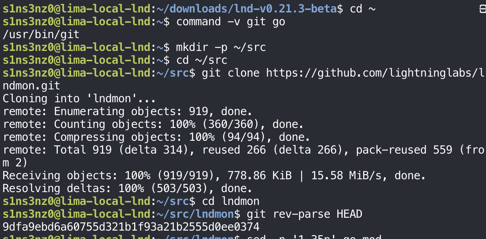
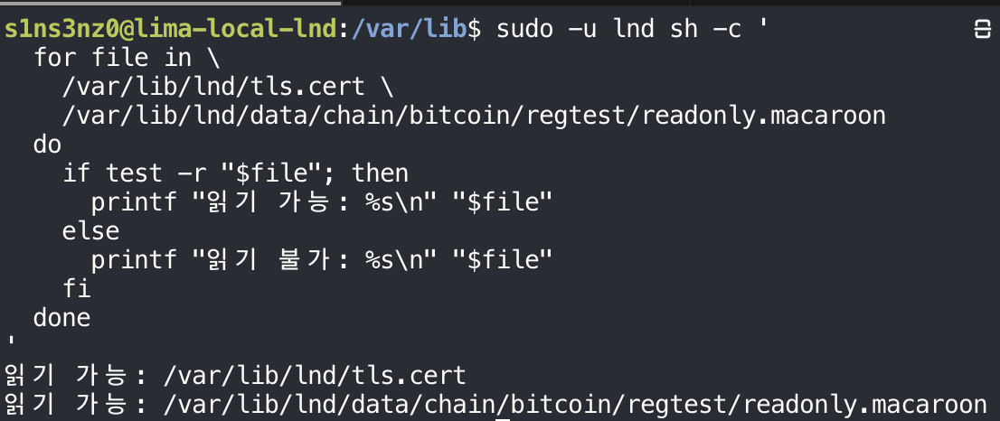
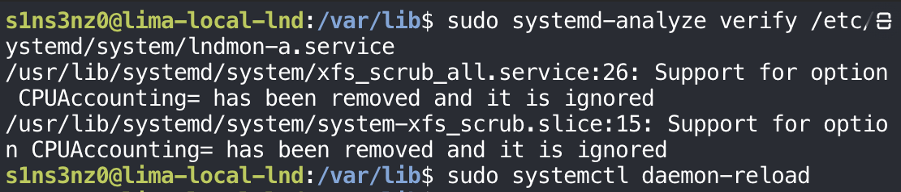
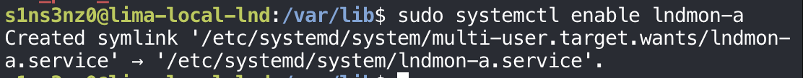
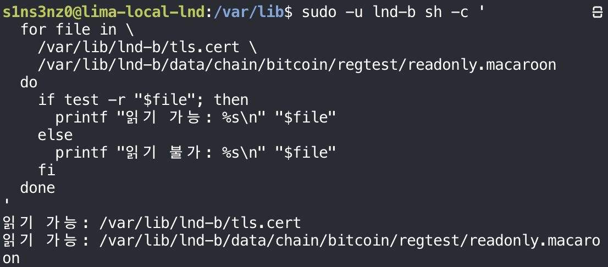
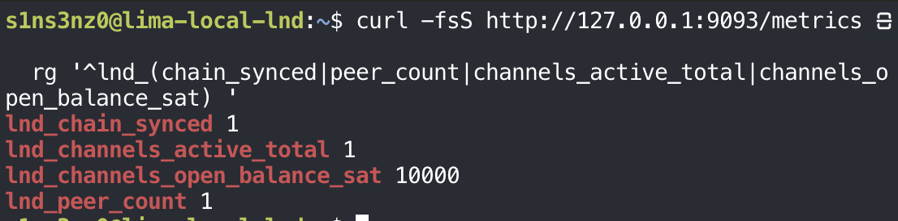
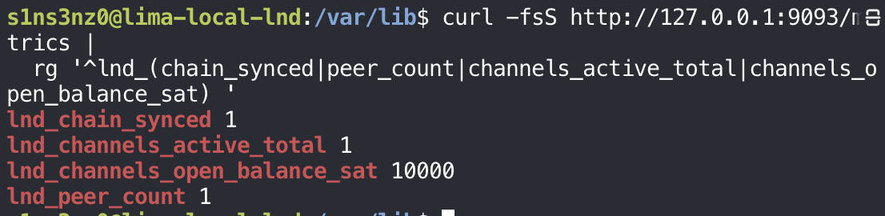

*This series picks up where [Running LND with systemd, Without Containers](/posts/running-lnd-with-systemd-without-containers-channel-payment/) left off: two LND nodes in one Lima VM, `lnc` (A) and `lnb` (B), with an open channel and a settled payment. A holds 986,530 sat in the channel and B holds 10,000.*

The next step is practicing failures: stopping a node, breaking its connection to Bitcoin Core, and seeing how it recovers. Before breaking anything, I want a record of what healthy looks like, so the first part of this series sets up monitoring, with the same rule as before: binaries and systemd, no containers.

The stack has three pieces:

| Piece | Role |
|---|---|
| [lndmon](https://github.com/lightninglabs/lndmon) | Lightning Labs' exporter. It queries an LND node and exposes what it finds as metrics |
| Prometheus | Scrapes those metrics on a schedule and stores them as time series |
| Grafana | Draws dashboards from Prometheus, so the state of each node is visible at a glance |

lndmon on its own doesn't store or display anything; it turns a node's state into numbers Prometheus can collect. Together, the three make it easy to see a node's current status and spot abnormal activity, and later to alert on it. I covered the Kubernetes version of the same idea in [Metrics Collector: Prometheus on LND](/posts/metrics-collector-prometheus-on-lnd/).

## Installing lndmon

### Getting the source

lndmon is built from source, so the first step is the repository:

```bash
cd ~
command -v git go
mkdir -p ~/src
cd ~/src
git clone https://github.com/lightninglabs/lndmon.git
cd lndmon
git rev-parse HEAD
```



| Command | Result | Meaning |
|---|---|---|
| `command -v git go` | Only `/usr/bin/git` | Git is installed; Go isn't yet, and building lndmon will need it |
| `git clone …` | 919 objects | The lndmon repository, into `~/src/lndmon` |
| `git rev-parse HEAD` | `9dfa9eb…0374` | The exact commit being built. Without a release tarball and a signed manifest as in Part 4 of the previous series, recording the commit is how this build can be identified and repeated |

### Building and installing it

With Git already present and Go installed, building lndmon is one `go build`, and installing it is the same `install` used for `bitcoind` and `lnd`:

```bash
command -v git go
git --version
go version

cd ~/src/lndmon
git rev-parse HEAD

go build -mod=readonly -o ./lndmon ./cmd/lndmon

sudo install -o root -g root -m 0755 ./lndmon /usr/local/bin/lndmon

command -v lndmon
lndmon --help
```

<!-- TODO: screenshot of go version / go build, and how Go was installed -->

![Inside ~/src/lndmon: sudo install -o root -g root -m 0755 ./lndmon /usr/local/bin/lndmon; command -v lndmon prints /usr/local/bin/lndmon; lndmon --help prints Usage: lndmon [OPTIONS], then Application Options starting with --primarynode=](../../assets/images/lnd-monitoring/lndmon-installed.png)

`command -v` finds `lndmon` at `/usr/local/bin/lndmon`, and `--help` runs and prints its options, so the binary works.

| Command | Meaning |
|---|---|
| `go version` | Confirm the Go toolchain is installed before building |
| `git rev-parse HEAD` | Confirm the build is from the commit recorded above |
| `go build -mod=readonly -o ./lndmon ./cmd/lndmon` | Compile the `lndmon` command into a single binary. `-mod=readonly` makes the build fail rather than quietly change `go.mod`, so the dependencies are exactly the versions the repository pins |
| `sudo install -o root -g root -m 0755 …` | Put the binary in `/usr/local/bin`, owned by root and read-only to everyone else, like `bitcoind` and `lnd` |
| `command -v lndmon`, `lndmon --help` | Check it's on the `PATH` and runs |

Go compiles lndmon into one self-contained binary, so the build tools stay in my home directory and only the finished `lndmon` goes into `/usr/local/bin`. The service will never need Go or the source tree to run.

### Reading lndmon's options

The full `--help` output shows what lndmon needs to be told:

![lndmon --help: Application Options --primarynode (public key of the primary node in a primary-gateway setup), --disablegraph, --disablehtlc, --disablepayments; prometheus options --prometheus.listenaddr (default localhost:9092), --prometheus.logdir (default /home/s1ns3nz0.guest/.lndmon/logs), --prometheus.maxlogfiles (default 3), --prometheus.maxlogfilesize (default 10); lnd options --lnd.host (default localhost:10009), --lnd.network (regtest, testnet, testnet4, mainnet, simnet, signet; default mainnet), --lnd.macaroondir (default /home/s1ns3nz0.guest/.lnd), --lnd.macaroonname (default readonly.macaroon), --lnd.rpctimeout (default 30s), --lnd.tlspath](../../assets/images/lnd-monitoring/lndmon-help.png)

| Option | Default | What this lab needs |
|---|---|---|
| `--prometheus.listenaddr` | `localhost:9092` | Where lndmon serves its metrics for Prometheus to scrape. Two nodes need two lndmon instances on two ports |
| `--prometheus.logdir` | `~/.lndmon/logs` | A directory the lndmon service account can write to, not my home |
| `--lnd.host` | `localhost:10009` | Node A's gRPC address. Node B's lndmon points at B's own port |
| `--lnd.network` | `mainnet` | `regtest`. The default would be wrong here |
| `--lnd.macaroondir`, `--lnd.macaroonname` | `~/.lnd`, `readonly.macaroon` | Where each node's macaroon is. The default name is already the read-only one, which is all a monitor should hold |
| `--lnd.tlspath` | (none) | Each node's `tls.cert`, so lndmon can verify it's talking to the right LND |
| `--disablegraph`, `--disablehtlc`, `--disablepayments` | Collected | Metric groups that can be turned off. All stay on here |

One port detail is easy to misread. `9092` is lndmon's own metrics port, the address Prometheus scrapes, not Prometheus itself, which serves its own interface on another port. With two nodes in the same VM, two lndmon instances can't both listen on `9092`:

| lndmon for | Watches LND at | Serves metrics on |
|---|---|---|
| Node A (`lnc`) | A's gRPC port | `127.0.0.1:9092`, the default |
| Node B (`lnb`) | B's gRPC port | `127.0.0.1:9093` |

## Connecting lndmon to LND

### The two files lndmon needs

lndmon talks to LND over the same gRPC API `lncli` uses, and that connection is TLS-encrypted. Two files from LND's data directory make it work:

| File | Path | Job |
|---|---|---|
| `tls.cert` | `/var/lib/lnd/tls.cert` | LND's TLS certificate. lndmon uses it to encrypt the connection and to check it's talking to this LND and not something pretending to be it |
| `readonly.macaroon` | `/var/lib/lnd/data/chain/bitcoin/regtest/readonly.macaroon` | The credential lndmon presents on each call. It allows reading the node's state and nothing else |

TLS and the macaroon answer different questions. TLS protects the connection and proves the server's identity; the macaroon proves the client is allowed to ask. Only the certificate leaves LND's directory, never `tls.key`, the private key that goes with it.

Both files were created by LND under `/var/lib/lnd`, the `0700` directory only `lnd` can enter. Before copying them anywhere, I checked that they exist where I expected, as the `lnd` user:

```bash
sudo -u lnd sh -c '
  for file in \
    /var/lib/lnd/tls.cert \
    /var/lib/lnd/data/chain/bitcoin/regtest/readonly.macaroon
  do
    if test -r "$file"; then
      printf "readable: %s\n" "$file"
    else
      printf "not readable: %s\n" "$file"
    fi
  done
'
```



*The script's messages are in Korean in the screenshot; "읽기 가능" means "readable".*

`test -r` is true when the file exists and the current user can read it. Running the loop through `sudo -u lnd sh -c` makes `lnd` the current user, so both `readable` lines confirm the files are there and belong to LND's side. The macaroon sits under the chain and network, `bitcoin/regtest`, because LND keeps separate macaroons per network.

### A first run by hand

Before writing any service, a quick manual run shows whether lndmon can reach LND at all. For this one test I ran it as `lnd`, which can already read both files where they are:

```bash
sudo -u lnd lndmon \
  --lnd.host=127.0.0.1:10009 \
  --lnd.network=regtest \
  --lnd.tlspath=/var/lib/lnd/tls.cert \
  --lnd.macaroondir=/var/lib/lnd/data/chain/bitcoin/regtest \
  --lnd.macaroonname=readonly.macaroon \
  --prometheus.listenaddr=127.0.0.1:9092 \
  --prometheus.logdir=/var/lib/lnd/lndmon-log
```


Every option from the table above is set for node A: its gRPC address, `regtest` instead of the `mainnet` default, its certificate and read-only macaroon, metrics on `127.0.0.1:9092`, and a log directory `lnd` can write to.

| Log line | Meaning |
|---|---|
| `LNDMON: Starting Prometheus exporter...` | lndmon connected to LND and is setting up its metrics endpoint |
| `HTLC: Starting Htlc Monitor` | The HTLC metrics group started |
| `PMNT: Starting payments monitor...` | The payments metrics group started |
| `LNDMON: Prometheus active!` | The endpoint is up on `127.0.0.1:9092`, ready to be scraped |

So lndmon can talk to LND over TLS with the read-only macaroon, and it's serving metrics. Nothing is collecting them yet; that's Prometheus's job, once it's installed.

Running as `lnd` let lndmon read both files in place, without copying anything.

### Checking the metrics endpoint

`Prometheus active!` is lndmon's own claim. With lndmon still running in the first terminal, I opened a second shell into the VM from the Mac and fetched the endpoint directly, the way Prometheus will:

```bash
limactl shell local-lnd
curl -fsS http://127.0.0.1:9092/metrics | head -n 30
```


| Part | Meaning |
|---|---|
| `limactl shell local-lnd` | Open a shell inside the VM from the Mac, since the first terminal is busy with lndmon |
| `curl -fsS` | Fetch quietly (`-s`) but still show errors (`-S`), and fail on an HTTP error (`-f`) |
| `\| head -n 30` | The full output is long; the first 30 lines are enough to see the format |

The endpoint answers in the Prometheus text format covered in [Metrics Collector: Prometheus on LND](/posts/metrics-collector-prometheus-on-lnd/): a `# HELP` line describing each metric, a `# TYPE` line saying whether it's a `gauge`, `counter`, or `summary`, then the values.

These first lines are about lndmon itself rather than the node. Every Go program that exposes Prometheus metrics gets the `go_*` set for free: garbage collection pauses, goroutines, memory. `go_info{version="go1.26.0"}` also records the Go toolchain lndmon was built with. The node's own numbers, its channels, peers, balances, and chain state, come further down the same output, and those are what the dashboard will use.

### The node's own metrics

Filtering out the comments and lndmon's own process metrics leaves what lndmon learned from LND:

```bash
curl -fsS http://127.0.0.1:9092/metrics |
  rg -v '^(#|go_|process_|promhttp_|$)'
```

![curl -fsS http://127.0.0.1:9092/metrics piped into rg -v '^(#|go_|process_|promhttp_|$)' prints lnd_chain_block_height 105, lnd_chain_block_timestamp 1.790925295e+09, lnd_chain_synced 1, lnd_channel_uptime_percentage 1, lnd_channels_active_total 1, lnd_channels_bandwidth_incoming_sat 10000, lnd_channels_bandwidth_outgoing_sat 986530, lnd_channels_commit_fee 2810, lnd_channels_commit_weight 1116, lnd_channels_csv_delay 144, lnd_channels_fee_per_kw 2500, each per-channel metric labeled chan_id="115448720982016", initiator="true", peer="0361b96b…4191", status="active"](../../assets/images/lnd-monitoring/lndmon-node-metrics.png)

`rg -v` prints every line that doesn't match the pattern, so it drops comment lines, blank lines, and the `go_`, `process_`, and `promhttp_` metrics that describe lndmon rather than the node.

Every number here is something the previous series already saw through `lncli` or `bitcoin-cli`, now as a metric:

| Metric | Value | Seen before as |
|---|---:|---|
| `lnd_chain_block_height` | 105 | The height after mining the funding block |
| `lnd_chain_synced` | 1 | `synced_to_chain: true` |
| `lnd_peer_count` | 1 | Node B, the one peer from `listpeers` |
| `lnd_channels_active_total` | 1 | The one open channel |
| `lnd_channels_inactive_total` | 0 | No channel down |
| `lnd_channels_bandwidth_outgoing_sat` | 986,530 | Node A's local balance after the payment |
| `lnd_channels_bandwidth_incoming_sat` | 10,000 | Node A's remote balance, node B's side |
| `lnd_channels_commit_fee` | 2,810 | `commit_fee` from `pendingchannels` |
| `lnd_channels_fee_per_kw` | 2,500 | `fee_per_kw` from `pendingchannels` |
| `lnd_channels_sent_sat` | 10,000 | The one payment sent over this channel so far |
| `lnd_channels_unsettled_balance` | 0 | No payment in flight, the `unsettled_*: 0` from the balance check |
| `lnd_channel_uptime_percentage` | 1 | The channel has been active the whole time lndmon has watched it |
| `lnd_channels_csv_delay` | 144 | Blocks node A would have to wait to spend its own funds after closing the channel unilaterally |

Some of these rows come from further down the same output than the screenshot shows.

Two cautions when reading them. `bandwidth_outgoing_sat` matches the channel balance, but it isn't the most A can pay in one go: the 10,000 sat channel reserve and the commitment fee still limit that, as the previous series showed. And the full output also has network graph statistics, some of which show `NaN` or `1.7976931348623157e+308`, the largest possible floating-point number. Those shouldn't be read as fee values. How lndmon computes those statistics is something to check separately; on a graph of two nodes and one channel they don't describe anything useful yet. I'm not charting them, and the dashboard sticks to the node and channel metrics above.

The per-channel metrics carry labels that identify the channel: `chan_id="115448720982016"` is the short channel ID that `payinvoice` showed as `CHAN_OUT` (block 105, transaction 1, output 0), `peer` is node B's public key, `initiator="true"` says A opened it, and `status="active"`.

These are the numbers the dashboard will chart, and the baseline from the end of the previous series, A at 986,530 sat and B at 10,000, is already in them.

## Running lndmon with systemd

### The unit for node A

With the manual run working, the same command goes into a unit file, `lndmon-a.service`, built like the `bitcoind` and `lnd` units from the previous series:

```bash
sudo tee /etc/systemd/system/lndmon-a.service >/dev/null <<'EOF'
[Unit]
Description=LND A metrics exporter
Wants=lnd.service
After=lnd.service
StartLimitIntervalSec=0

[Service]
Type=simple
User=lnd
Group=lnd
ExecStart=/usr/local/bin/lndmon \
  --lnd.host=127.0.0.1:10009 \
  --lnd.network=regtest \
  --lnd.tlspath=/var/lib/lnd/tls.cert \
  --lnd.macaroondir=/var/lib/lnd/data/chain/bitcoin/regtest \
  --lnd.macaroonname=readonly.macaroon \
  --prometheus.listenaddr=127.0.0.1:9092 \
  --prometheus.logdir=/var/lib/lnd/lndmon-log
Restart=on-failure
RestartSec=5
UMask=0077
NoNewPrivileges=true
ProtectHome=true
ProtectSystem=full

[Install]
WantedBy=multi-user.target
EOF
```

![sudo tee /etc/systemd/system/lndmon-a.service >/dev/null <<'EOF' with [Unit] Description=LND A metrics exporter, Wants=lnd.service, After=lnd.service, StartLimitIntervalSec=0; [Service] Type=simple, User=lnd, Group=lnd, ExecStart=/usr/local/bin/lndmon with --lnd.host=127.0.0.1:10009, --lnd.network=regtest, --lnd.tlspath=/var/lib/lnd/tls.cert, --lnd.macaroondir=/var/lib/lnd/data/chain/bitcoin/regtest, --lnd.macaroonname=readonly.macaroon, --prometheus.listenaddr=127.0.0.1:9092, --prometheus.logdir=/var/lib/lnd/lndmon-log, Restart=on-failure, RestartSec=5, UMask=0077, NoNewPrivileges=true, ProtectHome=true, ProtectSystem=full; [Install] WantedBy=multi-user.target](../../assets/images/lnd-monitoring/lndmon-a-unit.png)

`[Unit]`, how this service relates to others:

| Directive | Meaning |
|---|---|
| `Description=LND A metrics exporter` | The name shown in `systemctl status` and the journal. "A" marks which node it watches, since B gets its own unit |
| `Wants=lnd.service` | Starting lndmon also asks systemd to start node A's LND. There's nothing to monitor without it |
| `After=lnd.service` | Start lndmon after LND's start job. As with LND and `bitcoind`, this orders processes; it doesn't wait for LND's wallet to be unlocked or its gRPC to answer |
| `StartLimitIntervalSec=0` | Turn off systemd's start rate limit. By default, a service that fails and restarts too many times in a short window is given up on. With the limit off, lndmon keeps retrying every 5 seconds until LND is reachable, for example while LND's wallet is still locked |

`[Service]`, how lndmon runs:

| Directive | Meaning |
|---|---|
| `Type=simple` | lndmon stays in the foreground, so the process systemd starts is the service |
| `User=lnd`, `Group=lnd` | Run as LND's account, which can read `tls.cert` and the macaroon in place |
| `ExecStart=… --lnd.host=127.0.0.1:10009` | Node A's gRPC API |
| `--lnd.network=regtest` | Override the `mainnet` default |
| `--lnd.tlspath`, `--lnd.macaroondir`, `--lnd.macaroonname` | The certificate and the read-only macaroon checked above |
| `--prometheus.listenaddr=127.0.0.1:9092` | Serve metrics on loopback, port 9092. Node B's exporter will use 9093 |
| `--prometheus.logdir=/var/lib/lnd/lndmon-log` | lndmon's log files, in a directory `lnd` can write to |
| `Restart=on-failure`, `RestartSec=5` | Restart after a crash or an error exit, 5 seconds later |
| `UMask=0077` | Files lndmon creates, such as its logs, are readable only by `lnd` |
| `NoNewPrivileges=true` | lndmon and its children can never gain privileges |
| `ProtectHome=true` | `/home`, `/root`, and `/run/user` are invisible to it |
| `ProtectSystem=full` | `/usr`, `/boot`, `/efi`, and `/etc` are read-only to it |

`[Install]`:

| Directive | Meaning |
|---|---|
| `WantedBy=multi-user.target` | Once enabled, start it at every normal boot |

Running lndmon as `lnd` is the simple choice: no copies, nothing to keep in sync when LND regenerates its certificate. The trade-off is that lndmon then has everything `lnd` can read, including `admin.macaroon` and the wallet database, even though it only ever uses the read-only macaroon. The tighter version is a separate `lndmon` account holding copies of just `tls.cert` and `readonly.macaroon`, so a compromised exporter couldn't reach anything else. The `ProtectSystem` and `ProtectHome` lines limit what it can do outside `/var/lib/lnd`, but not inside it.

### Checking the unit

The same check as for every unit before it, then a reload so systemd knows the new file:

```bash
sudo systemd-analyze verify /etc/systemd/system/lndmon-a.service
sudo systemctl daemon-reload
```



Nothing in `lndmon-a.service` was flagged. The two warnings are the same Ubuntu XFS units that appeared when verifying `bitcoind.service` and `lnd.service` in the previous series, and `daemon-reload` returned silently.

### Starting it and checking the metrics

With the manual run from earlier stopped, so port 9092 is free again, systemd starts lndmon as a service. `status` shows how it's running, and a narrower `curl` checks the four metrics the first dashboard will lean on:

```bash
sudo systemctl start lndmon-a
sudo systemctl status lndmon-a --no-pager -l
curl -fsS http://127.0.0.1:9092/metrics |
  rg '^lnd_(chain_synced|peer_count|channels_active_total|channels_open_balance_sat) '
```

![sudo systemctl status lndmon-a --no-pager -l: lndmon-a.service - LND A metrics exporter, loaded, disabled, Active: active (running) since Fri 2026-10-02 17:22:35 KST, Main PID 34311 (lndmon), Memory 26.8M, CGroup running /usr/local/bin/lndmon with the options from the unit; the journal shows Started lndmon-a.service, Starting Prometheus exporter, Starting Htlc Monitor, Starting payments monitor, Prometheus active!; curl -fsS http://127.0.0.1:9092/metrics piped into rg prints lnd_chain_synced 1, lnd_channels_active_total 1, lnd_channels_open_balance_sat 986530, lnd_peer_count 1](../../assets/images/lnd-monitoring/lndmon-a-status-metrics.png)

| Line | Meaning |
|---|---|
| `active (running)`, `Main PID: 34311 (lndmon)` | systemd started lndmon and is tracking its process |
| `CGroup: … /usr/local/bin/lndmon --lnd.host=…` | The command line from `ExecStart`, every option intact |
| `Started lndmon-a.service` through `Prometheus active!` | The same startup as the manual run, now in the journal under the service's name |
| `Loaded: … disabled` | Not wired to boot yet, as with `bitcoind` and `lnd` before `enable` |

| Metric | Value | Meaning |
|---|---:|---|
| `lnd_chain_synced` | 1 | Node A is synced to the chain |
| `lnd_peer_count` | 1 | Connected to node B |
| `lnd_channels_active_total` | 1 | The one channel is active |
| `lnd_channels_open_balance_sat` | 986,530 | A's balance across its open channels, the baseline from the previous series |

The trailing space in the `rg` pattern matters: it matches only metric names followed directly by their value, so it skips longer names that start the same way and the labeled per-channel lines. The service-run lndmon reports the same state the manual run did, so node A's exporter is in place.

Then `enable`, so node A's exporter comes back on its own after a reboot:

```bash
sudo systemctl enable lndmon-a
```



The symlink in `multi-user.target.wants/` is the same mechanism as for `bitcoind` in the previous series: at boot, systemd starts everything linked there. Because the unit also says `Wants=lnd.service`, booting into `lndmon-a` pulls in LND too.

### Node B

Node B is the second LND from the previous series, set up the same way under its own account, `lnd-b`, with its data in `/var/lib/lnd-b`. Its exporter follows A's pattern, so the first step is the same file check, now as `lnd-b`:

```bash
sudo -u lnd-b sh -c '
  for file in \
    /var/lib/lnd-b/tls.cert \
    /var/lib/lnd-b/data/chain/bitcoin/regtest/readonly.macaroon
  do
    if test -r "$file"; then
      printf "readable: %s\n" "$file"
    else
      printf "not readable: %s\n" "$file"
    fi
  done
'
```



*As before, "읽기 가능" in the screenshot means "readable".*

Both of node B's files are there and readable by `lnd-b`. They are B's own certificate and macaroon, not copies of A's: each LND generates its own when it first starts, and B's exporter has to present B's macaroon to B's gRPC port.

Then the same manual run as for A, with B's values:

```bash
sudo -u lnd-b lndmon \
  --lnd.host=127.0.0.1:10010 \
  --lnd.network=regtest \
  --lnd.tlspath=/var/lib/lnd-b/tls.cert \
  --lnd.macaroondir=/var/lib/lnd-b/data/chain/bitcoin/regtest \
  --lnd.macaroonname=readonly.macaroon \
  --prometheus.listenaddr=127.0.0.1:9093 \
  --prometheus.logdir=/var/lib/lnd-b/lndmon-log
```


| Option | Node A | Node B |
|---|---|---|
| Run as | `lnd` | `lnd-b` |
| `--lnd.host` | `127.0.0.1:10009` | `127.0.0.1:10010`, B's gRPC port |
| `--lnd.tlspath`, `--lnd.macaroondir` | Under `/var/lib/lnd` | Under `/var/lib/lnd-b` |
| `--prometheus.listenaddr` | `127.0.0.1:9092` | `127.0.0.1:9093` |
| `--prometheus.logdir` | `/var/lib/lnd/lndmon-log` | `/var/lib/lnd-b/lndmon-log` |

Everything that names a node changes; `--lnd.network` and the macaroon name stay the same. The startup log matches A's, ending in `Prometheus active!`.

From a second shell, B's endpoint on 9093:

```bash
curl -fsS http://127.0.0.1:9093/metrics |
  rg '^lnd_(chain_synced|peer_count|channels_active_total|channels_open_balance_sat) '
```



| Metric | Node A (9092) | Node B (9093) |
|---|---:|---:|
| `lnd_chain_synced` | 1 | 1 |
| `lnd_peer_count` | 1 | 1 |
| `lnd_channels_active_total` | 1 | 1 |
| `lnd_channels_open_balance_sat` | 986,530 | 10,000 |

The two exporters describe the two ends of one channel. Both nodes are synced, each has one peer and one active channel, and the balances are the previous series' baseline split exactly: 986,530 sat on A's side, 10,000 on B's. Together they account for the channel's 996,530 sat after the commitment costs.

B's unit is A's with the node-specific values swapped:

![sudo tee /etc/systemd/system/lndmon-b.service >/dev/null <<'EOF' with [Unit] Description=LND B metrics exporter, Wants=lnd-b.service, After=lnd-b.service, StartLimitIntervalSec=0; [Service] Type=simple, User=lnd-b, Group=lnd-b, ExecStart=/usr/local/bin/lndmon with --lnd.host=127.0.0.1:10010, --lnd.network=regtest, --lnd.tlspath=/var/lib/lnd-b/tls.cert, --lnd.macaroondir=/var/lib/lnd-b/data/chain/bitcoin/regtest, --lnd.macaroonname=readonly.macaroon, --prometheus.listenaddr=127.0.0.1:9093, --prometheus.logdir=/var/lib/lnd-b/lndmon-log, Restart=on-failure, RestartSec=5, UMask=0077, NoNewPrivileges=true, ProtectHome=true, ProtectSystem=full; [Install] WantedBy=multi-user.target](../../assets/images/lnd-monitoring/lndmon-b-unit.png)

| Directive | `lndmon-a.service` | `lndmon-b.service` |
|---|---|---|
| `Description` | `LND A metrics exporter` | `LND B metrics exporter` |
| `Wants`, `After` | `lnd.service` | `lnd-b.service`, node B's own LND unit |
| `User`, `Group` | `lnd` | `lnd-b` |
| `ExecStart` options | A's host, files, port 9092 | B's host, files, port 9093, as in the manual run |

Everything else, the restart policy, `StartLimitIntervalSec=0`, and the four hardening lines, is identical, and means the same as in A's tables. Each exporter depends on its own node's LND, so stopping node B later will affect `lndmon-b` and leave `lndmon-a` alone.

Then the same steps as for A, with the manual run stopped first so port 9093 is free:

```bash
sudo systemd-analyze verify /etc/systemd/system/lndmon-b.service
sudo systemctl daemon-reload
sudo systemctl start lndmon-b
systemctl status lndmon-b --no-pager
```

![sudo systemd-analyze verify /etc/systemd/system/lndmon-b.service prints only the two known xfs_scrub CPUAccounting= warnings; daemon-reload and start lndmon-b print nothing; systemctl status lndmon-b --no-pager shows lndmon-b.service - LND B metrics exporter, loaded, disabled, Active: active (running) since Fri 2026-10-02 17:30:24 KST, Main PID 34686 (lndmon), Memory 26.2M, with the CGroup command line and the journal lines cut off with ellipses and a Hint: Some lines were ellipsized, use -l to show in full](../../assets/images/lnd-monitoring/lndmon-b-verify-start-status.png)

`verify` flagged nothing new, and `lndmon-b` is `active (running)` as its own process, PID 34686, next to A's exporter.

This `status` ran without `-l`, and it shows why that flag has been on every other `status` in these series: long lines are cut off with `…`, including the command line and the journal messages, and systemd prints a hint to use `-l`. The start-up messages can still be read in full with `journalctl -u lndmon-b`.

The service-run exporter on 9093 reports what the manual run did:

```bash
curl -fsS http://127.0.0.1:9093/metrics |
  rg '^lnd_(chain_synced|peer_count|channels_active_total|channels_open_balance_sat) '
```



Synced, one peer, one active channel, 10,000 sat on B's side. Both exporters now run under systemd, A's on 9092 and B's on 9093, ready for Prometheus to scrape.

<!-- TODO: lndmon-b enable (still disabled) -->

## Where this part ends

Both nodes now export their state as Prometheus metrics, each from its own lndmon service on loopback: node A on `127.0.0.1:9092`, node B on `127.0.0.1:9093`. The numbers match what `lncli` showed at the end of the previous series. Nothing is collecting them yet; that's Prometheus, in the next part.

Next: [Scraping lndmon with Prometheus](/posts/monitoring-lnd-with-systemd-without-containers-prometheus/).
