I use a private container-image repository for the Hoodi Node Validator. To implement defense in depth, I considered multiple security controls. Because I run this validator on AWS, I fully leverage AWS services such as CodeBuild and ECR.

You can use other solutions to host private repositories. Cost, availability within your network, and integration with your existing security controls are useful evaluation criteria.

## 1. Security Context

This EKS environment is designed as a private operating environment. Its purpose is not merely to hide workloads from the Internet. It is to minimize external access points across the full path from source selection to a running Kubernetes container.
```text
Source code or an approved upstream image is verified through the following stages:
1. GitHub review and CI workflow
2. AWS identity and build/signing services
3. private ECR artifact storage
4. private EKS image retrieval
5. Kubernetes admission
6. running validator or node workload
```
An attacker may target any point on that path. For example:

1. An upstream image tag is changed after the team reviewed it.
2. A GitHub Actions credential is stolen and used to publish a malicious image.
3. A workflow is changed to bypass source-digest validation.
4. A tag in ECR is replaced with new content.
5. A release-signing private key is exposed to CI or a build environment.
6. A worker node retrieves a public image rather than the approved private image.
7. An internal image is pulled through an unnecessary public network route.
8. A user with Kubernetes access submits a noncompliant Pod directly.
9. A vulnerable component is introduced into a runtime image.
10. A critical image or release artifact is deleted or cannot be recovered during an incident.

The design uses multiple controls because no single control prevents all of these situations.

---

## 2. CIA Security Objectives

Let’s review the CIA questions from [Private EKS Security Design Review](https://miata.cloud/posts/securing-a-hoodi-ethereum-testnet-validator-on-aws-eks/).

- **Confidentiality:** Can unauthorized people read sensitive information?
- **Integrity:** Can unauthorized people alter software, configuration, or operational decisions?
- **Availability:** Can authorized users and systems still perform their required work?

For private ECR delivery, those questions apply as follows.

| CIA objective | What must be protected | Example failure | Main controls |
|---|---|---|---|
| Confidentiality | Private images, build artifacts, release evidence, internal registry metadata, signing keys, AWS access paths | A release archive or signing key becomes available to an unauthorized CI workflow | Private ECR, KMS, S3 encryption, IAM least privilege, Vault Transit, private VPC endpoints |
| Integrity | Source image identity, image contents, ECR tag history, deployment manifests, runtime workloads | A reviewed image tag is replaced with malicious content before EKS starts it | SHA-256 digest pinning, approved-source allowlists, destination digest comparison, immutable ECR tags, GitHub OIDC, Kyverno |
| Availability | ECR image retrieval, release evidence recovery, workload startup, node connectivity | A private node cannot pull the required runtime image during replacement or recovery | ECR, node ECR-read access, ECR/S3 VPC endpoints, S3 versioning, lifecycle retention |

The design is defense in depth. One failed control should not automatically allow an attacker to deploy arbitrary software.

For example:
```text
A GitHub review mistake does not automatically mean a public unpinned image can run, because Kyverno can still reject it.
```

Likewise:
```text
An ECR image scan finding does not itself stop a deployment, so it must be combined with CI gates, review policy, immutable artifact identity, and Kubernetes admission controls.
```

---

## 3. Prerequisites for Private ECR Workloads in EKS

A private EKS workload can run a private ECR image only when several independent components are configured correctly.

| Requirement | Why it is necessary | Repository-aligned configuration evidence |
|---|---|---|
| Private ECR repository | Stores approved images under AWS account control | `aws_ecr_repository` |
| Immutable tags | Prevents a published tag from later being overwritten | `image_tag_mutability = "IMMUTABLE"` |
| Image scanning | Detects known vulnerabilities when an image is pushed | `image_scanning_configuration { scan_on_push = true }` |
| Encryption at rest | Protects image layers and metadata in storage | `encryption_configuration`, `encryption_type = "KMS"` |
| EKS node ECR permission | Allows kubelet to pull an image before the Pod starts | `AmazonEC2ContainerRegistryReadOnly` attached to node role |
| ECR private connectivity | Lets private nodes contact ECR API and registry services | VPC interface endpoints for `ecr.api` and `ecr.dkr` |
| S3 private connectivity | Supports the image-layer retrieval path | S3 gateway endpoint |
| Digest-pinned manifest | Identifies exact image content for runtime | `image: ...@sha256:<digest>` |
| Kubernetes admission control | Blocks noncompliant images before execution | Kyverno private-ECR digest validation |
| Controlled publishing identity | Limits who may publish private images | GitHub OIDC trust policy and repository-scoped ECR actions |

The runtime image must be referred to by digest:

```yaml
image: >-
  <AWS_ACCOUNT_ID>.dkr.ecr.ap-northeast-2.amazonaws.com/
  node-operator-node-runtime-prysm-beacon@sha256:<IMAGE_DIGEST>
```

This is different from:

```yaml
image: node-operator-node-runtime-prysm-beacon:v7.1.8
```

The first identifies specific content. The second names a tag, which is a label even if the repository is configured for immutable tags.

---

## 4. Integrated Delivery Workflow

```mermaid
flowchart LR
  subgraph Source["External source boundary"]
    Dev["Developer change"]
    Upstream["Approved upstream image<br/>SHA-256 digest"]
  end

  subgraph GitHub["GitHub control plane"]
    Review["Pull request review"]
    CI["CI checks<br/>policy and scan evidence"]
    OIDC["Short-lived OIDC token"]
  end

  subgraph AWS["Private AWS delivery boundary"]
    IAM["Scoped IAM role"]
    Build["CodeBuild<br/>sign or verify"]
    Vault["Vault Transit<br/>key custody"]
    S3["Encrypted, versioned<br/>S3 evidence"]
    ECR["Private ECR<br/>immutable artifact"]
  end

  subgraph EKS["Private EKS runtime boundary"]
    Endpoints["ECR and S3<br/>VPC endpoints"]
    Kubelet["Node IAM + kubelet<br/>pulls image by digest"]
    Admission["Kyverno admission<br/>private ECR + digest"]
    Pod["Hardened workload Pod"]
  end

  Dev --> Review --> CI
  Upstream -->|"source digest"| CI
  CI -->|"approved mirror"| ECR
  CI --> OIDC --> IAM
  IAM -->|"scoped authority"| Build
  Build <-->|"sign or verify"| Vault
  Build -->|"evidence"| S3
  Build -->|"approved release"| ECR
  ECR -->|"scan on push"| CI
  ECR --> Endpoints --> Kubelet
  Kubelet -->|"requested image"| Admission -->|"allow"| Pod

  classDef gate fill:#e8f4fd,stroke:#1a73a8,color:#0b3954
  classDef store fill:#eef7e8,stroke:#4f7c3f,color:#1f4d1b
  classDef runtime fill:#fff3e0,stroke:#b26a00,color:#6b3d00
  class Review,CI,OIDC,IAM,Admission gate
  class Vault,S3,ECR store
  class Endpoints,Kubelet,Pod runtime
```



The workflow contains different resource types:

| Resource type | Examples | Main role |
|---|---|---|
| Human and source boundary | Developer, Git repository, upstream registry | Proposes source or configuration change |
| CI control plane | GitHub Actions, pull-request review | Reviews, orchestrates, validates, and mirrors |
| Identity control | GitHub OIDC token, IAM role | Converts trusted CI identity into temporary AWS permission |
| Build and signing environment | CodeBuild, Vault Transit | Performs high-trust release work without exposing key material |
| Artifact storage | ECR, S3 | Stores images and release evidence |
| Encryption service | KMS | Protects data at rest |
| Network control | VPC endpoints | Provides private service connectivity |
| Cluster runtime | Kubernetes API, kubelet, Pods | Admits, pulls, and executes workloads |
| Admission control | Kyverno | Makes final allow-or-deny decisions before Pod creation |

---

## 5. Source Selection, Approval, and Digest Mirroring

### General concept

An upstream image is not trusted merely because it comes from a recognized publisher. The delivery process must identify an exact source image, review it, ensure it is eligible for use, and preserve that content identity through mirroring and deployment.

A tag can be changed. A digest cannot identify different content without changing value. The following is an example of a tag reference:

```text
offchainlabs/prysm-validator:v7.1.8
```

The recommended approach is an immutable content reference:

```text
offchainlabs/prysm-validator@sha256:<DIGEST>
```

### Purpose
This control primarily protects integrity.
It reduces the risk of:

- upstream tag movement after approval;
- use of an unreviewed image;
- publishing a source image from an unexpected publisher;
- destination ECR content differing from the reviewed source;
- accidental image substitution during workflow execution.

### How it is applied

The validator-client mirror workflow receives a digest-pinned image input and validates both its expected publisher and its inclusion in the reviewed allowlist.

```yaml
on:
  workflow_dispatch:
    inputs:
      source_image:
        description: Reviewed immutable Prysm validator image digest
        required: true
        type: string

permissions:
  contents: read
  id-token: write

jobs:
  mirror:
    runs-on: ubuntu-24.04
    environment: validator-client-ecr-mirror
```

The source digest is validated before mirroring:
```bash
set -euo pipefail

[[ "$SOURCE_IMAGE" =~ \
  ^offchainlabs/prysm-validator@sha256:[a-f0-9]{64}$ ]] ||
  { echo "Expected an immutable Prysm digest"; exit 1; }

jq -e --arg source "$SOURCE_IMAGE" \
  '.images[] |
   select(
     .source == $source and
     .mirror_eligible == true and
     .release_channel == "upstream-mirror" and
     .provenance_status == "upstream-release-mirror"
   )' \
  .ci/validator/approved-client-images.json >/dev/null ||
  { echo "Source is not approved"; exit 1; }
```

The image is copied into private ECR:
```bash
docker buildx imagetools create \
  --tag "$DESTINATION_IMAGE" \
  "$SOURCE_IMAGE"
```

Then the workflow retrieves the digest from ECR and compares it to the reviewed source digest:
```bash
digest="$(aws ecr describe-images \
  --region "$AWS_REGION" \
  --repository-name node-operator-baseline-validator-prysm \
  --image-ids "imageTag=${SOURCE_IMAGE#*@sha256:}" \
  --query 'imageDetails[0].imageDigest' \
  --output text)"

[[ "$digest" =~ ^sha256:[a-f0-9]{64}$ ]] || exit 1
test "$digest" = "${SOURCE_IMAGE#*@}"
```

The last command is the integrity check. It verifies that the content stored in private ECR is the same content that was reviewed upstream.

---

## 6. GitHub OIDC Identity and Least-Privilege Publishing

### General concept

GitHub Actions should not use permanent AWS access keys. Instead, GitHub provides a short-lived OIDC token to a workflow, and AWS IAM grants temporary credentials only if the token satisfies the role’s trust policy.

### Purpose

This reduces the risk that a stolen CI credential remains valid indefinitely.

It also lets AWS restrict a role to:

- one GitHub organization or repository;
- one environment;
- one branch or release context;
- one intended publishing workflow;
- one or more named ECR repositories.

### How it is applied

The IAM trust relationship allows `sts:AssumeRoleWithWebIdentity` only for GitHub’s OIDC provider and the approved environment subject.

```hcl
data "aws_iam_policy_document" "github_validator_mirror_assume_role" {
  statement {
    actions = ["sts:AssumeRoleWithWebIdentity"]

    principals {
      type = "Federated"

      identifiers = [
        "arn:aws:iam::<AWS_ACCOUNT_ID>:oidc-provider/token.actions.githubusercontent.com"
      ]
    }

    condition {
      test     = "StringEquals"
      variable = "token.actions.githubusercontent.com:aud"
      values   = ["sts.amazonaws.com"]
    }

    condition {
      test     = "StringEquals"
      variable = "token.actions.githubusercontent.com:sub"

      values = [
        "repo:<ORGANIZATION>/node-operator:environment:validator-client-ecr-mirror"
      ]
    }
  }
}
```

The GitHub workflow obtains the short-lived OIDC token and exchanges it for temporary STS credentials:
```bash
token="$(curl --fail --silent \
  -H "Authorization: bearer $ACTIONS_ID_TOKEN_REQUEST_TOKEN" \
  "$ACTIONS_ID_TOKEN_REQUEST_URL&audience=sts.amazonaws.com" |
  jq -er .value)"

aws sts assume-role-with-web-identity \
  --role-arn "$AWS_ROLE_ARN" \
  --role-session-name "prysm-mirror-${GITHUB_RUN_ID}" \
  --web-identity-token "$token" \
  --duration-seconds 900 > "$RUNNER_TEMP/creds.json"
```

The OIDC session duration is limited to 900 seconds in this example.
If you do not need to handle the OIDC token directly, use the GitHub Actions AWS credentials action instead.

```yaml
steps:
  - uses: actions/checkout@<FULL_COMMIT_SHA>
    with:
      persist-credentials: false

  - name: Configure temporary AWS credentials
    uses: aws-actions/configure-aws-credentials@<FULL_COMMIT_SHA>
    with:
      role-to-assume: ${{ vars.VALIDATOR_CLIENT_ECR_MIRROR_ROLE_ARN }}
      aws-region: ap-northeast-2
      role-duration-seconds: 900
      role-session-name: prysm-mirror-${{ github.run_id }}
      allowed-account-ids: ${{ vars.AWS_ACCOUNT_ID }}
      unset-current-credentials: true
```

The corresponding publishing policy gives ECR upload rights only to the intended repositories:
```hcl
data "aws_iam_policy_document" "github_validator_mirror" {
  statement {
    actions   = ["ecr:GetAuthorizationToken"]
    resources = ["*"]
  }

  statement {
    actions = [
      "ecr:BatchCheckLayerAvailability",
      "ecr:BatchGetImage",
      "ecr:CompleteLayerUpload",
      "ecr:DescribeImages",
      "ecr:InitiateLayerUpload",
      "ecr:PutImage",
      "ecr:UploadLayerPart",
    ]

    resources = [
      aws_ecr_repository.validator_client.arn,
      aws_ecr_repository.validator_signing_fence.arn,
    ]
  }
}
```

`ecr:GetAuthorizationToken` uses `Resource = "*"`, because AWS requires that scope for the authorization-token API. It does not, by itself, permit writes to every repository. The write actions remain constrained by the named repository ARNs.

---

## 7. Private ECR Artifact Controls

### General concept

Amazon ECR is the private artifact boundary between CI, trusted build jobs, and EKS workloads. It is where the approved image is stored before the kubelet retrieves it.

### Purpose

Private ECR provides:

- account-controlled storage for approved images;
- a location for scanning and retention policy;
- an IAM authorization boundary;
- a private service endpoint for node image pulls;
- a place to enforce tag immutability;
- encrypted-at-rest artifact storage.

### How it is applied

The repository provisions runtime and mirror repositories with immutable tag settings, vulnerability scanning, and KMS encryption where configured.

```hcl
resource "aws_ecr_repository" "validator_client" {
  name                 = "node-operator-validator-prysm"
  image_tag_mutability = "IMMUTABLE"

  encryption_configuration {
    encryption_type = "KMS"
    kms_key         = aws_kms_key.validator_client_ecr.arn
  }

  image_scanning_configuration {
    scan_on_push = true
  }

  tags = {
    Purpose = "private-prysm-validator-image"
  }
}
```

| Field | Security meaning |
|---|---|
| `image_tag_mutability = "IMMUTABLE"` | Prevents replacing an existing tag with new content |
| `encryption_type = "KMS"` | Encrypts ECR image layers and metadata at rest |
| `kms_key` | Identifies the controlled encryption key |
| `scan_on_push = true` | Starts ECR vulnerability scanning when an image is pushed |
| `Purpose` tag | Improves operator inventory and control ownership |

ECR immutability protects tags, but the strongest deployment identity still comes from a digest-pinned workload manifest.

```yaml
image: <PRIVATE_ECR_REPOSITORY>@sha256:<DIGEST>
```

This is stronger than relying only on an immutable tag because the Kubernetes manifest directly requests the exact image content.

### Artifact retention and accidental deletion

ECR lifecycle rules can remove old images according to retention needs. Critical production image repositories should retain enough historical images to support rollback and incident investigation.

Terraform-level deletion protection can also be applied:

```hcl
lifecycle {
  prevent_destroy = true
}
```

This does not prevent normal image lifecycle cleanup, but it prevents an accidental Terraform destroy from removing the repository resource without deliberate intervention.

---

## 8. Vulnerability Detection, SBOMs, Provenance, and Attestation

### General concept

Several controls answer different questions:

| Control | Question answered |
|---|---|
| ECR scan on push | Does the pushed image contain known reported vulnerabilities? |
| Grype scan | Does the image or its SBOM contain known vulnerable packages? |
| SBOM | Which components are included in the artifact? |
| Provenance | How and from where was the artifact created? |
| Source/destination digest comparison | Is the private image identical to the reviewed source image? |
| Cosign signature or attestation | Did an expected signing identity produce or attest to this artifact? |

These controls should not be treated as interchangeable.

For example, an image may have no currently known vulnerability but still be unauthorized. Conversely, an approved source image may have known vulnerabilities that need a risk decision.

### How it is applied

The repository enables ECR scan on push for applicable ECR repositories:

```hcl
image_scanning_configuration {
  scan_on_push = true
}
```

Selected workflows also generate SBOMs, run Grype, and produce signing or attestation evidence.

A typical conceptual sequence is:

```text
Build or mirror image
→ generate SBOM
→ scan image or SBOM
→ create provenance
→ sign or attest selected artifact
→ publish private ECR image
→ ECR performs scan on push
```

### Important limitation

ECR scan-on-push is a detection control. It does not automatically mean:

```text
vulnerability found
→ Kubernetes deployment blocked
```

That blocking behavior must be implemented through CI policy, GitOps policy, or admission controls.

Likewise, Grype, SBOM, and Cosign use are workflow-specific. They are not demonstrated as one universal mandatory process for every mirrored upstream runtime image.

The repository does not show a universal Trivy deployment. Grype exists for selected images and release flows, so scan coverage should be reviewed image by image rather than assumed to be identical across all workloads.

---

## 9. CodeBuild, Vault Transit, and High-Trust Release Operations

### Why CodeBuild is useful

GitHub Actions is useful for review integration, workflow orchestration, mirroring, and standard CI checks. CodeBuild becomes useful when an operation requires a controlled AWS execution environment, private network access, AWS-native workload identity, Vault access, or signing-key separation.

In this repository, CodeBuild is relevant to higher-trust activities such as:

- release signing;
- GitOps bootstrap or validation;
- Vault bootstrap-related operations;
- private CD or validation runner activity;
- processing release inputs and writing durable evidence.

### What CodeBuild does in this architecture

```text
GitHub prepares an approved release input
→ input is stored in encrypted, versioned S3
→ CodeBuild downloads one exact S3 version
→ CodeBuild authenticates to Vault using AWS identity
→ Vault Transit signs or verifies material
→ CodeBuild saves signed evidence to encrypted S3
→ approved output becomes available for release or deployment
```

### IaC implementation

```hcl
resource "aws_codebuild_project" "release_signer" {
  name          = "node-operator-release-signer"
  service_role  = aws_iam_role.release_codebuild_signer.arn
  build_timeout = 30

  artifacts {
    type                = "S3"
    location            = aws_s3_bucket.release_artifacts.id
    path                = "release-signer-output"
    name                = "release-signer-output.zip"
    namespace_type      = "BUILD_ID"
    packaging           = "ZIP"
    encryption_disabled = false
  }

  environment {
    compute_type                = "BUILD_GENERAL1_SMALL"
    image                       = var.release_signer_image
    type                        = "LINUX_CONTAINER"
    privileged_mode             = false
    image_pull_credentials_type = "SERVICE_ROLE"

    environment_variable {
      name  = "VAULT_ADDR"
      value = var.vault_signer_endpoint
    }

    environment_variable {
      name  = "VAULT_AUTH_ROLE"
      value = var.vault_signer_auth_role
    }

    environment_variable {
      name  = "VAULT_CA_CERT"
      value = data.aws_secretsmanager_secret.vault_client_ca.arn
      type  = "SECRETS_MANAGER"
    }
  }

  vpc_config {
    vpc_id             = var.vpc_id
    subnets            = var.release_signer_subnet_ids
    security_group_ids = [aws_security_group.release_signer.id]
  }

  source {
    type      = "S3"
    location  = "${aws_s3_bucket.release_artifacts.id}/release-input/input.zip"
    buildspec = "buildspec-release-sign.yml"
  }
}
```

| Field | Security role |
|---|---|
| `service_role` | Gives CodeBuild a dedicated AWS identity |
| `image` | Uses the designated private build image |
| `privileged_mode = false` | Avoids unnecessary Docker daemon privilege for signing work |
| `image_pull_credentials_type = "SERVICE_ROLE"` | Uses CodeBuild’s AWS identity for private image pull |
| `vpc_config` | Places the job in designated VPC subnets and security groups |
| `VAULT_ADDR` | Identifies the Vault endpoint, rather than embedding key material |
| `VAULT_AUTH_ROLE` | Identifies the Vault policy context |
| `SECRETS_MANAGER` certificate reference | Supplies TLS material through a managed secret reference |
| encrypted S3 artifact configuration | Protects output evidence at rest |

### Vault Transit’s role

Vault Transit performs cryptographic operations without exporting the private key.

```text
CodeBuild sends data to Vault Transit
→ Vault checks CodeBuild’s authenticated identity and policy
→ Vault uses the protected private key internally
→ Vault returns a signature or verification result
→ CodeBuild stores the result, not the private key
```

This is important separation of duties:

- CodeBuild can perform release processing.
- Vault owns signing key custody.
- GitHub Actions orchestrates but does not need the private key.
- EKS workloads consume approved artifacts but do not need signing authority.

CodeBuild should not automatically be treated as private or Internet-isolated merely because it is CodeBuild. Each project’s VPC, route table, security group, endpoint, and source configuration must be evaluated individually.

---

## 10. Encrypted and Versioned Release Artifacts

### General concept

Release inputs, signatures, provenance, build outputs, and verification evidence are operationally important. They may be needed to investigate an incident, prove which release was deployed, or reproduce a signing decision.

### Purpose

S3 versioning supports integrity and recovery. KMS encryption supports confidentiality.

### IaC implementation

```hcl
resource "aws_s3_bucket_versioning" "release_artifacts" {
  bucket = aws_s3_bucket.release_artifacts.id

  versioning_configuration {
    status = "Enabled"
  }
}

resource "aws_s3_bucket_server_side_encryption_configuration" "release_artifacts" {
  bucket = aws_s3_bucket.release_artifacts.id

  rule {
    apply_server_side_encryption_by_default {
      kms_master_key_id = aws_kms_key.release_artifacts.arn
      sse_algorithm     = "aws:kms"
    }
  }
}
```

| Field | Security role |
|---|---|
| `status = "Enabled"` | Preserves earlier object versions for recovery and investigation |
| `kms_master_key_id` | Uses the designated KMS key to encrypt artifacts |
| `sse_algorithm = "aws:kms"` | Requires KMS-backed server-side encryption |

A versioned release workflow can identify a specific S3 object version as CodeBuild input. This prevents ambiguity about which release archive the job actually processed.

---

## 11. Private EKS Image Retrieval

### General concept

Kubernetes Pods do not normally pull an ECR image themselves. The kubelet on the assigned EKS worker node retrieves the image before the container starts.

The expected sequence is:

```text
Deployment or StatefulSet references private ECR image by digest
→ Kubernetes scheduler chooses worker node
→ node kubelet obtains ECR authorization using node IAM role
→ kubelet contacts ECR private endpoints
→ image layers are retrieved through AWS service path
→ kubelet verifies and unpacks layers
→ container runtime starts the requested image
```

### EKS node authorization

The node role is assigned the ECR read-only managed policy:

```hcl
resource "aws_iam_role_policy_attachment" "node_ecr_read_only" {
  role       = aws_iam_role.nodes.name
  policy_arn = "arn:aws:iam::aws:policy/AmazonEC2ContainerRegistryReadOnly"
}
```

This permission should belong to the worker node identity because the kubelet performs image retrieval. It should not be broadly granted to each workload service account.

### Private network path

The VPC provides private connectivity to ECR API and registry endpoints:

```hcl
resource "aws_vpc_endpoint" "ecr_api" {
  vpc_id             = var.vpc_id
  service_name       = "com.amazonaws.ap-northeast-2.ecr.api"
  vpc_endpoint_type  = "Interface"
  subnet_ids         = var.private_subnet_ids
  security_group_ids = [aws_security_group.vpc_endpoints.id]
}

resource "aws_vpc_endpoint" "ecr_dkr" {
  vpc_id             = var.vpc_id
  service_name       = "com.amazonaws.ap-northeast-2.ecr.dkr"
  vpc_endpoint_type  = "Interface"
  subnet_ids         = var.private_subnet_ids
  security_group_ids = [aws_security_group.vpc_endpoints.id]
}

resource "aws_vpc_endpoint" "s3" {
  vpc_id            = var.vpc_id
  service_name      = "com.amazonaws.ap-northeast-2.s3"
  vpc_endpoint_type = "Gateway"
  route_table_ids   = var.private_route_table_ids
}
```

| Endpoint | Role in image retrieval |
|---|---|
| `ecr.api` | Supports ECR API operations, including image authorization and metadata calls |
| `ecr.dkr` | Supports Docker/OCI registry operations |
| S3 gateway endpoint | Supports the AWS image-layer retrieval path |
| Security group on endpoint | Limits which network sources can reach the private endpoint |
| Private route table | Directs traffic to the S3 gateway endpoint |

Private endpoints reduce unnecessary public exposure. They do not eliminate the need for node IAM restrictions, endpoint policy, security-group restrictions, and careful route-table design.

---

## 12. Kubernetes Admission and Runtime Enforcement

### General concept

CI controls protect the artifact path before deployment. Kubernetes admission control protects the final decision point: whether the Kubernetes API will create a workload object.

This matters because a normal GitOps workflow can be bypassed by:

- an overprivileged Kubernetes identity;
- a manually submitted manifest;
- a configuration mistake;
- an automation path outside the expected CI workflow;
- a compromised GitOps controller.

### Private registry and digest policy

The updated Kyverno baseline applies its private-ECR and SHA-256 digest requirements across workload namespaces.

```yaml
apiVersion: kyverno.io/v1
kind: ClusterPolicy
metadata:
  name: workload-baseline
spec:
  validationFailureAction: Enforce
  background: false

  rules:
    - name: require-private-ecr-image-digest
      match:
        any:
          - resources:
              kinds:
                - Pod
      validate:
        message: >-
          Containers must use a private ECR image pinned to a SHA-256 digest.
        foreach:
          - list: request.object.spec.containers[]
            pattern:
              image: >-
                <AWS_ACCOUNT_ID>.dkr.ecr.ap-northeast-2.amazonaws.com/
                *@sha256:????????????????????????????????????????????????????????????????
```

This should reject a public or tag-only image reference:

```yaml
image: docker.io/library/nginx:latest
```

This is the intended accepted pattern:

```yaml
image: >-
  <AWS_ACCOUNT_ID>.dkr.ecr.ap-northeast-2.amazonaws.com/
  node-operator-node-runtime-prysm-beacon@sha256:<DIGEST>
```

### Host isolation

The baseline blocks host-level namespaces and hostPath volumes unless a deliberately scoped exception is configured:

```yaml
- name: deny-host-namespaces-and-host-paths
  validate:
    deny:
      conditions:
        any:
          - key: "{{ request.object.spec.hostNetwork || `false` }}"
            operator: Equals
            value: true
          - key: "{{ request.object.spec.hostPID || `false` }}"
            operator: Equals
            value: true
          - key: "{{ request.object.spec.hostIPC || `false` }}"
            operator: Equals
            value: true
          - key: "{{ (request.object.spec.volumes || `[]`)[?hostPath] | length(@) }}"
            operator: GreaterThan
            value: 0
```

This reduces the chance that a compromised container can directly interact with the worker node.

### Pod and container hardening

The policy requires a restricted Pod-level security context:

```yaml
securityContext:
  runAsNonRoot: true
  seccompProfile:
    type: RuntimeDefault
```

And a restricted container context:

```yaml
securityContext:
  runAsNonRoot: true
  privileged: false
  allowPrivilegeEscalation: false
  readOnlyRootFilesystem: true
  capabilities:
    drop:
      - ALL
```

It also requires resource requests and limits:

```yaml
resources:
  requests:
    cpu: "1"
    memory: "2Gi"
  limits:
    cpu: "2"
    memory: "4Gi"
```

| Control | Security effect |
|---|---|
| `runAsNonRoot` | Reduces direct root execution in the container |
| `RuntimeDefault` seccomp | Restricts dangerous system calls |
| `privileged: false` | Prevents privileged-container mode |
| `allowPrivilegeEscalation: false` | Restricts privilege transitions |
| `readOnlyRootFilesystem: true` | Reduces runtime filesystem modification |
| `drop: ALL` | Removes default Linux capabilities |
| resource requests and limits | Reduces resource exhaustion and unpredictable scheduling |

---

## 13. Namespace-Wide Kyverno Enforcement

Kyverno workload baseline policies are applied across all workload namespaces. This makes private-image and Pod-hardening requirements consistent cluster-wide admission controls.

The admission sequence is:

```text
Pod submitted to a protected workload namespace
→ Kyverno evaluates the workload
→ private ECR registry is required
→ SHA-256 image digest is required
→ host namespace and hostPath use are rejected
→ restricted Pod and container security context is required
→ CPU and memory requests and limits are required
→ compliant workload is admitted
```

The baseline controls are:

```text
Private ECR image reference
+ immutable SHA-256 digest
+ non-root container execution
+ RuntimeDefault seccomp
+ no privileged container
+ no privilege escalation
+ read-only root filesystem
+ all Linux capabilities dropped
+ no host network, host PID, host IPC, or hostPath
+ CPU and memory requests and limits
```

This ensures that workloads such as execution clients, consensus clients, validator clients, signing components, databases, and supporting operational services receive the same final Kubernetes admission checks before they run.

Some operational components may require deliberately scoped exceptions. For example, a node-log collector that reads host logs may need hostPath access. Such exceptions should be explicit, narrowly targeted by workload identity and namespace, and documented as intentional deviations rather than granted through a broad namespace exemption.

The enforcement model is:

```text
GitHub and CodeBuild protect artifact creation
→ private ECR protects artifact storage
→ EKS node IAM and VPC endpoints protect image retrieval
→ Kyverno protects the final Kubernetes admission decision
→ Pod Security Admission and workload security contexts provide additional runtime constraints
```

This gives protected workloads a common final barrier against public images, mutable tags, unsafe container settings, and unbounded resource definitions.

---

## 14. Security Outcome

The effective defense-in-depth chain is:

```text
Reviewed pull request
→ approved source digest
→ GitHub OIDC short-lived identity
→ repository-scoped ECR publish role
→ source-to-destination digest comparison
→ immutable private ECR artifact
→ KMS encryption at rest
→ ECR scan on push
→ Grype, SBOM, provenance, and Cosign where configured
→ private CodeBuild and Vault Transit for high-trust release operations
→ encrypted and versioned S3 evidence
→ private ECR and S3 VPC endpoint path
→ node IAM ECR read-only permission
→ digest-pinned Kubernetes workload
→ Kyverno admission validation
→ restricted Pod and container security context
→ running EKS workload
```

Each control addresses a different failure mode.

| Control | What it does not replace |
|---|---|
| Private ECR | Source approval, scanning, admission enforcement |
| Immutable tags | Digest-pinned deployment reference |
| Digest pinning | Vulnerability assessment or source trust review |
| GitHub OIDC | Kubernetes admission control |
| ECR scanning | A mandatory deployment gate |
| Vault Transit | Image signing verification or Pod hardening |
| Kyverno | CI supply-chain validation |
| VPC endpoints | IAM, endpoint policy, security groups, or route controls |
| Node ECR-read permission | Application-level least privilege |

This is a best-practice example for a personal project. You can apply additional GitHub security controls, such as a private runner.

When designing a private repository to prevent the use of unauthorized or unsafe images, identify likely vulnerabilities along the deployment path and apply appropriate security controls.
