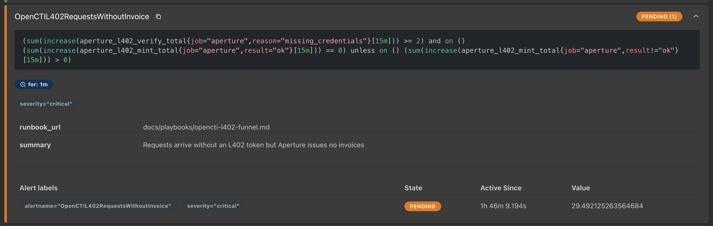

In the [previous post](/posts/metrics-collector-prometheus-on-lnd/), lndmon exposed LND's state on a `/metrics` endpoint. This post moves one step further: the Prometheus UI, and where its alerts actually come from.

## The Prometheus UI

Prometheus ships with a small web UI. Two parts of it are enough for most of this lab.

**Query** lets you search the stored metrics with **PromQL**, Prometheus's query language, and draw them as a table or graph. For example, the number of successful L402 invoices over the last 15 minutes:

```text
sum(increase(aperture_l402_mint_total{result="ok"}[15m]))
```

![Prometheus Query page graphing sum(increase(aperture_l402_mint_total{result="ok"}[15m])) over 30 minutes: flat around 30, then stepping down after 03:05](../../assets/images/kagent-l402/mint-ok-15m-window.png)

*A PromQL query on the Query page. This one comes from the incident drill, where the pricer died at 03:05 and successful invoices drained out of the 15-minute window.*

**Alerts** in the navigation bar lists every alert rule Prometheus has loaded and its current state: `inactive`, `pending`, or `firing`.



*One rule on the Alerts page: its expression, how long it must stay true (`for: 1m`), its labels, and its current state.*

So where do those rules come from?

## Option 1: rules in the Helm values

I installed Prometheus with the **kube-prometheus-stack** Helm chart. The chart's `values.yaml` has a key, `additionalPrometheusRulesMap`, where you can write your own rules next to the rest of the configuration.

Here is a minimal lab: the chart's default rules and the extra components are switched off, and one alert is added that is always true.

```bash
cd ~/prometheus-alert-lab

cat > alert-test-values.yaml <<'EOF'
defaultRules:
  create: false

grafana:
  enabled: false

alertmanager:
  enabled: false

nodeExporter:
  enabled: false

kubeStateMetrics:
  enabled: false

additionalPrometheusRulesMap:
  manual-test:
    groups:
      - name: manual-test
        rules:
          - alert: ManualAlertTest
            expr: vector(1)
            for: 1m
            labels:
              severity: warning
            annotations:
              summary: "Manual alert test"
              description: "A test alert: its condition is always true and has held for one minute."
EOF
```

Starting from the chart's default `values.yaml`, you can define your own rules for your applications the same way.

Then install or upgrade the release with that file:

```bash
helm upgrade --install alert-lab ./kube-prometheus-stack \
  --namespace monitoring-lab \
  --create-namespace \
  -f alert-test-values.yaml \
  --wait --timeout 10m
```

About a minute after the rule loads, `ManualAlertTest` moves from `pending` to `firing` on the Alerts page.

## Option 2: a PrometheusRule file per service

The Helm route works, but it ties every alert change to a `helm upgrade` of the whole monitoring stack.

kube-prometheus-stack runs the **Prometheus Operator**, which watches for `PrometheusRule` resources in the cluster and loads them into Prometheus. So a rule can also be its own Kubernetes object, applied with `kubectl`:

```yaml
apiVersion: monitoring.coreos.com/v1
kind: PrometheusRule
metadata:
  name: test-alerts
  namespace: monitoring-lab
  labels:
    release: alert-lab   # must match the Prometheus ruleSelector
spec:
  groups:
    - name: manual-test
      rules:
        - alert: ManualAlertTest
          expr: vector(1)
          for: 1m
          labels:
            severity: warning
          annotations:
            summary: "Manual alert test"
```

```bash
kubectl apply -f rules/test-alerts.yaml
```

The `release` label matters. By default, kube-prometheus-stack configures Prometheus to load only the rules whose labels match its `ruleSelector`, which is the Helm release name. A rule without that label is accepted by Kubernetes but never loaded.

## The split I use

The practice I settled on is to keep each concern in one place:

- **The Prometheus installation** (version, memory, storage, retention) lives in Helm values.
- **Each service's alerts** live in their own `PrometheusRule` file.

```text
monitoring/
├── values.yaml              # Prometheus install, storage, retention
└── rules/
    ├── lnd-alerts.yaml      # LND channel and sync alerts
    ├── app-alerts.yaml      # application errors and latency
    └── test-alerts.yaml     # lab-only alerts
```

| What changes | File to edit | How it is applied |
|---|---|---|
| Prometheus version, memory, storage | `values.yaml` | `helm upgrade` |
| Add an LND alert or change a threshold | `rules/lnd-alerts.yaml` | `kubectl apply -f` |
| Add an application alert | `rules/app-alerts.yaml` | `kubectl apply -f` |

With this split, editing one alert never touches the Prometheus installation settings.

## Rules for managing the rules

- **Don't edit the downloaded chart's templates.** Every chart upgrade would then mean merging your changes back in by hand. Customize through values instead.
- **Give each rule exactly one home.** Don't define the same rule in both the Helm values and a separate YAML file.
- **Keep rule files in Git.** Then you can see who changed a threshold, why, and roll it back.
- **Match the namespace and labels.** Prometheus only loads rules selected by its `ruleSelector` and `ruleNamespaceSelector`. See the [Prometheus Operator guide on deploying rules](https://prometheus-operator.dev/docs/developer/alerting/#deploying-prometheus-rules).
- **Check the Rules page after applying.** Loading and evaluation errors show up there. For important rules, `promtool` can also test when an alert should fire and resolve; see [unit testing for rules](https://prometheus.io/docs/prometheus/latest/configuration/unit_testing_rules/).

For a small lab, putting everything in `additionalPrometheusRulesMap` is fine. Here I practiced adding separate `PrometheusRule` files by hand; the next step is letting Flux apply those files from Git automatically.
