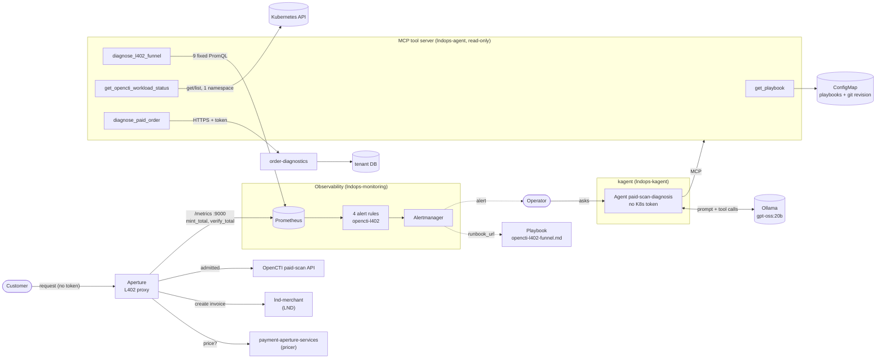
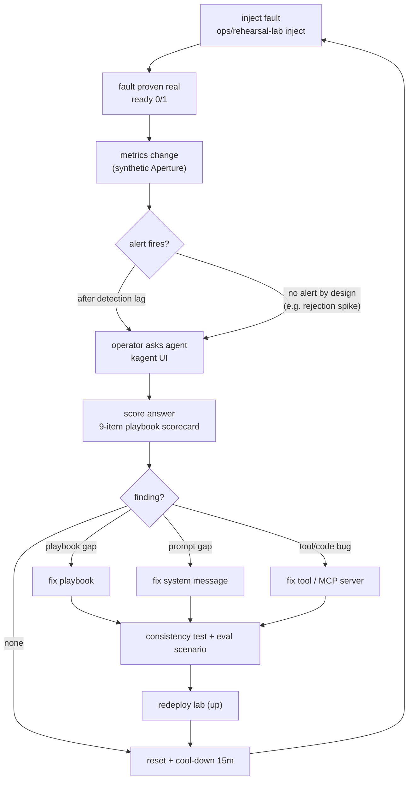
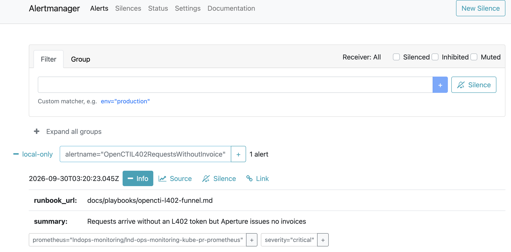
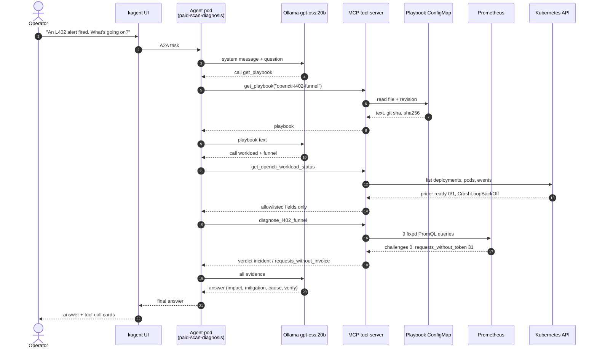

*Part 4 of the series. [Part 1](/posts/diagnosing-opencti-with-kagent-architecture/) covered the architecture, [Part 2](/posts/diagnosing-opencti-with-kagent-tools/) the tools and read-only access, and [Part 3](/posts/diagnosing-opencti-with-kagent-access-control/) access control in a GitOps setup.*

I built a Kubernetes-native AI agent using **Kagent** to monitor an **L402 payment gate powered by Aperture** in front of a paid security-scanning service.

But I did not want to simply deploy the agent and trust whatever it said.

Instead, I treated it the way I would treat a human on-call engineer: I rehearsed incidents.

On a disposable local Kubernetes cluster, I deliberately injected faults, waited for real Prometheus alerts to fire, asked the agent to investigate the incident, and then scored its answer against a written operational playbook.

The exercise was originally intended to evaluate the agent.

It ended up evaluating my system as well.

While testing the agent, I found several problems in my own observability logic, alert design, and application code.

That turned out to be one of the most useful parts of the experiment.

---

## The setup

The request path looks roughly like this:

**Client → Aperture / L402 → paid security-scanning service**

Aperture acts as the payment gate.

When a client sends a request without a valid payment credential, Aperture returns an HTTP `402 Payment Required` response together with the information required to pay the Lightning invoice.

After payment, the client presents the appropriate L402 credential and retries the request. Aperture verifies the token and, if everything is valid, admits the request to the protected service.

For the agent, however, knowing that "Aperture is running" is not enough.

I wanted it to answer a more operationally useful question:

**Is the L402 payment funnel actually working?**

Here is the whole lab. The agent has no Kubernetes token of its own; everything it can see goes through a read-only MCP tool server, and each tool is deliberately narrow.



### The rehearsal loop

Each rehearsal follows the same loop, borrowed from the "Wheel of Misfortune" exercises on-call teams run. Every finding turns into a fix in the playbook, the system message, or the tools, and then into a test so it cannot quietly come back.



---

## Turning metrics into a funnel verdict

I modeled the L402 flow as a funnel with three important stages:

1. **Invoice issued**
2. **Token verified**
3. **Request admitted**

At first, it was tempting to judge the funnel using conversion ratios.

For example:

```text
verified_tokens / invoices_issued
```

or:

```text
admitted_requests / verified_tokens
```

That works reasonably well when traffic volume is high.

My local environment does not have high traffic.

With only a handful of payments, one unpaid invoice can dramatically change the ratio. A perfectly normal user abandoning a payment could suddenly make the system look unhealthy.

So instead of relying primarily on percentages, I classified the funnel using **event kinds and counts**.

The resulting verdicts were:

- `incident`
- `inconclusive`
- `no_l402_traffic`
- `healthy`

This makes the diagnosis much more useful in a low-volume environment.

For example, zero successful payments does not necessarily mean that the payment system is broken. There may simply have been no users attempting an L402 payment.

That distinction matters.

---

## What the first tabletop exercise exposed

The first important failure was not in the agent.

It was in my own detection logic.

I killed the component responsible for pricing requests.

I expected the system to report an incident.

Instead, the funnel initially interpreted the situation as:

```text
no_l402_traffic
```

That was technically consistent with the metrics I had given it: no new invoices were being issued.

But operationally, it was wrong.

There is a big difference between:

> Nobody requested an L402-protected endpoint.

and:

> Requests arrived, but the system failed to issue an invoice.

My metrics could not distinguish those two situations.

So I added another signal:

```text
requests_without_invoice
```

This represents requests that reach Aperture but do not result in an invoice being issued.

Normally, the first request reaches Aperture without an L402 token. Aperture should respond with `402 Payment Required` and issue the payment challenge.

If requests are arriving but no invoice is being produced, that is no longer "no traffic."

It is evidence that something in the payment path is broken.

In Prometheus, that signal became its own alert rule: at least two requests without credentials in the last 15 minutes, no successful mints in the same window, and no failed mints either (a failed mint points somewhere else).


*The rule that came out of the exercise. The `runbook_url` label points the agent at the playbook it is scored against.*

That metric came directly from the tabletop exercise.

Without deliberately killing the component, I might not have noticed the blind spot.

---

## Scenario 1: The pricer dies

The first full incident scenario was simple:

**Kill the pricer and see what happens.**

The actual timeline looked like this:

| Time (UTC) | Event |
|---|---|
| 03:04:47 | Fault injected. `payment-aperture-services` becomes `0/1 Ready` and enters `CrashLoopBackOff`. |
| 03:04–03:19 | The service is down, but the 15-minute Prometheus window still contains earlier invoices. The funnel continues to report `healthy`, and the alert remains inactive. |
| 03:19:36 | `invoices_issued` inside the evaluation window reaches `0`. The alert enters `pending`. |
| 03:20:37 | The alert starts firing, roughly 16 minutes after the outage began. |
| 03:24 | The agent completes its investigation and scores **8/9** against the incident-response scorecard. |

Laid out on a timeline, the gap between reality and the alert is easy to see:

```mermaid
gantt
    title Scenario 1: pricer outage vs. alert (UTC, 2026-09-30)
    dateFormat HH:mm:ss
    axisFormat %H:%M

    section Reality
    Pricer down (CrashLoopBackOff)        :crit, down, 03:04:47, 03:30:00

    section Metrics window (15m)
    Old invoices still in window          :active, lag, 03:04:47, 03:19:36
    Invoices in window = 0                :done, zero, 03:19:36, 03:30:00

    section Alert state
    inactive                              :a1, 03:04:47, 03:19:36
    pending (for 1m)                      :a2, 03:19:36, 03:20:37
    firing                                :crit, a3, 03:20:37, 03:30:00

    section Agent
    Operator asks, agent answers 8/9      :milestone, m1, 03:24:00, 0s
```



This revealed another important property of the system:

**Detection lag is part of the design.**

The alert did not fire immediately when the workload failed.

That was not because Prometheus was broken or because the agent missed the incident.

The query intentionally used a 15-minute counter window.

Historical activity remained inside that window after the failure occurred. Until those older invoice events aged out, the metric still looked healthy.

![Prometheus graph of sum(increase(aperture_l402_mint_total{result="ok"}[15m])) from 02:45 to 03:15: flat around 30 until 03:05, then stepping down steadily toward 10](../../assets/images/kagent-l402/mint-ok-15m-window.png)

*Successful mints over a 15-minute window. The pricer died at 03:04:47, but the line only starts falling afterward, one step at a time, as older invoices age out of the window. It has to reach zero before the alert can fire.*

The alert therefore fired approximately 16 minutes after the actual outage.



*The alert reaching Alertmanager at 03:20, about 16 minutes after the fault.*

This is easy to overlook when writing PromQL.

A rolling window is not just a query implementation detail. It directly affects how quickly an incident becomes visible.

---

## Evaluating the agent against the playbook

I did not want to judge the agent based on whether its response simply "looked good."

I wrote a playbook first and used it as the expected operational behavior.

The agent was expected to:

- identify the user impact,
- gather evidence,
- identify the failing component,
- distinguish the most likely cause from alternatives,
- propose an appropriate mitigation,
- respect approval boundaries,
- and verify recovery using fresh evidence.

In the pricer incident, the agent scored **8/9**.

More importantly, several parts of its behavior matched what I wanted from an on-call investigation.

This is what a single investigation looked like inside kagent. The agent reads the playbook first, then asks for the workload status and the funnel verdict before the model writes its answer:



### What worked well

The agent fetched the playbook before beginning its investigation.

It then gathered the required evidence itself instead of immediately guessing from the alert name.

It also described **impact before cause**.

That distinction matters.

An alert might tell us that a pod is unhealthy, but an operator first needs to understand what users are experiencing.

The agent also proposed a mitigation and explicitly stated when human approval was required.


*The agent's mitigation plan. Each action carries its approval boundary: telling customers needs none, while removing L402 from the service's payment methods needs a human because it restarts the API.*

When explaining the cause, it backed its conclusion with concrete evidence such as:

```text
CrashLoopBackOff
ready_replicas = 0
```

After recovery, it verified the system using **new activity**, rather than merely checking whether the pod had restarted.

For example:

```text
challenges_issued > 0
```

That is a much stronger recovery signal.

A running process does not necessarily mean the user-facing workflow is healthy.

The agent also used negative evidence effectively.

There was no `mint_failed` signal, so it correctly treated the LND side of the payment path as less likely to be the cause.

This was much closer to the behavior I wanted than simply saying:

> "The pod crashed, therefore restart it."

---

## The most interesting failure: the playbook leaves space for invention

The agent still missed one point on the scorecard.

That failure taught me something more important than the score itself:

**What the playbook leaves unsaid, the model tends to fill in.**

When operational instructions were vague, the model sometimes introduced plausible-sounding components, explanations, or alternatives that were not actually supported by the collected evidence.

From a language-model perspective, this behavior makes sense.

From an incident-response perspective, it is dangerous.

An on-call agent should not create a richer story

<!-- TODO(draft): the source text stops here, mid-sentence. Finish this section and add the closing. -->

Next: [Diagnosing OpenCTI with Kagent (5) - Reviewing the Setup Against Google SRE](/posts/diagnosing-opencti-with-kagent-google-sre-review/)
