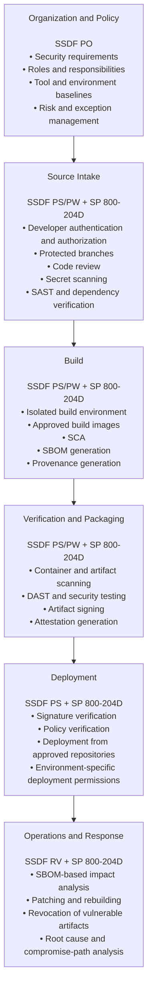

I've briefly summarized NIST SP 800-218 and SP 800-204D in previous posts. If you read those posts, you will discover the relationship between these two documents. The SSDF provides a high-level perspective on software development, regardless of methodology or architecture, while SP 800-204D addresses CI/CD pipeline security specifically for cloud-native applications. The principles of the SSDF are further specified within SP 800-204D in this article

## Table of contents

NIST SP 800-218 and SP 800-204D both address secure software development and software supply chain security, but they differ in scope and purpose.

Their relationship can be summarized as follows:

> **SP 800-218 SSDF defines the high-level practices organizations should follow to develop secure software, while SP 800-204D provides specific strategies for integrating software supply chain security into cloud-native DevSecOps CI/CD pipelines.**

The two publications are therefore complementary rather than competing or interchangeable. In practice, organizations can use **SSDF as the foundational framework for the Secure Software Development Lifecycle and SP 800-204D as implementation guidance for CI/CD and software supply chain security**.

## 1. The Role of SP 800-218 SSDF

NIST SP 800-218 defines the Secure Software Development Framework, or SSDF.

SSDF provides a core set of secure software development practices that can be integrated into an existing SDLC. It does not mandate a particular development methodology, programming language, CI/CD product, or cloud platform. Instead, it is a technology-neutral framework organized around the security outcomes an organization should achieve.

SSDF v1.1 consists of four practice groups:

* **PO: Prepare the Organization**
* **PS: Protect the Software**
* **PW: Produce Well-Secured Software**
* **RV: Respond to Vulnerabilities**

Together, these groups cover the entire software lifecycle. They address preparing the organization and development environment, protecting software and related artifacts, producing software with fewer vulnerabilities, and responding to vulnerabilities discovered after release.

SSDF primarily helps answer questions such as:

* What security policies and responsibility structures should the organization establish?
* How should development environments and source code be protected?
* What activities are required for secure design, implementation, and testing?
* How should third-party components and software provenance information be managed?
* How should identified vulnerabilities be remediated and prevented from recurring?

In other words, SSDF is a high-level framework that defines **what an organization should do**.

## 2. The Role of SP 800-204D

The full title of NIST SP 800-204D is **Strategies for the Integration of Software Supply Chain Security in DevSecOps CI/CD Pipelines**.

The publication explains how software supply chain security can be integrated into the DevSecOps CI/CD pipelines used to develop and deploy cloud-native applications.

Its primary areas of focus include:

* Developers and external contributors
* Source code repositories
* Open-source and third-party dependencies
* CI/CD workflows and build runners
* Security scanning and testing tools
* Packages and container images
* Artifact repositories
* SBOMs, provenance, and attestations
* Signing keys and deployment credentials

SP 800-204D focuses on practical questions such as:

* How should external packages and dependencies be verified?
* Which security checks should be performed at each stage of the CI/CD pipeline?
* How can an organization prove that an artifact was created from approved source code in a trusted build environment?
* When should SBOMs, provenance, and attestations be generated and verified?
* How can external pull requests be prevented from accessing internal secrets or deployment credentials?
* How can deployment be restricted to signed and verified artifacts?

SP 800-204D can therefore be understood as guidance on **how to implement SSDF security objectives within a CI/CD pipeline**.

## 3. Key Differences Between the Two Publications

| Category             | NIST SP 800-218 SSDF                                                               | NIST SP 800-204D                                               |
| -------------------- | ---------------------------------------------------------------------------------- | -------------------------------------------------------------- |
| Primary purpose      | Defines common practices for secure software development                           | Integrates software supply chain security into CI/CD pipelines |
| Scope                | Organization, people, development, protection, testing, and vulnerability response | Repositories, dependencies, builds, artifacts, and deployment  |
| Level of abstraction | High-level framework                                                               | Implementation and architectural strategies                    |
| Primary question     | What should the organization do?                                                   | How should it be implemented in the pipeline?                  |
| Major outputs        | Policies, roles, security requirements, and development activities                 | SBOMs, provenance, attestations, and signed artifacts          |
| Primary use          | Organization-wide Secure SDLC baseline                                             | CI/CD and software supply chain security design guidance       |

SSDF is not limited to CI/CD. It also covers security training, roles and responsibilities, security requirements, design reviews, vulnerability response, and root cause analysis.

SP 800-204D, in contrast, does not attempt to define an organization’s entire software security governance program. It focuses on maintaining trust as code and dependencies enter a pipeline and are built, verified, packaged, signed, and deployed.

## 4. Connecting SSDF Practices to SP 800-204D

The activities described in SP 800-204D are particularly relevant to the PO, PS, and PW practice groups of SSDF. They also support RV when organizations respond to vulnerabilities in software components and supply chain systems.

### PO: Prepare the Organization

The PO practice group requires organizations to prepare the people, processes, technologies, and development environments needed for secure software development.

SP 800-204D can translate these requirements into activities such as:

* Defining CI/CD and software supply chain security roles
* Separating the responsibilities of developers, platform teams, and application security teams
* Identifying approved development tools and package repositories
* Establishing security baselines for developer workstations and build systems
* Performing threat modeling for CI/CD pipelines
* Defining security scanning and exception approval policies
* Establishing retention policies for provenance and other evidence

SSDF requires organizations to prepare and maintain secure development environments. SP 800-204D explains how this requirement can be applied to repositories, CI servers, build runners, package repositories, and deployment environments.

### PS: Protect the Software

The PS practice group focuses on protecting code and release artifacts against unauthorized access and modification.

SP 800-204D translates this objective into controls such as:

* Repository access controls and protected branches
* Protection of workflow definitions and build scripts
* Isolated build environments
* Restricted access to artifact repositories
* Digital signing of release artifacts
* Signature and hash verification before deployment
* Generation and protection of SBOMs and provenance
* Attestations covering build processes and results
* Separation and protection of signing keys and deployment credentials

SSDF requires organizations to manage software integrity and provenance information. SP 800-204D provides more specific guidance on the evidence that can be generated during CI/CD and how trust can be established across pipeline stages.

### PW: Produce Well-Secured Software

The PW practice group requires secure design, implementation, code review, and testing to reduce the number of vulnerabilities in software.

SP 800-204D can support these requirements through automated pipeline controls, including:

* Secret scanning
* Pull request reviews
* SAST and SCA
* Container and infrastructure-as-code scanning
* DAST and runtime security testing
* Blocking unapproved or malicious components
* Verifying dependency provenance and signatures
* Blocking builds that fail security policies
* Using only validated inputs during builds
* Packaging software with secure default configurations

SSDF establishes the need for security reviews and testing. SP 800-204D explains how those activities can be placed within source intake, build, packaging, and deployment stages.

### RV: Respond to Vulnerabilities

The RV practice group requires organizations to continuously identify, prioritize, remediate, and analyze the root causes of vulnerabilities.

Supply chain information generated under SP 800-204D can support this process through activities such as:

* Matching newly disclosed vulnerabilities against SBOM components
* Identifying affected products, builds, and releases
* Blocking vulnerable images and artifacts from deployment
* Rebuilding software with corrected dependencies
* Signing and redeploying updated artifacts
* Revoking compromised keys and credentials
* Using provenance to investigate the path of compromise

For example, when a new vulnerability is discovered in an open-source library, SSDF requires the organization to identify and remediate the issue. SP 800-204D supports the technical workflow by using SBOM and provenance data to locate affected products, rebuild them with an updated dependency, and then sign and redeploy the new artifacts.

## 5. A Combined CI/CD Model

The following diagram illustrates how the two publications can be applied together across a CI/CD workflow.

In this model, SSDF defines the security objectives that should be achieved at each stage. SP 800-204D translates those objectives into automated pipeline controls and verifiable supply chain evidence.

## 6. The Relationship from a Threat-Modeling Perspective

SSDF aims to reduce the number of vulnerabilities introduced into software, limit the impact of vulnerabilities that remain, and address their root causes.

SP 800-204D takes a more specific supply chain perspective. It recognizes that vulnerabilities and malicious code may be introduced not only through developer-written source code but also through other parts of the software supply chain.

Key targets of compromise include:

* **Actor:** Developers, administrators, and external contributors
* **Artifact:** Source code, dependencies, build files, images, and SBOMs
* **Step:** Review, build, testing, signing, and deployment
* **Resource:** Developer workstations, repositories, build runners, and artifact repositories

For example, even when source code is secure, a compromised build system may inject malicious code into the final binary.

Security testing may be performed correctly, but an attacker who modifies the pipeline configuration may bypass or manipulate the results.

An artifact may be digitally signed, but if the signing key is inadequately protected, an attacker may sign a malicious artifact and present it as a legitimate release.

Organizations applying both publications should therefore address two questions at the same time:

1. **SSDF perspective:** What development activities are required to produce secure software?
2. **SP 800-204D perspective:** How can the organization verify that those activities were performed, and that their results were produced in a trusted environment?

## 7. The Roles of SBOM, Provenance, and Attestation

Understanding the relationship between the two publications also requires distinguishing among SBOMs, provenance, and attestations.

### SBOM

An SBOM is an inventory of the components included in a software product.

It answers the question:

> What is included in this software?

Organizations can use SBOMs to identify affected products and versions when a new vulnerability is disclosed.

### Provenance

Provenance describes where software came from and the materials, environment, and processes used to create it.

It answers the question:

> Which source code, dependencies, build environment, and process were used to produce this artifact?

### Attestation

An attestation is a signed statement or form of evidence asserting that a particular build, verification activity, or policy check was performed.

It answers the question:

> Who claims to have performed which verification, in what environment, and can that claim be trusted?

SSDF provides high-level requirements for collecting and protecting this information. SP 800-204D describes strategies for generating and using it during the build, verification, packaging, and deployment stages of CI/CD.

## 8. A Practical Adoption Sequence

A realistic implementation sequence for using both publications is as follows.

### Step 1: Assess the Development Program Using SSDF

Use the PO, PS, PW, and RV practice groups to identify current secure development activities and organizational gaps.

### Step 2: Map the Software Supply Chain

Identify code authors and approvers, external packages, build systems, testing tools, artifact repositories, signing processes, and deployment paths.

### Step 3: Analyze Supply Chain Threats

Evaluate risks such as:

* Account and credential theft
* Malicious dependency injection
* Pipeline modification
* Security control bypass
* Build environment compromise
* Signing key theft
* Artifact replacement
* Unauthorized production deployment

### Step 4: Add Controls to the CI/CD Pipeline

Apply controls such as:

* Multi-factor authentication and least privilege
* Protected branches and mandatory reviews
* Isolation between external pull requests and internal secrets
* SAST, SCA, secret scanning, and infrastructure-as-code scanning
* Isolated build runners
* Dependency version and digest pinning
* SBOM and provenance generation
* Artifact signing
* Signature and policy verification before deployment

### Step 5: Connect Evidence to Operations and Response

SBOMs, provenance, and attestations should not simply be stored for compliance purposes. They should be used for:

* Vulnerability impact analysis
* Deployment policy evaluation
* Audits and supplier assessments
* Investigation of compromise paths
* Rebuilding and redeploying corrected releases
* Improving processes based on recurring failures

## 9. Conclusion

The relationship between NIST SP 800-218 SSDF and SP 800-204D can be summarized as follows:

> **SSDF is the foundational framework for the overall Secure SDLC, while SP 800-204D provides detailed guidance for implementing software supply chain security in cloud-native DevSecOps environments.**

SSDF alone can help an organization identify the full range of secure development activities it should perform. However, it may not provide enough implementation detail for establishing and verifying trust across a CI/CD software supply chain.

SP 800-204D alone can help establish technical controls such as SBOM generation, provenance, attestations, artifact signing, and build isolation. However, it does not replace organization-wide elements such as roles and responsibilities, security requirements, training, and root cause analysis.

In practice, the publications can be used as follows:

* **SP 800-218:** Organization-wide secure software development baseline and assessment framework
* **SP 800-204D:** CI/CD and software supply chain implementation guidance
* **Combined use:** An integrated DevSecOps security model connecting organizational policy, source code, builds, artifacts, deployment, and vulnerability response

By implementing the secure development principles of SSDF through the pipeline controls and evidence structures described in SP 800-204D, an organization can move beyond simply claiming that security scans were performed.

It can establish a software supply chain in which it is possible to explain and verify **which source code and components were used, where and how an artifact was built, which security checks were performed, and how the artifact was approved for production deployment**.

## References
- [NIST SP 800-218(SSDF)](https://nvlpubs.nist.gov/nistpubs/specialpublications/nist.sp.800-218.pdf)
- [NIST SP 800-204D](https://nvlpubs.nist.gov/nistpubs/SpecialPublications/NIST.SP.800-204D.pdf)
