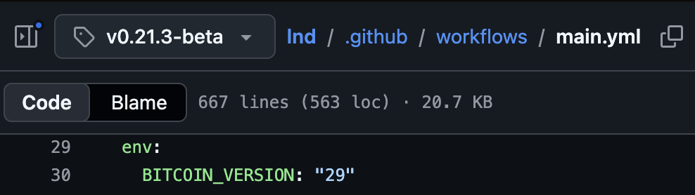
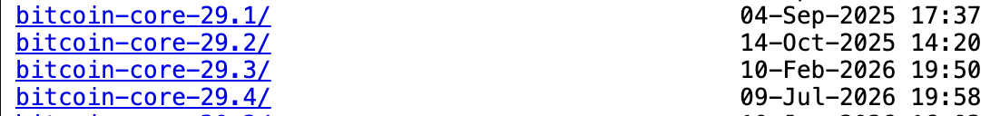
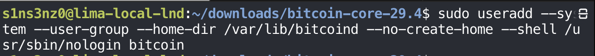
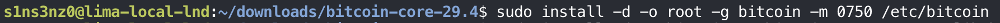
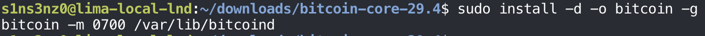
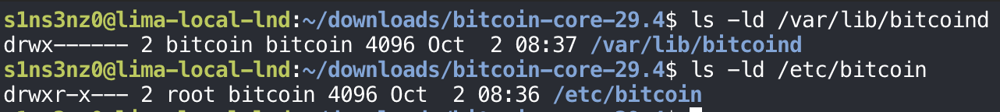
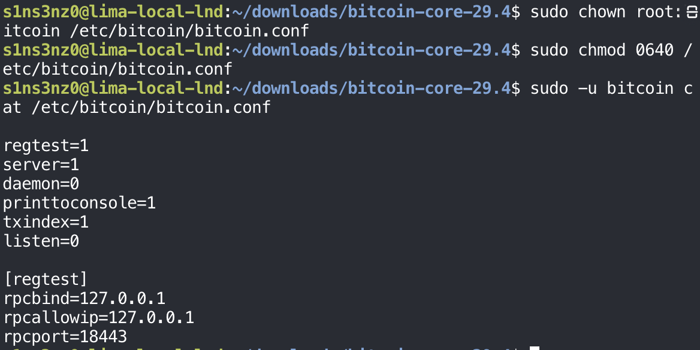

*Part 2 of the series. [Part 1](/posts/running-lnd-with-systemd-without-containers/) set up the Lima VM and checked that it starts clean.*

## Installing Bitcoin Core

### Why LND needs Bitcoin Core

You might wonder what Bitcoin Core is and why a Lightning lab starts with it. Bitcoin Core is the reference implementation of a Bitcoin full node. It verifies every transaction and block against the consensus rules, stores the blockchain, and relays transactions and blocks to its peers.

Lightning runs on top of Bitcoin, so an LND node can't operate without a view of the chain. It relies on its backend, here Bitcoin Core (`bitcoind`) running in the same VM, for:

| What LND needs | Why |
|---|---|
| Broadcasting transactions | Opening a channel, closing it, and sweeping funds back are all on-chain transactions that have to reach the network |
| Following new blocks | A channel is usable only after its funding transaction confirms, and payment timeouts are counted in block height |
| Watching for cheating | If a peer publishes an old channel state, LND has to spot it on chain in time to claim the funds back |
| Fee estimates | LND needs current fee rates to get its own transactions confirmed |

A backend that LND trusts but that is wrong or out of date puts the funds in its channels at risk. Running my own full node removes that trust in a third party.

### Choosing the Bitcoin Core version

Before installing either, I checked which `bitcoind` version LND itself is tested against. LND's CI workflow pins it, in [`.github/workflows/main.yml` at `v0.21.3-beta`](https://github.com/lightningnetwork/lnd/blob/v0.21.3-beta/.github/workflows/main.yml):



`BITCOIN_VERSION: "29"` means LND's integration tests for this release run against Bitcoin Core 29. That isn't a hard requirement, since LND talks to `bitcoind` over RPC and ZMQ and works across a range of versions, but it is the combination the LND developers actually exercise.

The CI only pins the major version. On the [Bitcoin Core download server](https://bitcoincore.org/bin/), the 29 line has four maintenance releases after 29.0:



I use the latest, 29.4, which stays on the version line LND's tests use and carries the most fixes. Any other recent Bitcoin Core release should work too; matching the CI is a choice for this lab, not a rule.

### Downloading Bitcoin Core and checking the checksum

`curl` downloads a file from a URL. I fetched the ARM64 Linux release into `~/downloads/bitcoin-core-29.4`, and with it the published SHA-256 hashes, to verify that I got the right file. How hash functions work is out of scope for this post.

```bash
curl -fLO https://bitcoincore.org/bin/bitcoin-core-29.4/bitcoin-29.4-aarch64-linux-gnu.tar.gz
curl -fLO https://bitcoincore.org/bin/bitcoin-core-29.4/SHA256SUMS
curl -fLO https://bitcoincore.org/bin/bitcoin-core-29.4/SHA256SUMS.asc
sha256sum --ignore-missing --check SHA256SUMS
```

| Flag | Meaning |
|---|---|
| `-f` | Fail on an HTTP error such as 404 or 500 instead of saving the error page as if it were the file |
| `-L` | Follow redirects to the file's final location |
| `-O` | Save the file under its remote name (`-o` would let me choose a different name) |


`SHA256SUMS` lists the expected hash of every file in the release. `sha256sum --check` compares my download against it, and `--ignore-missing` skips the builds for other platforms that I didn't download. `OK` means the tarball matches.

That only proves the download wasn't corrupted. The tarball and `SHA256SUMS` came from the same server, so anyone who could replace one could replace both. `SHA256SUMS.asc` closes that gap: it holds signatures over `SHA256SUMS` from Bitcoin Core's builders, which I check next.

### Verifying the signatures

This step confirms that the release was signed by the people who build Bitcoin Core, not just served by its website. Bitcoin Core is built reproducibly with Guix by several independent builders, and each one signs `SHA256SUMS` with their own key. The official [download page](https://bitcoincore.org/en/download/) walks through the verification for each OS (Windows, macOS, Linux, and Snap) and points to the builders' public keys in the [`guix.sigs`](https://github.com/bitcoin-core/guix.sigs) repository. The steps below are its Linux version.

That needs two tools: GnuPG (`gpg`) to check signatures, and Git to fetch the keys.

```bash
sudo apt install git gnupg
git clone --depth 1 https://github.com/bitcoin-core/guix.sigs.git
```


Both tools turned out to ship with the Ubuntu image already, so `apt` installed nothing. The `Not Upgrading: 155` line is a reminder that the VM has pending package updates, which I'll deal with when I harden it. `--depth 1` clones only the latest commit, since I need the current key files, not the repository's history.

First the builders' public keys go into the local GnuPG keyring, then `gpg` checks every signature in `SHA256SUMS.asc` against `SHA256SUMS`:

```bash
gpg --import guix.sigs/builder-keys/*
gpg --verify SHA256SUMS.asc SHA256SUMS
```

![gpg --verify SHA256SUMS.asc SHA256SUMS: signature made Thu Jul 9 22:48:06 2026 KST using RSA key 33C103B4B2794170546CCF7BCFB2C83C66CD792A; Good signature from "Sebastian van Staa" [unknown]; WARNING: This key is not certified with a trusted signature; primary key fingerprint 33C1 03B4 B279 4170 546C CF7B CFB2 C83C 66CD 792A](../../assets/images/lnd-without-containers/gpg-verify.png)

*The output repeats this block once per builder. Every builder's signature came back as a Good signature; the screenshot shows the first one, since the full output is long.*

| Line | Meaning |
|---|---|
| `Good signature from "Sebastian van Staa"` | One of the builders signed exactly this `SHA256SUMS`. If a single byte of the file had changed, this would say `BAD signature` |
| `using RSA key 33C1…792A` | The signing key, which matches a key file in `guix.sigs/builder-keys` |
| `[unknown]` and the `WARNING` | GnuPG hasn't been told to trust this key. That's expected: I imported it from `guix.sigs` and never certified it myself, so `gpg` reports the signature as valid but the owner as unverified |

The warning is the honest part of the result. The signatures prove that whoever holds these keys signed the release; trusting that those keys belong to the real builders rests on the `guix.sigs` repository. Requiring several independent builders to sign, instead of one, is what makes a single stolen or fake key not enough.

### Installing bitcoind and bitcoin-cli

With the checksum matching and the signatures good, I installed the two binaries this lab needs: `bitcoind`, the node itself, and `bitcoin-cli`, the command-line client that talks to it over RPC.

```bash
tar -xzf bitcoin-29.4-aarch64-linux-gnu.tar.gz
sudo install -o root -g root -m 0755 \
  bitcoin-29.4/bin/bitcoind \
  bitcoin-29.4/bin/bitcoin-cli \
  /usr/local/bin/
bitcoind --version
bitcoin-cli --version
```


| Command | Meaning |
|---|---|
| `tar -xzf` | Extract (`x`) a gzip-compressed (`z`) archive from the file (`f`) |
| `install` | Copy the files and set their owner and permissions in one step, unlike `cp` |
| `-o root -g root` | Owned by root, so an ordinary user, or a compromised node process, can't replace the binaries |
| `-m 0755` | Everyone can read and run them; only the owner can write |
| `/usr/local/bin/` | The standard place for software installed by hand rather than by `apt`, and already on the `PATH` |

Both report `v29.4.0`, the release I verified. The release has other binaries too, such as `bitcoin-qt` and `bitcoin-wallet`, but a headless node only needs these two.

## Configuring Bitcoin Core

### A service user for bitcoind

`bitcoind` shouldn't run as me or as root. It gets its own account: not a person who logs in, but a system user that exists only to run the service. It also gets its own group. Adding it to an existing group would hand it that group's file access too, which least privilege rules out.

```bash
sudo useradd --system --user-group --home-dir /var/lib/bitcoind --no-create-home --shell /usr/sbin/nologin bitcoin
```



| Option | Meaning |
|---|---|
| `--system` | A system account, with a UID from the system range and no password aging |
| `--user-group` | Create a group named `bitcoin` just for this user |
| `--home-dir /var/lib/bitcoind` | Its home is where the node will keep its data |
| `--no-create-home` | Don't create that directory now; I'll create it with the exact owner and permissions the data needs |
| `--shell /usr/sbin/nologin` | Nobody can log in or get a shell as this user |

No output means `useradd` succeeded.

### The configuration directory

`bitcoind`'s configuration goes in `/etc/bitcoin`. Root owns it, and the `bitcoin` group can read it. `install -d` creates the directory and sets its owner, group, and mode in one command, the same way `install` did for the binaries.

```bash
sudo install -d -o root -g bitcoin -m 0750 /etc/bitcoin
```



| Part | Meaning |
|---|---|
| `-d` | Create a directory instead of copying a file |
| `-o root` | Owned by root |
| `-g bitcoin` | Group `bitcoin`, the service user's own group |
| `-m 0750` | Owner: read, write, enter (`7`). Group: read and enter (`5`). Everyone else: nothing (`0`) |

The split matters. `bitcoind` running as `bitcoin` can read its configuration but can't change it, so a compromised node process can't rewrite its own settings, and other users on the VM can't read them at all. That will matter once the file holds RPC credentials.


### The data directory

`/var/lib/bitcoind`, the home directory I gave the `bitcoin` user earlier, is where the node keeps what it writes while running: the blocks, the chain state, and any wallet files. I created it with the same `install -d` options, but the ownership is the reverse of the configuration directory.

```bash
sudo install -d -o bitcoin -g bitcoin -m 0700 /var/lib/bitcoind
```



| Directory | Owner:group | Mode | Who can do what |
|---|---|---|---|
| `/etc/bitcoin` | `root:bitcoin` | `0750` | Root writes the configuration; `bitcoind` only reads it |
| `/var/lib/bitcoind` | `bitcoin:bitcoin` | `0700` | Only `bitcoind` reads and writes; nobody else, not even its group, can look inside |

`bitcoind` has to write its data, so it owns this directory. `0700` keeps everyone else out, which matters for anything in it that holds keys.

Checking both directories:

```bash
ls -ld /var/lib/bitcoind
ls -ld /etc/bitcoin
```



`-d` lists the directory itself instead of its contents. The first character, `d`, marks a directory, and the nine after it are the mode in letters: `rwx------` is `0700`, and `rwxr-x---` is `0750`. Owner and group match the table above.

### The configuration file

These are the settings for this lab, in `/etc/bitcoin/bitcoin.conf`. Reading it takes `sudo`, which shows the directory permissions at work: my own user isn't root and isn't in the `bitcoin` group.

```bash
sudo cat /etc/bitcoin/bitcoin.conf
```

![sudo cat /etc/bitcoin/bitcoin.conf: regtest=1, server=1, daemon=0, printtoconsole=1, txindex=1, listen=0, then a [regtest] section with rpcbind=127.0.0.1, rpcallowip=127.0.0.1, rpcport=18443](../../assets/images/lnd-without-containers/bitcoin-conf.png)

| Setting | Meaning |
|---|---|
| `regtest=1` | Run a private local test chain (regression test mode) instead of mainnet or testnet. I create blocks on demand, so there's nothing to download |
| `server=1` | Turn on the JSON-RPC server, which `bitcoin-cli` and later LND use |
| `daemon=0` | Stay in the foreground instead of forking into the background. systemd manages the process directly, and it needs to see the real one |
| `printtoconsole=1` | Write logs to standard output, where systemd's journal collects them |
| `txindex=1` | Keep an index of every transaction, so any transaction can be looked up by its ID, not only those in the wallet |
| `listen=0` | Don't accept incoming P2P connections from other nodes |
| `[regtest]` | The settings below apply only when the node runs on regtest |
| `rpcbind=127.0.0.1` | Serve RPC on the VM's loopback address only |
| `rpcallowip=127.0.0.1` | Accept RPC connections only from that address |
| `rpcport=18443` | The RPC port, which is also the regtest default |

Together, `listen=0` and the loopback-only RPC keep this node closed to the network: nothing outside the VM can reach either its P2P or its RPC port. Since there's no `rpcuser` or `rpcauth` here, `bitcoind` falls back to cookie authentication: it writes a random credential to a `.cookie` file in its data directory each time it starts, and only users who can read that file can call RPC.

The file gets the same split as its directory: root owns it, the `bitcoin` group can read it, and nobody else can. Then I read it as the `bitcoin` user to confirm the service account can actually see its configuration.

```bash
sudo chown root:bitcoin /etc/bitcoin/bitcoin.conf
sudo chmod 0640 /etc/bitcoin/bitcoin.conf
sudo -u bitcoin cat /etc/bitcoin/bitcoin.conf
```



| Command | Meaning |
|---|---|
| `chown root:bitcoin` | Owner root, group `bitcoin` |
| `chmod 0640` | Owner reads and writes (`6`), the group reads (`4`), everyone else gets nothing (`0`). No execute bits, since it's a file, not a program |
| `sudo -u bitcoin cat` | Run `cat` as the `bitcoin` user instead of root |

`sudo -u bitcoin` is the useful check here. `sudo cat` earlier only proved that root can read the file; reading it as `bitcoin` proves the permissions work for the account `bitcoind` will actually run as, before systemd ever starts it.

Next: [Running bitcoind as a systemd service](/posts/running-lnd-with-systemd-without-containers-bitcoind-service/).
