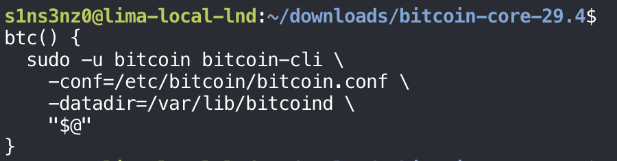
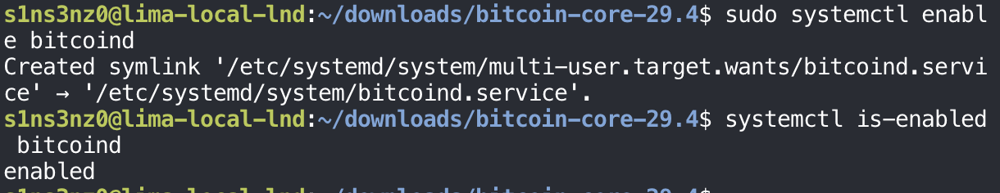

*Part 3 of the series. [Part 2](/posts/running-lnd-with-systemd-without-containers-bitcoin-core/) installed Bitcoin Core and gave it its own user, directories, and configuration.*

### The unit file

This is where systemd takes over the job Kubernetes used to do. A unit file tells systemd how to start `bitcoind`, as which user, when to restart it, and what it may touch. I wrote it with `tee`:

```bash
sudo tee /etc/systemd/system/bitcoind.service > /dev/null <<'EOF'
[Unit]
Description=Bitcoin Core regtest node
After=network.target

[Service]
Type=simple
User=bitcoin
Group=bitcoin
ExecStart=/usr/local/bin/bitcoind -conf=/etc/bitcoin/bitcoin.conf -datadir=/var/lib/bitcoind
Restart=on-failure
RestartSec=5
TimeoutStopSec=300
UMask=0077
NoNewPrivileges=true
ProtectHome=true
ProtectSystem=full

[Install]
WantedBy=multi-user.target
EOF
```

![Inside the VM: sudo tee /etc/systemd/system/bitcoind.service > /dev/null <<'EOF' with the [Unit], [Service], and [Install] sections of the bitcoind unit](../../assets/images/lnd-without-containers/bitcoind-service-unit.png)

`sudo tee` writes the file as root, which a plain `sudo cat > file` can't do because the redirection runs in my own shell. `> /dev/null` stops `tee` from echoing the file back. Quoting `'EOF'` keeps the shell from expanding anything inside the text.

| Directive | Meaning |
|---|---|
| `After=network.target` | Start after basic networking is up |
| `Type=simple` | The process systemd starts is the service. This pairs with `daemon=0` in `bitcoin.conf`: if `bitcoind` forked into the background, systemd would lose track of it |
| `User=bitcoin`, `Group=bitcoin` | Run as the service account, never as root |
| `ExecStart=… -conf=… -datadir=…` | The binary, its read-only configuration, and its data directory, all spelled out instead of relying on defaults under a home directory |
| `Restart=on-failure`, `RestartSec=5` | If `bitcoind` crashes or exits with an error, start it again after 5 seconds. A clean stop stays stopped |
| `TimeoutStopSec=300` | Give it up to 5 minutes to shut down. `bitcoind` flushes its databases on exit, and killing it early risks a long reindex |
| `UMask=0077` | Every file it creates is readable only by `bitcoin`, including the RPC `.cookie` |
| `NoNewPrivileges=true` | The process and its children can never gain privileges, for example through a setuid binary |
| `ProtectHome=true` | `/home`, `/root`, and `/run/user` are invisible to it |
| `ProtectSystem=full` | `/usr`, `/boot`, `/efi`, and `/etc` are read-only to it, so even a compromised `bitcoind` can't change its binary or its configuration |
| `WantedBy=multi-user.target` | Once enabled, start it at every normal boot |

`Restart=on-failure` is the piece that replaces a Kubernetes restart policy, and the last four lines play the role a pod's `securityContext` did: they limit what the process can do, enforced by the kernel.

### Checking the unit and starting it

Before starting anything, `systemd-analyze verify` checks the unit file. Then systemd reloads its unit files and starts the service.

```bash
sudo systemd-analyze verify /etc/systemd/system/bitcoind.service
sudo systemctl daemon-reload
sudo systemctl start bitcoind
```


| Command | Meaning |
|---|---|
| `systemd-analyze verify` | Check the unit's syntax, its dependencies on other units, and that the commands it runs, such as the `ExecStart` binary, actually exist |
| `daemon-reload` | Make systemd read the unit files from disk again. Without it, systemd only knows the units it loaded at boot (or at the last reload), so a new `bitcoind.service` doesn't exist as far as it's concerned |
| `start bitcoind` | Start the service now |

The two warnings aren't about `bitcoind.service`. `verify` also loads units that ship with Ubuntu, and two of them, for XFS filesystem scrubbing, still use `CPUAccounting=`, an option newer systemd has dropped. Nothing in my unit was flagged, and both `daemon-reload` and `start` returned without output, which means they succeeded.

### Checking that it's running

`systemctl status` shows whether the service started, how it's running, and its latest log lines:

```bash
sudo systemctl status bitcoind --no-pager -l
```

![sudo systemctl status bitcoind --no-pager -l: bitcoind.service - Bitcoin Core regtest node, Loaded from /etc/systemd/system/bitcoind.service; disabled; preset: enabled, Active: active (running) since Fri 2026-10-02 08:59:40 KST, Main PID 11042, Tasks 26, Memory 59.7M, CGroup /system.slice/bitcoind.service running /usr/local/bin/bitcoind -conf=/etc/bitcoin/bitcoin.conf -datadir=/var/lib/bitcoind, followed by log lines for txindex, addcon, msghand, net, and dnsseed threads, Loading addresses from DNS seed dummySeed.invalid, 0 addresses found, Added 0 fixed seeds](../../assets/images/lnd-without-containers/bitcoind-status.png)

| Line | What it shows |
|---|---|
| `Active: active (running)` | `bitcoind` started and is still up |
| `Main PID: 11042 (bitcoind)` | systemd is tracking the real process, thanks to `Type=simple` and `daemon=0` |
| `Tasks`, `Memory`, `CPU` | What the service is using, counted per service through its cgroup |
| `CGroup: /system.slice/bitcoind.service` | The exact command line, with the configuration and data paths from the unit |
| `Loaded: …; disabled` | The unit isn't enabled, so it won't start on its own after a reboot. `start` runs it once; `enable` is what wires it to `multi-user.target` |

`--no-pager` prints straight to the terminal, and `-l` stops systemd from cutting long lines short.

The log lines are what an isolated regtest node should say. The worker threads start, the DNS seed lookup goes to `dummySeed.invalid` and finds nothing because regtest has no seeds, and no fixed seeds are added. With `listen=0` and no peers, the node is running on its own, which is what this lab wants. The log carries two clocks: the journal's local time (KST) at the front, and `bitcoind`'s own UTC timestamp after it.

### Talking to it over RPC

A running process isn't proof that the node answers. `bitcoin-cli` asks it over RPC:

```bash
sudo -u bitcoin bitcoin-cli -conf=/etc/bitcoin/bitcoin.conf -datadir=/var/lib/bitcoind getblockchaininfo
```


The command runs as `bitcoin` for the same reason as before: with no `rpcuser` set, RPC authenticates with the `.cookie` file in the data directory, and only `bitcoin` can read it. `-conf` and `-datadir` point `bitcoin-cli` at the same configuration and data directory the service uses, so it finds the regtest RPC port and the cookie.

| Field | Value | Meaning |
|---|---|---|
| `chain` | `"regtest"` | The network in use: the local test chain I configured |
| `blocks` | `0` | The **height** of the fully validated active chain. The genesis block sits at height 0, so this doesn't mean there are no blocks |
| `headers` | `0` | The height of the best validated header chain. It can run ahead of `blocks` when headers arrive first and the block bodies are still being checked |
| `bestblockhash` | `"0f9188…2206"` | The hash of the last block on the active chain. Right now that's the regtest genesis block, the same on every regtest node |
| `bits` | `"207fffff"` | The proof-of-work `target` in compact form |
| `target` | `"7fffff…0000"` | A block's hash must be at or below this value to count as valid work. The bigger the target, the easier it is to hit |
| `difficulty` | `4.6565…e-10` | How hard mining is relative to the minimum difficulty. On regtest it's tiny, so blocks can be made on demand |
| `time` | `1296688602` | The Unix timestamp in the last block's header, here the genesis block's fixed February 2011 time. Not when the command ran |
| `mediantime` | `1296688602` | The median time of the last 11 blocks, including the tip. With a single block it equals `time` |
| `verificationprogress` | `1` | An estimate of how much of the chain's transactions have been verified, from 0 to 1 |
| `initialblockdownload` | `true` | The node thinks it's still in initial block download (IBD) |
| `chainwork` | `"0000…0002"` | The total proof of work accumulated on the active chain, in hex |
| `size_on_disk` | `293` | Estimated size of the block and undo files, in bytes |
| `pruned` | `false` | Pruning, which deletes old block files to save space, is off |
| `warnings` | `[]` | No network or blockchain warnings to report |

`initialblockdownload` looks odd next to `verificationprogress: 1`, but it follows from `time`. The node decides it's caught up only when its tip is recent, and its tip is a block from 2011. Mining the first new block will clear it.

The node is up, reachable over RPC by its own service account, and waiting for its first block.

### A shortcut for bitcoin-cli

Typing `sudo -u bitcoin`, the configuration path, and the data directory before every RPC call gets old fast. A shell function wraps them, the same way `lnc` wrapped `lncli` in my Kubernetes posts:

```bash
btc() {
  sudo -u bitcoin bitcoin-cli \
    -conf=/etc/bitcoin/bitcoin.conf \
    -datadir=/var/lib/bitcoind \
    "$@"
}
```



`"$@"` passes along every argument given to `btc`, each one kept as a separate word with its quoting intact, so `btc getblockchaininfo` runs the full command above. A function defined at the prompt lasts only for that shell session; adding it to `~/.bashrc` makes it available in every new one.

### A miner wallet and the first blocks

On regtest there are no miners but me. I created a wallet called `miner`, took a new address from it, and mined blocks to that address.

```bash
btc -named createwallet wallet_name=miner load_on_startup=true
MINER_ADDRESS=$(btc -rpcwallet=miner getnewaddress)
printf '%s\n' "$MINER_ADDRESS"
btc generatetoaddress 101 "$MINER_ADDRESS"
```


| Command | Meaning |
|---|---|
| `-named createwallet wallet_name=miner …` | Create the wallet. `-named` passes arguments as `name=value` instead of by position, which is easier to read |
| `load_on_startup=true` | Load this wallet again whenever `bitcoind` restarts |
| `-rpcwallet=miner getnewaddress` | Ask the `miner` wallet for a fresh receiving address |
| `generatetoaddress 101 …` | Mine 101 blocks, each paying its block reward to that address, and print their hashes |

The address starts with `bcrt1`, the prefix for native SegWit addresses on regtest. Mainnet uses `bc1` and testnet `tb1`, so a regtest address can't be mistaken for a real one.

Why 101 blocks: a block reward can't be spent until 100 more blocks are built on top of it. Mining 101 makes the reward from the first block spendable, which is what the miner will use later to fund the Lightning nodes. The wallet's files live in the data directory, under `/var/lib/bitcoind/regtest/wallets/miner`, which is one reason that directory is `0700`.

Asking the node again, through `btc` this time, shows what the 101 blocks changed:

```bash
btc getblockchaininfo
btc -rpcwallet=miner getbalances
```


| Field | Before | After | Why |
|---|---|---|---|
| `blocks`, `headers` | `0` | `101` | The 101 blocks I just mined, on top of genesis |
| `bestblockhash` | `0f9188…2206` | `279b42…b577` | The tip is now the last block I mined |
| `time` | `1296688602` | `1790899993` | The tip carries the current time instead of the 2011 genesis time |
| `initialblockdownload` | `true` | `false` | With a recent tip, the node considers itself caught up, as expected above |
| `chainwork` | `…0002` | `…00cc` | `0xcc` is 204: each regtest block adds 2 units of work, and there are now 102 blocks counting genesis |
| `size_on_disk` | `293` | `30375` | 101 more blocks on disk, about 30 KB |

The wallet's balances show the maturity rule from above at work:

| Balance | Amount | Meaning |
|---|---|---|
| `trusted` | 50 BTC | The reward from the first mined block, now buried under 100 more and spendable |
| `immature` | 5,000 BTC | The other 100 rewards, 50 BTC each, still waiting to mature |
| `lastprocessedblock.height` | 101 | The wallet has caught up with the chain tip |

These are regtest coins with no value, but they behave like real ones: 50 BTC is what the miner can actually spend to fund the Lightning nodes.

### Surviving a restart

Before LND comes anywhere near this node, the chain has to survive `bitcoind` going down and coming back. I saved the tip's hash, restarted the service, and asked again:

```bash
BEFORE_RESTART_HASH=$(btc getbestblockhash)
sudo systemctl restart bitcoind
btc -rpcwait -rpcwaittimeout=60 getblockchaininfo
```


`systemctl restart` stops `bitcoind`, which flushes its databases to disk within the `TimeoutStopSec` window, then starts it again. Right after the restart the RPC server isn't up yet, so `-rpcwait` makes `bitcoin-cli` keep retrying instead of failing at once, and `-rpcwaittimeout=60` gives up after a minute.

After the restart, the node reports the same height, 101, and the same tip, `279b42…b577`, as before it. `initialblockdownload` stays `false` and `chainwork` and `size_on_disk` are unchanged. The blocks live in `/var/lib/bitcoind`, not in the process, so a restart costs nothing. This is the property a PersistentVolume gave my pods, here provided by nothing more than a directory the service owns.

Comparing the saved hash against the tip after the restart, and checking the wallet:

```bash
AFTER_RESTART_HASH=$(btc getbestblockhash)
printf 'before: %s\nafter:  %s\n' \
  "$BEFORE_RESTART_HASH" "$AFTER_RESTART_HASH"
btc listwallets
btc -rpcwallet=miner getbalances
```


The two hashes are identical, character for character. `listwallets` shows `miner` already loaded without my touching it, which is `load_on_startup=true` doing its job, and the balances match what they were before the restart: 50 BTC spendable, 5,000 BTC immature, synced to height 101.

### Starting at boot

Everything so far ran on `systemctl start`, which starts the service once. With the unit, the RPC, and the restart all checked, I enabled it so it comes up on its own whenever the VM boots:

```bash
sudo systemctl enable bitcoind
systemctl is-enabled bitcoind
```



`enable` doesn't start anything. It creates a symlink in `multi-user.target.wants/`, the directory systemd reads to decide what to start when the system reaches its normal multi-user state at boot. That's the `WantedBy=multi-user.target` line from the unit's `[Install]` section taking effect. `is-enabled` now answers `enabled`, where `systemctl status` showed `disabled` earlier.

Next: [Installing LND and its service account](/posts/running-lnd-with-systemd-without-containers-lnd/).
