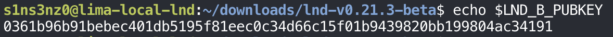
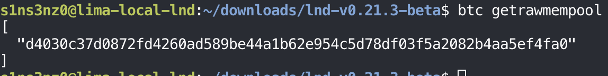
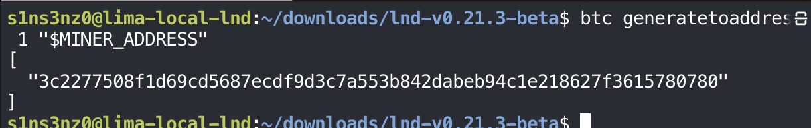
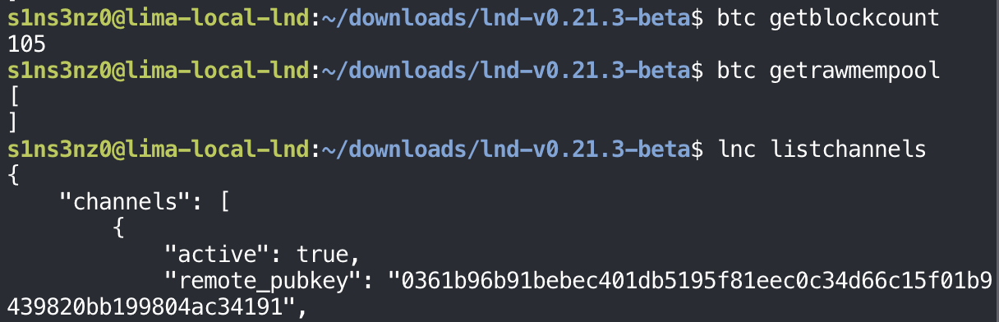

*Part 7 of the series. [Part 6](/posts/running-lnd-with-systemd-without-containers-lnd-service/) left two LND nodes connected as peers in the same VM: `lnc` with 1 BTC on chain, `lnb` with nothing, and no channel between them.*

## Opening a channel

### The counterparty's public key

A channel is opened to a specific node, and a node is identified by its public key. So the first thing `lnc` needs is `lnb`'s key, which I'd kept in a variable:

```bash
echo $LND_B_PUBKEY
```



`0361b9…4191` is the same key `lnc listpeers` showed at the end of Part 6, so the channel will go to the node `lnc` is already connected to. On a real network, a node's public key is how you find it and how you check you've reached the right one; an address alone could point anywhere.

### openchannel and the pending channel

`openchannel` takes the counterparty's key, how much to put in the channel, and the fee rate for the funding transaction. If it succeeds, it prints the ID of that funding transaction. Until the transaction confirms, the channel shows up under `pendingchannels`:

```bash
lnc openchannel \
  --node_key="$LND_B_PUBKEY" \
  --local_amt=1000000 \
  --sat_per_vbyte=2
lnc pendingchannels
```

![lnc openchannel --node_key="$LND_B_PUBKEY" --local_amt=1000000 --sat_per_vbyte=2 returns funding_txid d4030c37d0872fd4260ad589be44a1b62e954c5d78df03f5a2082b4aa5ef4fa0; lnc pendingchannels lists one pending open channel: remote_node_pub 0361b96b…4191, channel_point d4030c37…4fa0:0, capacity 1000000, local_balance 996530, remote_balance 0, local and remote chan_reserve_sat 10000, initiator INITIATOR_LOCAL, commitment_type ANCHORS, private false; commit_fee 2810, commit_weight 772, fee_per_kw 2500, funding_expiry_blocks 2016, confirmations_until_active 1, confirmation_height 0](../../assets/images/lnd-without-containers/openchannel-pending.png)

| Option | Meaning |
|---|---|
| `--node_key` | The peer to open the channel with, by public key |
| `--local_amt=1000000` | Put 1,000,000 sat (0.01 BTC) of `lnc`'s on-chain funds into the channel |
| `--sat_per_vbyte=2` | Fee rate for the on-chain funding transaction, the same 2 sat/vB as the deposit in Part 6 |

The pending channel, field by field:

| Field | Value | Meaning |
|---|---|---|
| `channel_point` | `d4030c…4fa0:0` | The funding transaction and its output 0: the on-chain coin that is the channel |
| `capacity` | `1000000` | The channel's total size |
| `local_balance` / `remote_balance` | `996530` / `0` | All of it is on `lnc`'s side, since `lnc` funded it. `lnb` starts with nothing |
| `local_chan_reserve_sat`, `remote_chan_reserve_sat` | `10000` each | 1% of the capacity each side must keep and can't spend, so cheating always has something to lose |
| `initiator` | `INITIATOR_LOCAL` | `lnc` opened it |
| `commitment_type` | `ANCHORS` | The commitment format: each commitment transaction carries small "anchor" outputs that let either side raise its fee later |
| `commit_fee` | `2810` | Sats set aside to pay for the commitment transaction if the channel is ever closed on chain |
| `confirmations_until_active` | `1` | The funding transaction needs 1 more confirmation before the channel can be used |
| `confirmation_height` | `0` | Not in a block yet |
| `funding_expiry_blocks` | `2016` | If the funding transaction never confirms, the channel is given up after this many blocks |

Why `local_balance` is 996,530 rather than 1,000,000: as the opener, `lnc` pays the commitment transaction's costs out of its side. That's the 2,810 sat `commit_fee` plus two anchor outputs of 330 sat each:

```text
1,000,000 − 2,810 − 2 × 330 = 996,530
```

Two fees are in play here and they're easy to mix up. `--sat_per_vbyte=2` pays for the funding transaction that goes on chain now. `commit_fee` is held back inside the channel for a commitment transaction that only goes on chain if the channel is closed that way.

### The same pending channel, from lnb

`lnb` knows about the channel too, before anything is on chain: opening a channel is a conversation between the two nodes, and they agreed on it over their peer connection before `lnc` broadcast the funding transaction.

```bash
lnb pendingchannels
```


| Field | From `lnc` | From `lnb` |
|---|---|---|
| `remote_node_pub` | `0361b9…4191` (`lnb`) | `031a76…0b0d` (`lnc`) |
| `channel_point` | `d4030c…4fa0:0` | `d4030c…4fa0:0` |
| `capacity` | `1000000` | `1000000` |
| `local_balance` | `996530` | `0` |
| `remote_balance` | `0` | `996530` |
| `initiator` | `INITIATOR_LOCAL` | `INITIATOR_REMOTE` |
| `commit_fee`, reserves, `confirmations_until_active` | `2810`, `10000`, `1` | `2810`, `10000`, `1` |

It's one channel seen from both ends, the same way the Mac and WSL nodes saw one channel in [an earlier routing post](/posts/lnd-testnet-routing-practice/): the same channel point and capacity, local and remote swapped, and each side naming the other as the initiator or not. The numbers they both have to agree on, the commitment fee, the reserves, and the confirmations needed, are identical.

### The funding transaction in bitcoind's mempool

The channel is pending because its funding transaction is waiting for a block, and the place transactions wait is Bitcoin Core's mempool:

```bash
btc getrawmempool
```



| Where | ID |
|---|---|
| `lnc openchannel` → `funding_txid` | `d4030c37d0872fd4260ad589be44a1b62e954c5d78df03f5a2082b4aa5ef4fa0` |
| `pendingchannels` → `channel_point`, before the `:0` | `d4030c37d0872fd4260ad589be44a1b62e954c5d78df03f5a2082b4aa5ef4fa0` |
| `btc getrawmempool` | `d4030c37d0872fd4260ad589be44a1b62e954c5d78df03f5a2082b4aa5ef4fa0` |

All three are the same transaction. LND built and signed it from its own wallet, then handed it to `bitcoind` over RPC to broadcast, the first job in the table from Part 2 of what LND needs Bitcoin Core for. It's the only transaction in the mempool, so the next block will pick it up.

### Mining the funding transaction into a block

`confirmations_until_active` was 1, so one block is all the channel needs:

```bash
btc generatetoaddress 1 "$MINER_ADDRESS"
```



Block `3c2277…0780` takes the funding transaction out of the mempool and into the chain. Both nodes hear about it over ZMQ, count the confirmation, and can move the channel from pending to open.

### The channel is open

```bash
btc getblockcount
btc getrawmempool
lnc listchannels
```



| Check | Result | Meaning |
|---|---|---|
| `getblockcount` | `105` | One block more than before mining. Part 6 ended at 103; setting up the second node added block 104 |
| `getrawmempool` | Empty | The funding transaction left the mempool for that block |
| `lnc listchannels` | `active: true`, peer `0361b9…4191` | The channel moved out of `pendingchannels` and is open with `lnb` |

Before the block, `getrawmempool` listed exactly one transaction, the funding transaction. Now it returns an empty list: nothing is waiting, because the only pending transaction went into block 105.

The channel now exists on chain as a single output, and `lnc` can start moving its 996,530 sat to `lnb` without touching the chain again.

## Sending a payment

### An invoice from lnb

On Lightning, the receiver starts a payment by creating an invoice. `lnb` makes one for 10,000 sat, and I copied its payment request into a variable for `lnc` to use:

```bash
lnb addinvoice --amt=10000 --memo="first-regtest-payment"
read -r -p 'B invoice: ' B_INVOICE
```


| Field | Meaning |
|---|---|
| `r_hash` | The payment hash: the SHA-256 hash of a secret, the preimage, that only `lnb` knows. `lnb` reveals the preimage when it's paid, and that reveal is what proves payment |
| `payment_request` | The invoice itself, encoded as one string to hand to the payer |
| `add_index` | `1`: the first invoice this node has created |
| `payment_addr` | A random payment secret included in the invoice, so only someone who has the invoice can pay it |

The payment request's prefix already says a lot. `ln` is Lightning, `bcrt` is Bitcoin regtest (mainnet would be `lnbc`), and `100u` is the amount: 100 micro-bitcoin, which is 10,000 sat.

### Paying it from lnc

An invoice is a request for payment, so it always comes from the receiver; here `lnb` made it, and `lnc` pays it:

```bash
lnc payinvoice "$B_INVOICE"
```


Before asking for confirmation, `payinvoice` decodes the invoice and shows what's inside it, which is the same information `lncli decodepayreq` gives:

| Decoded field | Value | Matches |
|---|---|---|
| Payment hash | `5b4d32…793f` | `r_hash` from `lnb addinvoice` |
| Description | `first-regtest-payment` | The `--memo` |
| Amount | 10,000 sat | `--amt`, and the `100u` in the request |
| Destination | `0361b9…4191` | `lnb`'s public key |
| Fee limit | 500 sat | The most `lnc` will pay in routing fees, 5% of the amount by default |

Then the result:

| Field | Value | Meaning |
|---|---|---|
| `HTLC_STATE` | `SUCCEEDED` | The payment went through |
| `RESOLVE_TIME` | `0.098` | About a tenth of a second, start to finish, with no block mined |
| `RECEIVER_AMT` | `10000` | What `lnb` received |
| `FEE` | `0` | A direct channel has no node in between to pay |
| `TIMELOCK` | `188` | The block height at which the payment's HTLC would have expired had it not settled |
| `CHAN_OUT` | `115448720982016` | The channel it left through, as a short channel ID |
| `preimage` | `53f346…e323` | The secret `lnb` revealed to settle the payment |

Two numbers tie this back to earlier steps. `CHAN_OUT` decodes the same way as the SCIDs in my earlier routing posts: `115448720982016` is block 105, transaction 1, output 0, which is the funding transaction in the block mined above, at the `:0` of the `channel_point`. And the preimage hashes to the payment hash, which anyone can check from the two values in the screenshot:

```bash
printf '53f34658c223fd43bbace9628b78b0d02fce96a522378ed52a6ced091711e323' | xxd -r -p | sha256sum
# expected: 5b4d32fbf13499bd2c5ba811f0da6a77cf72d8ba7c3d3744821745fd674e793f  -
```

That match is the proof of payment: `lnc` now holds a secret that only `lnb` could have given it, and only in exchange for the 10,000 sat. Revealing it here costs nothing, since this invoice is paid and these are regtest coins.

### Balances after the payment

After the payment, the two sides of the channel line up exactly:

| | `lnc` (A) | `lnb` (B) |
|---|---:|---:|
| Local balance | 986,530 sat | 10,000 sat |
| Remote balance | 10,000 sat | 986,530 sat |
| Unsettled balance | 0 | 0 |

`lnc`'s `local_balance` is `lnb`'s `remote_balance`, and the other way around. `lnc` started with 996,530 sat in the channel and paid 10,000, which leaves 986,530; `lnb` started with nothing and now has the 10,000. `unsettled_*: 0` means no payment is still in flight on either side. No transaction went on chain for any of this: the channel's funding output is unchanged, and only the two nodes' agreement about how to split it moved.

I'm recording these numbers as a baseline. If anything goes wrong with either node later, this is the state a recovery has to get back to.

## Where the series ends

Over seven parts, the lab went from a clean Lima VM to two LND nodes with an open channel and a settled payment, without a container or Kubernetes anywhere:

| Part | What it set up |
|---|---|
| 1 | The VM, its kernel, and systemd as the service manager |
| 2 | Bitcoin Core, verified and installed, with its own user, directories, and configuration |
| 3 | `bitcoind` as a hardened systemd service, mining regtest blocks, surviving restarts |
| 4 | LND, verified and installed, with its own user and directories |
| 5 | `rpcauth` and ZMQ, so LND can reach `bitcoind` |
| 6 | LND as a systemd service, its wallet, its first funds, and a second node as a peer |
| 7 | A channel between the two nodes and a payment across it |

Each job Kubernetes used to do for me had a plain Linux answer: systemd units for restarts and boot order, users and file modes for isolation, loopback binding for network policy, and a directory the service owns for persistent storage.

What happens when one of these nodes fails is the next question, and it gets its own series.
