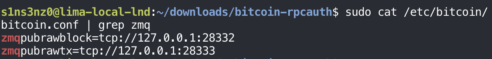
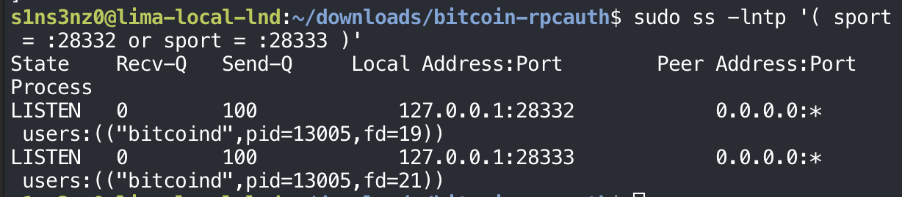

*Part 5 of the series. [Part 4](/posts/running-lnd-with-systemd-without-containers-lnd/) installed LND and gave it its own user and directories.*

Everything LND needs is now installed. Before it can run, it has to be able to talk to Bitcoin Core, and Part 4 ended on why that needs work: `lnd` can't read `bitcoind`'s cookie file, by design.

## RPC credentials for LND

### Generating them with rpcauth

Bitcoin Core ships a small script for this, [`rpcauth.py`](https://github.com/bitcoin/bitcoin/blob/v29.4/share/rpcauth/rpcauth.py), in its repository. It's short enough to read before running, and it shows exactly how the credential is made:

```python
salt = token_hex(16)
password = token_urlsafe(32)
password_hmac = hmac.new(salt.encode('utf-8'), password.encode('utf-8'), 'SHA256').hexdigest()
```

| Piece | How it's made |
|---|---|
| Salt | 16 random bytes from Python's `secrets` module, written as hex |
| Password | 32 random bytes from `secrets`, written as URL-safe base64 |
| HMAC | HMAC-SHA256 of the password, keyed with the salt |

The username is the one I pass in. The script prints `rpcauth=<user>:<salt>$<hmac>` for `bitcoin.conf`, and the password for the client, here LND. So Bitcoin Core never stores the password in plain text, only the salt and the HMAC: enough to check a password when a client logs in, not enough to recover it from the file. The random salt also means two users with the same password would still get different lines.

I fetched the script from the `v29.4` tag, the same version as the installed node, and generated credentials for a user named `lnd`:

```bash
mkdir -p ~/downloads/bitcoin-rpcauth
cd ~/downloads/bitcoin-rpcauth
curl -fL -o rpcauth.py \
  https://raw.githubusercontent.com/bitcoin/bitcoin/v29.4/share/rpcauth/rpcauth.py
python3 rpcauth.py lnd
```


*The generated `rpcauth=` line and password are covered.*

The script prints two things:

| Output | Where it goes | Who can read it |
|---|---|---|
| `rpcauth=lnd:<salt>$<hash>` | `bitcoin.conf`, so `bitcoind` can check the password | root and the `bitcoin` group, through the `0640` file from Part 2 |
| The password | LND's configuration, so it can log in | root and the `lnd` group, once LND's configuration exists |

The password is printed once and isn't stored anywhere else, so I copied it straight to a safe place. It shouldn't stay in the shell history or a notes file in my home directory.

### Adding the rpcauth line to bitcoin.conf

The `rpcauth=lnd:…` line goes into `/etc/bitcoin/bitcoin.conf`. I put it with the general settings, above the `[regtest]` section:

```bash
sudo cat /etc/bitcoin/bitcoin.conf
```

![sudo cat /etc/bitcoin/bitcoin.conf: regtest=1, server=1, daemon=0, printtoconsole=1, txindex=1, listen=0, then rpcauth=lnd: followed by the covered salt and HMAC, then the [regtest] section with rpcbind=127.0.0.1, rpcallowip=127.0.0.1, rpcport=18443](../../assets/images/lnd-without-containers/bitcoin-conf-rpcauth.png)

*The salt and HMAC are covered. They can't be turned back into the password, but there's no reason to publish them either.*

A line above `[regtest]` applies to every network, and `rpcauth` is one of the options Bitcoin Core accepts there; options tied to a specific network, like `rpcport` and `rpcbind`, are the ones that have to sit inside the section. The file keeps the owner and mode set in Part 2, `root:bitcoin` and `0640`, so editing it doesn't open it up to anyone else.

### Two ways into bitcoind's RPC

With `rpcauth` added, Bitcoin Core accepts two kinds of RPC login, and this lab uses both.

The first is the cookie I've been using since Part 3. Every time `bitcoind` starts, it writes a fresh random credential to `.cookie` in its data directory, here `/var/lib/bitcoind/regtest/.cookie`:

```bash
sudo cat /var/lib/bitcoind/regtest/.cookie
sudo -u bitcoin bitcoin-cli \
  -conf=/etc/bitcoin/bitcoin.conf \
  -datadir=/var/lib/bitcoind \
  getblockchaininfo
```


*The cookie's secret is covered.*

The file holds `__cookie__:` and a random secret, a username and password in one line. `bitcoin-cli` finds it through `-datadir` and logs in with it, which is why the `btc` function never needed a password. Reading it as my own user fails with `Permission denied`, the line cut off at the top of the screenshot: the data directory is `0700` and belongs to `bitcoin`.

| | Cookie | `rpcauth` |
|---|---|---|
| Credential | Random, rewritten at every `bitcoind` start | Fixed until I generate a new one |
| Stored by `bitcoind` | The secret itself, in `.cookie` | Only the salt and HMAC, in `bitcoin.conf` |
| Who can use it | Anyone who can read the data directory: here, only `bitcoin` (and root) | Anyone who knows the password |
| Used by | `bitcoin-cli` through the `btc` function | LND, running as `lnd` |

The cookie suits a client running as the same account, and it changes on every restart, which a long-running separate service like LND can't keep up with without reading the file each time. `rpcauth` gives LND a stable login of its own while `lnd` stays out of `bitcoind`'s files.

### Logging in as lnd with rpcauth

The real test is logging in the way LND will: as the `lnd` user, with the `rpcauth` password, and without any access to `bitcoind`'s files. Typing the password into the command line would leave it in the shell history and in the process list, so I read it into a shell variable first and passed it on standard input:

```bash
read -r -s -p 'LND RPC password: ' LND_RPC_PASSWORD
printf '%s\n' "$LND_RPC_PASSWORD" |
  sudo -u lnd bitcoin-cli \
    -conf=/dev/null \
    -datadir=/var/lib/lnd \
    -regtest \
    -rpcconnect=127.0.0.1 \
    -rpcport=18443 \
    -rpcuser=lnd \
    -stdinrpcpass \
    getblockchaininfo
```


| Part | Why |
|---|---|
| `read -r -s -p '…' LND_RPC_PASSWORD` | Prompt for the password without echoing it (`-s`), keep backslashes as typed (`-r`), and store it in a shell variable. It isn't exported, so it stays in this shell and never enters other programs' environments |
| `printf '%s\n' "$LND_RPC_PASSWORD" \|` | Hand the password to the next command on standard input. `printf` is a shell builtin, so the password never shows up as a command-line argument in `ps` |
| `sudo -u lnd` | Run as the account LND will use |
| `-conf=/dev/null` | Read no configuration file; `lnd` can't read `bitcoin.conf` anyway |
| `-datadir=/var/lib/lnd` | LND's own directory, which has no `.cookie`, so cookie login is impossible |
| `-regtest -rpcconnect=127.0.0.1 -rpcport=18443` | Where `bitcoind`'s RPC listens, spelled out since there's no config to read it from |
| `-rpcuser=lnd -stdinrpcpass` | Log in as `lnd` with the password from standard input |

`getblockchaininfo` came back with the same chain as before: regtest, height 101, the same tip. Since the cookie was out of reach, the only way that could work is the `rpcauth` credential. LND's RPC login is ready.

## ZMQ notifications

### Why LND needs them

RPC is request and response: LND asks, `bitcoind` answers. That's fine for lookups, but LND also has to know the moment a new block or transaction appears, to confirm channels and catch a peer cheating. Asking over and over would be slow and wasteful.

ZeroMQ (ZMQ) is a messaging library that lets one program publish a stream of messages and others subscribe to it. Bitcoin Core can publish to ZMQ sockets, and LND's `bitcoind` backend requires two of them:

```bash
sudo cat /etc/bitcoin/bitcoin.conf | grep zmq
```



| Setting | What `bitcoind` publishes |
|---|---|
| `zmqpubrawblock=tcp://127.0.0.1:28332` | Every new block, in full, as soon as it's connected to the chain |
| `zmqpubrawtx=tcp://127.0.0.1:28333` | Every transaction entering its mempool, and those in new blocks |

Bitcoin Core is the publisher and LND is the subscriber. Each side has its ZMQ component built in, `bitcoind`'s publisher and LND's subscriber, and those handle the connection and the message traffic on their own. Beyond these two lines here and the matching addresses in LND's configuration later, there's nothing to set up, no broker or extra service to run.

ZMQ is also a separate path from RPC. The `rpcauth` login above covers RPC only; the ZMQ sockets don't use it and have no login of their own. What keeps them private is where they listen: both are on `127.0.0.1`, like RPC, so nothing outside the VM can subscribe.

### Restarting and checking the sockets

`bitcoind` reads its configuration only at startup, so the new lines take effect after a restart. `getzmqnotifications` then lists the sockets it's actually publishing on:

```bash
sudo systemctl restart bitcoind
sudo -u bitcoin bitcoin-cli \
  -conf=/etc/bitcoin/bitcoin.conf \
  -datadir=/var/lib/bitcoind \
  -rpcwait -rpcwaittimeout=60 \
  getzmqnotifications
```


Both sockets are there, at the addresses from the configuration. `-rpcwait` covers the few seconds after the restart before RPC is back, as in Part 3.

`hwm` is the high-water mark: up to 1,000 messages can queue for a subscriber that falls behind. Past that, ZMQ drops new messages instead of letting memory grow. On a quiet regtest chain with a local subscriber, that limit won't come close.

`getzmqnotifications` is `bitcoind`'s own account of its sockets. `ss` asks the kernel instead, which shows what is really listening and on which address:

```bash
sudo ss -lntp '( sport = :28332 or sport = :28333 )'
```



| Flag or field | Meaning |
|---|---|
| `-l` | Only listening sockets |
| `-n` | Show numeric addresses and ports instead of resolving names |
| `-t` | TCP only |
| `-p` | Show the owning process; this needs `sudo` because the process belongs to `bitcoin` |
| `'( sport = :28332 or sport = :28333 )'` | Filter on the local (source) port, so only the two ZMQ sockets appear |
| `127.0.0.1:28332`, `127.0.0.1:28333` | Bound to loopback only. A socket open to the network would show `0.0.0.0` or the VM's own address here |
| `users:(("bitcoind",pid=13005,…))` | Both sockets belong to the running `bitcoind` |

The kernel agrees with `bitcoind`: both ZMQ sockets exist, both belong to `bitcoind`, and both accept connections only from inside the VM. That loopback binding is the only protection ZMQ has here, and this is the check that confirms it.

With the RPC login and both ZMQ feeds in place, `bitcoind` is ready for LND.

Next: [Configuring LND and running it as a service](/posts/running-lnd-with-systemd-without-containers-lnd-service/).
