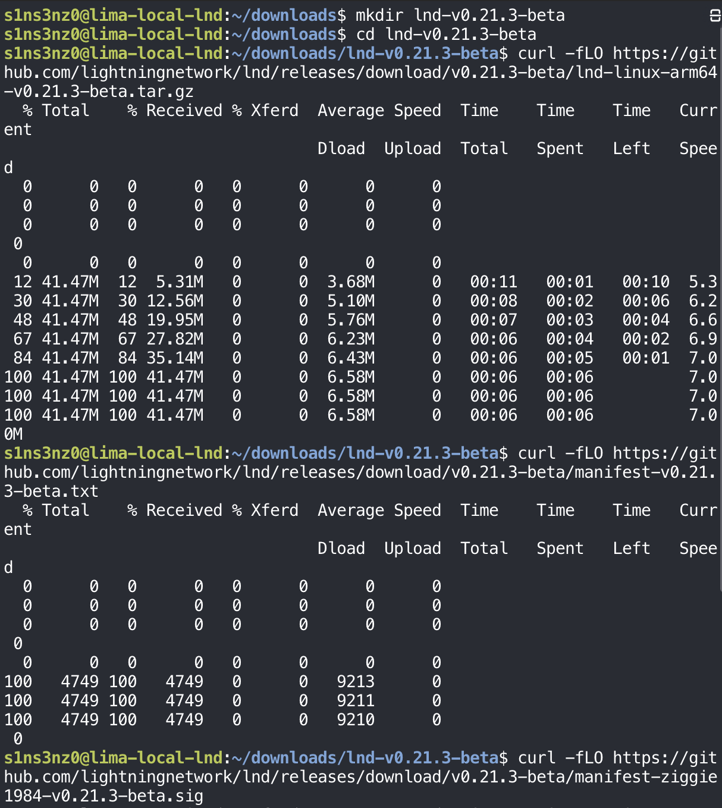
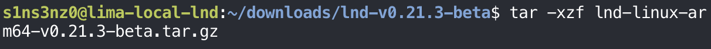

*Part 4 of the series. [Part 3](/posts/running-lnd-with-systemd-without-containers-bitcoind-service/) left `bitcoind` running on regtest as a systemd service, with 101 blocks mined.*

## Installing LND

### Downloading the release

Downloading and verifying LND follows the same pattern as Bitcoin Core in [Part 2](/posts/running-lnd-with-systemd-without-containers-bitcoin-core/): fetch the release, a file of hashes, and a signature over that file, then check both. The names differ:

| | Bitcoin Core | LND |
|---|---|---|
| Release | `bitcoin-29.4-aarch64-linux-gnu.tar.gz` | `lnd-linux-arm64-v0.21.3-beta.tar.gz` |
| Hash list | `SHA256SUMS` | `manifest-v0.21.3-beta.txt` |
| Signatures | One `SHA256SUMS.asc` holding every builder's signature | One `manifest-<signer>-v0.21.3-beta.sig` file per signer |
| Signing keys | `guix.sigs/builder-keys` | `scripts/keys/` in the LND repository |

The release matches the version whose CI pinned Bitcoin Core 29 in Part 2, and the `arm64` build matches the VM's `aarch64` architecture.

```bash
mkdir lnd-v0.21.3-beta
cd lnd-v0.21.3-beta
curl -fLO https://github.com/lightningnetwork/lnd/releases/download/v0.21.3-beta/lnd-linux-arm64-v0.21.3-beta.tar.gz
curl -fLO https://github.com/lightningnetwork/lnd/releases/download/v0.21.3-beta/manifest-v0.21.3-beta.txt
curl -fLO https://github.com/lightningnetwork/lnd/releases/download/v0.21.3-beta/manifest-ziggie1984-v0.21.3-beta.sig
```



### Verifying the signature, then the checksum

The signature here is from `ziggie1984`, one of the LND maintainers who sign releases. Their public key lives in the LND repository, so I fetched it, checked its fingerprint before importing it, and then verified the manifest and the tarball.

```bash
curl -fL -o ziggie1984.asc \
  https://raw.githubusercontent.com/lightningnetwork/lnd/master/scripts/keys/ziggie1984.asc
gpg --show-keys --with-fingerprint ziggie1984.asc
gpg --import ziggie1984.asc
gpg --verify \
  manifest-ziggie1984-v0.21.3-beta.sig \
  manifest-v0.21.3-beta.txt
sha256sum --ignore-missing --check manifest-v0.21.3-beta.txt
```

![curl -fL -o ziggie1984.asc downloads the key (1079 bytes); gpg --show-keys --with-fingerprint shows an ed25519 key created 2021-11-28, expiring 2035-11-03, fingerprint 5F75 437E 1169 5F86 D50C 11BB 1AFF 9C4D CED6 D666, uid ziggie ("First ziggie Key") <ziggie1984@protonmail.com>; gpg --import imports it; gpg --verify reports a Good signature from ziggie made Wed Sep 2 10:28:58 2026 KST with the same fingerprint, plus the usual not-certified warning; sha256sum --ignore-missing --check manifest-v0.21.3-beta.txt prints lnd-linux-arm64-v0.21.3-beta.tar.gz: OK](../../assets/images/lnd-without-containers/lnd-verify.png)

| Step | What it proves |
|---|---|
| `gpg --show-keys --with-fingerprint` | Shows the key's fingerprint before it touches my keyring, so I can compare it with the one the LND project publishes |
| `gpg --import` | Adds the key to my keyring |
| `gpg --verify … .sig … .txt` | `Good signature`: the manifest is exactly what `ziggie1984` signed. The fingerprint matches the key I inspected |
| `sha256sum --check manifest…` | `OK`: the tarball matches the hash in that signed manifest |

The order is the reverse of Part 2, and it reads better this way: first prove the list of hashes is authentic, then check the file against it. The `WARNING` line means the same thing as before: the key is valid, but I haven't certified it myself, so trust rests on where the key came from.

That's also the limit of this check. The key and the release both come from GitHub, and only one signer is verified here. Each release usually carries signatures from several maintainers; verifying more than one, the way Part 2 did for Bitcoin Core's builders, would make a single compromised key or account not enough.

### Installing lnd and lncli

With the tarball verified, I extracted it, the same `tar -xzf` as for Bitcoin Core:

```bash
tar -xzf lnd-linux-arm64-v0.21.3-beta.tar.gz
```



Then the same `install` into `/usr/local/bin`, owned by root and read-only to everyone else, and a check that both commands are on the `PATH` and report the verified version:

```bash
sudo install -o root -g root -m 0755 \
  lnd-linux-arm64-v0.21.3-beta/lnd \
  lnd-linux-arm64-v0.21.3-beta/lncli \
  /usr/local/bin/
command -v lnd lncli
lnd --version
lncli --version
```


`lnd` is the node daemon; `lncli` is its command-line client, the way `bitcoin-cli` is for `bitcoind`. `command -v` now prints a path for each, where it printed nothing in Part 1's clean-VM check, and both report `0.21.3-beta` built from the `v0.21.3-beta` tag.

## Configuring LND

### A service user and directories for lnd

`lnd` gets the same treatment as `bitcoind` in Part 2: its own system user and group with no login shell, a configuration directory that root owns and `lnd` can only read, and a data directory only `lnd` can enter.

```bash
sudo useradd --system --user-group \
  --home-dir /var/lib/lnd \
  --no-create-home \
  --shell /usr/sbin/nologin \
  lnd
sudo install -d -o root -g lnd -m 0750 /etc/lnd
sudo install -d -o lnd -g lnd -m 0700 /var/lib/lnd
id lnd
getent passwd lnd
ls -ld /etc/lnd /var/lib/lnd
```


This time the checks are in the screenshot too. `getent passwd` prints the account's line from the user database, fields separated by colons:

| Field | Value | Meaning |
|---|---|---|
| Name | `lnd` | The account |
| Password | `x` | The password lives in `/etc/shadow`; a system account has none to log in with |
| UID / GID | `997` / `983` | Numbers from the system range, because of `--system` |
| Comment | (empty) | No full name, since nobody sits behind this account |
| Home | `/var/lib/lnd` | The data directory |
| Shell | `/usr/sbin/nologin` | No interactive login |

`id lnd` shows that `lnd` belongs only to its own group. In particular, it isn't in the `bitcoin` group, so it can't read anything inside `/var/lib/bitcoind`, including the RPC `.cookie`. That's deliberate, and it means LND needs its own credentials for `bitcoind`'s RPC, which comes next.

Next: connecting LND to `bitcoind` over RPC and ZMQ.
