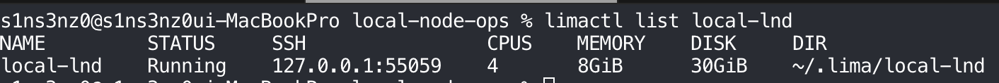
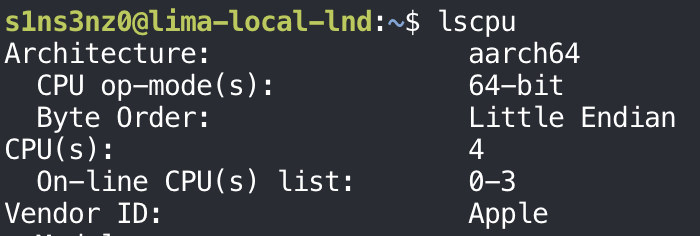
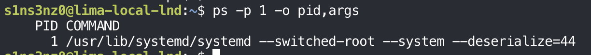
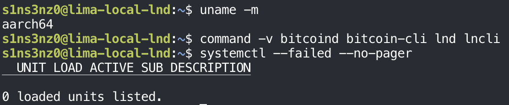

I already run LND nodes in my local environment, on a Mac and in WSL, and I'm used to deploying simple applications to K3s. This series goes the other way: I'll run LND and an Ethereum Hoodi node directly on the machine, without containers or Kubernetes.

Containers and Kubernetes caught on because running applications by hand was hard work for operators. A container packages an application with its dependencies so it runs the same way everywhere, and Kubernetes schedules those containers, restarts them when they fail, and wires them together. Those tools hide a lot of the operating system. Doing the same work by hand is how I want to see what they hide.

I'm not new to Linux. I've used Kali in a lot of ethical hacking labs, and Ubuntu for kernel settings. What I want from this series is different: tuning these nodes for day-to-day operations, and getting faster and more fluent in the terminal along the way. This first post covers the lab environment.

One more change from my earlier posts: I used to publish command output as Markdown text, which proves nothing about whether I actually ran it. In this series I show screenshots of the commands and their real output instead.

## Prerequisites

The lab runs on one machine, in four layers:

| Layer | What it is here | What it does |
|---|---|---|
| Host | An Apple silicon (ARM) Mac with 48 GB of memory, running macOS | Owns the hardware and runs the virtual machine |
| VM | `local-lnd`, an Ubuntu 26.04 ARM64 virtual machine managed by Lima, with 4 vCPUs, 8 GiB of RAM, and a 30 GiB disk | A separate Linux computer carved out of the Mac |
| Guest kernel | The Linux kernel inside the VM, `7.0.0-28-generic` | Runs every process in the lab; macOS's own kernel never sees them directly |
| Service manager | systemd, the first process the guest kernel starts (PID 1) | Starts LND and the Hoodi node at boot, restarts them when they crash, and collects their logs |

### Host

macOS can't run Linux programs on its own kernel, so the Linux side of the lab needs a virtual machine. The host only lends the VM part of its CPU, memory, and disk. On the Mac, `limactl` shows what the VM got:

```bash
limactl list local-lnd
```



4 CPUs, 8 GiB of the Mac's 48 GB, and a 30 GiB disk go to the lab; the rest stays with macOS. Lima also forwards a local port, here `127.0.0.1:55059`, for SSH into the VM, and keeps the VM's files under `~/.lima/local-lnd`.

### VM

[Lima](https://lima-vm.io/) creates and runs Linux VMs on macOS from a short YAML template. The VM uses the same ARM64 architecture as the Mac, so it runs native ARM binaries without emulation. That matters later: every binary in this lab, LND included, has to be the ARM64 build.

```bash
lscpu
```



`aarch64` is the kernel's name for 64-bit ARM; release downloads usually call the same architecture `arm64`. The 4 CPUs match what Lima assigned, and the vendor is Apple: the VM runs on the Mac's own cores.

Memory, disk, kernel, and OS from inside the VM:

```bash
free -h
lsblk
df -h
uname -r
cat /etc/os-release
```


| Check | Result | Note |
|---|---|---|
| Memory | 7.7 GiB total, 7.3 GiB available | A little under 8 GiB: the kernel reserves some before `free` counts it |
| Swap | 0 B | No swap. If the nodes run out of memory, the kernel kills a process instead of slowing down |
| Disk | `vda`, 30 GiB; `/` has 26 GiB free | The tightest resource here; worth checking again before any chain data goes on it |
| `vdb` | 19 MiB, read-only, at `/mnt/lima-cidata` | Lima's cloud-init disk: the user, SSH key, and first-boot settings |
| `/tmp` | `tmpfs`, 3.9 GiB | In memory, so anything written there is gone after a reboot |
| OS | Ubuntu 26.04 LTS (Resolute Raccoon) | |

### Guest kernel

The VM boots its own Linux kernel, `7.0.0-28-generic` from `uname -r` above. This is the line between a VM and a container: a container shares the host's kernel, while a VM brings its own. The kernel settings I tune in this series, such as file descriptor limits and network parameters, apply to this kernel and leave macOS untouched.

### Service manager

Without Kubernetes, nothing restarts a crashed process or starts it at boot unless I set that up. On Ubuntu, that job belongs to systemd. Each node gets a unit file that says how to start it, which user it runs as, and what to do when it fails. Much of this series is about writing and hardening those units, the work a Kubernetes Deployment or StatefulSet did for me before.

Process 1 in the VM confirms it:

```bash
ps -p 1 -o pid,args
```



| Argument | Meaning |
|---|---|
| `--switched-root` | systemd first ran from the initramfs, the small boot filesystem, then switched to the real root filesystem on the disk |
| `--system` | The system-wide instance that manages services, not a per-user instance |
| `--deserialize=44` | After re-executing itself, systemd read its saved state back from file descriptor 44, so the switch kept track of what was already running |

Every service in this lab will be a child of this process.

## Setting up the lab

### Starting from a clean VM

Before installing anything, I checked that the VM is a clean slate: the right architecture, none of the Bitcoin or Lightning binaries already on the `PATH`, and no failed services.

```bash
uname -m
command -v bitcoind bitcoin-cli lnd lncli
systemctl --failed --no-pager
```



| Check | Result | Meaning |
|---|---|---|
| `uname -m` | `aarch64` | Downloads must be the ARM64 builds |
| `command -v …` | No output | None of `bitcoind`, `bitcoin-cli`, `lnd`, or `lncli` is installed yet |
| `systemctl --failed` | 0 units | Nothing is broken before I start, so any failure later is mine |

`command -v` prints the path of each command it finds and nothing for the ones it doesn't, which makes empty output the expected result here. `--no-pager` keeps `systemctl` from opening `less`, so the output stays in the terminal and in the screenshot.

Next: [Installing and configuring Bitcoin Core](/posts/running-lnd-with-systemd-without-containers-bitcoin-core/).
