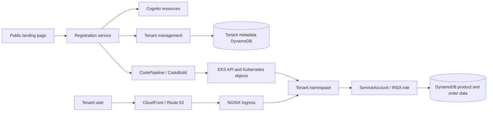

The first article described the EKS SaaS service. The second article classified its impact as Moderate and selected the NIST SP 800-53B Moderate baseline with OWASP ASVS Level 2 as the application starting point.

This stage asks what can go wrong in the actual architecture. The goal is not to produce another generic Kubernetes checklist. It is to model concrete paths through the shared control plane, tenant namespaces, ingress routing, cloud identities, data stores, and provisioning pipeline.

The AWS sample uses a shared EKS cluster, namespace-per-tenant isolation, NGINX Ingress, tenant-specific Cognito user pools, and both pooled and siloed DynamoDB storage. Those relationships create threats that cannot be seen by inspecting a Deployment object in isolation. [AWS EKS SaaS Architecture Guide](https://github.com/aws-samples/aws-saas-factory-eks-reference-architecture/blob/main/GUIDE.md)

## Table of contents

## Begin with the operating scenario

The threat model uses the service profile from the previous stages. The landing page is public and can start tenant registration. Tenant users authenticate through their tenant's Cognito user pool. Provider operators use a separate administration application to manage tenants and platform settings.

The sample's registration service creates or coordinates Cognito resources, tenant metadata, namespaces, ingress objects, and application deployments. CodePipeline and CodeBuild execute Kubernetes configuration and deployment steps. Product and order services then access DynamoDB through Kubernetes service accounts mapped to AWS IAM roles.

This scenario is more precise than saying "the cluster is internet-facing." It identifies where an anonymous request can begin, where tenant identity is resolved, and which non-human actors can create or modify platform state.

## Data flow and trust boundaries

The primary flow is:



The model records trust boundaries at the public registration endpoint, the provider administration application, the shared microservices, the EKS API, the ingress controller, the namespace boundary, the Kubernetes-to-AWS identity mapping, and the pooled DynamoDB access path.

A threat is attached to a boundary and a path rather than only to a technology. "Kubernetes is insecure" is not a useful threat statement. "A tenant request with a forged path reaches another namespace through a shared NGINX Ingress rule" is concrete enough to analyze and test.

## T-01: Public registration can create unintended platform state

The landing page is intentionally public and the registration service is internet-facing. Its purpose is to onboard a new tenant, but that operation creates identities, metadata, namespaces, ingress rules, and workloads.

If the service accepts an untrusted or weakly verified registration request, an attacker may create arbitrary tenants, exhaust cluster or AWS resources, register a domain they do not control, or trigger provisioning for unauthorized input.

This is an elevation-of-privilege and denial-of-service threat against the control plane. The requirement is not simply "protect the sign-up page." It must define which fields are validated, whether registration requires approval or verification, how rate limits are applied, and which identity is allowed to initiate provisioning.

## T-02: Tenant identity can be confused during routing or authentication

The sample resolves tenant-specific authentication configuration through a shared service and routes requests using tenant-qualified paths and ingress rules. A mismatch between the hostname, path, tenant metadata, and Cognito user pool can authenticate a user in the wrong tenant context.

An attacker may attempt to alter a tenant identifier, reuse a token issued for another user pool, or exploit a default route when an expected tenant mapping is missing. The result is a confused-deputy path in which a valid identity is accepted for the wrong tenant.

This threat crosses the browser, tenant-management service, Cognito configuration, and ingress boundary. Tests must verify that tenant context comes from a trusted source, that token issuer and tenant mapping agree, and that missing or conflicting context is rejected before a microservice is called.

## T-03: Ingress rules can route one tenant to another namespace

NGINX Ingress is shared by tenant workloads and receives tenant-specific routing rules during onboarding. A malformed, overlapping, or overly broad rule can send a request for one tenant to another tenant's product or order service.

This threat is different from an application authorization bug. The request may be routed to the wrong workload before the application has an opportunity to evaluate the caller's tenant claim.

The requirement must cover exact host and path matching, default-backend behavior, rule review, and safe handling of an unknown tenant. A route that falls through to a shared service must not become an unintended cross-tenant access path.

## T-04: Namespace isolation is assumed without network enforcement

Namespaces organize Kubernetes resources, but they do not automatically prevent Pod-to-Pod communication. If network policies are absent, incomplete, or applied only to some namespaces, a compromised workload may connect directly to another tenant's service.

The threat becomes more serious when a service exposes administrative endpoints or trusts requests from an internal network without rechecking tenant identity. A compromised product Pod could scan service names, reach order endpoints, or attempt to access shared services.

The requirement should define default-deny behavior, explicitly allowed service paths, and how shared services are protected. A benchmark result saying that a NetworkPolicy object exists is not enough; the effective policy must deny the unwanted connection.

## T-05: A service account can obtain the wrong AWS role

The architecture uses IAM Roles for Service Accounts to connect Kubernetes service accounts to AWS permissions. A mistaken annotation, trust-policy condition, or namespace/service-account binding can give a tenant workload credentials intended for another service or tenant.

If the order service receives a role for another tenant's table, silo isolation fails. If a workload receives a platform role, the compromise can move from the cluster into account-level management APIs.

The requirement must verify the complete mapping: Pod to ServiceAccount, ServiceAccount to IAM role, IAM trust policy to cluster identity, and IAM actions to approved resources. Inspecting only the annotation on a service account does not establish the effective cloud permission.

## T-06: Pooled DynamoDB access can cross the tenant boundary

The product service stores multiple tenants in one DynamoDB table and relies on a tenant identifier and IAM condition to restrict access. A missing condition, a user-controlled partition key, or an incorrectly derived claim can expose or modify another tenant's products.

This is a direct cross-tenant data threat. The order service's separate table per tenant changes the storage boundary, but it does not remove the need to restrict the role and prevent a workload from selecting another tenant's table.

The requirement should be expressed as a negative property: a tenant identity must not read or write another tenant's records, even when the request supplies a forged, missing, or conflicting tenant identifier. The test must observe the actual data operation rather than only checking the request format.

## T-07: Provider administration can become a platform-wide path

The provider administration application manages tenant policies and settings. Its users are authenticated through a separate Cognito pool, but an authenticated provider user may still have more authority than the operation requires.

A stolen or misused provider account could modify tenant mappings, invoke onboarding, change deployment parameters, or delete tenant resources. A vulnerability in the administration application could therefore affect every tenant even when tenant namespaces are configured correctly.

The threat model treats provider operations as a separate control-plane class. Requirements must distinguish read-only support access, tenant-scoped administration, and platform-wide operations, with stronger approval and audit expectations for the last category.

## T-08: CodePipeline or CodeBuild can deploy beyond its intended tenant

Tenant onboarding uses CodePipeline and CodeBuild to run Kubernetes commands and apply tenant-specific resources. The pipeline receives tenant parameters and can create namespaces, ingress resources, and microservices.

If the build role or build input is manipulated, the pipeline may deploy to another namespace, change shared services, use an attacker-controlled image, or apply a wildcard Kubernetes permission. This is a supply-chain and privilege-escalation threat that crosses AWS IAM, the build environment, the EKS API, and tenant resources.

The requirement must constrain both the AWS role and the Kubernetes identity used by the pipeline. Tenant parameters must be validated against the approved onboarding record, and the deployment must be attributable to a reviewed source revision and image digest.

## T-09: Shared controllers and admission paths can amplify a compromise

The ingress controller, External DNS, and any admission or operator components have cluster-wide influence. A compromise of one of these components can modify routing, DNS records, or the admission of workloads across namespaces.

This threat is easy to miss when the review focuses only on tenant application Pods. A tenant workload that can reach a controller's administrative endpoint, or a deployment role that can change the controller configuration, may turn a local compromise into a cluster-wide incident.

The resulting requirement should identify controller permissions, administrative endpoints, admission policy, and change approval. Shared controllers need a separate blast-radius classification from ordinary tenant services.

## T-10: Secrets and identity configuration can leak through logs or configuration

The sample passes tenant authentication configuration through shared services and browser-side application initialization. It also creates user pools, clients, and deployment metadata during onboarding.

If tokens, client secrets, temporary credentials, or tenant-sensitive configuration are written to logs, build artifacts, browser responses, or error messages, an attacker may reuse them outside the intended flow.

The requirement is to define which identity fields may leave each boundary, remove secrets from logs and public responses, and ensure that temporary credentials are short-lived and scoped. The fact that Cognito is used does not prove that the surrounding configuration path is safe.

## Threats become testable requirements

The threat model produces more than a list of concerns. Each threat records its entry point, affected boundary, likely actor, impacted asset, and verification work.

```yaml
- id: T-06
  category: elevation_of_privilege
  entrypoint: tenant_product_api
  path:
    - tenant-user
    - product-service
    - pooled-product-table
  affected_scope:
    tenant_scope: subset
    data_scope: shared_dataset
  verification:
    - forged_tenant_identifier_denied
    - missing_tenant_claim_denied
```

The threat does not assert that the sample is currently exploitable. It identifies a plausible failure path that must be reviewed against the deployed configuration and tested behavior.

## What this stage produces

The EKS threat model captures the paths that later stages will prioritize:

```text
public registration
  → shared control plane
  → tenant provisioning
  → EKS API and Kubernetes objects
  → namespace and ingress
  → ServiceAccount and AWS IAM
  → tenant data stores
```

The next stage will calculate the blast radius of these paths. It will distinguish a failure contained within one tenant namespace from a failure that reaches the shared cluster, control plane, AWS account, or every tenant's data.
