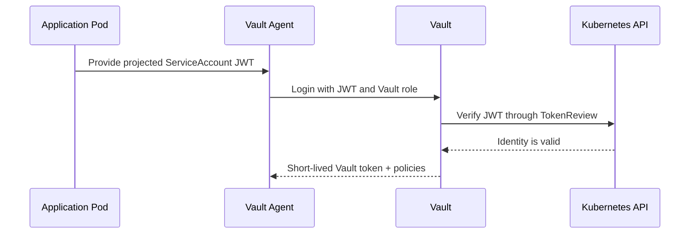
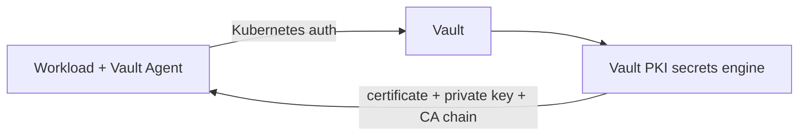
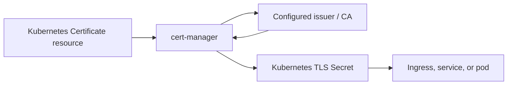

Vault is a trusted service that stores secrets, authenticates workloads, and decides which workload may read which secret. Kubernetes runs the workloads; Vault controls access to sensitive data.

```mermaid
flowchart TB
    subgraph K8S["Kubernetes cluster"]
        API["Kubernetes API server<br/>Pod admission · TokenReview"]

        subgraph APPS["Application namespace"]
            subgraph POD["Application Pod"]
                JWT["Projected ServiceAccount JWT"]
                AGENT["Vault Agent<br/>Init container / sidecar"]
                FILES["Shared memory volume<br/>Secrets · certificates · private keys"]
                APP["Application container"]

                JWT -->|"Authenticate"| AGENT
                AGENT -->|"Render files"| FILES
                FILES -->|"Read / reload"| APP
            end
        end

        subgraph VAULT["vault namespace"]
            INJECTOR["Vault Agent Injector<br/>Admission webhook"]
            SVC["Vault API Service<br/>HTTPS :8200"]

            subgraph HA["Three-server StatefulSet · Integrated Raft"]
                direction LR
                V1["vault-1<br/>Follower / standby"]
                V0["vault-0<br/>Leader / active"]
                V2["vault-2<br/>Follower / standby"]

                V0 <-->|"Raft replication<br/>Cluster port :8201"| V1
                V0 <-->|"Raft replication<br/>Cluster port :8201"| V2

                D1[("PVC 1<br/>Local Raft data")]
                D0[("PVC 0<br/>Local Raft data")]
                D2[("PVC 2<br/>Local Raft data")]

                V1 --- D1
                V0 --- D0
                V2 --- D2
            end

            subgraph LOGIC["Vault capabilities · run inside the servers"]
                AUTH["Kubernetes auth<br/>Roles + ACL policies"]
                KV["KV secrets engine<br/>Stored application secrets"]
                PKI["PKI secrets engine<br/>Intermediate CA · issuance roles"]
            end

            SVC -->|"Requests to active node"| V0
            V0 --- AUTH
            V0 --- KV
            V0 --- PKI
        end

        subgraph CERTNS["cert-manager namespace · optional"]
            CM["cert-manager<br/>Certificate lifecycle controller"]
        end

        TLS["Vault listener TLS Secret<br/>Mounted into all three servers"]
    end

    API -.->|"AdmissionReview"| INJECTOR
    INJECTOR -.->|"Mutation response:<br/>add Agent + volumes"| API

    AGENT -->|"Login + secret requests<br/>HTTPS :8200"| SVC
    AUTH -->|"Validate JWT through TokenReview"| API

    ROOT["Root CA<br/>Protected signing key"]
    ROOT -->|"Sign intermediate CA certificate"| PKI
    CM -->|"Authenticate + submit CSR<br/>through Vault API"| PKI
    CM -->|"Write issued certificate + key"| APP_TLS["Application TLS Secret<br/>Alternative to Agent delivery"]
    APP_TLS -->|"Mount certificate files"| APP

    BOOT["Bootstrap / external CA"]
    BOOT -->|"Issue Vault listener certificate"| TLS
    TLS -.->|"TLS material"| V0
    TLS -.->|"TLS material"| V1
    TLS -.->|"TLS material"| V2

    KMS["Cloud KMS / HSM<br/>Auto-unseal"]
    V0 --> KMS
    V1 --> KMS
    V2 --> KMS

    SNAP["Snapshot workflow"]
    V0 -->|"Raft snapshot API"| SNAP
    SNAP --> BACKUP[("Protected backup storage")]

    AUDIT["Protected audit destination"]
    V0 -->|"Local audit output"| AUDIT
    V1 -->|"Local audit output"| AUDIT
    V2 -->|"Local audit output"| AUDIT

    style APPS fill:transparent,stroke:#888,stroke-dasharray:6 4
    style VAULT fill:transparent,stroke:#888,stroke-dasharray:6 4
    style CERTNS fill:transparent,stroke:#888,stroke-dasharray:6 4
    style LOGIC fill:transparent,stroke:#aaa,stroke-dasharray:2 3
```



## 1. The Vault Server: the central authority

Vault servers provide the API that clients use to authenticate and fetch secrets. A production installation normally has multiple Vault servers for availability.

One server is the **active** node. It serves writes and coordinates the cluster. Other nodes are **standbys**. They replicate Vault data and can become active if the current leader fails.

Vault is not itself a Kubernetes Secret. It is an application with its own encrypted storage, access rules, tokens, audit records, and recovery process.

## 2. Storage: where Vault keeps its state

Vault needs durable storage for:

- encrypted secret data
- policies
- auth-method configuration
- token and lease state
- audit-device configuration
- PKI issuer and certificate metadata, if Vault runs PKI

A common Kubernetes design uses **integrated Raft storage**. Each Vault server has persistent storage, and the servers replicate changes through the Raft consensus protocol.

When a secret changes, the active Vault server records it and replicates it to enough peer servers before treating the change as committed. This avoids dependence on a separate Consul cluster.

The storage layer must be backed up independently. Raft snapshots are the normal backup unit for an integrated-storage Vault cluster. A recovery plan needs tested snapshot restoration, not just a successful snapshot upload.

## 3. Sealing and unsealing

Vault encrypts all of its stored data. Before it can serve requests after startup, it must be **unsealed**.

There are two common ways to handle this:

1. **Manual unseal**: operators provide enough unseal-key shares after Vault starts.
2. **Auto-unseal**: Vault uses a trusted key-management service, such as AWS KMS, Azure Key Vault, GCP Cloud KMS, or an HSM.

With auto-unseal, Vault asks the external KMS to decrypt the key material it needs to open its storage. The KMS does not become the Vault database; it only protects the key used in the unseal process.

A Kubernetes Vault pod should obtain cloud access through workload identity, such as AWS IRSA or EKS Pod Identity, rather than static cloud access keys.

## 4. Kubernetes Service Accounts: workload identity

Kubernetes gives each pod an identity through its **ServiceAccount**. Vault uses that identity to decide whether a pod is allowed to log in.

A ServiceAccount token is a JWT. Modern Kubernetes supports projected tokens with a chosen audience and a limited lifetime. For Vault, a pod should use a projected token whose audience is `vault`, rather than relying on a broadly mounted token.



Vault’s Kubernetes auth method binds a Vault role to details such as:

- permitted ServiceAccount names
- permitted Kubernetes namespaces
- token audience
- Vault policies
- Vault token TTL and maximum TTL

This lets Vault distinguish, for example, a billing API pod from a database migration pod, even if both are in the same cluster. [Vault Kubernetes auth documentation](https://developer.hashicorp.com/vault/docs/auth/kubernetes), [Kubernetes ServiceAccount documentation](https://kubernetes.io/docs/concepts/security/service-accounts/).

## 5. Vault policies: authorization after authentication

Authentication establishes the workload’s identity. A Vault policy defines what that identity can do.

A least-privilege policy usually allows only the exact operations and paths a workload needs:

```hcl
path "kv/data/payments/api" {
  capabilities = ["read"]
}
```

A workload with this policy can read that one path. It cannot list every secret, edit secret values, create new policies, issue certificates, or administer Vault.

A good design has separate roles and policies for separate applications and functions. Sharing one broad “application” policy across many pods makes later separation and incident response much harder.

## 6. Vault Agent and the Injector

Vault Agent is the local helper that authenticates to Vault and delivers secrets to an application. The application does not need to embed a Vault token or implement Vault login code.

The **Vault Agent Injector** is an admission webhook. When Kubernetes creates an annotated pod, the Injector mutates the pod specification to add:

- a Vault Agent init container, sidecar, or both
- an in-memory shared volume for rendered files
- Agent configuration
- any projected token volume needed for Vault authentication

The Injector is not the Vault server. It only prepares pods to use Vault. The actual authentication and authorization decisions still happen at the Vault server. [Vault Agent Injector documentation](https://developer.hashicorp.com/vault/docs/deploy/kubernetes/injector).

## 7. Init container versus sidecar

There are two important Agent operating modes.

| Mode | Behavior | Best fit |
|---|---|---|
| **Init container** | Fetches and renders secrets before the app starts, then exits. | Secrets that change only during controlled deployment or restart. |
| **Sidecar** | Remains running, renews Vault tokens, and can re-render secrets. | Dynamic secrets or regularly rotated certificates, if the application can reload them. |

A sidecar alone does not make secret rotation complete. The application must notice and reload the updated file, or be restarted safely. A database client that only reads its password at startup, for example, still needs a restart or explicit reload action.

## 8. Secret delivery: files, not environment variables

Vault Agent commonly renders secrets into a shared in-memory volume such as:

```text
/vault/secrets/database-password
/vault/secrets/tls.crt
/vault/secrets/tls.key
```

The application reads the files from that mount. This is usually preferable to environment variables because environment values are fixed at process start and can accidentally appear in diagnostics or child-process environments.

The secret still exists in the application pod’s memory or filesystem view, so Kubernetes isolation, pod access control, and container hardening remain essential. Vault reduces distribution and authorization risk; it cannot protect a compromised process that is legitimately allowed to read a secret.

## 9. PKI management: who issues certificates?

PKI management is a distinct responsibility from storing ordinary secrets. It covers:

- CA private keys
- root and intermediate certificate authorities
- certificate issuance rules
- certificate lifetimes
- renewal
- revocation data such as CRLs or OCSP
- trust-distribution of CA certificates

There are two common Kubernetes architectures.

### Option A: Vault owns PKI

Vault’s **PKI secrets engine** acts as a certificate authority. A workload authenticates to Vault, then receives a short-lived X.509 certificate according to a PKI role.



This is a strong fit when certificates are workload credentials, especially for mTLS. Vault can issue one certificate per workload instance, use short TTLs, and enforce issuance policy through the same identity and policy system used for secrets. [Vault PKI secrets engine](https://developer.hashicorp.com/vault/docs/secrets/pki).

### Option B: cert-manager owns PKI delivery

In this pattern, **cert-manager** watches Kubernetes `Certificate` resources and writes the resulting certificate and private key into a Kubernetes Secret. Its issuer may be an internal CA, a public CA, or even Vault through a Vault-backed issuer integration.



This is especially natural for Kubernetes-native certificates, such as ingress TLS or certificates needed by a controller.

### Choosing the owner

The key question is: **which system is the certificate authority of record?**

- If Vault is configured with its PKI secrets engine and issues certificates, then **Vault owns PKI**.
- If cert-manager uses its own issuer or an external CA, then **cert-manager and that issuer own PKI**; Vault may still store or consume certificates but is not the CA.
- If cert-manager requests certificates from Vault, then **Vault owns issuance policy and CA keys**, while cert-manager manages Kubernetes lifecycle and Secret delivery.

Vault Agent using TLS to connect to Vault does **not** mean Vault manages PKI. It only means the Agent trusts a CA certificate and verifies Vault’s server certificate. The server certificate might be issued by Vault PKI, cert-manager, an enterprise PKI, or a cloud private CA.

## 10. TLS and mTLS

TLS protects communication between clients and Vault:

- the client verifies Vault’s certificate;
- Vault proves it controls the private key for that certificate;
- traffic is encrypted in transit.

With **mutual TLS (mTLS)**, Vault or another service also verifies a client certificate. This adds a cryptographic workload identity alongside, or sometimes instead of, the Kubernetes ServiceAccount identity.

For most in-cluster Vault Agent authentication flows, Kubernetes auth establishes workload identity and TLS protects the connection. PKI-issued mTLS certificates are more commonly used for service-to-service authentication or controlled external client access.

## 11. Network policies are a second boundary

NetworkPolicy should restrict which pods can reach Vault’s API.

This is important, but network access is not authorization:

1. A NetworkPolicy may allow a workload to reach Vault on port 8200.
2. Vault still requires valid authentication.
3. Vault still applies a policy that limits secret paths and operations.

Both boundaries matter. Network policy limits which systems may attempt access. Vault authentication and policy determine whether the attempt is allowed.

## 12. Auditing and operations

Vault audit devices record requests to Vault, including authentication, allowed secret reads, denied actions, and request metadata. Audit logs should be protected because they can reveal sensitive operational context even when Vault redacts secret values.

A complete operating model also includes:

- monitoring Vault availability, seal state, and storage health;
- backup and restore testing;
- certificate-expiry monitoring;
- policy review;
- controlled root-token use;
- revocation and incident-response procedures;
- upgrade planning for both Vault and Kubernetes.

The central idea is simple: Kubernetes provides the workload identity and lifecycle; Vault verifies that identity, applies policy, and supplies the minimum secret or certificate needed by the workload.
