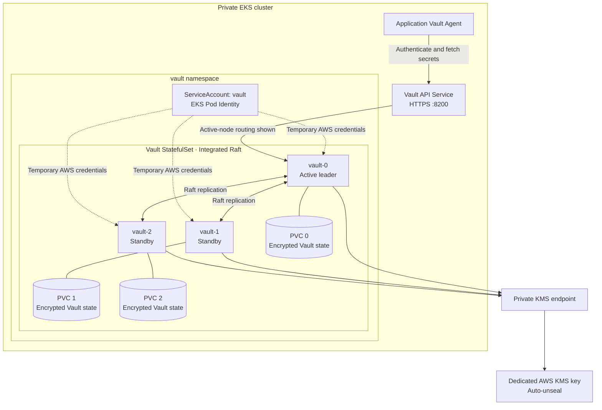
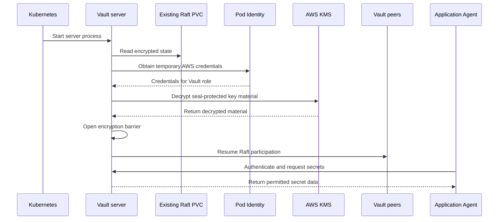

Vault must recover after Kubernetes pod restarts while keeping stored secrets protected. This project combines **AWS KMS auto-unseal**, **EKS Pod Identity**, and **three Vault servers using integrated Raft storage**.

This article explains how those components work together. The configuration excerpts describe the project’s design; they do not, by themselves, prove the current live deployment’s health.

## 1. What Does “Sealed” Mean?

A sealed Vault server can access its storage, but it cannot decrypt the protected data. Its process may be running while normal secret operations remain unavailable.

Unsealing makes the required encryption-key material available in memory. Vault can then open its encryption barrier and serve authorized requests. Persistent data remains encrypted.

Sealing removes the required key material from memory, preventing further normal access through that server. [HashiCorp: Seal and Unseal](https://developer.hashicorp.com/vault/docs/concepts/seal).

Three security questions must remain separate:

| Question | Mechanism |
|---|---|
| Can Vault access its encrypted data? | Seal and unseal |
| Who is requesting a secret? | Authentication |
| May that identity read this secret? | Authorization policies |

An unsealed Vault still requires applications to authenticate and satisfy its policies.

## 2. The Project’s Three-Server Architecture

The project configures three Vault replicas, each with persistent storage:

```yaml
server:
  serviceAccount:
    create: true
    name: vault

  ha:
    enabled: true
    replicas: 3
    raft:
      enabled: true
      setNodeId: true

  dataStorage:
    enabled: true
    size: 20Gi
    storageClass: gp3-encrypted
```



The diagram shows `vault-0` as the current leader; another member can take that role.

Raft replicates state and coordinates leadership. In a cluster of three voting servers, two are required for quorum. Unsealing and quorum are distinct requirements: an unsealed server alone does not establish a healthy three-member cluster. [HashiCorp: Integrated Storage](https://developer.hashicorp.com/vault/docs/concepts/integrated-storage).

## 3. Configuring AWS KMS Auto-Unseal

The Vault server configuration selects AWS KMS as its seal provider:

```hcl
seal "awskms" {
  region     = "ap-northeast-2"
  kms_key_id = "REPLACE_WITH_VAULT_UNSEAL_KEY_ARN"
}
```

Deployment preparation replaces the placeholder with the dedicated key ARN.

The ARN identifies the key. It does not contain cryptographic key material, and putting it in the configuration does not grant permission to use KMS.

Terraform defines the key separately:

```hcl
resource "aws_kms_key" "vault" {
  description             = "Vault auto-unseal key; never used for workload secret payloads"
  deletion_window_in_days = 30
  enable_key_rotation     = true
  policy                  = data.aws_iam_policy_document.vault_key.json

  tags = merge(local.common_tags, {
    Name = "${local.name_prefix}-vault-unseal"
  })
}

resource "aws_kms_alias" "vault" {
  name          = "alias/${local.name_prefix}-vault-unseal"
  target_key_id = aws_kms_key.vault.key_id
}
```

The project uses separate keys for other purposes, including disk encryption and snapshot storage.

The 30-day deletion setting provides a waiting period for scheduled deletion. It does not create a backup of the KMS key.

## 4. How Vault Gets Its AWS Identity

Vault needs AWS credentials to invoke KMS. The project supplies them through EKS Pod Identity:

```hcl
resource "aws_eks_pod_identity_association" "vault" {
  cluster_name    = aws_eks_cluster.private.name
  namespace       = "vault"
  service_account = "vault"
  role_arn        = aws_iam_role.vault.arn
}
```

This associates one Kubernetes identity with one AWS IAM role:

```text
Vault server pod
    → ServiceAccount: vault
    → Namespace: vault
    → EKS Pod Identity association
    → Vault IAM role
    → Authorized KMS operations
```

The role’s trust policy allows the Pod Identity service to assume it:

```hcl
data "aws_iam_policy_document" "vault_pod_assume_role" {
  statement {
    actions = ["sts:AssumeRole", "sts:TagSession"]

    principals {
      type        = "Service"
      identifiers = ["pods.eks.amazonaws.com"]
    }
  }
}
```

The application’s Vault Agent has a different responsibility. It authenticates to Vault to retrieve application secrets; it does not unseal the Vault servers.

## 5. KMS Authorization Needs More Than an IAM Role

HashiCorp documents three required permissions for the AWS KMS seal:

```text
kms:Encrypt
kms:Decrypt
kms:DescribeKey
```

Both the caller’s authorization and the KMS key’s access controls matter. [HashiCorp: AWS KMS Seal Configuration](https://developer.hashicorp.com/vault/docs/configuration/seal/awskms).

The project’s permission statement currently contains:

```hcl
data "aws_iam_policy_document" "vault_kms" {
  statement {
    actions = [
      "kms:Decrypt",
      "kms:DescribeKey",
      "kms:Encrypt",
      "kms:CreateGrant"
    ]

    resources = [aws_kms_key.vault.arn]

    condition {
      test     = "Bool"
      variable = "kms:GrantIsForAWSResource"
      values   = ["true"]
    }
  }
}
```

There is a detail here that needs validation: the condition applies to the entire statement, including the cryptographic operations.

AWS documents `kms:GrantIsForAWSResource` for grant operations performed by integrated AWS services. This conditional statement therefore should not be treated as proof that ordinary Vault `Encrypt` and `Decrypt` requests are authorized. Other effective permissions or grants may affect the deployed result.

This is a configuration concern, not a confirmed diagnosis of the running cluster. [AWS: KMS Condition Keys](https://docs.aws.amazon.com/kms/latest/developerguide/conditions-kms.html#conditions-kms-grant-is-for-aws-resource).

## 6. Reaching KMS from the Private Cluster

Credentials and permissions are insufficient if Vault cannot reach KMS.

The project includes KMS in its private endpoint inventory:

```hcl
baseline_interface_endpoint_services = toset([
  "ec2",
  "ecr.api",
  "ecr.dkr",
  "eks-auth",
  "kms",
  "logs",
])
```

The endpoint resource enables private DNS:

```hcl
resource "aws_vpc_endpoint" "required_interface" {
  for_each = local.required_interface_endpoint_services

  vpc_id              = local.network_vpc_id
  service_name        = "com.amazonaws.${var.aws_region}.${each.value}"
  vpc_endpoint_type   = "Interface"
  private_dns_enabled = true
  subnet_ids          = local.system_subnet_ids
  security_group_ids  = [aws_security_group.endpoints.id]
}
```

This defines the intended private route to KMS. Successful communication also requires working DNS and compatible network rules.

## 7. What Happens When a Server Restarts?

For an initialized server with an existing Raft volume, the intended startup sequence is:



A new server with an empty volume must also join the existing cluster. The project provides a bootstrap address and TLS material:

```hcl
storage "raft" {
  path = "/vault/data"

  retry_join {
    leader_api_addr         = "https://vault-0.vault-internal:8200"
    leader_ca_cert_file     = "/vault/userconfig/vault-tls/ca.crt"
    leader_client_cert_file = "/vault/userconfig/vault-tls/tls.crt"
    leader_client_key_file  = "/vault/userconfig/vault-tls/tls.key"
  }
}
```

This configuration supports joining through `vault-0`; it does not make that server the permanent leader.

## 8. Initialization and Recovery Keys

Initialization establishes a new Vault cluster. With auto-unseal, it produces recovery shares and an initial root token.

A restart reopens existing state. It is not a reason to initialize Vault again.

Recovery shares authorize sensitive ceremonies, such as generating a replacement root token. They cannot substitute for a permanently lost KMS seal key, even when a snapshot is available. [HashiCorp: Seal and Unseal](https://developer.hashicorp.com/vault/docs/concepts/seal).

| Item | Purpose |
|---|---|
| **KMS seal key** | Enables access to seal-protected key material. |
| **Recovery shares** | Authorize designated recovery ceremonies when the threshold is met. |
| **Root token** | Provides highly privileged Vault API access. |
| **Application token** | Provides access governed by attached Vault policies. |

The project separates AWS access from custody of recovery shares. Its operator-recovery design specifies short-lived, restricted tokens for recovery ceremonies. The recovery-share threshold is not established by the configuration shown here, so no particular share count is assumed.

## 9. What Sealing Means for Applications

The checked-in Nethermind configuration uses Agent initialization:

```yaml
vault.hashicorp.com/agent-inject: "true"
vault.hashicorp.com/agent-pre-populate-only: "true"
vault.hashicorp.com/agent-service-account-token-volume-name: vault-auth
vault.hashicorp.com/role: hoodi-engine-nethermind
vault.hashicorp.com/agent-inject-secret-engine.jwt: node-operator-runtime/data/nodes/hoodi/engine-api-jwt
vault.hashicorp.com/agent-inject-template-engine.jwt: |
  {{- with secret "node-operator-runtime/data/nodes/hoodi/engine-api-jwt" -}}{{ .Data.data.jwt }}{{- end }}
```

The Agent fetches the Engine API JWT before the application starts.

This creates two different cases:

- **New pod:** the Agent needs an available Vault path to retrieve the secret and complete initialization.
- **Existing pod:** the application may continue using the secret file already delivered.

Sealing does not erase those files, revoke an application certificate, or rotate a database password. Those actions have separate credential-management procedures.

## 10. Why Backups Still Depend on the Seal Key

The project defines a dedicated snapshot bucket with Object Lock enabled:

```hcl
resource "aws_s3_bucket" "vault_snapshot" {
  bucket_prefix       = "${local.name_prefix}-vs-"
  force_destroy       = false
  object_lock_enabled = true

  tags = merge(local.common_tags, {
    Name    = "${local.name_prefix}-vault-snapshot"
    Purpose = "private-vault-raft-migration-backup"
  })
}
```

Versioning is also enabled:

```hcl
resource "aws_s3_bucket_versioning" "vault_snapshot" {
  bucket = aws_s3_bucket.vault_snapshot.id

  versioning_configuration {
    status = "Enabled"
  }
}
```

The Object Lock configuration includes:

```hcl
default_retention {
  mode = "GOVERNANCE"
  days = 90
}
```

These controls protect stored snapshots. Governance retention can be bypassed by appropriately authorized principals; it is not unconditional immutability.

The project’s isolated recovery design requires access to the original seal key to open restored state. A usable backup therefore depends on preserving the snapshot, its storage-encryption dependencies, and the Vault seal mechanism.

## 11. How PKI Relates to Unsealing

Vault’s listener uses TLS:

```hcl
listener "tcp" {
  address         = "[::]:8200"
  cluster_address = "[::]:8201"

  tls_disable        = 0
  tls_cert_file      = "/vault/userconfig/vault-tls/tls.crt"
  tls_key_file       = "/vault/userconfig/vault-tls/tls.key"
  tls_client_ca_file = "/vault/userconfig/vault-tls/ca.crt"
}
```

The server mounts that material from a Kubernetes Secret:

```yaml
volumes:
  - name: userconfig-vault-tls
    secret:
      secretName: vault-tls
      defaultMode: 420

volumeMounts:
  - name: userconfig-vault-tls
    mountPath: /vault/userconfig/vault-tls
    readOnly: true
```

Each layer establishes a different property:

| Layer | What it provides |
|---|---|
| **TLS and PKI** | A trusted, encrypted connection to Vault. |
| **KMS auto-unseal** | Access to Vault’s encrypted internal state. |
| **Kubernetes authentication** | Verification of the requesting workload’s identity. |
| **Vault policies** | Permission to use specific paths and operations. |

A valid TLS connection does not prove that Vault is unsealed. Successful unsealing does not authorize every connected client.

## 12. Verifying the Complete Design

Before describing auto-unseal as operational, the deployment should demonstrate that:

1. All three servers use the intended seal configuration and KMS key.
2. Pod Identity supplies the expected temporary AWS credentials.
3. Effective permissions allow the required KMS operations.
4. Private DNS and networking permit KMS access.
5. A controlled restart returns a server to an unsealed, healthy cluster.
6. Applications can authenticate and retrieve their permitted secrets.
7. An isolated snapshot restoration succeeds with the required key access.

A basic diagnostic command is:

```sh
vault status
```

This is an example, not a command executed for this article. A request through a load-balanced Service may report only one member’s status; verification must account for all three servers.

The required outcome is that Vault can open its encrypted state, participate in Raft, and serve authorized applications after restart.
